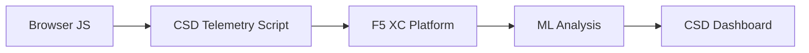

import { Aside } from "@astrojs/starlight/components";

يحمي F5 Distributed Cloud Client-Side Defense (CSD) تطبيقات الويب من الهجمات من جانب العميل من خلال مراقبة سلوك JavaScript مباشرة في المتصفح. يمكن تكوين موازن الأحمال F5 XC لحقن سكريبت القياس عن بُعد الخاص بـ CSD في الصفحات المقدمة للعميل. يراقب هذا السكريبت جميع أنشطة JavaScript — أي السكريبتات التي يتم تحميلها، وحقول النماذج التي تقرأها، والاتصالات الشبكية التي تنشئها. تُرسل بيانات القياس عن بُعد إلى منصة F5 XC حيث تحلل نماذج التعلم الآلي سلوك السكريبتات، وتُعيّن درجات المخاطر، وتُحدد الشذوذات. تراجع فرق الأمان عمليات الكشف في وحدة تحكم CSD وتتخذ إجراءات بالسماح أو التخفيف لنطاقات السكريبتات.

## إشارات الكشف الأساسية

يراقب CSD ثلاث فئات من السلوك على جانب المتصفح:

| الإشارة | ما يراقبه CSD | مثال |
| --- | --- | --- |
| **قراءات حقول النماذج** | أي السكريبتات تصل إلى أي حقول `input` موجودة في DOM الصفحة وقت التحميل | `main.js` يقرأ حقل `password` في صفحة `/login` |
| **جرد السكريبتات** | جميع سكريبتات JavaScript من الطرف الأول والطرف الثالث المحملة في كل صفحة، مع تتبعها حسب نطاق المصدر | وسم `<script>` جديد يتم تحميله من `cdn.jsdelivr.net` يظهر في صفحة تسجيل الدخول |
| **التفاعلات الشبكية** | النطاقات المشاركة في النشاط الشبكي للسكريبتات — تشمل كلاً من نطاقات مصدر تحميل السكريبتات ونطاقات وجهة fetch/XHR | سكريبتات مصدرها `esm.sh` وأهداف تسريب البيانات مثل `www.httpbin.org` تظهر في النطاقات المكتشفة |

<Aside type="caution">
تتبع إشارة التفاعلات الشبكية في CSD بشكل أساسي **نطاقات مصدر تحميل السكريبتات**. ومع ذلك، تظهر أيضاً نطاقات وجهة fetch/XHR في واجهة API `/detected_domains` وجدول نطاقات لوحة المعلومات — يكتشف CSD النشاط الشبكي على مستوى النطاق، وليس فقط تحميلات السكريبتات. انظر [حدود الكشف](#حدود-الكشف) للقائمة الكاملة للقيود السلوكية.
</Aside>

## مصفوفة الميزات

| الميزة | الوصف | الموقع في وحدة التحكم |
| --- | --- | --- |
| **تقييم مخاطر السكريبتات** | تصنيف تلقائي: بدون مخاطر، مخاطر منخفضة، مخاطر عالية | قائمة السكريبتات &rarr; عمود مستوى المخاطر |
| **حساسية حقول النماذج** | تصنيف تلقائي للحقول كحساسة (بواسطة النظام) بناءً على نوع الحقل واسمه | عرض حقول النماذج &rarr; عمود التحليل |
| **الجدول الزمني للسلوك** | رسوم بيانية لمستوى مخاطر السكريبت ونطاق المصدر والنوع عبر الزمن | تفاصيل السكريبت &rarr; نظرة عامة &rarr; السلوكيات عبر الزمن |
| **إسناد المستخدمين المتأثرين** | تتبع المستخدمين المتأثرين حسب عنوان IP والموقع الجغرافي والمتصفح والجهاز | تفاصيل السكريبت &rarr; تبويب المستخدمون المتأثرون |
| **قائمة النطاقات المسموح بها** | وضع علامة على نطاقات السكريبتات الموثوقة كمسموح بها | لوحة المعلومات &rarr; صف النطاق &rarr; إضافة إلى قائمة السماح |
| **قائمة النطاقات المُخفَّفة** | حظر الاستدعاءات الشبكية وقراءات حقول النماذج من نطاقات سكريبتات محددة، مما يمنع تسريب البيانات | لوحة المعلومات &rarr; صف النطاق &rarr; إضافة إلى قائمة التخفيف |
| **تكوين التنبيهات** | إشعارات للنطاقات الجديدة وتغييرات المخاطر والسلوك المشبوه | قسم الإشعارات |
| **تبرير السكريبت** | إضافة ملاحظات توضح سبب ترخيص السكريبت (امتثال PCI DSS) | تفاصيل السكريبت &rarr; حقل التبرير |
| **تتبع المعاملات** | عداد شهري لأحداث القياس عن بُعد يؤكد أن CSD نشط | لوحة المعلومات &rarr; بطاقة المعاملات المستهلكة |
| **فلاتر الوقت والموقع** | تصفية جميع العروض حسب النطاق الزمني (24 ساعة، 7 أيام، 30 يوماً) والموقع | عناصر التحكم بالفلاتر في الشريط العلوي |

## حدود الكشف

فهم ما **لا** يراقبه CSD أمر بالغ الأهمية لتحديد توقعات دقيقة للعرض التوضيحي:

| القيد | التفاصيل | تم التحقق |
| --- | --- | --- |
| **الحقول المُنشأة ديناميكياً** | يتتبع CSD حقول `input` الموجودة في DOM عند تحميل الصفحة. الحقول المحقونة بواسطة JavaScript بعد التحميل لا تتم مراقبتها. حقل `<input>` مُنشأ ديناميكياً ويُقرأ بواسطة سكريبت لا يظهر في عرض حقول النماذج. | نعم — الحقل غائب من `/formFields` بعد انتظار 10 دقائق |
| **التشفير على مستوى الكود** | لا يُحدد CSD تقنيات تنفيذ الكود الديناميكي أو أنماط التشفير كإشارات كشف منفصلة. تُنتج أدوات الحصاد المشفرة نفس مستوى المخاطر مثل غير المشفرة — يتتبع CSD البيانات الوصفية السلوكية وليس أنماط الكود المصدري. | نعم — "مخاطر عالية" متطابقة لكلتا التقنيتين |
| **حقول النماذج المتراكبة** | يتتبع CSD فقط حقول النماذج الموجودة في DOM الأصلي عند تحميل الصفحة. النماذج المتراكبة المحقونة بواسطة JavaScript (تقنية شائعة في الاستيلاء الرقمي) لا يتم تتبعها — يتم اكتشاف قراءات الحقول الأصلية فقط. | نعم — حقول التراكب غائبة من `/formFields` بعد انتظار 10 دقائق |
| **سلوك عدادات لوحة المعلومات** | تتغير أعداد الملخص "تم العثور عليها والتخفيف منها" و"تم العثور عليها والسماح بها" فقط بعد أن يضيف المسؤول نطاقاً بشكل صريح إلى قائمة التخفيف أو السماح. تتحدث أعداد "يتطلب إجراء" و"إجمالي ما تم العثور عليه" تلقائياً عند اكتشاف نطاقات جديدة. | نعم — تغيّر "تم العثور عليها والسماح بها" من 0 إلى 1 فقط بعد POST إلى `/allowed_domains` |

<Aside type="note" title="الرؤية عبر API مقابل وحدة التحكم">
تُرجع نقطة نهاية API `/detected_domains` جميع النطاقات المكتشفة بما في ذلك نطاقات مصدر السكريبتات من الطرف الأول والطرف الثالث. يظهر نطاق التطبيق من الطرف الأول (مثل `csd.bankexample.com`) في قائمة النطاقات المكتشفة إلى جانب نطاقات CDN من الطرف الثالث. تظهر نطاقات الطرف الأول والطرف الثالث في جدول نطاقات لوحة المعلومات.

تظهر أيضاً نطاقات وجهة fetch/XHR (مثل `www.httpbin.org` التي يتم الاتصال بها عبر `fetch()`) في استجابة `/detected_domains`. تتتبع منصة CSD هذه النطاقات على مستوى النطاق حتى لو لم تكن نطاقات مصدر تحميل سكريبتات.
</Aside>

## تعيين PCI DSS v4.0

يعالج CSD بشكل مباشر متطلبين من PCI DSS v4.0 لأمان صفحات الدفع:

| متطلب PCI DSS | ما يتطلبه | كيف يعالجه CSD |
| --- | --- | --- |
| **6.4.3** — إدارة السكريبتات في صفحات الدفع | الحفاظ على جرد لجميع السكريبتات، وتوفير ترخيص كتابي وتبرير لكل منها، والتحقق من سلامة السكريبت | توفر قائمة السكريبتات جرداً كاملاً؛ حقل التبرير يوثق الترخيص؛ الجدول الزمني للسلوك يتتبع التغييرات |
| **11.6.1** — كشف التلاعب في صفحات الدفع | كشف التعديلات غير المصرح بها على رؤوس HTTP ومحتوى صفحة الدفع | يكتشف قياس CSD عن بُعد حقن السكريبتات الجديدة، وقراءات حقول النماذج غير المصرح بها، والنطاقات الشبكية الجديدة — مع التنبيه على التغييرات في سلوك الصفحة |

<Aside type="tip">
استخدم ميزة **تبرير السكريبت** لتوثيق سبب ترخيص كل سكريبت في صفحات الدفع. يُنشئ هذا مساراً للتدقيق يُعيَّن مباشرة لمتطلبات ترخيص PCI DSS 6.4.3.
</Aside>

## مصفوفة تغطية التهديدات

يُعيّن الجدول التالي فئات الهجمات الشائعة من جانب العميل إلى إشارات كشف CSD التي ستنطلق أثناء كل نوع هجوم. أنواع الهجمات المعلمة بـ **\*** مؤكدة من [وثائق F5 الرسمية](https://www.f5.com/cloud/products/client-side-defense). الأنواع غير المعلمة مستنتجة بناءً على فئات إشارات الكشف في CSD وقد لا تكون مُعلنة صراحةً من F5.

| فئة الهجوم | الوصف | قراءات الحقول | حقن السكريبتات | الشبكة |
| --- | --- | --- | --- | --- |
| **الاستيلاء على النماذج** \* | سكريبت خبيث يقرأ قيم حقول النماذج ويسربها | نعم | — | نعم |
| **الاستيلاء الرقمي** \* | يحقن نماذج متراكبة أو سكريبتات لالتقاط بيانات الدفع | نعم | نعم | نعم |
| **هجوم سلسلة التوريد** \* | مكتبة طرف ثالث مخترقة تحمل كوداً خبيثاً | — | نعم | نعم |
| **تسريب البيانات** \* | يقرأ البيانات الحساسة ويرسلها إلى نطاقات خارجية | نعم | — | نعم |
| **حقن السكريبتات** \* | يُدرج وسوم `<script>` غير مصرح بها في الصفحة | — | نعم | نعم |
| **تعدين العملات الرقمية** \* | يحقن سكريبتات تعدين العملات المشفرة | — | نعم | نعم |
| **التلاعب بـ DOM** | يحقن أو يعدل عناصر الصفحة لخداع المستخدمين | — | نعم | — |
| **الرجل في المتصفح** | يعترض بيانات النماذج ضمن جلسة المتصفح — انظر [OWASP](https://owasp.org/www-community/attacks/Man-in-the-browser_attack) و [MITRE T1185](https://attack.mitre.org/techniques/T1185/) | نعم | — | نعم |
| **اختطاف النقرات** | يراكب إطارات غير مرئية لاختطاف نقرات المستخدم — انظر [OWASP](https://owasp.org/www-community/attacks/Clickjacking) | — | نعم | — |
| **استمرارية أداة الاستيلاء** | يعيد حقن سكريبتات الاستيلاء عبر عمليات التنقل بين الصفحات — انظر [أبحاث Sansec Magecart](https://sansec.io/what-is-magecart) | — | نعم | نعم |

<Aside type="note">
يغطي كشف "الشبكة" كلاً من نطاقات مصدر تحميل السكريبتات ونطاقات وجهة fetch/XHR — وكلاهما يظهر في واجهة API `/detected_domains` الخاصة بـ CSD وجدول نطاقات لوحة المعلومات. ومع ذلك، يستهدف تخفيف CSD تحميل السكريبتات (ناقل سلسلة التوريد)، وليس استدعاءات fetch/XHR. تخفيف نطاق ما يحظر تحميلات وسم `<script>` من ذلك النطاق لكنه لا يعترض استدعاءات `fetch()` أو `XMLHttpRequest` إليه.
</Aside>
