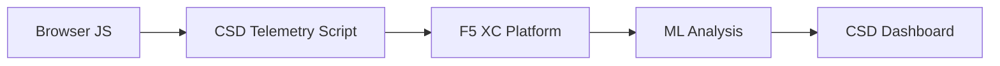

import { Aside } from "@astrojs/starlight/components";

يحمي F5 Distributed Cloud Client-Side Defense (CSD) تطبيقات الويب من الهجمات من جانب العميل من خلال مراقبة سلوك JavaScript مباشرة في المتصفح. يمكن تكوين موازن التحميل F5 XC لحقن سكريبت telemetry الخاص بـ CSD في الصفحات المقدمة للعميل. يراقب هذا السكريبت جميع نشاط JavaScript — أي السكريبتات التي يتم تحميلها، وأي حقول النموذج التي تقرأها، والاتصالات الشبكية التي تنشئها. يتم إرسال بيانات telemetry إلى منصة F5 XC حيث تحلل نماذج التعلم الآلي سلوك السكريبت، وتعين درجات المخاطر، وتحدد الشذوذ. تقوم فرق الأمان بمراجعة الكشفيات في لوحة تحكم CSD واتخاذ إجراء بالسماح أو تخفيف نطاقات السكريبت.

## إشارات الكشف الأساسية

يراقب CSD ثلاث فئات من السلوك من جانب المتصفح:

| الإشارة | ما يلاحظه CSD | مثال |
| --- | --- | --- |
| **قراءة حقول النموذج** | السكريبتات التي تصل إلى حقول `input` الموجودة في DOM للصفحة عند تحميلها | `main.js` تقرأ حقل `password` على `/login` |
| **جرد السكريبت** | جميع JavaScript من الطرف الأول والطرف الثالث المحملة على كل صفحة، مع التتبع حسب نطاق المصدر | وسم `<script>` جديد يحمل من `cdn.jsdelivr.net` يظهر على صفحة تسجيل الدخول |
| **التفاعلات الشبكية** | النطاقات المشاركة في نشاط الشبكة للسكريبت — تشمل نطاقات مصادر تحميل السكريبت ونطاقات وجهة fetch/XHR | السكريبتات المصدرة من `esm.sh` وأهداف تسرب البيانات مثل `www.httpbin.org` تظهر في النطاقات المكتشفة |

<Aside type="caution">
إشارة التفاعلات الشبكية في CSD تتبع بشكل أساسي **نطاقات مصدر تحميل السكريبت**. ومع ذلك، تظهر نطاقات وجهة fetch/XHR أيضًا في API `/detected_domains` وجدول النطاقات في لوحة التحكم — يكتشف CSD النشاط الشبكي على مستوى النطاق، وليس فقط تحميل السكريبتات. انظر [حدود الكشف](#detection-boundaries) للحصول على القائمة الكاملة للقيود السلوكية.
</Aside>

## مصفوفة الميزات

| الميزة | الوصف | موقع لوحة التحكم |
| --- | --- | --- |
| **تسجيل مخاطر السكريبت** | التصنيف التلقائي: بدون مخاطر، مخاطر منخفضة، مخاطر عالية | قائمة السكريبت &rarr; عمود مستوى المخاطرة |
| **حساسية حقول النموذج** | تصنيف تلقائي للحقول كحساسة (من قبل النظام) بناءً على نوع الحقل والاسم | عرض حقول النموذج &rarr; عمود التحليل |
| **الخط الزمني السلوكي** | رسوم بيانية لمستوى مخاطرة السكريبت ونطاق المصدر والنوع بمرور الوقت | تفاصيل السكريبت &rarr; نظرة عامة &rarr; السلوكيات عبر الزمن |
| **نسب المستخدم المتأثر** | تتبع المستخدمين المتأثرين حسب عنوان IP والموقع الجغرافي والمتصفح والجهاز | تفاصيل السكريبت &rarr; علامة تبويب المستخدمين المتأثرين |
| **قائمة السماح للنطاق** | وضع علامة على نطاقات السكريبت الموثوقة كمسموحة | لوحة التحكم &rarr; صف النطاق &rarr; إضافة إلى قائمة السماح |
| **قائمة تخفيف النطاق** | حظر استدعاءات الشبكة وقراءات حقول النموذج من نطاقات سكريبت محددة، لمنع تسرب البيانات | لوحة التحكم &rarr; صف النطاق &rarr; إضافة إلى قائمة التخفيف |
| **تكوين التنبيهات** | الإخطارات للنطاقات الجديدة وتغييرات المخاطر والسلوك المريب | قسم الإخطارات |
| **تبرير السكريبت** | إضافة ملاحظات توضح سبب تفويض السكريبت (توافق PCI DSS) | تفاصيل السكريبت &rarr; حقل التبرير |
| **تتبع المعاملات** | عداد حدث telemetry الشهري يؤكد أن CSD نشط | لوحة التحكم &rarr; بطاقة المعاملات المستهلكة |
| **مرشحات الوقت والموقع** | تصفية جميع الآراء حسب نطاق الزمن (24 ساعة، 7 أيام، 30 يومًا) والموقع | عناصر تحكم المرشح في الشريط العلوي |

## حدود الكشف

يعتبر فهم ما لا يراقبه CSD **ليس** أمرًا حاسمًا لتعيين توقعات العرض التوضيحي الدقيقة:

| القيد | التفاصيل | تم التحقق |
| --- | --- | --- |
| **الحقول المنشأة ديناميكيًا** | يتتبع CSD حقول `input` الموجودة في DOM عند تحميل الصفحة. لا يتم مراقبة الحقول المحقونة بواسطة JavaScript بعد التحميل. حقل `<input>` منشأ ديناميكيًا ومقروء بواسطة سكريبت لا يظهر في عرض حقول النموذج. | نعم — الحقل غائب من `/formFields` بعد انتظار 10 دقائق |
| **الإخفاء على مستوى الكود** | لا يعلم CSD عن تقنيات تنفيذ الكود الديناميكية أو أنماط الإخفاء كإشارات كشف منفصلة. يعطي حاصدو البيانات المخفية نفس مستوى المخاطرة مثل غير المخفية — يتتبع CSD بيانات التعريف السلوكية، وليس أنماط الكود المصدري. | نعم — نفس "مخاطر عالية" لكلا التقنيتين |
| **حقول تراكب النموذج** | يتتبع CSD فقط حقول النموذج الموجودة في DOM الأصلي عند تحميل الصفحة. نماذج التراكب المحقونة بواسطة JavaScript (تقنية شائعة لـ digital skimming) لا يتم تتبعها — يتم كشف قراءة الحقول الأصلية فقط. | نعم — حقول التراكب غائبة من `/formFields` بعد انتظار 10 دقائق |
| **سلوك عداد لوحة التحكم** | تتغير أعداد الملخص "تم العثور عليه والتخفيف منه" و"تم العثور عليه والسماح به" فقط بعد أن يقوم المسؤول صراحة بإضافة نطاق إلى قائمة التخفيف أو السماح. تتحدث أعداد "إجراء مطلوب" و"إجمالي تم العثور عليه" تلقائيًا عند اكتشاف نطاقات جديدة. | نعم — تغير "تم العثور عليه والسماح به" من 0 إلى 1 فقط بعد POST إلى `/allowed_domains` |

<Aside type="note" title="رؤية API مقابل لوحة التحكم">
يعيد نقطة نهاية API `/detected_domains` جميع النطاقات المكتشفة بما في ذلك نطاقات مصدر السكريبت من الطرف الأول والثالث. يظهر نطاق تطبيق الطرف الأول (على سبيل المثال، `csd.bankexample.com`) في قائمة النطاقات المكتشفة إلى جانب نطاقات CDN من الطرف الثالث. يظهر كل من نطاقات الطرف الأول والثالث في جدول النطاق في لوحة التحكم.

نطاقات وجهة fetch/XHR (على سبيل المثال، `www.httpbin.org` التي تم الوصول إليها عبر `fetch()`) تظهر أيضًا في استجابة `/detected_domains`. تتبع منصة CSD هذه على مستوى النطاق حتى لو لم تكن نطاقات مصدر تحميل السكريبت.
</Aside>

## خريطة PCI DSS v4.0

يعالج CSD مباشرة متطلبين من متطلبات PCI DSS v4.0 لأمان صفحة الدفع:

| متطلب PCI DSS | ما يتطلبه | كيف يعالجه CSD |
| --- | --- | --- |
| **6.4.3** — إدارة السكريبت على صفحات الدفع | الحفاظ على جرد جميع السكريبتات، وتوفير التفويض الكتابي والتبرير لكل منها، والتحقق من سلامة السكريبت | توفر قائمة السكريبت جردًا كاملاً؛ حقل التبرير يوثق التفويض؛ الخط الزمني السلوكي يتتبع التغييرات |
| **11.6.1** — كشف التعديل غير المصرح به على صفحات الدفع | كشف التعديلات غير المصرح بها على رؤوس HTTP ومحتوى صفحة الدفع | يكتشف telemetry الخاص بـ CSD حقن السكريبت الجديد والقراءات غير المصرح بها لحقول النموذج والنطاقات الشبكية الجديدة — إصدار تنبيهات عند التغييرات في سلوك الصفحة |

<Aside type="tip">
استخدم ميزة **تبرير السكريبت** لتوثيق سبب تفويض كل سكريبت على صفحات الدفع. يعمل هذا على إنشاء مسار تدقيق يخطط مباشرة إلى متطلبات التفويض في PCI DSS 6.4.3.
</Aside>

## مصفوفة تغطية التهديدات

يخطط الجدول التالي فئات الهجوم الشائعة من جانب العميل إلى إشارات كشف CSD التي ستنطلق أثناء كل نوع هجوم. أنواع الهجوم المميزة بـ **\*** تم التحقق منها بواسطة [وثائق F5 الرسمية](https://www.f5.com/cloud/products/client-side-defense). الأنواع غير المميزة مستنتجة بناءً على فئات إشارات كشف CSD وقد لا يتم المطالبة بها بشكل صريح من قبل F5.

| فئة الهجوم | الوصف | قراءة الحقول | حقن السكريبت | الشبكة |
| --- | --- | --- | --- | --- |
| **Formjacking** \* | سكريبت ضار يقرأ قيم حقول النموذج ويسرقها | نعم | — | نعم |
| **Digital skimming** \* | يحقن نماذج تراكب أو سكريبتات لالتقاط بيانات الدفع | نعم | نعم | نعم |
| **هجوم سلسلة التوريد** \* | مكتبة طرف ثالث مخترقة تحمل كود ضار | — | نعم | نعم |
| **تسرب البيانات** \* | يقرأ البيانات الحساسة ويرسلها إلى نطاقات خارجية | نعم | — | نعم |
| **حقن السكريبت** \* | إدراج وسوم `<script>` غير مصرح بها في الصفحة | — | نعم | نعم |
| **التعدين بالعملات المشفرة** \* | حقن سكريبتات تعدين العملات المشفرة | — | نعم | نعم |
| **التعديل على DOM** | حقن أو تعديل عناصر الصفحة لخداع المستخدمين | — | نعم | — |
| **Man-in-the-Browser** | اعتراض بيانات النموذج داخل جلسة المتصفح — انظر [OWASP](https://owasp.org/www-community/attacks/Man-in-the-browser_attack) و[MITRE T1185](https://attack.mitre.org/techniques/T1185/) | نعم | — | نعم |
| **Clickjacking** | تراكب إطارات غير مرئية لاختراق نقرات المستخدم — انظر [OWASP](https://owasp.org/www-community/attacks/Clickjacking) | — | نعم | — |
| **استمرار Web skimmer** | إعادة حقن سكريبتات skimmer عبر ملاحة الصفحة — انظر [أبحاث Sansec Magecart](https://sansec.io/what-is-magecart) | — | نعم | نعم |

<Aside type="note">
يغطي كشف "الشبكة" نطاقات مصدر تحميل السكريبت ونطاقات وجهة fetch/XHR — كلاهما يظهر في API `/detected_domains` الخاص بـ CSD وجدول النطاق في لوحة التحكم. ومع ذلك، يستهدف تخفيف CSD تحميل السكريبت (ناقل سلسلة التوريد)، وليس استدعاءات fetch/XHR. يحظر تخفيف نطاق تحميل وسوم `<script>` من هذا النطاق ولكن لا يعترض استدعاءات `fetch()` أو `XMLHttpRequest` إليه.
</Aside>
