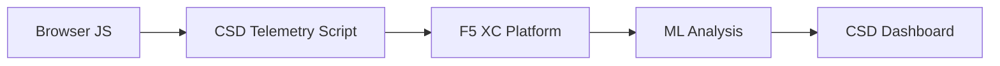

import { Aside } from "@astrojs/starlight/components";

يحمي F5 Distributed Cloud Client-Side Defense (CSD) تطبيقات الويب من هجمات جهة العميل عبر مراقبة سلوك JavaScript مباشرةً في المتصفح. يمكن تهيئة موازن تحميل F5 XC لحقن سكريبت قياس أداء CSD في الصفحات المقدَّمة للعميل. يرصد هذا السكريبت جميع أنشطة JavaScript — أيُّ السكريبتات يتم تحميلها، وأيُّ حقول النماذج تقرأها، وأيُّ اتصالات الشبكة تُجريها. تُرسَل بيانات القياس إلى منصة F5 XC حيث تحلل نماذج التعلم الآلي سلوك السكريبتات وتُسند درجات المخاطرة وتُشير إلى الشذوذات. تراجع فرق الأمان عمليات الكشف في وحدة تحكم CSD وتتخذ إجراءات بالسماح لنطاقات السكريبتات أو التخفيف من تأثيرها.

## إشارات الكشف الأساسية

يراقب CSD ثلاث فئات من السلوك على جهة المتصفح:

| الإشارة | ما يرصده CSD | مثال |
| --- | --- | --- |
| **قراءات حقول النماذج** | أيُّ السكريبتات تصل إلى أيِّ حقول `input` الموجودة في DOM الصفحة عند التحميل | قراءة `main.js` لحقل `password` على `/login` |
| **جرد السكريبتات** | جميع JavaScript من الطرف الأول والطرف الثالث المحمَّلة في كل صفحة، مع التتبع حسب نطاق المصدر | ظهور وسم `<script>` جديد يُحمَّل من `cdn.jsdelivr.net` على صفحة تسجيل الدخول |
| **تفاعلات الشبكة** | النطاقات المشاركة في نشاط شبكة السكريبتات — تشمل نطاقات مصدر تحميل السكريبتات ونطاقات وجهة fetch/XHR | ظهور سكريبتات مصدرها `esm.sh` وأهداف تسريب البيانات مثل `www.httpbin.org` ضمن النطاقات المكتشَفة |

<Aside type="caution">
تتتبع إشارة تفاعلات الشبكة في CSD بصورة أساسية **نطاقات مصدر تحميل السكريبتات**. غير أن نطاقات وجهة fetch/XHR تظهر أيضاً في API `/detected_domains` وجدول النطاقات في لوحة المعلومات — إذ يكشف CSD نشاط الشبكة على مستوى النطاق، لا على مستوى تحميلات السكريبتات فحسب. راجع [حدود الكشف](#detection-boundaries) للاطلاع على القائمة الكاملة للقيود السلوكية.
</Aside>

## مصفوفة الميزات

| الميزة | الوصف | موقع وحدة التحكم |
| --- | --- | --- |
| **تسجيل درجة مخاطرة السكريبتات** | تصنيف تلقائي: لا مخاطرة، مخاطرة منخفضة، مخاطرة عالية | قائمة السكريبتات &rarr; عمود مستوى المخاطرة |
| **حساسية حقول النماذج** | تصنيف تلقائي للحقول على أنها حساسة (بواسطة النظام) بناءً على نوع الحقل واسمه | عرض حقول النماذج &rarr; عمود التحليل |
| **الجدول الزمني للسلوك** | مخططات لمستوى مخاطرة السكريبت ونطاق مصدره ونوعه عبر الزمن | تفاصيل السكريبت &rarr; نظرة عامة &rarr; السلوكيات بمرور الوقت |
| **إسناد المستخدمين المتأثرين** | تتبع المستخدمين المتأثرين حسب IP والموقع الجغرافي والمتصفح والجهاز | تفاصيل السكريبت &rarr; علامة تبويب المستخدمين المتأثرين |
| **قائمة السماح بالنطاقات** | تمييز نطاقات السكريبتات الموثوقة على أنها مسموح بها | لوحة المعلومات &rarr; صف النطاق &rarr; إضافة إلى قائمة السماح |
| **قائمة تخفيف النطاقات** | حجب استدعاءات الشبكة وقراءات حقول النماذج من نطاقات سكريبتات محددة، مما يمنع تسريب البيانات | لوحة المعلومات &rarr; صف النطاق &rarr; إضافة إلى قائمة التخفيف |
| **تهيئة التنبيهات** | إشعارات بشأن النطاقات الجديدة وتغييرات المخاطرة والسلوك المشبوه | قسم الإشعارات |
| **مبرر السكريبت** | إضافة ملاحظات توضح سبب تفويض سكريبت ما (الامتثال لـ PCI DSS) | تفاصيل السكريبت &rarr; حقل المبرر |
| **تتبع المعاملات** | عداد شهري لأحداث قياس الأداء يؤكد نشاط CSD | لوحة المعلومات &rarr; بطاقة المعاملات المستهلَكة |
| **مرشحات الوقت والموقع** | تصفية جميع العروض حسب النطاق الزمني (24 ساعة، 7 أيام، 30 يوماً) والموقع | عناصر تحكم مرشح الشريط العلوي |

## حدود الكشف

يُعدّ فهم ما **لا** يراقبه CSD أمراً بالغ الأهمية لتحديد توقعات العرض التوضيحي بدقة:

| القيد | التفاصيل | تم التحقق |
| --- | --- | --- |
| **الحقول المُنشأة ديناميكياً** | يتتبع CSD حقول `input` الموجودة في DOM عند تحميل الصفحة. لا تتم مراقبة الحقول التي تُحقَن بواسطة JavaScript بعد التحميل. لا يظهر `<input>` المُنشأ ديناميكياً والمقروء بواسطة سكريبت في عرض حقول النماذج. | نعم — الحقل غائب من `/formFields` بعد انتظار 10 دقائق |
| **إخفاء الكود** | لا يُشير CSD إلى تقنيات تنفيذ الكود الديناميكي أو أنماط الإخفاء كإشارات كشف منفصلة. تُنتج أدوات الحصاد المخفاة مستوى المخاطرة ذاته الخاص بالأدوات غير المخفاة — يتتبع CSD البيانات الوصفية للسلوك لا أنماط الكود المصدري. | نعم — "مخاطرة عالية" متطابقة لكلتا التقنيتين |
| **حقول النماذج التراكبية** | يتتبع CSD فقط حقول النماذج الموجودة في DOM الأصلي عند تحميل الصفحة. لا يتم تتبع النماذج التراكبية المُحقَنة بواسطة JavaScript (وهي تقنية شائعة لقشط البيانات الرقمية) — ولا يُكتشف إلا قراءات الحقول الأصلية. | نعم — الحقول التراكبية غائبة من `/formFields` بعد انتظار 10 دقائق |
| **سلوك عداد لوحة المعلومات** | تتغير أعداد الملخص "وُجد وخُفِّف" و"وُجد وسُمح به" فقط بعد أن يضيف المسؤول صراحةً نطاقاً إلى قائمة التخفيف أو السماح. تتحدث أعداد "يتطلب إجراءً" و"المجموع المكتشَف" تلقائياً عند اكتشاف نطاقات جديدة. | نعم — تغيّر "وُجد وسُمح به" من 0 إلى 1 فقط بعد POST إلى `/allowed_domains` |

<Aside type="note" title="رؤية API مقابل وحدة التحكم">
تُعيد نقطة نهاية API `/detected_domains` جميع النطاقات المكتشَفة بما فيها نطاقات مصدر السكريبتات من الطرف الأول والطرف الثالث. يظهر نطاق تطبيق الطرف الأول (مثل `csd.bankexample.com`) في قائمة النطاقات المكتشَفة جانباً نطاقات CDN من الطرف الثالث. تظهر نطاقات الطرف الأول والطرف الثالث في جدول النطاقات بلوحة المعلومات.

تظهر أيضاً نطاقات وجهة fetch/XHR (مثل `www.httpbin.org` التي يتم الاتصال بها عبر `fetch()`) في استجابة `/detected_domains`. تتتبع منصة CSD هذه النطاقات على مستوى النطاق حتى وإن لم تكن نطاقات مصدر تحميل سكريبتات.
</Aside>

## تعيين PCI DSS v4.0

يتناول CSD مباشرةً متطلبَين من PCI DSS v4.0 لأمان صفحات الدفع:

| متطلب PCI DSS | ما يتطلبه | كيف يعالجه CSD |
| --- | --- | --- |
| **6.4.3** — إدارة السكريبتات في صفحات الدفع | الحفاظ على جرد لجميع السكريبتات، وتقديم تفويض خطي ومبرر لكل منها، والتحقق من سلامة السكريبتات | توفر قائمة السكريبتات جرداً كاملاً؛ ويوثّق حقل المبرر التفويض؛ ويتتبع الجدول الزمني للسلوك التغييرات |
| **11.6.1** — الكشف عن التلاعب في صفحات الدفع | الكشف عن التعديلات غير المصرح بها على رؤوس HTTP ومحتوى صفحات الدفع | يكشف قياس أداء CSD عن حقن السكريبتات الجديدة وقراءات حقول النماذج غير المصرح بها والنطاقات الشبكية الجديدة — مع التنبيه عند تغييرات سلوك الصفحة |

<Aside type="tip">
استخدم ميزة **مبرر السكريبت** لتوثيق سبب تفويض كل سكريبت في صفحات الدفع. يُنشئ ذلك مسار تدقيق يُعيَّن مباشرةً إلى متطلبات تفويض PCI DSS 6.4.3.
</Aside>

## مصفوفة تغطية التهديدات

يُعيِّن الجدول التالي فئات هجمات جهة العميل الشائعة إلى إشارات الكشف في CSD التي ستُطلَق خلال كل نوع هجوم. أنواع الهجمات المُعلَّمة بـ **\*** مؤكَّدة بواسطة [وثائق F5 الرسمية](https://www.f5.com/cloud/products/client-side-defense). والأنواع غير المُعلَّمة مستنتَجة بناءً على فئات إشارات الكشف في CSD وقد لا تكون مُعلَنة صراحةً من قِبل F5.

| فئة الهجوم | الوصف | قراءات الحقول | حقن السكريبتات | الشبكة |
| --- | --- | --- | --- | --- |
| **Formjacking** \* | سكريبت خبيث يقرأ قيم حقول النماذج ويُسرِّبها | نعم | — | نعم |
| **القشط الرقمي** \* | حقن نماذج أو سكريبتات تراكبية لالتقاط بيانات الدفع | نعم | نعم | نعم |
| **هجوم سلسلة التوريد** \* | مكتبة طرف ثالث مخترَقة تُحمِّل كوداً خبيثاً | — | نعم | نعم |
| **تسريب البيانات** \* | قراءة البيانات الحساسة وإرسالها إلى نطاقات خارجية | نعم | — | نعم |
| **حقن السكريبتات** \* | إدراج وسوم `<script>` غير مصرح بها في الصفحة | — | نعم | نعم |
| **Cryptojacking** \* | حقن سكريبتات تعدين العملات المشفرة | — | نعم | نعم |
| **التلاعب بـ DOM** | حقن أو تعديل عناصر الصفحة لخداع المستخدمين | — | نعم | — |
| **Man-in-the-Browser** | اعتراض بيانات النماذج داخل جلسة المتصفح — راجع [OWASP](https://owasp.org/www-community/attacks/Man-in-the-browser_attack) و[MITRE T1185](https://attack.mitre.org/techniques/T1185/) | نعم | — | نعم |
| **Clickjacking** | تراكب إطارات غير مرئية لاختطاف نقرات المستخدم — راجع [OWASP](https://owasp.org/www-community/attacks/Clickjacking) | — | نعم | — |
| **استمرارية قاشط الويب** | إعادة حقن سكريبتات القشط عبر تنقلات الصفحة — راجع [أبحاث Sansec Magecart](https://sansec.io/what-is-magecart) | — | نعم | نعم |

<Aside type="note">
يغطي كشف "الشبكة" كلاً من نطاقات مصدر تحميل السكريبتات ونطاقات وجهة fetch/XHR — وكلاهما يظهر في API `/detected_domains` الخاص بـ CSD وجدول النطاقات في لوحة المعلومات. غير أن تخفيف CSD يستهدف تحميل السكريبتات (متجه سلسلة التوريد)، لا استدعاءات fetch/XHR. يحجب تخفيف نطاق ما تحميلات وسم `<script>` من ذلك النطاق لكنه لا يعترض استدعاءات `fetch()` أو `XMLHttpRequest` إليه.
</Aside>
