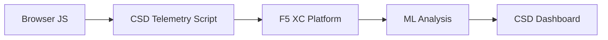

import { Aside } from "@astrojs/starlight/components";

يحمي حل F5 Distributed Cloud Client-Side Defense (CSD) تطبيقات الويب من الهجمات من جانب العميل من خلال مراقبة سلوك JavaScript مباشرة في المتصفح. يمكن تهيئة موازن الأحمال F5 XC لحقن برنامج القياس عن بُعد الخاص بـ CSD في الصفحات المقدمة للعميل. يراقب هذا البرنامج جميع أنشطة JavaScript — أي البرامج النصية التي يتم تحميلها، وحقول النماذج التي تقرأها، والاتصالات الشبكية التي تجريها. تُرسل بيانات القياس عن بُعد إلى منصة F5 XC حيث تقوم نماذج التعلم الآلي بتحليل سلوك البرامج النصية، وتعيين درجات المخاطر، والإبلاغ عن الحالات الشاذة. تراجع فرق الأمان عمليات الكشف في وحدة تحكم CSD وتتخذ الإجراءات المناسبة من خلال السماح بنطاقات البرامج النصية أو التخفيف من مخاطرها.

## إشارات الكشف الأساسية

يراقب CSD ثلاث فئات من السلوك على جانب المتصفح:

| الإشارة | ما يراقبه CSD | مثال |
| --- | --- | --- |
| **قراءات حقول النماذج** | أي البرامج النصية تصل إلى أي حقول `input` الموجودة في DOM الصفحة عند التحميل | `main.js` يقرأ حقل `password` في صفحة `/login` |
| **جرد البرامج النصية** | جميع برامج JavaScript الخاصة بالطرف الأول والطرف الثالث المحملة على كل صفحة، مُتتبعة حسب نطاق المصدر | ظهور وسم `<script>` جديد يُحمّل من `cdn.jsdelivr.net` على صفحة تسجيل الدخول |
| **التفاعلات الشبكية** | النطاقات المشاركة في نشاط الشبكة للبرامج النصية — تشمل كلاً من نطاقات مصدر تحميل البرامج النصية ونطاقات وجهة fetch/XHR | برامج نصية مصدرها `esm.sh` وأهداف تسريب البيانات مثل `www.httpbin.org` تظهر في النطاقات المكتشفة |

<Aside type="caution">
تتتبع إشارة التفاعلات الشبكية في CSD بشكل أساسي **نطاقات مصدر تحميل البرامج النصية**. ومع ذلك، تظهر أيضاً نطاقات وجهة fetch/XHR في واجهة برمجة التطبيقات `/detected_domains` وجدول النطاقات في لوحة التحكم — يكتشف CSD النشاط الشبكي على مستوى النطاق، وليس فقط تحميل البرامج النصية. راجع [حدود الكشف](#حدود-الكشف) للاطلاع على القائمة الكاملة للقيود السلوكية.
</Aside>

## مصفوفة الميزات

| الميزة | الوصف | الموقع في وحدة التحكم |
| --- | --- | --- |
| **تقييم مخاطر البرامج النصية** | تصنيف تلقائي: بدون مخاطر، مخاطر منخفضة، مخاطر عالية | قائمة البرامج النصية &rarr; عمود مستوى المخاطر |
| **حساسية حقول النماذج** | تصنيف تلقائي للحقول كحقول حساسة (بواسطة النظام) بناءً على نوع الحقل واسمه | عرض حقول النماذج &rarr; عمود التحليل |
| **الخط الزمني للسلوك** | رسوم بيانية لمستوى مخاطر البرنامج النصي ونطاق المصدر والنوع عبر الزمن | تفاصيل البرنامج النصي &rarr; نظرة عامة &rarr; السلوكيات عبر الزمن |
| **إسناد المستخدمين المتأثرين** | تتبع المستخدمين المتأثرين حسب عنوان IP والموقع الجغرافي والمتصفح والجهاز | تفاصيل البرنامج النصي &rarr; تبويب المستخدمين المتأثرين |
| **قائمة النطاقات المسموح بها** | تحديد نطاقات البرامج النصية الموثوقة كمسموح بها | لوحة التحكم &rarr; صف النطاق &rarr; إضافة إلى قائمة السماح |
| **قائمة النطاقات المخففة** | حظر الاتصالات الشبكية وقراءات حقول النماذج من نطاقات برامج نصية محددة، مما يمنع تسريب البيانات | لوحة التحكم &rarr; صف النطاق &rarr; إضافة إلى قائمة التخفيف |
| **تهيئة التنبيهات** | إشعارات للنطاقات الجديدة وتغييرات المخاطر والسلوك المشبوه | قسم الإشعارات |
| **تبرير البرنامج النصي** | إضافة ملاحظات تشرح سبب ترخيص البرنامج النصي (امتثال PCI DSS) | تفاصيل البرنامج النصي &rarr; حقل التبرير |
| **تتبع المعاملات** | عداد شهري لأحداث القياس عن بُعد يؤكد أن CSD نشط | لوحة التحكم &rarr; بطاقة المعاملات المستهلكة |
| **مرشحات الوقت والموقع** | تصفية جميع العروض حسب النطاق الزمني (24 ساعة، 7 أيام، 30 يوماً) والموقع | عناصر التحكم بالتصفية في الشريط العلوي |

## حدود الكشف

فهم ما **لا** يراقبه CSD أمر بالغ الأهمية لتحديد توقعات العرض التوضيحي بدقة:

| القيد | التفاصيل | تم التحقق |
| --- | --- | --- |
| **الحقول المنشأة ديناميكياً** | يتتبع CSD حقول `input` الموجودة في DOM عند تحميل الصفحة. الحقول التي يحقنها JavaScript بعد التحميل لا تُراقب. حقل `<input>` مُنشأ ديناميكياً يقرأه برنامج نصي لا يظهر في عرض حقول النماذج. | نعم — الحقل غائب من `/formFields` بعد انتظار 10 دقائق |
| **التشويش على مستوى الكود** | لا يُبلّغ CSD عن تقنيات تنفيذ الكود الديناميكي أو أنماط التشويش كإشارات كشف منفصلة. تُنتج أدوات الحصاد المشوشة نفس مستوى المخاطر مثل غير المشوشة — يتتبع CSD البيانات الوصفية السلوكية، وليس أنماط الكود المصدري. | نعم — "مخاطر عالية" متطابقة لكلتا التقنيتين |
| **حقول النماذج المتراكبة** | يتتبع CSD فقط حقول النماذج الموجودة في DOM الأصلي عند تحميل الصفحة. النماذج المتراكبة التي يحقنها JavaScript (تقنية شائعة للقشط الرقمي) لا تُتتبع — يتم اكتشاف قراءات الحقول الأصلية فقط. | نعم — الحقول المتراكبة غائبة من `/formFields` بعد انتظار 10 دقائق |
| **سلوك عدادات لوحة التحكم** | تتغير أعداد الملخص "تم الاكتشاف والتخفيف" و"تم الاكتشاف والسماح" فقط بعد أن يضيف المسؤول صراحة نطاقاً إلى قائمة التخفيف أو السماح. تتحدث أعداد "يتطلب إجراء" و"إجمالي المكتشف" تلقائياً عند اكتشاف نطاقات جديدة. | نعم — تغير "تم الاكتشاف والسماح" من 0 إلى 1 فقط بعد إرسال POST إلى `/allowed_domains` |

<Aside type="note" title="الرؤية عبر واجهة برمجة التطبيقات مقابل وحدة التحكم">
تُعيد نقطة نهاية واجهة برمجة التطبيقات `/detected_domains` جميع النطاقات المكتشفة بما في ذلك نطاقات مصدر البرامج النصية الخاصة بالطرف الأول والطرف الثالث. يظهر نطاق التطبيق الخاص بالطرف الأول (مثل `csd.bankexample.com`) في قائمة النطاقات المكتشفة جنباً إلى جنب مع نطاقات CDN الخاصة بالطرف الثالث. تظهر نطاقات الطرف الأول والطرف الثالث في جدول النطاقات في لوحة التحكم.

تظهر أيضاً نطاقات وجهة fetch/XHR (مثل `www.httpbin.org` التي يتم الاتصال بها عبر `fetch()`) في استجابة `/detected_domains`. تتتبع منصة CSD هذه النطاقات على مستوى النطاق حتى لو لم تكن نطاقات مصدر تحميل البرامج النصية.
</Aside>

## تعيين PCI DSS v4.0

يعالج CSD مباشرة متطلبين من متطلبات PCI DSS v4.0 لأمان صفحات الدفع:

| متطلب PCI DSS | ما يتطلبه | كيف يعالجه CSD |
| --- | --- | --- |
| **6.4.3** — إدارة البرامج النصية على صفحات الدفع | الحفاظ على جرد لجميع البرامج النصية، وتوفير ترخيص وتبرير مكتوب لكل منها، والتحقق من سلامة البرنامج النصي | توفر قائمة البرامج النصية جرداً كاملاً؛ يوثق حقل التبرير الترخيص؛ يتتبع الخط الزمني للسلوك التغييرات |
| **11.6.1** — كشف التلاعب على صفحات الدفع | اكتشاف التعديلات غير المصرح بها على رؤوس HTTP ومحتوى صفحات الدفع | يكتشف القياس عن بُعد لـ CSD حقن البرامج النصية الجديدة، وقراءات حقول النماذج غير المصرح بها، والنطاقات الشبكية الجديدة — مع التنبيه على التغييرات في سلوك الصفحة |

<Aside type="tip">
استخدم ميزة **تبرير البرنامج النصي** لتوثيق سبب ترخيص كل برنامج نصي على صفحات الدفع. يُنشئ هذا مسار تدقيق يرتبط مباشرة بمتطلبات ترخيص PCI DSS 6.4.3.
</Aside>

## مصفوفة تغطية التهديدات

يعيّن الجدول التالي فئات الهجمات الشائعة من جانب العميل إلى إشارات كشف CSD التي ستنطلق خلال كل نوع هجوم. أنواع الهجمات المميزة بعلامة **\*** مؤكدة من [وثائق F5 الرسمية](https://www.f5.com/cloud/products/client-side-defense). الأنواع غير المميزة مُستنتجة بناءً على فئات إشارات الكشف في CSD وقد لا تكون مذكورة صراحة من قبل F5.

| فئة الهجوم | الوصف | قراءات الحقول | حقن البرامج النصية | الشبكة |
| --- | --- | --- | --- | --- |
| **اختطاف النماذج** \* | برنامج نصي ضار يقرأ قيم حقول النماذج ويسربها | نعم | — | نعم |
| **القشط الرقمي** \* | يحقن نماذج متراكبة أو برامج نصية لالتقاط بيانات الدفع | نعم | نعم | نعم |
| **هجوم سلسلة التوريد** \* | مكتبة طرف ثالث مخترقة تحمّل كوداً ضاراً | — | نعم | نعم |
| **تسريب البيانات** \* | يقرأ بيانات حساسة ويرسلها إلى نطاقات خارجية | نعم | — | نعم |
| **حقن البرامج النصية** \* | يُدرج وسوم `<script>` غير مصرح بها في الصفحة | — | نعم | نعم |
| **تعدين العملات الرقمية** \* | يحقن برامج نصية لتعدين العملات المشفرة | — | نعم | نعم |
| **التلاعب بـ DOM** | يحقن أو يعدل عناصر الصفحة لخداع المستخدمين | — | نعم | — |
| **هجوم الوسيط في المتصفح** | يعترض بيانات النماذج داخل جلسة المتصفح — راجع [OWASP](https://owasp.org/www-community/attacks/Man-in-the-browser_attack) و [MITRE T1185](https://attack.mitre.org/techniques/T1185/) | نعم | — | نعم |
| **اختطاف النقرات** | يُراكب إطارات غير مرئية لاختطاف نقرات المستخدم — راجع [OWASP](https://owasp.org/www-community/attacks/Clickjacking) | — | نعم | — |
| **استمرارية أداة القشط** | يعيد حقن برامج القشط النصية عبر تنقلات الصفحات — راجع [بحث Sansec حول Magecart](https://sansec.io/what-is-magecart) | — | نعم | نعم |

<Aside type="note">
يغطي كشف "الشبكة" كلاً من نطاقات مصدر تحميل البرامج النصية ونطاقات وجهة fetch/XHR — وكلاهما يظهر في واجهة برمجة التطبيقات `/detected_domains` الخاصة بـ CSD وجدول النطاقات في لوحة التحكم. ومع ذلك، يستهدف تخفيف CSD تحميل البرامج النصية (ناقل سلسلة التوريد)، وليس استدعاءات fetch/XHR. يؤدي تخفيف نطاق ما إلى حظر تحميل وسوم `<script>` من ذلك النطاق ولكنه لا يعترض استدعاءات `fetch()` أو `XMLHttpRequest` إليه.
</Aside>
