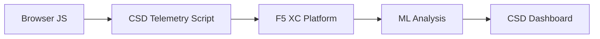

import { Aside } from "@astrojs/starlight/components";

F5 Distributed Cloud Clientseitige Abwehr (CSD) schützt Webanwendungen vor clientseitigen Angriffen, indem das JavaScript-Verhalten direkt im Browser überwacht wird. Der F5 XC Load Balancer kann so konfiguriert werden, dass er das CSD-Telemetrieskript in die an den Client ausgelieferten Seiten einfügt. Dieses Skript beobachtet alle JavaScript-Aktivitäten – welche Skripte geladen werden, welche Formularfelder sie lesen und welche Netzwerkverbindungen sie aufbauen. Telemetriedaten werden an die F5 XC Plattform gesendet, wo Machine-Learning-Modelle das Skriptverhalten analysieren, Risikobewertungen vergeben und Anomalien kennzeichnen. Sicherheitsteams überprüfen Erkennungen in der CSD-Konsole und ergreifen Maßnahmen, indem sie Skript-Domains zulassen oder einschränken.

## Zentrale Erkennungssignale

CSD überwacht drei Kategorien von browserseitigem Verhalten:

| Signal | Was CSD beobachtet | Beispiel |
| --- | --- | --- |
| **Formularfeld-Lesezugriffe** | Welche Skripte auf welche `input`-Felder zugreifen, die beim Seitenaufruf im DOM vorhanden sind | `main.js` liest das `password`-Feld auf `/login` |
| **Skript-Inventar** | Alle first-party und third-party JavaScript-Dateien, die auf jeder Seite geladen werden, erfasst nach Quell-Domain | Ein neues `<script>`-Tag, das von `cdn.jsdelivr.net` auf der Login-Seite eingebunden wird |
| **Netzwerkinteraktionen** | Domains, die an Netzwerkaktivitäten von Skripten beteiligt sind – einschließlich Quell-Domains für Skript-Loads sowie Ziel-Domains für fetch/XHR | Skripte von `esm.sh` und Datenexfiltrationsziele wie `www.httpbin.org` erscheinen in den erkannten Domains |

<Aside type="caution">
Das Signal „Netzwerkinteraktionen" von CSD verfolgt in erster Linie **Quell-Domains für Skript-Loads**. Ziel-Domains für fetch/XHR erscheinen jedoch ebenfalls in der `/detected_domains`-API und der Dashboard-Domain-Tabelle – CSD erkennt Netzwerkaktivität auf Domain-Ebene, nicht nur Skript-Loads. Eine vollständige Liste der verhaltensbezogenen Einschränkungen finden Sie unter [Erkennungsgrenzen](#erkennungsgrenzen).
</Aside>

## Funktionsmatrix

| Funktion | Beschreibung | Konsolen-Standort |
| --- | --- | --- |
| **Skript-Risikobewertung** | Automatische Klassifizierung: Kein Risiko, Geringes Risiko, Hohes Risiko | Skriptliste &rarr; Spalte „Risikostufe" |
| **Formularfeld-Sensitivität** | Automatische Klassifizierung von Feldern als „Sensibel" (durch das System) basierend auf Feldtyp und -name | Formularfelder-Ansicht &rarr; Spalte „Analyse" |
| **Verhaltens-Zeitachse** | Zeigt Risikostufe, Quell-Domain und Typ eines Skripts über die Zeit | Skriptdetail &rarr; Übersicht &rarr; Verhalten im Zeitverlauf |
| **Betroffene Benutzerzuordnung** | Verfolgt betroffene Benutzer nach IP-Adresse, Geolokalisierung, Browser und Gerät | Skriptdetail &rarr; Registerkarte „Betroffene Benutzer" |
| **Domain-Zulassungsliste** | Vertrauenswürdige Skript-Domains als zulässig markieren | Dashboard &rarr; Domain-Zeile &rarr; Zur Zulassungsliste hinzufügen |
| **Domain-Blockierliste** | Netzwerkaufrufe und Formularfeld-Lesezugriffe von bestimmten Skript-Domains blockieren, um Datenexfiltration zu verhindern | Dashboard &rarr; Domain-Zeile &rarr; Zur Blockierliste hinzufügen |
| **Benachrichtigungskonfiguration** | Benachrichtigungen für neue Domains, Risikoänderungen und verdächtiges Verhalten | Abschnitt „Benachrichtigungen" |
| **Skript-Begründung** | Notizen hinzufügen, die erläutern, warum ein Skript autorisiert ist (PCI-DSS-Compliance) | Skriptdetail &rarr; Feld „Begründung" |
| **Transaktionsverfolgung** | Monatlicher Telemetrie-Ereigniszähler, der bestätigt, dass CSD aktiv ist | Dashboard &rarr; Karte „Verbrauchte Transaktionen" |
| **Zeit- und Standortfilter** | Alle Ansichten nach Zeitraum (24 Std., 7 Tage, 30 Tage) und Standort filtern | Filtersteuerelemente in der oberen Leiste |

## Erkennungsgrenzen

Das Verständnis dessen, was CSD **nicht** überwacht, ist entscheidend für die Festlegung realistischer Demo-Erwartungen:

| Einschränkung | Details | Bestätigt |
| --- | --- | --- |
| **Dynamisch erstellte Felder** | CSD verfolgt `input`-Felder, die beim Seitenaufruf im DOM vorhanden sind. Felder, die nach dem Laden durch JavaScript eingefügt werden, werden nicht überwacht. Ein dynamisch erstelltes `<input>`-Element, das von einem Skript gelesen wird, erscheint nicht in der Formularfelder-Ansicht. | Ja – Feld nach 10-minütigem Warten nicht in `/formFields` vorhanden |
| **Code-Verschleierung** | CSD kennzeichnet keine Techniken zur dynamischen Code-Ausführung oder Verschleierungsmuster als separate Erkennungssignale. Verschleierte Harvester erzeugen dieselbe Risikostufe wie nicht verschleierte – CSD verfolgt Verhaltensmetadaten, keine Quellcodemuster. | Ja – identische Bewertung „Hohes Risiko" für beide Techniken |
| **Overlay-Formularfelder** | CSD verfolgt nur Formularfelder, die beim ursprünglichen Seitenaufruf im DOM vorhanden sind. Per JavaScript eingefügte Overlay-Formulare (eine verbreitete Digital-Skimming-Technik) werden nicht verfolgt – nur Lesezugriffe auf die ursprünglichen Felder werden erkannt. | Ja – Overlay-Felder nach 10-minütigem Warten nicht in `/formFields` vorhanden |
| **Verhalten des Dashboard-Zählers** | Die zusammenfassenden Zählerstände „Gefunden &amp; Blockiert" und „Gefunden &amp; Zugelassen" ändern sich nur, nachdem ein Administrator eine Domain explizit zur Blockier- oder Zulassungsliste hinzufügt. Die Zählerstände „Maßnahme erforderlich" und „Insgesamt gefunden" werden automatisch aktualisiert, wenn neue Domains erkannt werden. | Ja – „Gefunden &amp; Zugelassen" änderte sich von 0 auf 1 erst nach POST an `/allowed_domains` |

<Aside type="note" title="API- vs. Konsolen-Sichtbarkeit">
Der API-Endpunkt `/detected_domains` gibt alle erkannten Domains zurück, einschließlich der Quell-Domains für first-party und third-party Skripte. Die first-party Anwendungsdomain (z. B. `csd.bankexample.com`) erscheint in der Liste der erkannten Domains neben third-party CDN-Domains. Sowohl first-party als auch third-party Domains erscheinen in der Dashboard-Domain-Tabelle.

Ziel-Domains für fetch/XHR (z. B. `www.httpbin.org`, kontaktiert über `fetch()`) erscheinen ebenfalls in der Antwort von `/detected_domains`. Die CSD-Plattform verfolgt diese auf Domain-Ebene, auch wenn es sich nicht um Quell-Domains für Skript-Loads handelt.
</Aside>

## PCI-DSS-v4.0-Zuordnung

CSD adressiert direkt zwei PCI-DSS-v4.0-Anforderungen für die Sicherheit von Zahlungsseiten:

| PCI-DSS-Anforderung | Was sie verlangt | Wie CSD dies adressiert |
| --- | --- | --- |
| **6.4.3** – Skriptverwaltung auf Zahlungsseiten | Führen Sie ein Inventar aller Skripte, stellen Sie schriftliche Genehmigungen und Begründungen für jedes Skript bereit und überprüfen Sie die Skriptintegrität | Die Skriptliste bietet ein vollständiges Inventar; das Begründungsfeld dokumentiert die Genehmigung; die Verhaltens-Zeitachse verfolgt Änderungen |
| **11.6.1** – Manipulationserkennung auf Zahlungsseiten | Unautorisierte Änderungen an HTTP-Headern und Inhalten der Zahlungsseite erkennen | Die CSD-Telemetrie erkennt neue Skript-Injektionen, unautorisierte Formularfeld-Lesezugriffe und neue Netzwerk-Domains – und gibt Warnmeldungen bei Änderungen am Seitenverhalten aus |

<Aside type="tip">
Verwenden Sie die Funktion **Skript-Begründung**, um zu dokumentieren, warum jedes Skript auf Zahlungsseiten autorisiert ist. Dadurch wird ein Prüfpfad erstellt, der direkt den Autorisierungsanforderungen von PCI DSS 6.4.3 entspricht.
</Aside>

## Bedrohungsabdeckungsmatrix

Die folgende Tabelle ordnet gängige clientseitige Angriffskategorien den CSD-Erkennungssignalen zu, die bei jedem Angriffstyp ausgelöst würden. Mit **\*** gekennzeichnete Angriffstypen werden durch die [offizielle F5-Dokumentation](https://www.f5.com/cloud/products/client-side-defense) bestätigt. Nicht gekennzeichnete Typen sind basierend auf den Erkennungssignalkategorien von CSD abgeleitet und werden möglicherweise nicht explizit von F5 genannt.

| Angriffskategorie | Beschreibung | Feld-Lesezugriffe | Skript-Injektion | Netzwerk |
| --- | --- | --- | --- | --- |
| **Formjacking** \* | Bösartiges Skript liest Formularfeldwerte und exfiltriert sie | Ja | — | Ja |
| **Digital Skimming** \* | Fügt Overlay-Formulare oder Skripte ein, um Zahlungsdaten zu erfassen | Ja | Ja | Ja |
| **Supply-Chain-Angriff** \* | Kompromittierte Drittanbieter-Bibliothek lädt bösartigen Code | — | Ja | Ja |
| **Datenexfiltration** \* | Liest sensible Daten und sendet sie an externe Domains | Ja | — | Ja |
| **Skript-Injektion** \* | Fügt unautorisierte `<script>`-Tags in die Seite ein | — | Ja | Ja |
| **Cryptojacking** \* | Fügt Kryptowährungs-Mining-Skripte ein | — | Ja | Ja |
| **DOM-Manipulation** | Fügt Seitenelemente ein oder verändert sie, um Benutzer zu täuschen | — | Ja | — |
| **Man-in-the-Browser** | Fängt Formulardaten innerhalb der Browsersitzung ab – siehe [OWASP](https://owasp.org/www-community/attacks/Man-in-the-browser_attack) und [MITRE T1185](https://attack.mitre.org/techniques/T1185/) | Ja | — | Ja |
| **Clickjacking** | Legt unsichtbare Frames übereinander, um Benutzerklicks zu kapern – siehe [OWASP](https://owasp.org/www-community/attacks/Clickjacking) | — | Ja | — |
| **Web-Skimmer-Persistenz** | Fügt Skimmer-Skripte bei jedem Seitenaufruf erneut ein – siehe [Sansec Magecart Research](https://sansec.io/what-is-magecart) | — | Ja | Ja |

<Aside type="note">
Die „Netzwerk"-Erkennung umfasst sowohl Quell-Domains für Skript-Loads als auch Ziel-Domains für fetch/XHR – beide erscheinen in der CSD-API `/detected_domains` und der Dashboard-Domain-Tabelle. Die CSD-Mitigation zielt jedoch auf das Laden von Skripten (den Supply-Chain-Vektor) ab, nicht auf fetch/XHR-Aufrufe. Das Blockieren einer Domain verhindert das Laden von `<script>`-Tags von dieser Domain, fängt jedoch keine `fetch()`- oder `XMLHttpRequest`-Aufrufe an diese Domain ab.
</Aside>
