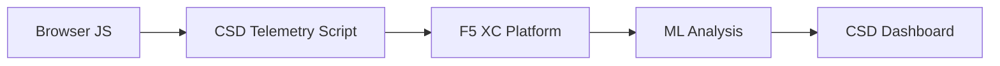

import { Aside } from "@astrojs/starlight/components";

F5 Distributed Cloud Client-Side Defense (CSD) schützt Webanwendungen vor clientseitigen Angriffen, indem das JavaScript-Verhalten direkt im Browser überwacht wird. Der F5 XC Load Balancer kann so konfiguriert werden, dass das CSD-Telemetrie-Skript in die an den Client bereitgestellten Seiten eingefügt wird. Dieses Skript beobachtet alle JavaScript-Aktivitäten — welche Skripte geladen werden, auf welche Formularfelder sie zugreifen und welche Netzwerkverbindungen sie herstellen. Telemetriedaten werden an die F5 XC-Plattform gesendet, wo Machine-Learning-Modelle das Skriptverhalten analysieren, Risikobewertungen vergeben und Anomalien kennzeichnen. Sicherheitsteams überprüfen Erkennungen in der CSD-Konsole und ergreifen Maßnahmen durch Zulassung oder Entschärfung von Skriptdomänen.

## Kernerkennungssignale

CSD überwacht drei Kategorien von browsergestütztem Verhalten:

| Signal | Was CSD beobachtet | Beispiel |
| --- | --- | --- |
| **Formularfeldleser** | Welche Skripte greifen auf welche `input`-Felder zu, die zum Zeitpunkt des Seitenladens im DOM vorhanden sind | `main.js` liest das `password`-Feld auf `/login` |
| **Skriptbestand** | Alle First-Party- und Third-Party-JavaScript-Dateien, die auf jeder Seite geladen werden, nach Quelldomäne verfolgbar | Ein neues `<script>`-Tag, das von `cdn.jsdelivr.net` auf der Anmeldeseite geladen wird |
| **Netzwerkinteraktionen** | Domänen, die an der Skriptnetzwerkaktivität beteiligt sind — umfasst sowohl Skriptladequelldomänen als auch Fetch-/XHR-Zieldomänen | Skripte, die von `esm.sh` stammen und Ziele zur Datenexfiltration wie `www.httpbin.org` in erkannten Domänen |

<Aside type="caution">
Das Signal für Netzwerkinteraktionen von CSD verfolgt in erster Linie **Skriptladequelldomänen**. Jedoch erscheinen Fetch-/XHR-Zieldomänen auch in der `/detected_domains`-API und der Dashboard-Domänentabelle — CSD erkennt Netzwerkaktivität auf Domänenebene, nicht nur Skriptladevorgänge. Siehe [Erkennungsgrenzen](#erkennungsgrenzen) für die vollständige Liste der Verhaltenseinschränkungen.
</Aside>

## Funktionsmatrix

| Funktion | Beschreibung | Konsolenstandort |
| --- | --- | --- |
| **Skriptrisikobewertung** | Automatische Klassifizierung: Kein Risiko, Niedriges Risiko, Hohes Risiko | Skriptliste &rarr; Spalte Risikostufe |
| **Empfindlichkeit von Formularfeldern** | Klassifiziert Felder automatisch als Sensibel (durch System) basierend auf Feldtyp und -name | Ansicht Formularfelder &rarr; Spalte Analyse |
| **Verhaltenszeitleiste** | Diagramme für Skriptrisikostufe, Quelldomäne und Typ im Zeitverlauf | Skriptdetail &rarr; Übersicht &rarr; Verhaltensweisen im Zeitverlauf |
| **Zuordnung betroffener Benutzer** | Verfolgt betroffene Benutzer nach IP, Geolocation, Browser und Gerät | Skriptdetail &rarr; Tab Betroffene Benutzer |
| **Domänen-Zulassungsliste** | Markieren Sie vertrauenswürdige Skriptdomänen als zulässig | Dashboard &rarr; Domänenzeile &rarr; Zur Zulassungsliste hinzufügen |
| **Domänen-Entschärfungsliste** | Blockieren Sie Netzwerkaufrufe und Formularfeldlesevorgänge von bestimmten Skriptdomänen, um Datenexfiltration zu verhindern | Dashboard &rarr; Domänenzeile &rarr; Zur Entschärfungsliste hinzufügen |
| **Benachrichtigungskonfiguration** | Benachrichtigungen für neue Domänen, Risikoänderungen, verdächtiges Verhalten | Abschnitt Benachrichtigungen |
| **Skriptbegründung** | Notizen hinzufügen, die erklären, warum ein Skript autorisiert ist (PCI-DSS-Compliance) | Skriptdetail &rarr; Feld Begründung |
| **Transaktionsverfolgung** | Monatlicher Telemetrieereigniszähler, der bestätigt, dass CSD aktiv ist | Dashboard &rarr; Karte Verbrauchte Transaktionen |
| **Zeit- und Standortfilter** | Filtern Sie alle Ansichten nach Zeitbereich (24h, 7d, 30d) und Standort | Filtersteuerelemente in der oberen Leiste |

## Erkennungsgrenzen

Das Verständnis, was CSD **nicht** überwacht, ist entscheidend für die Festlegung genauer Demo-Erwartungen:

| Einschränkung | Detail | Verifiziert |
| --- | --- | --- |
| **Dynamisch erstellte Felder** | CSD verfolgt `input`-Felder, die im DOM zum Zeitpunkt des Seitenladens vorhanden sind. Felder, die nach dem Laden durch JavaScript eingefügt werden, werden nicht überwacht. Ein dynamisch erstelltes `<input>`-Feld, das von einem Skript gelesen wird, wird nicht in der Ansicht Formularfelder angezeigt. | Ja — Feld fehlt nach 10-minütiger Wartezeit in `/formFields` |
| **Code-Obfuskation** | CSD kennzeichnet keine dynamischen Code-Ausführungstechniken oder Obfuskationsmuster als separate Erkennungssignale. Obfuskierte Harvester erzeugen das gleiche Risiko wie nicht-obfuskierte — CSD verfolgt Verhaltenmetadaten, keine Quellcodemuster. | Ja — Identisches "Hohes Risiko" für beide Techniken |
| **Formularoverlay-Felder** | CSD verfolgt nur Formularfelder, die im ursprünglichen DOM beim Seitenladen vorhanden sind. Overlay-Formulare, die durch JavaScript eingefügt werden (eine häufige Digital-Skimming-Technik), werden nicht verfolgt — nur Lesevorgänge der ursprünglichen Felder werden erkannt. | Ja — Overlay-Felder fehlen nach 10-minütiger Wartezeit in `/formFields` |
| **Dashboard-Zählerverhalten** | Die Zusammenfassungszählungen "Gefunden &amp; Entschärft" und "Gefunden &amp; Zulässig" ändern sich nur, wenn ein Administrator eine Domäne explizit zur Entschärfungs- oder Zulassungsliste hinzufügt. Die Zählungen "Maßnahme erforderlich" und "Insgesamt gefunden" werden automatisch aktualisiert, wenn neue Domänen erkannt werden. | Ja — "Gefunden &amp; Zulässig" änderte sich von 0 zu 1 nur nach POST zu `/allowed_domains` |

<Aside type="note" title="API vs. Konsolensichtbarkeit">
Der API-Endpunkt `/detected_domains` gibt alle erkannten Domänen zurück, einschließlich sowohl First-Party- als auch Third-Party-Skriptquelldomänen. Die First-Party-Anwendungsdomäne (z. B. `csd.bankexample.com`) erscheint in der Liste erkannter Domänen neben Third-Party-CDN-Domänen. Sowohl First-Party- als auch Third-Party-Domänen erscheinen in der Dashboard-Domänentabelle.

Fetch-/XHR-Zieldomänen (z. B. `www.httpbin.org`, das über `fetch()` kontaktiert wird), erscheinen auch in der `/detected_domains`-Antwort. Die CSD-Plattform verfolgt diese auf Domänenebene, obwohl sie keine Skriptladequelldomänen sind.
</Aside>

## PCI-DSS v4.0-Zuordnung

CSD adressiert direkt zwei PCI-DSS-v4.0-Anforderungen für die Sicherheit von Zahlungsseiten:

| PCI-DSS-Anforderung | Was erforderlich ist | Wie CSD dies adressiert |
| --- | --- | --- |
| **6.4.3** — Skriptverwaltung auf Zahlungsseiten | Führen Sie ein Bestand aller Skripte, stellen Sie schriftliche Genehmigung und Begründung für jedes bereit, verifizieren Sie die Skriptintegrität | Skriptliste bietet vollständigen Bestand; Feld Begründung dokumentiert Genehmigung; Verhaltenszeitleiste verfolgt Änderungen |
| **11.6.1** — Tamper-Erkennung auf Zahlungsseiten | Erkennen Sie unberechtigte Änderungen an HTTP-Headern und Zahlungsseiteninhalten | CSD-Telemetrie erkennt neue Skriptinjektionen, nicht autorisierte Formularfeldleser und neue Netzwerkdomänen — benachrichtigt über Änderungen des Seitenverhaltens |

<Aside type="tip">
Verwenden Sie die Funktion **Skriptbegründung**, um zu dokumentieren, warum jedes Skript auf Zahlungsseiten autorisiert ist. Dies erstellt einen Audit-Trail, der sich direkt auf PCI-DSS-6.4.3-Genehmigungsanforderungen abbildet.
</Aside>

## Threat-Coverage-Matrix

Die folgende Tabelle ordnet allgemeine clientseitige Angriffskategorien den CSD-Erkennungssignalen zu, die während jedes Angriffstyps aktiviert würden. Angriffstypen, die mit **\*** gekennzeichnet sind, werden durch die [offizielle F5-Dokumentation](https://www.f5.com/cloud/products/client-side-defense) bestätigt. Nicht gekennzeichnete Typen werden basierend auf CSD-Erkennungssignalkategorien abgeleitet und können nicht explizit von F5 beansprucht werden.

| Angriffskategorie | Beschreibung | Feldleser | Skriptinjektion | Netzwerk |
| --- | --- | --- | --- | --- |
| **Formjacking** \* | Böswilliges Skript liest Formularfeldwerte und exfiltriert sie | Ja | — | Ja |
| **Digital Skimming** \* | Fügt Overlay-Formulare oder Skripte ein, um Zahlungsdaten zu erfassen | Ja | Ja | Ja |
| **Supply-Chain-Angriff** \* | Kompromittierte Drittanbieterbibliothek lädt böswilligen Code | — | Ja | Ja |
| **Datenexfiltration** \* | Liest sensible Daten und sendet sie an externe Domänen | Ja | — | Ja |
| **Skriptinjektion** \* | Fügt nicht autorisierte `<script>`-Tags in die Seite ein | — | Ja | Ja |
| **Cryptojacking** \* | Fügt Kryptowährungs-Mining-Skripte ein | — | Ja | Ja |
| **DOM-Manipulation** | Fügt Seitenelemente ein oder ändert sie, um Benutzer zu täuschen | — | Ja | — |
| **Man-in-the-Browser** | Fängt Formulardaten innerhalb der Browsersitzung ab — siehe [OWASP](https://owasp.org/www-community/attacks/Man-in-the-browser_attack) und [MITRE T1185](https://attack.mitre.org/techniques/T1185/) | Ja | — | Ja |
| **Clickjacking** | Überlagert unsichtbare Frames, um Benutzerklicks zu entführen — siehe [OWASP](https://owasp.org/www-community/attacks/Clickjacking) | — | Ja | — |
| **Web-Skimmer-Persistenz** | Injiziert Skimmer-Skripte erneut über Seitennavigationen — siehe [Sansec Magecart Research](https://sansec.io/what-is-magecart) | — | Ja | Ja |

<Aside type="note">
Die "Netzwerk"-Erkennung abdeckt sowohl Skriptladequelldomänen als auch Fetch-/XHR-Zieldomänen — beide erscheinen in der CSD-`/detected_domains`-API und der Dashboard-Domänentabelle. Allerdings zielt die CSD-Entschärfung auf das Skriptladen (der Supply-Chain-Vektor) ab, nicht auf Fetch-/XHR-Aufrufe. Das Entschärfen einer Domäne blockiert `<script>`-Tag-Ladevorgänge von dieser Domäne, fängt aber keine `fetch()`- oder `XMLHttpRequest`-Aufrufe dafür ab.
</Aside>
