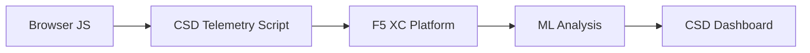

import { Aside } from "@astrojs/starlight/components";

F5 Distributed Cloud Client-Side Defense (CSD) schützt Webanwendungen vor clientseitigen Angriffen, indem es das JavaScript-Verhalten direkt im Browser überwacht. Der F5 XC Load Balancer kann so konfiguriert werden, dass er das CSD-Telemetrie-Skript in Seiten einfügt, die an den Client ausgeliefert werden. Dieses Skript beobachtet alle JavaScript-Aktivitäten — welche Skripte geladen werden, welche Formularfelder sie auslesen und welche Netzwerkverbindungen sie herstellen. Telemetriedaten werden an die F5 XC-Plattform gesendet, wo Machine-Learning-Modelle das Skriptverhalten analysieren, Risikobewertungen vergeben und Anomalien markieren. Sicherheitsteams überprüfen die Erkennungen in der CSD-Konsole und ergreifen Maßnahmen, indem sie Skript-Domains zulassen oder entschärfen.

## Kernerkennungssignale

CSD überwacht drei Kategorien von browserseitigem Verhalten:

| Signal | Was CSD beobachtet | Beispiel |
| --- | --- | --- |
| **Formularfeld-Lesezugriffe** | Welche Skripte auf welche `input`-Felder zugreifen, die beim Laden der Seite im DOM vorhanden sind | `main.js` liest das `password`-Feld auf `/login` |
| **Skript-Inventar** | Alle First-Party- und Third-Party-JavaScript-Dateien, die auf jeder Seite geladen werden, nachverfolgt nach Quell-Domain | Ein neues `<script>`-Tag, das von `cdn.jsdelivr.net` auf der Login-Seite geladen wird |
| **Netzwerkinteraktionen** | Domains, die an Skript-Netzwerkaktivitäten beteiligt sind — umfasst sowohl Quell-Domains für das Laden von Skripten als auch Ziel-Domains von fetch/XHR | Skripte von `esm.sh` und Datenexfiltrationsziele wie `www.httpbin.org`, die in erkannten Domains erscheinen |

<Aside type="caution">
Das Signal für Netzwerkinteraktionen von CSD verfolgt primär **Quell-Domains für das Laden von Skripten**. Allerdings erscheinen fetch/XHR-Ziel-Domains ebenfalls in der `/detected_domains`-API und der Dashboard-Domain-Tabelle — CSD erkennt Netzwerkaktivitäten auf Domain-Ebene, nicht nur Skript-Ladevorgänge. Siehe [Erkennungsgrenzen](#erkennungsgrenzen) für die vollständige Liste der Verhaltensbeschränkungen.
</Aside>

## Funktionsmatrix

| Funktion | Beschreibung | Konsolenstandort |
| --- | --- | --- |
| **Skript-Risikobewertung** | Automatische Klassifizierung: Kein Risiko, Niedriges Risiko, Hohes Risiko | Skriptliste &rarr; Spalte Risikostufe |
| **Formularfeld-Sensitivität** | Automatische Klassifizierung von Feldern als Sensibel (durch das System) basierend auf Feldtyp und -name | Formularfelder-Ansicht &rarr; Spalte Analyse |
| **Verhaltens-Zeitverlauf** | Diagramme zu Skript-Risikostufe, Quell-Domain und Typ im Zeitverlauf | Skriptdetails &rarr; Übersicht &rarr; Verhalten im Zeitverlauf |
| **Zuordnung betroffener Benutzer** | Verfolgt betroffene Benutzer nach IP, Geolokalisierung, Browser und Gerät | Skriptdetails &rarr; Reiter Betroffene Benutzer |
| **Domain-Erlaubnisliste** | Vertrauenswürdige Skript-Domains als zugelassen markieren | Dashboard &rarr; Domain-Zeile &rarr; Zur Erlaubnisliste hinzufügen |
| **Domain-Entschärfungsliste** | Netzwerkaufrufe und Formularfeld-Lesezugriffe von bestimmten Skript-Domains blockieren, um Datenexfiltration zu verhindern | Dashboard &rarr; Domain-Zeile &rarr; Zur Entschärfungsliste hinzufügen |
| **Alarmkonfiguration** | Benachrichtigungen für neue Domains, Risikoänderungen, verdächtiges Verhalten | Bereich Benachrichtigungen |
| **Skript-Begründung** | Notizen hinzufügen, die erklären, warum ein Skript autorisiert ist (PCI DSS-Konformität) | Skriptdetails &rarr; Feld Begründung |
| **Transaktionsverfolgung** | Monatlicher Telemetrie-Ereigniszähler, der bestätigt, dass CSD aktiv ist | Dashboard &rarr; Karte Verbrauchte Transaktionen |
| **Zeit- und Standortfilter** | Alle Ansichten nach Zeitraum (24h, 7d, 30d) und Standort filtern | Filtersteuerungen in der oberen Leiste |

## Erkennungsgrenzen

Das Verständnis dessen, was CSD **nicht** überwacht, ist entscheidend, um genaue Erwartungen für Demonstrationen zu setzen:

| Einschränkung | Detail | Verifiziert |
| --- | --- | --- |
| **Dynamisch erstellte Felder** | CSD verfolgt `input`-Felder, die beim Laden der Seite im DOM vorhanden sind. Felder, die nach dem Laden durch JavaScript eingefügt werden, werden nicht überwacht. Ein dynamisch erstelltes `<input>`, das von einem Skript gelesen wird, erscheint nicht in der Formularfelder-Ansicht. | Ja — Feld nach 10-minütiger Wartezeit nicht in `/formFields` vorhanden |
| **Code-Level-Verschleierung** | CSD markiert dynamische Code-Ausführungstechniken oder Verschleierungsmuster nicht als separate Erkennungssignale. Verschleierte Harvester erzeugen die gleiche Risikostufe wie nicht-verschleierte — CSD verfolgt Verhaltensmetadaten, keine Quellcode-Muster. | Ja — identisches "Hohes Risiko" für beide Techniken |
| **Formular-Overlay-Felder** | CSD verfolgt nur Formularfelder, die beim Laden der Seite im ursprünglichen DOM vorhanden sind. Overlay-Formulare, die durch JavaScript eingefügt werden (eine gängige Digital-Skimming-Technik), werden nicht verfolgt — nur Lesezugriffe auf die ursprünglichen Felder werden erkannt. | Ja — Overlay-Felder nach 10-minütiger Wartezeit nicht in `/formFields` vorhanden |
| **Dashboard-Zählerverhalten** | Die Zusammenfassungszähler "Gefunden &amp; Entschärft" und "Gefunden &amp; Zugelassen" ändern sich nur, nachdem ein Administrator eine Domain explizit zur Entschärfungs- oder Erlaubnisliste hinzugefügt hat. Die Zähler "Aktion erforderlich" und "Insgesamt gefunden" aktualisieren sich automatisch, wenn neue Domains erkannt werden. | Ja — "Gefunden &amp; Zugelassen" änderte sich erst nach POST an `/allowed_domains` von 0 auf 1 |

<Aside type="note" title="API- vs. Konsolen-Sichtbarkeit">
Der API-Endpunkt `/detected_domains` gibt alle erkannten Domains zurück, einschließlich sowohl First-Party- als auch Third-Party-Skript-Quell-Domains. Die First-Party-Anwendungsdomain (z. B. `csd.bankexample.com`) erscheint in der Liste der erkannten Domains neben Third-Party-CDN-Domains. Sowohl First-Party- als auch Third-Party-Domains erscheinen in der Dashboard-Domain-Tabelle.

Fetch/XHR-Ziel-Domains (z. B. `www.httpbin.org`, die über `fetch()` kontaktiert werden) erscheinen ebenfalls in der `/detected_domains`-Antwort. Die CSD-Plattform verfolgt diese auf Domain-Ebene, obwohl es sich nicht um Quell-Domains für das Laden von Skripten handelt.
</Aside>

## PCI DSS v4.0-Zuordnung

CSD adressiert direkt zwei PCI DSS v4.0-Anforderungen für die Sicherheit von Zahlungsseiten:

| PCI DSS-Anforderung | Was sie erfordert | Wie CSD sie adressiert |
| --- | --- | --- |
| **6.4.3** — Skriptverwaltung auf Zahlungsseiten | Ein Inventar aller Skripte führen, schriftliche Autorisierung und Begründung für jedes Skript bereitstellen, Skript-Integrität überprüfen | Die Skriptliste bietet ein vollständiges Inventar; das Begründungsfeld dokumentiert die Autorisierung; der Verhaltens-Zeitverlauf verfolgt Änderungen |
| **11.6.1** — Manipulationserkennung auf Zahlungsseiten | Unautorisierte Änderungen an HTTP-Headern und Zahlungsseiteninhalten erkennen | CSD-Telemetrie erkennt neue Skript-Injektionen, unautorisierte Formularfeld-Lesezugriffe und neue Netzwerk-Domains — und alarmiert bei Änderungen am Seitenverhalten |

<Aside type="tip">
Verwenden Sie die Funktion **Skript-Begründung**, um zu dokumentieren, warum jedes Skript auf Zahlungsseiten autorisiert ist. Dies erstellt einen Audit-Trail, der direkt den Autorisierungsanforderungen von PCI DSS 6.4.3 entspricht.
</Aside>

## Bedrohungsabdeckungsmatrix

Die folgende Tabelle ordnet gängige clientseitige Angriffskategorien den CSD-Erkennungssignalen zu, die bei jedem Angriffstyp ausgelöst würden. Mit **\*** gekennzeichnete Angriffstypen sind durch die [offizielle F5-Dokumentation](https://www.f5.com/cloud/products/client-side-defense) bestätigt. Nicht gekennzeichnete Typen werden basierend auf den Erkennungssignal-Kategorien von CSD abgeleitet und werden möglicherweise nicht explizit von F5 beansprucht.

| Angriffskategorie | Beschreibung | Feld-Lesezugriffe | Skript-Injektion | Netzwerk |
| --- | --- | --- | --- | --- |
| **Formjacking** \* | Bösartiges Skript liest Formularfeldwerte aus und exfiltriert sie | Ja | — | Ja |
| **Digital Skimming** \* | Injiziert Overlay-Formulare oder Skripte, um Zahlungsdaten abzufangen | Ja | Ja | Ja |
| **Supply-Chain-Angriff** \* | Kompromittierte Third-Party-Bibliothek lädt bösartigen Code | — | Ja | Ja |
| **Datenexfiltration** \* | Liest sensible Daten aus und sendet sie an externe Domains | Ja | — | Ja |
| **Skript-Injektion** \* | Fügt unautorisierte `<script>`-Tags in die Seite ein | — | Ja | Ja |
| **Cryptojacking** \* | Injiziert Kryptowährungs-Mining-Skripte | — | Ja | Ja |
| **DOM-Manipulation** | Injiziert oder modifiziert Seitenelemente, um Benutzer zu täuschen | — | Ja | — |
| **Man-in-the-Browser** | Fängt Formulardaten innerhalb der Browsersitzung ab — siehe [OWASP](https://owasp.org/www-community/attacks/Man-in-the-browser_attack) und [MITRE T1185](https://attack.mitre.org/techniques/T1185/) | Ja | — | Ja |
| **Clickjacking** | Überlagert unsichtbare Frames, um Benutzerklicks zu kapern — siehe [OWASP](https://owasp.org/www-community/attacks/Clickjacking) | — | Ja | — |
| **Web-Skimmer-Persistenz** | Injiziert Skimmer-Skripte bei Seitennavigationen erneut — siehe [Sansec Magecart Research](https://sansec.io/what-is-magecart) | — | Ja | Ja |

<Aside type="note">
Die "Netzwerk"-Erkennung umfasst sowohl Quell-Domains für das Laden von Skripten als auch fetch/XHR-Ziel-Domains — beide erscheinen in der CSD `/detected_domains`-API und der Dashboard-Domain-Tabelle. Allerdings zielt die CSD-Entschärfung auf das Laden von Skripten (den Supply-Chain-Vektor) ab, nicht auf fetch/XHR-Aufrufe. Das Entschärfen einer Domain blockiert `<script>`-Tag-Ladevorgänge von dieser Domain, fängt aber keine `fetch()`- oder `XMLHttpRequest`-Aufrufe an sie ab.
</Aside>
