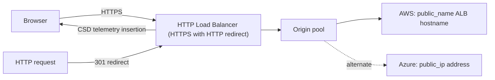
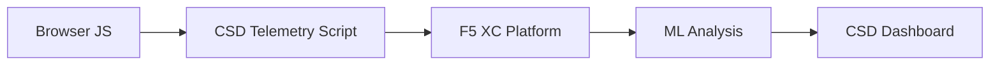

import { Aside } from "@astrojs/starlight/components";

F5 Distributed Cloud Client-Side Defense (CSD) adds browser-side telemetry to a protected application through the HTTP Load Balancer (HTTPS with HTTP redirect).
The service reports script, domain, form-field, risk, and behavior data for security review. Administrators can place observed domains on allow or mitigate lists. Validate actual coverage and enforcement with current tenant evidence before making a customer claim.

## Reference Architecture

The API and Terraform workflows create the same logical F5 Distributed Cloud architecture centered on one **HTTP Load Balancer (HTTPS with HTTP redirect)**:

The shared settings are namespace `client-side-defense`, domain
`client-side-defense.f5-sales-demo.com`, public default VIP advertisement, HTTPS automatic
certificate issuance with HTTP redirect, one default origin-pool route, and CSD insertion on all
pages. The load balancer has the unsuffixed name `client-side-defense`; there is no separate HTTP
resource. Protected-application execution uses HTTPS; HTTP is tested only for the `301` redirect.

Choose one ownership mode: [API build](/csd/en/demo/phase-1-build/) or
[Terraform](/csd/en/terraform/). The resulting traffic path is equivalent, but ownership is
mutually exclusive.

Choose one ownership mode. Never run the API create/update/delete workflow against resources present in Terraform state.

## Core Detection Signals

CSD telemetry in this lab provides evidence for these browser-side categories:

| Signal | What to Validate | Example |
| --- | --- | --- |
| **Form field interactions** | Form-field entries associated with observed scripts | An entry for an email or password input in `/formFields` |
| **Script inventory** | First-party and third-party scripts reported for the protected page | A CDN script URL in `/scripts` |
| **Detected domains** | Domains returned by `/detected_domains` for the active run | A candidate CDN or synthetic external destination observed in the run |

<Aside type="caution">
Do not infer complete coverage from the harness definition. Report only domains and fields observed in browser and API evidence for the active run.
</Aside>

## Feature Matrix

| Feature | Description | Console Location |
| --- | --- | --- |
| **Script risk scoring** | Displays the risk classification returned for a script | Script List &rarr; Risk Level column |
| **Form field analysis** | Displays available field analysis returned by the service | Form Fields view &rarr; Analysis column |
| **Behavior timeline** | Displays reported script behavior over time | Script detail &rarr; Overview &rarr; Behaviors Over Time |
| **Affected-user view** | Displays available impacted-user attributes | Script detail &rarr; Affected Users tab |
| **Domain allow list** | Records trusted domains selected by an administrator | Dashboard &rarr; domain row &rarr; Add To Allow List |
| **Domain mitigate list** | Records domains selected for mitigation | Dashboard &rarr; domain row &rarr; Add To Mitigate List |
| **Alert configuration** | Configures available CSD notifications | Notifications section |
| **Script justification** | Records administrator justification for an authorized script | Script detail &rarr; Justification field |
| **Transaction counter** | Configuration/telemetry evidence that events were recorded; not enforcement proof | Dashboard &rarr; Transactions Consumed card |
| **Time and location filters** | Filter all views by time range (24h, 7d, 30d) and location | Top bar filter controls |

## Detection Boundaries

The following are lab observations, not universal product limits. Revalidate them in the active tenant and protected application:

| Observation | Lab Evidence | Interpretation |
| --- | --- | --- |
| Dynamically created fields were absent | Field absent from `/formFields` during the observation window | The run did not produce form-field telemetry for that field; do not generalize beyond the tested build and traffic |
| Obfuscated and unobfuscated samples had the same displayed risk | Same displayed classification in the tested run | No distinct obfuscation signal was observed in this lab |
| Overlay fields were absent | Overlay field absent from `/formFields` during the observation window | The run did not produce form-field telemetry for the injected overlay field |
| Dashboard summary counters changed after list mutations | Counter change observed after allow/mitigate API operations | Counters are configuration-state evidence, not proof that the browser enforced mitigation |

<Aside type="note" title="API and browser evidence">
The API lists and counters show configuration and reported telemetry. Browser Network behavior is the enforcement evidence: compare the same HTTPS simulation before and after mitigation and record the requests actually observed. Domain coverage must be limited to the domains present in that run's baseline and API data.
</Aside>

## PCI DSS v4.0 Mapping

CSD can provide evidence that supports assessment of PCI DSS v4.0 payment-page controls; it does not by itself establish compliance:

| PCI DSS Requirement | Relevant CSD Evidence | Qualification |
| --- | --- | --- |
| **6.4.3** — Payment-page script management | Script inventory, approval status, and recorded justification available in the tenant | Confirm completeness and operating procedures with the assessor |
| **11.6.1** — Payment-page change/tamper detection | Observed script, domain, and behavior changes | Validate alerting, response, and coverage against the customer's implementation |

<Aside type="tip">
Use script justification and current inventory as audit evidence, while keeping authorization, integrity validation, review cadence, and assessor acceptance in the customer's control framework.
</Aside>

## Threat Coverage Matrix

The following table maps common client-side attack scenarios to lab signals relevant for validation. Scenarios marked with **\*** are described in [F5 product material](https://www.f5.com/cloud/products/client-side-defense). Unmarked mappings are scenario guidance, not confirmed F5 product claims. A `Yes` identifies a signal to test; it does not guarantee detection in every run.

| Attack Category | Description | Field Reads | Script Injection | Network |
| --- | --- | --- | --- | --- |
| **Formjacking** \* | Malicious script reads form field values and exfiltrates them | Yes | — | Yes |
| **Digital skimming** \* | Injects overlay forms or scripts to capture payment data | Yes | Yes | Yes |
| **Supply chain attack** \* | Compromised third-party library loads malicious code | — | Yes | Yes |
| **Data exfiltration** \* | Reads sensitive data and sends it to external domains | Yes | — | Yes |
| **Script injection** \* | Inserts unauthorized `<script>` tags into the page | — | Yes | Yes |
| **Cryptojacking** \* | Injects cryptocurrency mining scripts | — | Yes | Yes |
| **DOM manipulation** | Injects or modifies page elements to deceive users | — | Yes | — |
| **Man-in-the-Browser** | Intercepts form data within the browser session — see [OWASP](https://owasp.org/www-community/attacks/Man-in-the-browser_attack) and [MITRE T1185](https://attack.mitre.org/techniques/T1185/) | Yes | — | Yes |
| **Clickjacking** | Overlays invisible frames to hijack user clicks — see [OWASP](https://owasp.org/www-community/attacks/Clickjacking) | — | Yes | — |
| **Web skimmer persistence** | Re-injects skimmer scripts across page navigations — see [Sansec Magecart Research](https://sansec.io/what-is-magecart) | — | Yes | Yes |

<Aside type="note">
The matrix describes which lab signals are relevant to each scenario; it is not a guarantee that every listed signal or domain appears in every run. Validate coverage from current browser and API evidence before presenting a claim.
</Aside>
