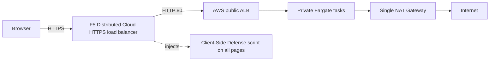

import { Aside } from "@astrojs/starlight/components";

This Terraform stack deploys the CSD reference application and its F5 Distributed Cloud
configuration as one state-managed architecture. It creates a dedicated two-AZ AWS VPC, an
internet-facing Application Load Balancer (ALB) restricted to documented F5 Distributed Cloud
Regional Edge source CIDRs, private Fargate tasks, logging controls, and the F5 Distributed Cloud
namespace, protected domain, origin pool, and HTTP Load Balancer configured for HTTPS.

<Aside type="caution" title="Exclusive ownership">
Choose one ownership mode. Never run the API create/update/delete workflow against resources present in Terraform state.
</Aside>

The API and Terraform workflows create the same logical F5 Distributed Cloud architecture, but they are mutually exclusive owners. Use Terraform for the complete AWS reference stack and keep all subsequent changes, recovery plans, and destruction in the same backend and state.

## Architecture

The load balancer uses `https_auto_cert` with HTTP redirect, advertises on the public default VIP, sends its default route to the managed origin pool, and enables CSD JavaScript injection on all pages. The origin pool consumes the ALB hostname through `public_name`; no generated ALB hostname is persisted in documentation.

The AWS topology has two public ALB subnets and two private Fargate subnets across two Availability Zones. Tasks have no public IP and no SSH path. The stack provides KMS-encrypted ECS and VPC logs, 365-day CloudWatch retention, scoped Flow Logs IAM, and a versioned SSE-S3 ALB log bucket with 90-day current and noncurrent expiry plus seven-day incomplete multipart cleanup.

<Aside type="caution" title="Single-AZ egress dependency">
The stack intentionally uses one NAT Gateway to control demo cost. Both private subnets depend on that NAT Gateway and its Availability Zone for outbound access. A production-resilient design requires one NAT Gateway and private route table per Availability Zone.
</Aside>

## Guardrails

Planning and apply are blocked unless the configured AWS account, profile, region, F5 Distributed Cloud namespace, and application domain match the reviewed values. The stack also checks that Client-Side Defense Standard is subscribed before creating dependent platform resources. Namespace creation is explicitly ordered before the protected domain, origin pool, and load balancer.

The backend uses remote S3 state, encryption, and Terraform's native lock file. Keep the committed provider lock file and use the same backend and state when resuming after a partial apply.

## Source provenance

The application module is vendored under `terraform/aws/vendor/aws-juice-shop` from `f5-sales-demo/origin-server` commit `d6384bb0621c4c1eceb38d55a6b63e7b9cc7083a`. The corresponding published origin documentation is [f5-sales-demo/origin-server](https://f5-sales-demo.github.io/origin-server/), released by merge `595841996ef7e782870be8200dce4775defb7e80`.

Vendoring pins the reviewed implementation rather than following a moving module ref. Update it only through a separate provenance review that compares upstream source, tests, and operational behavior.

Continue with the [source reference](./source-reference/), then follow the [operations runbook](./operations/).
