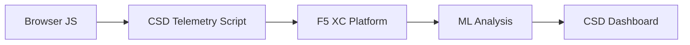

import { Aside } from "@astrojs/starlight/components";

F5 Distributed Cloud Client-Side Defense (CSD) protege las aplicaciones web contra ataques del lado del cliente mediante la monitorización del comportamiento de JavaScript directamente en el navegador. El balanceador de carga de F5 XC puede configurarse para inyectar el script de telemetría de CSD en las páginas servidas al cliente. Este script observa toda la actividad de JavaScript: qué scripts se cargan, qué campos de formulario leen y qué conexiones de red realizan. Los datos de telemetría se envían a la plataforma F5 XC, donde modelos de aprendizaje automático analizan el comportamiento de los scripts, asignan puntuaciones de riesgo y señalan anomalías. Los equipos de seguridad revisan las detecciones en la consola de CSD y toman medidas permitiendo o mitigando dominios de scripts.

## Señales de detección principales

CSD monitoriza tres categorías de comportamiento del lado del navegador:

| Señal | Qué observa CSD | Ejemplo |
| --- | --- | --- |
| **Lecturas de campos de formulario** | Qué scripts acceden a qué campos `input` presentes en el DOM de la página al momento de la carga | `main.js` leyendo el campo `password` en `/login` |
| **Inventario de scripts** | Todo el JavaScript propio y de terceros cargado en cada página, rastreado por dominio de origen | Una nueva etiqueta `<script>` cargando desde `cdn.jsdelivr.net` que aparece en la página de inicio de sesión |
| **Interacciones de red** | Dominios involucrados en la actividad de red de scripts — incluye tanto dominios de origen de carga de scripts como dominios de destino de fetch/XHR | Scripts originados desde `esm.sh` y objetivos de exfiltración de datos como `www.httpbin.org` apareciendo en los dominios detectados |

<Aside type="caution">
La señal de Interacciones de red de CSD rastrea principalmente **dominios de origen de carga de scripts**. Sin embargo, los dominios de destino de fetch/XHR también aparecen en la API `/detected_domains` y en la tabla de dominios del Dashboard — CSD detecta la actividad de red a nivel de dominio, no solo las cargas de scripts. Consulte [Límites de detección](#límites-de-detección) para la lista completa de limitaciones de comportamiento.
</Aside>

## Matriz de funcionalidades

| Funcionalidad | Descripción | Ubicación en la consola |
| --- | --- | --- |
| **Puntuación de riesgo de scripts** | Clasificación automática: Sin riesgo, Riesgo bajo, Riesgo alto | Lista de scripts &rarr; columna Nivel de riesgo |
| **Sensibilidad de campos de formulario** | Clasifica automáticamente los campos como Sensibles (por el sistema) basándose en el tipo y nombre del campo | Vista de campos de formulario &rarr; columna Análisis |
| **Línea temporal de comportamiento** | Gráficos del nivel de riesgo del script, dominio de origen y tipo a lo largo del tiempo | Detalle del script &rarr; Descripción general &rarr; Comportamientos a lo largo del tiempo |
| **Atribución de usuarios afectados** | Rastrea usuarios impactados por IP, geolocalización, navegador y dispositivo | Detalle del script &rarr; pestaña Usuarios afectados |
| **Lista de dominios permitidos** | Marcar dominios de scripts confiables como permitidos | Dashboard &rarr; fila de dominio &rarr; Añadir a lista de permitidos |
| **Lista de dominios a mitigar** | Bloquear llamadas de red y lecturas de campos de formulario desde dominios de scripts específicos, previniendo la exfiltración de datos | Dashboard &rarr; fila de dominio &rarr; Añadir a lista de mitigación |
| **Configuración de alertas** | Notificaciones para nuevos dominios, cambios de riesgo, comportamiento sospechoso | Sección de notificaciones |
| **Justificación de scripts** | Añadir notas explicando por qué un script está autorizado (cumplimiento PCI DSS) | Detalle del script &rarr; campo Justificación |
| **Seguimiento de transacciones** | Contador mensual de eventos de telemetría que confirma que CSD está activo | Dashboard &rarr; tarjeta Transacciones consumidas |
| **Filtros de tiempo y ubicación** | Filtrar todas las vistas por rango de tiempo (24h, 7d, 30d) y ubicación | Controles de filtro en la barra superior |

## Límites de detección

Comprender lo que CSD **no** monitoriza es fundamental para establecer expectativas precisas en las demostraciones:

| Limitación | Detalle | Verificado |
| --- | --- | --- |
| **Campos creados dinámicamente** | CSD rastrea los campos `input` presentes en el DOM al momento de la carga de la página. Los campos inyectados por JavaScript después de la carga no se monitorizan. Un `<input>` creado dinámicamente y leído por un script no aparece en la vista de campos de formulario. | Sí — campo ausente de `/formFields` tras espera de 10 minutos |
| **Ofuscación a nivel de código** | CSD no señala técnicas de ejecución dinámica de código ni patrones de ofuscación como señales de detección separadas. Los recolectores ofuscados producen el mismo nivel de riesgo que los no ofuscados — CSD rastrea metadatos de comportamiento, no patrones de código fuente. | Sí — "Riesgo alto" idéntico para ambas técnicas |
| **Campos de formulario superpuestos** | CSD rastrea únicamente los campos de formulario presentes en el DOM original al momento de la carga de la página. Los formularios superpuestos inyectados por JavaScript (una técnica común de skimming digital) no se rastrean — solo se detectan las lecturas de los campos originales. | Sí — campos superpuestos ausentes de `/formFields` tras espera de 10 minutos |
| **Comportamiento del contador del Dashboard** | Los contadores de resumen "Encontrados y mitigados" y "Encontrados y permitidos" solo cambian después de que un administrador añade explícitamente un dominio a la lista de mitigación o de permitidos. Los contadores "Acción necesaria" y "Total encontrados" se actualizan automáticamente cuando se detectan nuevos dominios. | Sí — "Encontrados y permitidos" cambió de 0 a 1 solo después de POST a `/allowed_domains` |

<Aside type="note" title="Visibilidad API vs Consola">
El endpoint de la API `/detected_domains` devuelve todos los dominios detectados, incluyendo tanto dominios de origen de scripts propios como de terceros. El dominio de la aplicación propia (por ejemplo, `csd.bankexample.com`) aparece en la lista de dominios detectados junto con los dominios CDN de terceros. Tanto los dominios propios como los de terceros aparecen en la tabla de dominios del Dashboard.

Los dominios de destino de fetch/XHR (por ejemplo, `www.httpbin.org` contactado mediante `fetch()`) también aparecen en la respuesta de `/detected_domains`. La plataforma CSD los rastrea a nivel de dominio aunque no sean dominios de origen de carga de scripts.
</Aside>

## Correspondencia con PCI DSS v4.0

CSD aborda directamente dos requisitos de PCI DSS v4.0 para la seguridad de páginas de pago:

| Requisito PCI DSS | Qué requiere | Cómo lo aborda CSD |
| --- | --- | --- |
| **6.4.3** — Gestión de scripts en páginas de pago | Mantener un inventario de todos los scripts, proporcionar autorización escrita y justificación para cada uno, verificar la integridad de los scripts | La Lista de scripts proporciona un inventario completo; el campo Justificación documenta la autorización; la línea temporal de comportamiento rastrea los cambios |
| **11.6.1** — Detección de manipulación en páginas de pago | Detectar modificaciones no autorizadas en encabezados HTTP y contenido de páginas de pago | La telemetría de CSD detecta nuevas inyecciones de scripts, lecturas no autorizadas de campos de formulario y nuevos dominios de red — alertando sobre cambios en el comportamiento de la página |

<Aside type="tip">
Utilice la funcionalidad de **Justificación de scripts** para documentar por qué cada script está autorizado en las páginas de pago. Esto crea un registro de auditoría que se corresponde directamente con los requisitos de autorización de PCI DSS 6.4.3.
</Aside>

## Matriz de cobertura de amenazas

La siguiente tabla relaciona las categorías de ataque comunes del lado del cliente con las señales de detección de CSD que se activarían durante cada tipo de ataque. Los tipos de ataque marcados con **\*** están confirmados por la [documentación oficial de F5](https://www.f5.com/cloud/products/client-side-defense). Los tipos no marcados se infieren basándose en las categorías de señales de detección de CSD y pueden no estar explícitamente declarados por F5.

| Categoría de ataque | Descripción | Lecturas de campos | Inyección de scripts | Red |
| --- | --- | --- | --- | --- |
| **Formjacking** \* | Un script malicioso lee los valores de campos de formulario y los exfiltra | Sí | — | Sí |
| **Skimming digital** \* | Inyecta formularios superpuestos o scripts para capturar datos de pago | Sí | Sí | Sí |
| **Ataque a la cadena de suministro** \* | Una biblioteca de terceros comprometida carga código malicioso | — | Sí | Sí |
| **Exfiltración de datos** \* | Lee datos sensibles y los envía a dominios externos | Sí | — | Sí |
| **Inyección de scripts** \* | Inserta etiquetas `<script>` no autorizadas en la página | — | Sí | Sí |
| **Cryptojacking** \* | Inyecta scripts de minería de criptomonedas | — | Sí | Sí |
| **Manipulación del DOM** | Inyecta o modifica elementos de la página para engañar a los usuarios | — | Sí | — |
| **Man-in-the-Browser** | Intercepta datos de formularios dentro de la sesión del navegador — ver [OWASP](https://owasp.org/www-community/attacks/Man-in-the-browser_attack) y [MITRE T1185](https://attack.mitre.org/techniques/T1185/) | Sí | — | Sí |
| **Clickjacking** | Superpone marcos invisibles para secuestrar los clics del usuario — ver [OWASP](https://owasp.org/www-community/attacks/Clickjacking) | — | Sí | — |
| **Persistencia de web skimmer** | Reinyecta scripts de skimming a lo largo de las navegaciones entre páginas — ver [Sansec Magecart Research](https://sansec.io/what-is-magecart) | — | Sí | Sí |

<Aside type="note">
La detección de "Red" cubre tanto dominios de origen de carga de scripts como dominios de destino de fetch/XHR — ambos aparecen en la API `/detected_domains` de CSD y en la tabla de dominios del Dashboard. Sin embargo, la mitigación de CSD se dirige a la carga de scripts (el vector de cadena de suministro), no a las llamadas fetch/XHR. Mitigar un dominio bloquea las cargas de etiquetas `<script>` desde ese dominio, pero no intercepta las llamadas `fetch()` o `XMLHttpRequest` hacia él.
</Aside>
