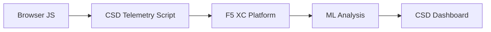

import { Aside } from "@astrojs/starlight/components";

F5 Distributed Cloud Client-Side Defense (CSD) protege aplicaciones web de ataques del lado del cliente monitoreando el comportamiento de JavaScript directamente en el navegador. El equilibrador de carga F5 XC se puede configurar para inyectar el script de telemetría de CSD en las páginas servidas al cliente. Este script observa toda la actividad de JavaScript — qué scripts se cargan, qué campos de formulario leen y qué conexiones de red realizan. Los datos de telemetría se envían a la plataforma F5 XC donde los modelos de aprendizaje automático analizan el comportamiento del script, asignan puntuaciones de riesgo e identifican anomalías. Los equipos de seguridad revisan las detecciones en la consola de CSD y toman medidas permitiendo o mitigando dominios de script.

## Señales de Detección Principal

CSD monitorea tres categorías de comportamiento del lado del navegador:

| Señal | Qué Observa CSD | Ejemplo |
| --- | --- | --- |
| **Lecturas de campos de formulario** | Qué scripts acceden a qué campos `input` presentes en el DOM de la página en el momento de carga | `main.js` leyendo el campo `password` en `/login` |
| **Inventario de scripts** | Todo JavaScript de primera parte y tercera parte cargado en cada página, rastreado por dominio de origen | Una nueva etiqueta `<script>` cargándose desde `cdn.jsdelivr.net` apareciendo en la página de inicio de sesión |
| **Interacciones de red** | Dominios involucrados en la actividad de red del script — incluye tanto dominios de origen de carga de script como dominios de destino de fetch/XHR | Scripts originarios de `esm.sh` y objetivos de exfiltración de datos como `www.httpbin.org` apareciendo en dominios detectados |

<Aside type="caution">
La señal de interacciones de red de CSD rastrea principalmente **dominios de origen de carga de script**. Sin embargo, los dominios de destino de fetch/XHR también aparecen en la API `/detected_domains` y en la tabla de dominios del Dashboard — CSD detecta actividad de red a nivel de dominio, no solo cargas de script. Consulte [Límites de Detección](#límites-de-detección) para obtener la lista completa de limitaciones de comportamiento.
</Aside>

## Matriz de Características

| Característica | Descripción | Ubicación en Consola |
| --- | --- | --- |
| **Puntuación de riesgo de script** | Clasificación automática: Sin Riesgo, Riesgo Bajo, Riesgo Alto | Lista de Scripts &rarr; columna Nivel de Riesgo |
| **Sensibilidad de campo de formulario** | Clasifica automáticamente campos como Sensibles (por sistema) basándose en tipo y nombre de campo | Vista Campos de Formulario &rarr; columna Análisis |
| **Línea de tiempo de comportamiento** | Gráficos del nivel de riesgo, dominio de origen y tipo de script a lo largo del tiempo | Detalle de Script &rarr; Descripción General &rarr; Comportamientos a lo Largo del Tiempo |
| **Atribución de usuarios afectados** | Rastrea usuarios impactados por IP, geolocalización, navegador y dispositivo | Detalle de Script &rarr; pestaña Usuarios Afectados |
| **Lista permitida de dominios** | Marcar dominios de script confiables como permitidos | Dashboard &rarr; fila de dominio &rarr; Agregar a Lista de Permitidos |
| **Lista de mitigación de dominios** | Bloquear llamadas de red y lecturas de campos de formulario desde dominios de script específicos, previniendo la exfiltración de datos | Dashboard &rarr; fila de dominio &rarr; Agregar a Lista de Mitigación |
| **Configuración de alertas** | Notificaciones para nuevos dominios, cambios de riesgo, comportamiento sospechoso | sección Notificaciones |
| **Justificación de script** | Agregar notas explicando por qué un script está autorizado (cumplimiento de PCI DSS) | Detalle de Script &rarr; campo Justificación |
| **Seguimiento de transacciones** | Contador mensual de eventos de telemetría confirmando que CSD está activo | Dashboard &rarr; tarjeta Transacciones Consumidas |
| **Filtros de tiempo y ubicación** | Filtrar todas las vistas por rango de tiempo (24h, 7d, 30d) y ubicación | Controles de filtro en la barra superior |

## Límites de Detección

Entender qué CSD **no** monitorea es crítico para establecer expectativas precisas en demostraciones:

| Limitación | Detalle | Verificado |
| --- | --- | --- |
| **Campos creados dinámicamente** | CSD rastrea campos `input` presentes en el DOM al cargar la página. Los campos inyectados por JavaScript después de la carga no se monitorean. Un `<input>` creado dinámicamente y leído por un script no aparece en la vista Campos de Formulario. | Sí — campo ausente de `/formFields` después de esperar 10 minutos |
| **Ofuscación a nivel de código** | CSD no marca técnicas de ejecución de código dinámico u patrones de ofuscación como señales de detección separadas. Los recolectores ofuscados producen el mismo nivel de riesgo que los no ofuscados — CSD rastrea metadatos de comportamiento, no patrones de código fuente. | Sí — "Riesgo Alto" idéntico para ambas técnicas |
| **Campos de formulario superpuestos** | CSD rastrea solo campos de formulario presentes en el DOM original al cargar la página. Los formularios superpuestos inyectados por JavaScript (una técnica común de skimming digital) no se rastrean — solo se detectan lecturas de los campos originales. | Sí — campos superpuestos ausentes de `/formFields` después de esperar 10 minutos |
| **Comportamiento del contador del Dashboard** | Los conteos de resumen "Encontrados y Mitigados" y "Encontrados y Permitidos" solo cambian después de que un administrador agrega explícitamente un dominio a la lista de mitigación o permitidos. Los conteos de "Acción Necesaria" y "Total Encontrado" se actualizan automáticamente cuando se detectan nuevos dominios. | Sí — "Encontrados y Permitidos" cambió de 0 a 1 solo después de POST a `/allowed_domains` |

<Aside type="note" title="Visibilidad en API vs Consola">
El endpoint API `/detected_domains` devuelve todos los dominios detectados incluyendo dominios de origen de script de primera parte y tercera parte. El dominio de aplicación de primera parte (p. ej., `csd.bankexample.com`) aparece en la lista de dominios detectados junto con dominios CDN de tercera parte. Tanto dominios de primera parte como de tercera parte aparecen en la tabla de dominios del Dashboard.

Los dominios de destino de fetch/XHR (p. ej., `www.httpbin.org` contactado a través de `fetch()`) también aparecen en la respuesta `/detected_domains`. La plataforma CSD rastrea estos a nivel de dominio aunque no sean dominios de origen de carga de script.
</Aside>

## Mapeo de PCI DSS v4.0

CSD aborda directamente dos requisitos de PCI DSS v4.0 para la seguridad de páginas de pago:

| Requisito PCI DSS | Qué Requiere | Cómo CSD lo Aborda |
| --- | --- | --- |
| **6.4.3** — Gestión de scripts en páginas de pago | Mantener un inventario de todos los scripts, proporcionar autorización escrita y justificación para cada uno, verificar integridad del script | Lista de Scripts proporciona inventario completo; campo Justificación documenta autorización; línea de tiempo de comportamiento rastrea cambios |
| **11.6.1** — Detección de manipulación en páginas de pago | Detectar modificaciones no autorizadas en encabezados HTTP y contenido de página de pago | La telemetría de CSD detecta nuevas inyecciones de script, lecturas de campos de formulario no autorizadas y nuevos dominios de red — alertando sobre cambios en el comportamiento de la página |

<Aside type="tip">
Use la característica **Justificación de script** para documentar por qué cada script está autorizado en páginas de pago. Esto crea un registro de auditoría que se asigna directamente a los requisitos de autorización de PCI DSS 6.4.3.
</Aside>

## Matriz de Cobertura de Amenazas

La siguiente tabla mapea categorías comunes de ataque del lado del cliente a las señales de detección de CSD que se activarían durante cada tipo de ataque. Los tipos de ataque marcados con **\*** están confirmados por [documentación oficial de F5](https://www.f5.com/cloud/products/client-side-defense). Los tipos sin marcar se infieren basándose en las categorías de señales de detección de CSD y pueden no ser explícitamente reclamados por F5.

| Categoría de Ataque | Descripción | Lecturas de Campo | Inyección de Script | Red |
| --- | --- | --- | --- | --- |
| **Formjacking** \* | Script malicioso lee valores de campos de formulario y los exfiltra | Sí | — | Sí |
| **Skimming digital** \* | Inyecta formularios superpuestos o scripts para capturar datos de pago | Sí | Sí | Sí |
| **Ataque de cadena de suministro** \* | Biblioteca de tercera parte comprometida carga código malicioso | — | Sí | Sí |
| **Exfiltración de datos** \* | Lee datos sensibles y los envía a dominios externos | Sí | — | Sí |
| **Inyección de script** \* | Inserta etiquetas `<script>` no autorizadas en la página | — | Sí | Sí |
| **Cryptojacking** \* | Inyecta scripts de minería de criptomonedas | — | Sí | Sí |
| **Manipulación del DOM** | Inyecta o modifica elementos de página para engañar a usuarios | — | Sí | — |
| **Hombre en el Navegador** | Intercepta datos de formulario dentro de la sesión del navegador — ver [OWASP](https://owasp.org/www-community/attacks/Man-in-the-browser_attack) y [MITRE T1185](https://attack.mitre.org/techniques/T1185/) | Sí | — | Sí |
| **Clickjacking** | Superpone marcos invisibles para secuestrar clics de usuario — ver [OWASP](https://owasp.org/www-community/attacks/Clickjacking) | — | Sí | — |
| **Persistencia de web skimmer** | Reinyecta scripts skimmer a través de navegaciones de página — ver [Investigación Sansec Magecart](https://sansec.io/what-is-magecart) | — | Sí | Sí |

<Aside type="note">
La detección de "Red" cubre tanto dominios de origen de carga de script como dominios de destino de fetch/XHR — ambos aparecen en la API `/detected_domains` de CSD y en la tabla de dominios del Dashboard. Sin embargo, la mitigación de CSD apunta a la carga de script (el vector de cadena de suministro), no a llamadas de fetch/XHR. Mitigar un dominio bloquea cargas de etiqueta `<script>` desde ese dominio pero no intercepta llamadas `fetch()` o `XMLHttpRequest` hacia él.
</Aside>
