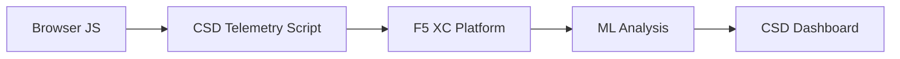

import { Aside } from "@astrojs/starlight/components";

F5 Distributed Cloud Defensa del lado del cliente (CSD) protege las aplicaciones web de ataques del lado del cliente mediante la supervisión del comportamiento de JavaScript directamente en el navegador. El balanceador de carga de F5 XC puede configurarse para inyectar el script de telemetría de CSD en las páginas servidas al cliente. Este script observa toda la actividad de JavaScript — qué scripts se cargan, qué campos de formulario leen y qué conexiones de red establecen. Los datos de telemetría se envían a la Plataforma F5 XC, donde los modelos de aprendizaje automático analizan el comportamiento de los scripts, asignan puntuaciones de riesgo y marcan anomalías. Los equipos de Seguridad revisan las detecciones en la consola de CSD y toman acciones permitiendo o mitigando dominios de scripts.

## Señales de detección principales

CSD supervisa tres categorías de comportamiento del lado del navegador:

| Señal | Qué observa CSD | Ejemplo |
| --- | --- | --- |
| **Lecturas de campos de formulario** | Qué scripts acceden a qué campos `input` presentes en el DOM de la página en el momento de carga | `main.js` leyendo el campo `password` en `/login` |
| **Inventario de scripts** | Todo el JavaScript de origen propio y de terceros cargado en cada página, rastreado por dominio de origen | Una nueva etiqueta `<script>` que carga desde `cdn.jsdelivr.net` apareciendo en la página de inicio de sesión |
| **Interacciones de red** | Dominios involucrados en la actividad de red de los scripts — incluye tanto los dominios de origen de carga de scripts como los dominios de destino de fetch/XHR | Scripts originados desde `esm.sh` y objetivos de exfiltración de datos como `www.httpbin.org` apareciendo en los dominios detectados |

<Aside type="caution">
La señal de interacciones de red de CSD rastrea principalmente **dominios de origen de carga de scripts**. Sin embargo, los dominios de destino de fetch/XHR también aparecen en la API `/detected_domains` y en la tabla de dominios del panel — CSD detecta la actividad de red a nivel de dominio, no solo las cargas de scripts. Consulte [Límites de detección](#detection-boundaries) para obtener la lista completa de limitaciones de comportamiento.
</Aside>

## Matriz de funcionalidades

| Funcionalidad | Descripción | Ubicación en consola |
| --- | --- | --- |
| **Puntuación de riesgo de scripts** | Clasificación automática: Sin riesgo, Riesgo bajo, Riesgo alto | Lista de scripts &rarr; columna Nivel de riesgo |
| **Sensibilidad de campos de formulario** | Clasifica automáticamente los campos como Sensibles (por el sistema) según el tipo y nombre del campo | Vista de campos de formulario &rarr; columna Análisis |
| **Línea de tiempo de comportamiento** | Representa gráficamente el nivel de riesgo del script, el dominio de origen y el tipo a lo largo del tiempo | Detalle del script &rarr; Descripción general &rarr; Comportamientos a lo largo del tiempo |
| **Atribución de usuarios afectados** | Realiza seguimiento de usuarios afectados por IP, geolocalización, navegador y dispositivo | Detalle del script &rarr; pestaña Usuarios afectados |
| **Lista de dominios permitidos** | Marca los dominios de scripts de confianza como permitidos | Panel &rarr; fila de dominio &rarr; Agregar a lista de permitidos |
| **Lista de dominios mitigados** | Bloquea llamadas de red y lecturas de campos de formulario de dominios de scripts específicos, previniendo la exfiltración de datos | Panel &rarr; fila de dominio &rarr; Agregar a lista de mitigados |
| **Configuración de alertas** | Notificaciones para nuevos dominios, cambios de riesgo y comportamiento sospechoso | Sección de notificaciones |
| **Justificación de scripts** | Añade notas que explican por qué un script está autorizado (cumplimiento de PCI DSS) | Detalle del script &rarr; campo Justificación |
| **Seguimiento de transacciones** | Contador mensual de eventos de telemetría que confirma que CSD está activo | Panel &rarr; tarjeta Transacciones consumidas |
| **Filtros de tiempo y ubicación** | Filtra todas las vistas por rango de tiempo (24h, 7d, 30d) y ubicación | Controles de filtro de la barra superior |

## Límites de detección

Comprender lo que CSD **no** supervisa es fundamental para establecer expectativas precisas en las demostraciones:

| Limitación | Detalle | Verificado |
| --- | --- | --- |
| **Campos creados dinámicamente** | CSD rastrea los campos `input` presentes en el DOM en el momento de carga de la página. Los campos inyectados por JavaScript después de la carga no se supervisan. Un `<input>` creado dinámicamente leído por un script no aparece en la vista de campos de formulario. | Sí — campo ausente de `/formFields` después de una espera de 10 minutos |
| **Ofuscación a nivel de código** | CSD no marca las técnicas de ejecución de código dinámico ni los patrones de ofuscación como señales de detección separadas. Los recolectores ofuscados producen el mismo nivel de riesgo que los no ofuscados — CSD rastrea metadatos de comportamiento, no patrones de código fuente. | Sí — "Alto riesgo" idéntico para ambas técnicas |
| **Campos de formularios superpuestos** | CSD rastrea únicamente los campos de formulario presentes en el DOM original en el momento de carga de la página. Los formularios superpuestos inyectados por JavaScript (una técnica común de skimming digital) no se rastrean — solo se detectan las lecturas de los campos originales. | Sí — campos superpuestos ausentes de `/formFields` después de una espera de 10 minutos |
| **Comportamiento del contador del panel** | Los recuentos de resumen "Encontrado y mitigado" y "Encontrado y permitido" solo cambian cuando un administrador agrega explícitamente un dominio a la lista de mitigados o permitidos. Los recuentos "Acción necesaria" y "Total encontrado" se actualizan automáticamente cuando se detectan nuevos dominios. | Sí — "Encontrado y permitido" cambió de 0 a 1 solo después del POST a `/allowed_domains` |

<Aside type="note" title="Visibilidad en la API frente a la consola">
El endpoint de API `/detected_domains` devuelve todos los dominios detectados, incluyendo tanto los dominios de origen de scripts de origen propio como los de terceros. El dominio de la aplicación de origen propio (p. ej., `csd.bankexample.com`) aparece en la lista de dominios detectados junto con los dominios de CDN de terceros. Tanto los dominios de origen propio como los de terceros aparecen en la tabla de dominios del panel.

Los dominios de destino de fetch/XHR (p. ej., `www.httpbin.org` contactado mediante `fetch()`) también aparecen en la respuesta de `/detected_domains`. La plataforma CSD los rastrea a nivel de dominio aunque no sean dominios de origen de carga de scripts.
</Aside>

## Mapeo de PCI DSS v4.0

CSD aborda directamente dos requisitos de PCI DSS v4.0 para la seguridad de páginas de pago:

| Requisito PCI DSS | Qué exige | Cómo lo aborda CSD |
| --- | --- | --- |
| **6.4.3** — Gestión de scripts en páginas de pago | Mantener un inventario de todos los scripts, proporcionar autorización y justificación escrita para cada uno, verificar la integridad de los scripts | La lista de scripts proporciona un inventario completo; el campo Justificación documenta la autorización; la línea de tiempo de comportamiento rastrea los cambios |
| **11.6.1** — Detección de manipulaciones en páginas de pago | Detectar modificaciones no autorizadas en los encabezados HTTP y el contenido de la página de pago | La telemetría de CSD detecta nuevas inyecciones de scripts, lecturas no autorizadas de campos de formulario y nuevos dominios de red — alertando sobre cambios en el comportamiento de la página |

<Aside type="tip">
Utilice la funcionalidad de **Justificación de scripts** para documentar por qué cada script está autorizado en las páginas de pago. Esto crea una pista de auditoría que se corresponde directamente con los requisitos de autorización del PCI DSS 6.4.3.
</Aside>

## Matriz de cobertura de amenazas

La siguiente tabla mapea las categorías comunes de ataques del lado del cliente con las señales de detección de CSD que se activarían durante cada tipo de ataque. Los tipos de ataque marcados con **\*** están confirmados por la [documentación oficial de F5](https://www.f5.com/cloud/products/client-side-defense). Los tipos no marcados se infieren a partir de las categorías de señales de detección de CSD y puede que no sean reclamados explícitamente por F5.

| Categoría de ataque | Descripción | Lecturas de campos | Inyección de scripts | Red |
| --- | --- | --- | --- | --- |
| **Formjacking** \* | Un script malicioso lee los valores de los campos de formulario y los exfiltra | Sí | — | Sí |
| **Skimming digital** \* | Inyecta formularios superpuestos o scripts para capturar datos de pago | Sí | Sí | Sí |
| **Ataque a la cadena de suministro** \* | Una biblioteca de terceros comprometida carga código malicioso | — | Sí | Sí |
| **Exfiltración de datos** \* | Lee datos sensibles y los envía a dominios externos | Sí | — | Sí |
| **Inyección de scripts** \* | Inserta etiquetas `<script>` no autorizadas en la página | — | Sí | Sí |
| **Cryptojacking** \* | Inyecta scripts de minería de criptomonedas | — | Sí | Sí |
| **Manipulación del DOM** | Inyecta o modifica elementos de la página para engañar a los usuarios | — | Sí | — |
| **Man-in-the-Browser** | Intercepta datos de formulario dentro de la sesión del navegador — véase [OWASP](https://owasp.org/www-community/attacks/Man-in-the-browser_attack) y [MITRE T1185](https://attack.mitre.org/techniques/T1185/) | Sí | — | Sí |
| **Clickjacking** | Superpone marcos invisibles para secuestrar los clics del usuario — véase [OWASP](https://owasp.org/www-community/attacks/Clickjacking) | — | Sí | — |
| **Persistencia de web skimmer** | Reinyecta scripts de skimmer entre navegaciones de página — véase [Investigación Magecart de Sansec](https://sansec.io/what-is-magecart) | — | Sí | Sí |

<Aside type="note">
La detección de "Red" cubre tanto los dominios de origen de carga de scripts como los dominios de destino de fetch/XHR — ambos aparecen en la API `/detected_domains` de CSD y en la tabla de dominios del panel. Sin embargo, la mitigación de CSD apunta a la carga de scripts (el vector de la cadena de suministro), no a las llamadas fetch/XHR. Mitigar un dominio bloquea las cargas de etiquetas `<script>` de ese dominio, pero no intercepta las llamadas `fetch()` o `XMLHttpRequest` dirigidas a él.
</Aside>
