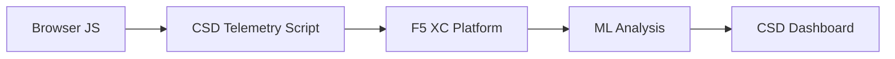

import { Aside } from "@astrojs/starlight/components";

F5 Distributed Cloud Défense côté client (CSD) protège les applications web contre les attaques côté client en surveillant le comportement JavaScript directement dans le navigateur. L'équilibreur de charge F5 XC peut être configuré pour injecter le script de télémétrie CSD dans les pages servies au client. Ce script observe toute l'activité JavaScript — quels scripts se chargent, quels champs de formulaire ils lisent et quelles connexions réseau ils établissent. Les données de télémétrie sont envoyées à la Plateforme F5 XC où des modèles d'apprentissage automatique analysent le comportement des scripts, attribuent des scores de risque et signalent les anomalies. Les équipes de Sécurité examinent les détections dans la console CSD et agissent en autorisant ou en atténuant les domaines de scripts.

## Signaux de détection principaux

CSD surveille trois catégories de comportements côté navigateur :

| Signal | Ce que CSD observe | Exemple |
| --- | --- | --- |
| **Lectures de champs de formulaire** | Quels scripts accèdent à quels champs `input` présents dans le DOM de la page au moment du chargement | `main.js` lisant le champ `password` sur `/login` |
| **Inventaire des scripts** | Tous les scripts JavaScript internes et tiers chargés sur chaque page, suivis par domaine source | Une nouvelle balise `<script>` se chargeant depuis `cdn.jsdelivr.net` apparaissant sur la page de connexion |
| **Interactions réseau** | Domaines impliqués dans l'activité réseau des scripts — inclut à la fois les domaines sources de chargement de scripts et les domaines de destination fetch/XHR | Des scripts provenant de `esm.sh` et des cibles d'exfiltration de données comme `www.httpbin.org` apparaissant dans les domaines détectés |

<Aside type="caution">
Le signal d'interactions réseau de CSD suit principalement les **domaines sources de chargement de scripts**. Cependant, les domaines de destination fetch/XHR apparaissent également dans l'API `/detected_domains` et dans le tableau des domaines du tableau de bord — CSD détecte l'activité réseau au niveau du domaine, pas seulement les chargements de scripts. Consultez [Limites de détection](#detection-boundaries) pour la liste complète des limitations comportementales.
</Aside>

## Matrice des fonctionnalités

| Fonctionnalité | Description | Emplacement dans la console |
| --- | --- | --- |
| **Évaluation du risque des scripts** | Classification automatique : Aucun risque, Faible risque, Risque élevé | Liste des scripts &rarr; Colonne Niveau de risque |
| **Sensibilité des champs de formulaire** | Classification automatique des champs comme Sensibles (par le système) selon le type et le nom du champ | Vue Champs de formulaire &rarr; Colonne Analyse |
| **Chronologie des comportements** | Graphiques du niveau de risque, du domaine source et du type de script dans le temps | Détail du script &rarr; Vue d'ensemble &rarr; Comportements au fil du temps |
| **Attribution des utilisateurs affectés** | Suivi des utilisateurs impactés par adresse IP, géolocalisation, navigateur et appareil | Détail du script &rarr; Onglet Utilisateurs affectés |
| **Liste d'autorisation de domaines** | Marquer les domaines de scripts de confiance comme autorisés | Tableau de bord &rarr; ligne de domaine &rarr; Ajouter à la liste d'autorisation |
| **Liste de mitigation de domaines** | Bloquer les appels réseau et les lectures de champs de formulaire provenant de domaines de scripts spécifiques, empêchant l'exfiltration de données | Tableau de bord &rarr; ligne de domaine &rarr; Ajouter à la liste de mitigation |
| **Configuration des alertes** | Notifications pour les nouveaux domaines, les changements de risque et les comportements suspects | Section Notifications |
| **Justification des scripts** | Ajouter des notes expliquant pourquoi un script est autorisé (conformité PCI DSS) | Détail du script &rarr; Champ Justification |
| **Suivi des transactions** | Compteur mensuel d'événements de télémétrie confirmant que CSD est actif | Tableau de bord &rarr; Carte Transactions consommées |
| **Filtres temporels et géographiques** | Filtrer toutes les vues par plage temporelle (24h, 7j, 30j) et localisation | Contrôles de filtre dans la barre supérieure |

## Limites de détection

Comprendre ce que CSD ne surveille **pas** est essentiel pour établir des attentes précises lors des démonstrations :

| Limitation | Détail | Vérifié |
| --- | --- | --- |
| **Champs créés dynamiquement** | CSD suit les champs `input` présents dans le DOM au chargement de la page. Les champs injectés par JavaScript après le chargement ne sont pas surveillés. Un `<input>` créé dynamiquement et lu par un script n'apparaît pas dans la vue Champs de formulaire. | Oui — champ absent de `/formFields` après 10 minutes d'attente |
| **Obscurcissement au niveau du code** | CSD ne signale pas les techniques d'exécution de code dynamique ou les patterns d'obscurcissement comme signaux de détection distincts. Les collecteurs obscurcis produisent le même niveau de risque que les non-obscurcis — CSD suit les métadonnées comportementales, pas les patterns du code source. | Oui — « Risque élevé » identique pour les deux techniques |
| **Champs de formulaires superposés** | CSD ne suit que les champs de formulaire présents dans le DOM d'origine au chargement de la page. Les formulaires superposés injectés par JavaScript (une technique courante de skimming numérique) ne sont pas suivis — seules les lectures des champs d'origine sont détectées. | Oui — champs superposés absents de `/formFields` après 10 minutes d'attente |
| **Comportement du compteur du tableau de bord** | Les compteurs récapitulatifs « Trouvé et atténué » et « Trouvé et autorisé » ne changent qu'après qu'un administrateur ajoute explicitement un domaine à la liste de mitigation ou d'autorisation. Les compteurs « Action requise » et « Total trouvé » se mettent à jour automatiquement lorsque de nouveaux domaines sont détectés. | Oui — « Trouvé et autorisé » est passé de 0 à 1 uniquement après un POST vers `/allowed_domains` |

<Aside type="note" title="Visibilité API vs Console">
L'endpoint API `/detected_domains` retourne tous les domaines détectés, incluant à la fois les domaines sources de scripts internes et tiers. Le domaine de l'application interne (par ex., `csd.bankexample.com`) apparaît dans la liste des domaines détectés aux côtés des domaines CDN tiers. Les domaines internes et tiers apparaissent tous deux dans le tableau des domaines du tableau de bord.

Les domaines de destination fetch/XHR (par ex., `www.httpbin.org` contacté via `fetch()`) apparaissent également dans la réponse `/detected_domains`. La Plateforme CSD les suit au niveau du domaine même s'il ne s'agit pas de domaines sources de chargement de scripts.
</Aside>

## Correspondance avec PCI DSS v4.0

CSD répond directement à deux exigences PCI DSS v4.0 pour la sécurité des pages de paiement :

| Exigence PCI DSS | Ce qu'elle requiert | Comment CSD y répond |
| --- | --- | --- |
| **6.4.3** — Gestion des scripts sur les pages de paiement | Maintenir un inventaire de tous les scripts, fournir une autorisation écrite et une justification pour chacun, vérifier l'intégrité des scripts | La liste des scripts fournit un inventaire complet ; le champ Justification documente l'autorisation ; la chronologie des comportements suit les modifications |
| **11.6.1** — Détection des altérations sur les pages de paiement | Détecter les modifications non autorisées des en-têtes HTTP et du contenu de la page de paiement | La télémétrie CSD détecte les nouvelles injections de scripts, les lectures non autorisées de champs de formulaire et les nouveaux domaines réseau — en alertant sur les changements de comportement de la page |

<Aside type="tip">
Utilisez la fonctionnalité **Justification des scripts** pour documenter pourquoi chaque script est autorisé sur les pages de paiement. Cela crée une piste d'audit qui correspond directement aux exigences d'autorisation de la norme PCI DSS 6.4.3.
</Aside>

## Matrice de couverture des menaces

Le tableau suivant associe les catégories courantes d'attaques côté client aux signaux de détection CSD qui se déclencheraient lors de chaque type d'attaque. Les types d'attaques marqués d'un **\*** sont confirmés par la [documentation officielle F5](https://www.f5.com/cloud/products/client-side-defense). Les types non marqués sont déduits sur la base des catégories de signaux de détection de CSD et peuvent ne pas être explicitement revendiqués par F5.

| Catégorie d'attaque | Description | Lectures de champs | Injection de scripts | Réseau |
| --- | --- | --- | --- | --- |
| **Formjacking** \* | Un script malveillant lit les valeurs des champs de formulaire et les exfiltre | Oui | — | Oui |
| **Skimming numérique** \* | Injecte des formulaires superposés ou des scripts pour capturer les données de paiement | Oui | Oui | Oui |
| **Attaque sur la chaîne d'approvisionnement** \* | Une bibliothèque tierce compromise charge du code malveillant | — | Oui | Oui |
| **Exfiltration de données** \* | Lit des données sensibles et les envoie vers des domaines externes | Oui | — | Oui |
| **Injection de scripts** \* | Insère des balises `<script>` non autorisées dans la page | — | Oui | Oui |
| **Cryptojacking** \* | Injecte des scripts de minage de cryptomonnaie | — | Oui | Oui |
| **Manipulation du DOM** | Injecte ou modifie des éléments de la page pour tromper les utilisateurs | — | Oui | — |
| **Man-in-the-Browser** | Intercepte les données de formulaire dans la session du navigateur — voir [OWASP](https://owasp.org/www-community/attacks/Man-in-the-browser_attack) et [MITRE T1185](https://attack.mitre.org/techniques/T1185/) | Oui | — | Oui |
| **Clickjacking** | Superpose des cadres invisibles pour détourner les clics des utilisateurs — voir [OWASP](https://owasp.org/www-community/attacks/Clickjacking) | — | Oui | — |
| **Persistance du skimmer web** | Réinjecte des scripts de skimming lors des navigations entre pages — voir [Sansec Magecart Research](https://sansec.io/what-is-magecart) | — | Oui | Oui |

<Aside type="note">
La détection « Réseau » couvre à la fois les domaines sources de chargement de scripts et les domaines de destination fetch/XHR — les deux apparaissent dans l'API `/detected_domains` de CSD et dans le tableau des domaines du tableau de bord. Cependant, la mitigation CSD cible le chargement de scripts (le vecteur de la chaîne d'approvisionnement), pas les appels fetch/XHR. Atténuer un domaine bloque les chargements de balises `<script>` depuis ce domaine, mais n'intercepte pas les appels `fetch()` ou `XMLHttpRequest` vers celui-ci.
</Aside>
