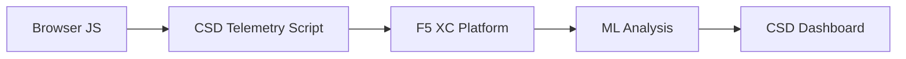

import { Aside } from "@astrojs/starlight/components";

F5 Distributed Cloud Client-Side Defense (CSD) protège les applications web contre les attaques côté client en surveillant le comportement JavaScript directement dans le navigateur. L'équilibreur de charge F5 XC peut être configuré pour injecter le script de télémétrie CSD dans les pages servies au client. Ce script observe toute l'activité JavaScript — quels scripts se chargent, quels champs de formulaire ils lisent et quelles connexions réseau ils établissent. Les données de télémétrie sont envoyées à la plateforme F5 XC où les modèles d'apprentissage automatique analysent le comportement des scripts, attribuent des scores de risque et signalent les anomalies. Les équipes de sécurité examinent les détections dans la console CSD et prennent des mesures en autorisant ou en atténuant les domaines de scripts.

## Signaux de détection principaux

CSD surveille trois catégories de comportement côté navigateur :

| Signal | Ce que CSD observe | Exemple |
| --- | --- | --- |
| **Lectures de champs de formulaire** | Quels scripts accèdent à quels champs `input` présents dans le DOM de la page au moment du chargement | `main.js` lisant le champ `password` sur `/login` |
| **Inventaire des scripts** | Tous les JavaScript propriétaires et tiers chargés sur chaque page, suivis par domaine source | Une nouvelle balise `<script>` se chargeant depuis `cdn.jsdelivr.net` apparaissant sur la page de connexion |
| **Interactions réseau** | Domaines impliqués dans l'activité réseau des scripts — inclut à la fois les domaines sources de chargement de scripts et les domaines de destination fetch/XHR | Scripts provenant de `esm.sh` et cibles d'exfiltration de données comme `www.httpbin.org` apparaissant dans les domaines détectés |

<Aside type="caution">
Le signal interactions réseau de CSD suit principalement les **domaines sources de chargement de scripts**. Cependant, les domaines de destination fetch/XHR apparaissent également dans l'API `/detected_domains` et le tableau de domaines du tableau de bord — CSD détecte l'activité réseau au niveau du domaine, pas seulement les chargements de scripts. Voir [Limites de détection](#limites-de-détection) pour la liste complète des limitations comportementales.
</Aside>

## Matrice des fonctionnalités

| Fonctionnalité | Description | Localisation dans la console |
| --- | --- | --- |
| **Notation du risque des scripts** | Classification automatique : Aucun risque, Risque faible, Risque élevé | Liste des scripts → colonne Niveau de risque |
| **Sensibilité des champs de formulaire** | Classifie automatiquement les champs comme Sensibles (par système) selon le type et le nom du champ | Vue Champs de formulaire → colonne Analyse |
| **Chronologie du comportement** | Affiche le niveau de risque des scripts, le domaine source et le type au fil du temps | Détails du script → Aperçu → Comportements au fil du temps |
| **Attribution des utilisateurs affectés** | Suit les utilisateurs impactés par adresse IP, géolocalisation, navigateur et appareil | Détails du script → onglet Utilisateurs affectés |
| **Liste d'autorisation de domaines** | Marquer les domaines de scripts de confiance comme autorisés | Tableau de bord → ligne de domaine → Ajouter à la liste d'autorisation |
| **Liste d'atténuation de domaines** | Bloquer les appels réseau et les lectures de champs de formulaire à partir de domaines de scripts spécifiques, en empêchant l'exfiltration de données | Tableau de bord → ligne de domaine → Ajouter à la liste d'atténuation |
| **Configuration des alertes** | Notifications pour les nouveaux domaines, les changements de risque, les comportements suspects | Section Notifications |
| **Justification des scripts** | Ajouter des notes expliquant pourquoi un script est autorisé (conformité PCI DSS) | Détails du script → champ Justification |
| **Suivi des transactions** | Compteur mensuel d'événements de télémétrie confirmant que CSD est actif | Tableau de bord → carte Transactions consommées |
| **Filtres de temps et de localisation** | Filtrer toutes les vues par plage horaire (24h, 7j, 30j) et localisation | Contrôles de filtre de la barre supérieure |

## Limites de détection

Comprendre ce que CSD **ne surveille pas** est essentiel pour établir des attentes précises en matière de démonstration :

| Limitation | Détail | Vérifié |
| --- | --- | --- |
| **Champs créés dynamiquement** | CSD suit les champs `input` présents dans le DOM au moment du chargement de la page. Les champs injectés par JavaScript après le chargement ne sont pas surveillés. Un `<input>` créé dynamiquement et lu par un script n'apparaît pas dans la vue Champs de formulaire. | Oui — champ absent de `/formFields` après attente de 10 minutes |
| **Obfuscation au niveau du code** | CSD ne signale pas les techniques d'exécution de code dynamique ou les motifs d'obfuscation comme des signaux de détection séparés. Les moissonneurs obfusqués produisent le même niveau de risque que les non obfusqués — CSD suit les métadonnées comportementales, pas les motifs de code source. | Oui — identique « Risque élevé » pour les deux techniques |
| **Champs de formulaire superposés** | CSD suit uniquement les champs de formulaire présents dans le DOM d'origine au moment du chargement de la page. Les formulaires superposés injectés par JavaScript (une technique courante d'écrémage numérique) ne sont pas suivis — seules les lectures des champs d'origine sont détectées. | Oui — champs superposés absents de `/formFields` après attente de 10 minutes |
| **Comportement du compteur du tableau de bord** | Les compteurs de synthèse « Trouvé et atténué » et « Trouvé et autorisé » changent uniquement après qu'un administrateur ajoute explicitement un domaine à la liste d'atténuation ou d'autorisation. Les compteurs « Action requise » et « Total trouvé » se mettent à jour automatiquement lorsque de nouveaux domaines sont détectés. | Oui — « Trouvé et autorisé » passé de 0 à 1 uniquement après POST à `/allowed_domains` |

<Aside type="note" title="Visibilité API vs Console">
Le point de terminaison API `/detected_domains` retourne tous les domaines détectés, y compris les domaines sources de scripts propriétaires et tiers. Le domaine d'application propriétaire (par exemple, `csd.bankexample.com`) apparaît dans la liste des domaines détectés aux côtés des domaines CDN tiers. Les domaines propriétaires et tiers apparaissent dans le tableau de domaines du tableau de bord.

Les domaines de destination fetch/XHR (par exemple, `www.httpbin.org` contacté via `fetch()`) apparaissent également dans la réponse `/detected_domains`. La plateforme CSD les suit au niveau du domaine même s'ils ne sont pas des domaines sources de chargement de scripts.
</Aside>

## Cartographie PCI DSS v4.0

CSD répond directement à deux exigences de PCI DSS v4.0 pour la sécurité des pages de paiement :

| Exigence PCI DSS | Ce qu'elle exige | Comment CSD l'aborde |
| --- | --- | --- |
| **6.4.3** — Gestion des scripts sur les pages de paiement | Maintenir un inventaire de tous les scripts, fournir une autorisation écrite et une justification pour chacun, vérifier l'intégrité des scripts | La liste des scripts fournit un inventaire complet ; le champ Justification documente l'autorisation ; la chronologie du comportement suit les changements |
| **11.6.1** — Détection de la falsification sur les pages de paiement | Détecter les modifications non autorisées des en-têtes HTTP et du contenu de la page de paiement | La télémétrie CSD détecte les nouvelles injections de scripts, les lectures non autorisées de champs de formulaire et les nouveaux domaines réseau — alertant sur les changements du comportement de la page |

<Aside type="tip">
Utilisez la fonctionnalité **Justification des scripts** pour documenter pourquoi chaque script est autorisé sur les pages de paiement. Cela crée une piste d'audit qui correspond directement aux exigences d'autorisation de PCI DSS 6.4.3.
</Aside>

## Matrice de couverture des menaces

Le tableau suivant mappe les catégories courantes d'attaques côté client aux signaux de détection CSD qui se déclencheraient lors de chaque type d'attaque. Les types d'attaques marqués avec **\*** sont confirmés par la [documentation officielle de F5](https://www.f5.com/cloud/products/client-side-defense). Les types non marqués sont déduits en fonction des catégories de signaux de détection de CSD et peuvent ne pas être explicitement revendiqués par F5.

| Catégorie d'attaque | Description | Lectures de champs | Injection de script | Réseau |
| --- | --- | --- | --- | --- |
| **Formjacking** \* | Un script malveillant lit les valeurs des champs de formulaire et les exfiltre | Oui | — | Oui |
| **Écrémage numérique** \* | Injecte des formulaires superposés ou des scripts pour capturer les données de paiement | Oui | Oui | Oui |
| **Attaque de la chaîne d'approvisionnement** \* | Une bibliothèque tierce compromise charge du code malveillant | — | Oui | Oui |
| **Exfiltration de données** \* | Lit les données sensibles et les envoie à des domaines externes | Oui | — | Oui |
| **Injection de script** \* | Insère des balises `<script>` non autorisées dans la page | — | Oui | Oui |
| **Cryptominage** \* | Injecte des scripts de minage de crypto-monnaie | — | Oui | Oui |
| **Manipulation du DOM** | Injecte ou modifie les éléments de la page pour tromper les utilisateurs | — | Oui | — |
| **Homme dans le navigateur** | Intercepte les données de formulaire dans la session du navigateur — voir [OWASP](https://owasp.org/www-community/attacks/Man-in-the-browser_attack) et [MITRE T1185](https://attack.mitre.org/techniques/T1185/) | Oui | — | Oui |
| **Clickjacking** | Superpose des cadres invisibles pour détourner les clics des utilisateurs — voir [OWASP](https://owasp.org/www-community/attacks/Clickjacking) | — | Oui | — |
| **Persistance du web skimmer** | Ré-injecte les scripts de skimmer lors de navigations de pages — voir [Recherche Sansec Magecart](https://sansec.io/what-is-magecart) | — | Oui | Oui |

<Aside type="note">
La détection « Réseau » couvre à la fois les domaines sources de chargement de scripts et les domaines de destination fetch/XHR — les deux apparaissent dans l'API CSD `/detected_domains` et le tableau de domaines du tableau de bord. Cependant, l'atténuation CSD cible le chargement de scripts (le vecteur de la chaîne d'approvisionnement), pas les appels fetch/XHR. L'atténuation d'un domaine bloque les chargements de balises `<script>` depuis ce domaine mais n'intercepte pas les appels `fetch()` ou `XMLHttpRequest` vers celui-ci.
</Aside>
