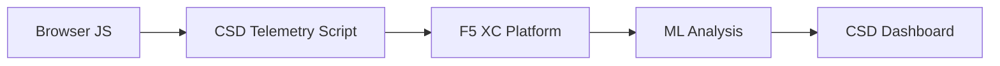

import { Aside } from "@astrojs/starlight/components";

F5 Distributed Cloud Client-Side Defense (CSD) ब्राउज़र में सीधे JavaScript व्यवहार की निगरानी करके वेब अनुप्रयोगों को क्लाइंट-साइड हमलों से सुरक्षित करता है। F5 XC लोड बैलेंसर को क्लाइंट को दिए जाने वाले पेजों में CSD टेलीमेट्री स्क्रिप्ट इंजेक्ट करने के लिए कॉन्फ़िगर किया जा सकता है। यह स्क्रिप्ट सभी JavaScript गतिविधि का अवलोकन करती है — कौन सी स्क्रिप्ट लोड होती हैं, कौन से फ़ॉर्म फ़ील्ड वे पढ़ती हैं, और कौन से नेटवर्क कनेक्शन वे बनाती हैं। टेलीमेट्री डेटा F5 XC प्लेटफ़ॉर्म को भेजा जाता है जहाँ मशीन लर्निंग मॉडल स्क्रिप्ट व्यवहार का विश्लेषण करते हैं, जोखिम स्कोर निर्धारित करते हैं, और विसंगतियों को चिह्नित करते हैं। सुरक्षा टीमें CSD कंसोल में पहचानों की समीक्षा करती हैं और स्क्रिप्ट डोमेन को अनुमति देने या प्रशमन करने की कार्रवाई करती हैं।

## मुख्य पहचान संकेत

CSD ब्राउज़र-साइड व्यवहार की तीन श्रेणियों की निगरानी करता है:

| संकेत | CSD क्या अवलोकन करता है | उदाहरण |
| --- | --- | --- |
| **फ़ॉर्म फ़ील्ड रीड** | कौन सी स्क्रिप्ट पेज DOM में लोड समय पर मौजूद कौन से `input` फ़ील्ड एक्सेस करती हैं | `main.js` द्वारा `/login` पर `password` फ़ील्ड पढ़ना |
| **स्क्रिप्ट इन्वेंटरी** | प्रत्येक पेज पर लोड होने वाली सभी फ़र्स्ट-पार्टी और थर्ड-पार्टी JavaScript, स्रोत डोमेन द्वारा ट्रैक की गई | लॉगिन पेज पर `cdn.jsdelivr.net` से लोड होने वाला एक नया `<script>` टैग |
| **नेटवर्क इंटरैक्शन** | स्क्रिप्ट नेटवर्क गतिविधि में शामिल डोमेन — इसमें स्क्रिप्ट-लोड स्रोत डोमेन और fetch/XHR गंतव्य डोमेन दोनों शामिल हैं | `esm.sh` से प्राप्त स्क्रिप्ट और पहचाने गए डोमेन में दिखने वाले `www.httpbin.org` जैसे डेटा एक्सफ़िल्ट्रेशन लक्ष्य |

<Aside type="caution">
CSD का नेटवर्क इंटरैक्शन संकेत मुख्य रूप से **स्क्रिप्ट-लोड स्रोत डोमेन** को ट्रैक करता है। हालाँकि, fetch/XHR गंतव्य डोमेन भी `/detected_domains` API और डैशबोर्ड डोमेन तालिका में दिखाई देते हैं — CSD नेटवर्क गतिविधि को डोमेन स्तर पर पहचानता है, न कि केवल स्क्रिप्ट लोड। व्यवहार संबंधी सीमाओं की पूरी सूची के लिए [पहचान सीमाएँ](#पहचान-सीमाएँ) देखें।
</Aside>

## सुविधा मैट्रिक्स

| सुविधा | विवरण | कंसोल स्थान |
| --- | --- | --- |
| **स्क्रिप्ट जोखिम स्कोरिंग** | स्वचालित वर्गीकरण: कोई जोखिम नहीं, कम जोखिम, उच्च जोखिम | Script List &rarr; Risk Level कॉलम |
| **फ़ॉर्म फ़ील्ड संवेदनशीलता** | फ़ील्ड प्रकार और नाम के आधार पर फ़ील्ड को संवेदनशील (सिस्टम द्वारा) के रूप में स्वतः वर्गीकृत करता है | Form Fields दृश्य &rarr; Analysis कॉलम |
| **व्यवहार टाइमलाइन** | समय के साथ स्क्रिप्ट जोखिम स्तर, स्रोत डोमेन, और प्रकार का चार्ट | Script detail &rarr; Overview &rarr; Behaviors Over Time |
| **प्रभावित उपयोगकर्ता एट्रिब्यूशन** | IP, भौगोलिक स्थान, ब्राउज़र, और डिवाइस द्वारा प्रभावित उपयोगकर्ताओं को ट्रैक करता है | Script detail &rarr; Affected Users टैब |
| **डोमेन अनुमति सूची** | विश्वसनीय स्क्रिप्ट डोमेन को अनुमत के रूप में चिह्नित करें | Dashboard &rarr; domain row &rarr; Add To Allow List |
| **डोमेन प्रशमन सूची** | विशिष्ट स्क्रिप्ट डोमेन से नेटवर्क कॉल और फ़ॉर्म फ़ील्ड रीड को ब्लॉक करें, डेटा एक्सफ़िल्ट्रेशन को रोकें | Dashboard &rarr; domain row &rarr; Add To Mitigate List |
| **अलर्ट कॉन्फ़िगरेशन** | नए डोमेन, जोखिम परिवर्तन, संदिग्ध व्यवहार के लिए सूचनाएँ | Notifications अनुभाग |
| **स्क्रिप्ट औचित्य** | स्क्रिप्ट क्यों अधिकृत है, इसकी व्याख्या करने वाले नोट्स जोड़ें (PCI DSS अनुपालन) | Script detail &rarr; Justification फ़ील्ड |
| **ट्रांज़ैक्शन ट्रैकिंग** | मासिक टेलीमेट्री ईवेंट काउंटर जो CSD सक्रिय होने की पुष्टि करता है | Dashboard &rarr; Transactions Consumed कार्ड |
| **समय और स्थान फ़िल्टर** | समय सीमा (24 घंटे, 7 दिन, 30 दिन) और स्थान द्वारा सभी दृश्यों को फ़िल्टर करें | शीर्ष बार फ़िल्टर नियंत्रण |

## पहचान सीमाएँ

CSD क्या **निगरानी नहीं** करता, इसे समझना सटीक डेमो अपेक्षाएँ निर्धारित करने के लिए महत्वपूर्ण है:

| सीमा | विवरण | सत्यापित |
| --- | --- | --- |
| **गतिशील रूप से बनाए गए फ़ील्ड** | CSD पेज लोड के समय DOM में मौजूद `input` फ़ील्ड को ट्रैक करता है। लोड के बाद JavaScript द्वारा इंजेक्ट किए गए फ़ील्ड की निगरानी नहीं की जाती। किसी स्क्रिप्ट द्वारा पढ़ा गया गतिशील रूप से बनाया गया `<input>` Form Fields दृश्य में दिखाई नहीं देता। | हाँ — 10 मिनट की प्रतीक्षा के बाद `/formFields` में फ़ील्ड अनुपस्थित |
| **कोड-स्तरीय अस्पष्टीकरण** | CSD गतिशील कोड निष्पादन तकनीकों या अस्पष्टीकरण पैटर्न को अलग पहचान संकेतों के रूप में चिह्नित नहीं करता। अस्पष्टीकृत हार्वेस्टर गैर-अस्पष्टीकृत के समान जोखिम स्तर उत्पन्न करते हैं — CSD व्यवहार संबंधी मेटाडेटा ट्रैक करता है, स्रोत कोड पैटर्न नहीं। | हाँ — दोनों तकनीकों के लिए समान "High Risk" |
| **फ़ॉर्म ओवरले फ़ील्ड** | CSD केवल पेज लोड के समय मूल DOM में मौजूद फ़ॉर्म फ़ील्ड को ट्रैक करता है। JavaScript द्वारा इंजेक्ट किए गए ओवरले फ़ॉर्म (एक सामान्य डिजिटल स्किमिंग तकनीक) ट्रैक नहीं किए जाते — केवल मूल फ़ील्ड के रीड पहचाने जाते हैं। | हाँ — 10 मिनट की प्रतीक्षा के बाद `/formFields` में ओवरले फ़ील्ड अनुपस्थित |
| **डैशबोर्ड काउंटर व्यवहार** | "Found &amp; Mitigated" और "Found &amp; Allowed" सारांश गणनाएँ केवल तब बदलती हैं जब कोई व्यवस्थापक स्पष्ट रूप से किसी डोमेन को प्रशमन या अनुमति सूची में जोड़ता है। "Action Needed" और "Total Found" गणनाएँ नए डोमेन पहचाने जाने पर स्वचालित रूप से अपडेट होती हैं। | हाँ — "Found &amp; Allowed" `/allowed_domains` पर POST के बाद ही 0 से 1 हुआ |

<Aside type="note" title="API बनाम कंसोल दृश्यता">
`/detected_domains` API एंडपॉइंट सभी पहचाने गए डोमेन लौटाता है जिसमें फ़र्स्ट-पार्टी और थर्ड-पार्टी स्क्रिप्ट स्रोत डोमेन दोनों शामिल हैं। फ़र्स्ट-पार्टी एप्लिकेशन डोमेन (जैसे, `csd.bankexample.com`) पहचाने गए डोमेन सूची में थर्ड-पार्टी CDN डोमेन के साथ दिखाई देता है। फ़र्स्ट-पार्टी और थर्ड-पार्टी दोनों डोमेन डैशबोर्ड डोमेन तालिका में दिखाई देते हैं।

Fetch/XHR गंतव्य डोमेन (जैसे, `fetch()` के माध्यम से संपर्क किया गया `www.httpbin.org`) भी `/detected_domains` प्रतिक्रिया में दिखाई देते हैं। CSD प्लेटफ़ॉर्म इन्हें डोमेन स्तर पर ट्रैक करता है भले ही ये स्क्रिप्ट-लोड स्रोत डोमेन नहीं हैं।
</Aside>

## PCI DSS v4.0 मैपिंग

CSD भुगतान पेज सुरक्षा के लिए दो PCI DSS v4.0 आवश्यकताओं को सीधे संबोधित करता है:

| PCI DSS आवश्यकता | यह क्या माँगती है | CSD इसे कैसे संबोधित करता है |
| --- | --- | --- |
| **6.4.3** — भुगतान पेजों पर स्क्रिप्ट प्रबंधन | सभी स्क्रिप्ट की एक सूची बनाए रखें, प्रत्येक के लिए लिखित प्राधिकरण और औचित्य प्रदान करें, स्क्रिप्ट अखंडता सत्यापित करें | Script List पूर्ण सूची प्रदान करता है; Justification फ़ील्ड प्राधिकरण को दस्तावेज़ित करता है; व्यवहार टाइमलाइन परिवर्तनों को ट्रैक करती है |
| **11.6.1** — भुगतान पेजों पर छेड़छाड़ पहचान | HTTP हेडर और भुगतान पेज सामग्री में अनधिकृत संशोधनों का पता लगाएँ | CSD टेलीमेट्री नई स्क्रिप्ट इंजेक्शन, अनधिकृत फ़ॉर्म फ़ील्ड रीड, और नए नेटवर्क डोमेन का पता लगाती है — पेज व्यवहार में परिवर्तनों पर अलर्ट करती है |

<Aside type="tip">
प्रत्येक स्क्रिप्ट भुगतान पेजों पर क्यों अधिकृत है, इसे दस्तावेज़ित करने के लिए **स्क्रिप्ट औचित्य** सुविधा का उपयोग करें। यह एक ऑडिट ट्रेल बनाता है जो सीधे PCI DSS 6.4.3 प्राधिकरण आवश्यकताओं से मैप होता है।
</Aside>

## खतरा कवरेज मैट्रिक्स

निम्नलिखित तालिका सामान्य क्लाइंट-साइड हमले की श्रेणियों को CSD पहचान संकेतों से मैप करती है जो प्रत्येक हमले के प्रकार के दौरान सक्रिय होंगे। **\*** से चिह्नित हमले के प्रकार [F5 आधिकारिक दस्तावेज़ीकरण](https://www.f5.com/cloud/products/client-side-defense) द्वारा पुष्ट हैं। बिना चिह्न वाले प्रकार CSD के पहचान संकेत श्रेणियों के आधार पर अनुमानित हैं और F5 द्वारा स्पष्ट रूप से दावा नहीं किए जा सकते।

| हमले की श्रेणी | विवरण | फ़ील्ड रीड | स्क्रिप्ट इंजेक्शन | नेटवर्क |
| --- | --- | --- | --- | --- |
| **फ़ॉर्मजैकिंग** \* | दुर्भावनापूर्ण स्क्रिप्ट फ़ॉर्म फ़ील्ड मान पढ़ती है और उन्हें एक्सफ़िल्ट्रेट करती है | हाँ | — | हाँ |
| **डिजिटल स्किमिंग** \* | भुगतान डेटा कैप्चर करने के लिए ओवरले फ़ॉर्म या स्क्रिप्ट इंजेक्ट करती है | हाँ | हाँ | हाँ |
| **सप्लाई चेन हमला** \* | समझौता की गई थर्ड-पार्टी लाइब्रेरी दुर्भावनापूर्ण कोड लोड करती है | — | हाँ | हाँ |
| **डेटा एक्सफ़िल्ट्रेशन** \* | संवेदनशील डेटा पढ़ता है और बाहरी डोमेन को भेजता है | हाँ | — | हाँ |
| **स्क्रिप्ट इंजेक्शन** \* | पेज में अनधिकृत `<script>` टैग डालता है | — | हाँ | हाँ |
| **क्रिप्टोजैकिंग** \* | क्रिप्टोकरेंसी माइनिंग स्क्रिप्ट इंजेक्ट करता है | — | हाँ | हाँ |
| **DOM हेरफेर** | उपयोगकर्ताओं को धोखा देने के लिए पेज तत्वों को इंजेक्ट या संशोधित करता है | — | हाँ | — |
| **मैन-इन-द-ब्राउज़र** | ब्राउज़र सत्र के भीतर फ़ॉर्म डेटा को इंटरसेप्ट करता है — देखें [OWASP](https://owasp.org/www-community/attacks/Man-in-the-browser_attack) और [MITRE T1185](https://attack.mitre.org/techniques/T1185/) | हाँ | — | हाँ |
| **क्लिकजैकिंग** | उपयोगकर्ता क्लिक को हाइजैक करने के लिए अदृश्य फ्रेम ओवरले करता है — देखें [OWASP](https://owasp.org/www-community/attacks/Clickjacking) | — | हाँ | — |
| **वेब स्किमर पर्सिस्टेंस** | पेज नेविगेशन के बीच स्किमर स्क्रिप्ट को पुनः इंजेक्ट करता है — देखें [Sansec Magecart Research](https://sansec.io/what-is-magecart) | — | हाँ | हाँ |

<Aside type="note">
"नेटवर्क" पहचान स्क्रिप्ट-लोड स्रोत डोमेन और fetch/XHR गंतव्य डोमेन दोनों को कवर करती है — दोनों CSD `/detected_domains` API और डैशबोर्ड डोमेन तालिका में दिखाई देते हैं। हालाँकि, CSD प्रशमन स्क्रिप्ट लोडिंग (सप्लाई-चेन वेक्टर) को लक्षित करता है, fetch/XHR कॉल को नहीं। किसी डोमेन का प्रशमन उस डोमेन से `<script>` टैग लोड को ब्लॉक करता है लेकिन उसके लिए `fetch()` या `XMLHttpRequest` कॉल को इंटरसेप्ट नहीं करता।
</Aside>
