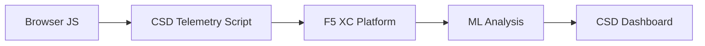

import { Aside } from "@astrojs/starlight/components";

F5 Distributed Cloud Client-Side Defense (CSD) ब्राउज़र में सीधे JavaScript व्यवहार की निगरानी करके वेब एप्लिकेशन को क्लाइंट-साइड अटैक से सुरक्षित करता है। F5 XC लोड बैलेंसर को CSD टेलीमेट्री स्क्रिप्ट को क्लाइंट को परोसे जाने वाले पेजों में इंजेक्ट करने के लिए कॉन्फ़िगर किया जा सकता है। यह स्क्रिप्ट सभी JavaScript गतिविधि को देखती है — कौन सी स्क्रिप्ट लोड होती हैं, वे कौन से फॉर्म फील्ड पढ़ते हैं, और वे कौन से नेटवर्क कनेक्शन बनाते हैं। टेलीमेट्री डेटा F5 XC प्लेटफॉर्म को भेजा जाता है जहां मशीन लर्निंग मॉडल स्क्रिप्ट व्यवहार का विश्लेषण करते हैं, जोखिम स्कोर असाइन करते हैं, और विसंगतियों को फ़्लैग करते हैं। सुरक्षा टीमें CSD कंसोल में डिटेक्शन की समीक्षा करती हैं और स्क्रिप्ट डोमेन को अनुमति देकर या कम करके कार्रवाई करती हैं।

## मुख्य डिटेक्शन सिग्नल

CSD ब्राउज़र-साइड व्यवहार की तीन श्रेणियों की निगरानी करता है:

| सिग्नल | CSD क्या देखता है | उदाहरण |
| --- | --- | --- |
| **फॉर्म फील्ड रीड्स** | कौन सी स्क्रिप्ट पेज लोड समय पर DOM में मौजूद कौन से `input` फील्ड को एक्सेस करती हैं | `/login` पर `password` फील्ड को पढ़ने वाली `main.js` |
| **स्क्रिप्ट इन्वेंटरी** | प्रत्येक पेज पर लोड की गई सभी फर्स्ट-पार्टी और थर्ड-पार्टी JavaScript, स्रोत डोमेन द्वारा ट्रैक की गई | लॉगिन पेज पर `cdn.jsdelivr.net` से लोड होने वाली एक नई `<script>` टैग |
| **नेटवर्क इंटरैक्शन** | स्क्रिप्ट नेटवर्क गतिविधि में शामिल डोमेन — स्क्रिप्ट-लोड स्रोत डोमेन और fetch/XHR गंतव्य डोमेन दोनों को शामिल करता है | `esm.sh` से सोर्स की गई स्क्रिप्ट और `www.httpbin.org` जैसी डिटेक्ट की गई डोमेन में डेटा एक्सफ़िल्ट्रेशन लक्ष्य |

<Aside type="caution">
CSD का नेटवर्क इंटरैक्शन सिग्नल मुख्य रूप से **स्क्रिप्ट-लोड स्रोत डोमेन** को ट्रैक करता है। हालांकि, fetch/XHR गंतव्य डोमेन `/detected_domains` API और Dashboard डोमेन टेबल में भी दिखाई देते हैं — CSD केवल स्क्रिप्ट लोड नहीं, बल्कि डोमेन स्तर पर नेटवर्क गतिविधि को डिटेक्ट करता है। व्यवहारिक सीमाओं की पूरी सूची के लिए [डिटेक्शन बाउंडरीज़](#detection-boundaries) देखें।
</Aside>

## फीचर मैट्रिक्स

| फीचर | विवरण | कंसोल लोकेशन |
| --- | --- | --- |
| **स्क्रिप्ट रिस्क स्कोरिंग** | ऑटोमेटिक क्लासिफिकेशन: कोई जोखिम नहीं, कम जोखिम, उच्च जोखिम | Script List &rarr; Risk Level कॉलम |
| **फॉर्म फील्ड सेंसिटिविटी** | फील्ड प्रकार और नाम के आधार पर फील्ड को संवेदनशील (सिस्टम द्वारा) के रूप में ऑटो-क्लासिफाई करता है | Form Fields view &rarr; Analysis कॉलम |
| **व्यवहार टाइमलाइन** | समय के साथ स्क्रिप्ट जोखिम स्तर, स्रोत डोमेन, और प्रकार को चार्ट करता है | Script detail &rarr; Overview &rarr; Behaviors Over Time |
| **प्रभावित उपयोगकर्ता एट्रिब्यूशन** | IP, भूस्थान, ब्राउज़र, और डिवाइस द्वारा प्रभावित उपयोगकर्ताओं को ट्रैक करता है | Script detail &rarr; Affected Users टैब |
| **डोमेन अनुमति सूची** | विश्वसनीय स्क्रिप्ट डोमेन को अनुमत के रूप में चिह्नित करें | Dashboard &rarr; डोमेन row &rarr; Add To Allow List |
| **डोमेन कम करने की सूची** | विशिष्ट स्क्रिप्ट डोमेन से नेटवर्क कॉल और फॉर्म फील्ड रीड्स को ब्लॉक करें, डेटा एक्सफ़िल्ट्रेशन को रोकें | Dashboard &rarr; डोमेन row &rarr; Add To Mitigate List |
| **अलर्ट कॉन्फ़िगरेशन** | नए डोमेन, जोखिम परिवर्तन, संदिग्ध व्यवहार के लिए नोटिफिकेशन | Notifications सेक्शन |
| **स्क्रिप्ट जस्टिफिकेशन** | यह नोट जोड़ें कि स्क्रिप्ट क्यों अधिकृत है (PCI DSS कम्पलायंस) | Script detail &rarr; Justification फील्ड |
| **ट्रांज़ैक्शन ट्रैकिंग** | मासिक टेलीमेट्री ईवेंट काउंटर जो पुष्टि करता है कि CSD सक्रिय है | Dashboard &rarr; Transactions Consumed कार्ड |
| **समय और लोकेशन फिल्टर** | सभी views को समय रेंज (24h, 7d, 30d) और लोकेशन द्वारा फ़िल्टर करें | ऊपरी बार फिल्टर कंट्रोल |

## डिटेक्शन बाउंडरीज़

यह समझना कि CSD क्या **नहीं** करता है, यह सटीक डेमो अपेक्षाएं सेट करने के लिए महत्वपूर्ण है:

| सीमा | विवरण | सत्यापित |
| --- | --- | --- |
| **डायनेमिकली बनाए गए फील्ड** | CSD पेज लोड पर DOM में मौजूद `input` फील्ड को ट्रैक करता है। JavaScript द्वारा लोड के बाद इंजेक्ट किए गए फील्ड की निगरानी नहीं की जाती है। एक गतिशील रूप से बनाया गया `<input>` जिसे स्क्रिप्ट द्वारा पढ़ा जाता है, Form Fields view में दिखाई नहीं देता है। | हाँ — 10 मिनट प्रतीक्षा के बाद `/formFields` से फील्ड अनुपस्थित |
| **कोड-स्तरीय ऑबफस्केशन** | CSD गतिशील कोड निष्पादन तकनीकों या ऑबफस्केशन पैटर्न को अलग डिटेक्शन सिग्नल के रूप में फ़्लैग नहीं करता है। अस्पष्टीकृत हार्वेस्टर गैर-अस्पष्टीकृत लोगों के समान जोखिम स्तर उत्पन्न करते हैं — CSD व्यवहारिक मेटाडेटा को ट्रैक करता है, स्रोत कोड पैटर्न नहीं। | हाँ — दोनों तकनीकों के लिए समान "उच्च जोखिम" |
| **फॉर्म ओवरले फील्ड** | CSD केवल पेज लोड पर मूल DOM में मौजूद फॉर्म फील्ड को ट्रैक करता है। JavaScript द्वारा इंजेक्ट किए गए ओवरले फॉर्म (एक सामान्य डिजिटल स्किमिंग तकनीक) को ट्रैक नहीं किया जाता है — केवल मूल फील्ड की रीड्स को डिटेक्ट किया जाता है। | हाँ — 10 मिनट प्रतीक्षा के बाद `/formFields` से ओवरले फील्ड अनुपस्थित |
| **डैशबोर्ड काउंटर व्यवहार** | "खोजा गया और कम किया गया" और "खोजा गया और अनुमत" सारांश गणना केवल तब बदलते हैं जब कोई व्यवस्थापक स्पष्ट रूप से डोमेन को कम करने या अनुमति सूची में जोड़ता है। "कार्रवाई आवश्यक" और "कुल मिली" गणना स्वचालित रूप से अपडेट होती है जब नए डोमेन का पता चलता है। | हाँ — "खोजा गया और अनुमत" `/allowed_domains` को POST के बाद ही 0 से 1 में बदला गया |

<Aside type="note" title="API बनाम कंसोल दृश्यमानता">
`/detected_domains` API एंडपॉइंट फर्स्ट-पार्टी और थर्ड-पार्टी दोनों स्क्रिप्ट स्रोत डोमेन सहित सभी डिटेक्ट किए गए डोमेन को रिटर्न करता है। फर्स्ट-पार्टी एप्लिकेशन डोमेन (जैसे, `csd.bankexample.com`) थर्ड-पार्टी CDN डोमेन के साथ डिटेक्ट किए गए डोमेन सूची में दिखाई देता है। फर्स्ट-पार्टी और थर्ड-पार्टी दोनों डोमेन Dashboard डोमेन टेबल में दिखाई देते हैं।

Fetch/XHR गंतव्य डोमेन (जैसे, `fetch()` के माध्यम से संपर्क किया गया `www.httpbin.org`) भी `/detected_domains` प्रतिक्रिया में दिखाई देते हैं। CSD प्लेटफॉर्म इन्हें डोमेन स्तर पर ट्रैक करता है भले ही वे स्क्रिप्ट-लोड स्रोत डोमेन न हों।
</Aside>

## PCI DSS v4.0 मैपिंग

CSD भुगतान पेज सुरक्षा के लिए दो PCI DSS v4.0 आवश्यकताओं को सीधे संबोधित करता है:

| PCI DSS आवश्यकता | इसके लिए क्या आवश्यक है | CSD इसे कैसे संबोधित करता है |
| --- | --- | --- |
| **6.4.3** — भुगतान पृष्ठों पर स्क्रिप्ट प्रबंधन | सभी स्क्रिप्ट की इन्वेंटरी बनाए रखें, प्रत्येक के लिए लिखित प्राधिकरण और औचित्य प्रदान करें, स्क्रिप्ट अखंडता सत्यापित करें | Script List पूर्ण इन्वेंटरी प्रदान करता है; Justification फील्ड प्राधिकरण को दस्तावेज़ करता है; व्यवहार टाइमलाइन परिवर्तन को ट्रैक करता है |
| **11.6.1** — भुगतान पृष्ठों पर टैम्पर डिटेक्शन | HTTP हेडर और भुगतान पेज सामग्री में अनधिकृत संशोधन का पता लगाएं | CSD टेलीमेट्री नई स्क्रिप्ट इंजेक्शन, अनधिकृत फॉर्म फील्ड रीड्स, और नए नेटवर्क डोमेन को डिटेक्ट करता है — पेज व्यवहार में परिवर्तन पर अलर्ट करता है |

<Aside type="tip">
भुगतान पृष्ठों पर प्रत्येक स्क्रिप्ट को क्यों अधिकृत किया गया है, इसे दस्तावेज़ करने के लिए **स्क्रिप्ट जस्टिफिकेशन** फीचर का उपयोग करें। यह एक ऑडिट ट्रेल बनाता है जो PCI DSS 6.4.3 प्राधिकरण आवश्यकताओं को सीधे मैप करता है।
</Aside>

## थ्रेट कवरेज मैट्रिक्स

निम्न तालिका सामान्य क्लाइंट-साइड अटैक श्रेणियों को CSD डिटेक्शन सिग्नल के साथ मैप करती है जो प्रत्येक अटैक प्रकार के दौरान फायर होंगे। **\*** से चिह्नित अटैक प्रकार [F5 आधिकारिक दस्तावेज़](https://www.f5.com/cloud/products/client-side-defense) द्वारा पुष्टि किए गए हैं। अचिह्नित प्रकार CSD की डिटेक्शन सिग्नल श्रेणियों के आधार पर अनुमानित हैं और F5 द्वारा स्पष्ट रूप से दावा नहीं किए जा सकते हैं।

| अटैक श्रेणी | विवरण | फील्ड रीड्स | स्क्रिप्ट इंजेक्शन | नेटवर्क |
| --- | --- | --- | --- | --- |
| **Formjacking** \* | दुर्भावनापूर्ण स्क्रिप्ट फॉर्म फील्ड मानों को पढ़ता है और उन्हें एक्सफ़िल्ट्रेट करता है | हाँ | — | हाँ |
| **डिजिटल स्किमिंग** \* | भुगतान डेटा को कैप्चर करने के लिए ओवरले फॉर्म या स्क्रिप्ट इंजेक्ट करता है | हाँ | हाँ | हाँ |
| **सप्लाई चेन अटैक** \* | समझौता किया गया थर्ड-पार्टी लाइब्रेरी दुर्भावनापूर्ण कोड लोड करता है | — | हाँ | हाँ |
| **डेटा एक्सफ़िल्ट्रेशन** \* | संवेदनशील डेटा पढ़ता है और इसे बाहरी डोमेन को भेजता है | हाँ | — | हाँ |
| **स्क्रिप्ट इंजेक्शन** \* | पेज में अनधिकृत `<script>` टैग डालता है | — | हाँ | हाँ |
| **Cryptojacking** \* | क्रिप्टोकरेंसी माइनिंग स्क्रिप्ट इंजेक्ट करता है | — | हाँ | हाँ |
| **DOM हेराफेरी** | उपयोगकर्ताओं को धोखा देने के लिए पेज तत्वों को इंजेक्ट या संशोधित करता है | — | हाँ | — |
| **ब्राउज़र में आदमी** | ब्राउज़र सेशन के भीतर फॉर्म डेटा को इंटरसेप्ट करता है — [OWASP](https://owasp.org/www-community/attacks/Man-in-the-browser_attack) और [MITRE T1185](https://attack.mitre.org/techniques/T1185/) देखें | हाँ | — | हाँ |
| **Clickjacking** | उपयोगकर्ता क्लिक को हाईजैक करने के लिए अदृश्य फ्रेम ओवरले करता है — [OWASP](https://owasp.org/www-community/attacks/Clickjacking) देखें | — | हाँ | — |
| **वेब स्किमर परिस्थिति** | पेज नेविगेशन में स्किमर स्क्रिप्ट को फिर से इंजेक्ट करता है — [Sansec Magecart रिसर्च](https://sansec.io/what-is-magecart) देखें | — | हाँ | हाँ |

<Aside type="note">
"नेटवर्क" डिटेक्शन स्क्रिप्ट-लोड स्रोत डोमेन और fetch/XHR गंतव्य डोमेन दोनों को कवर करता है — दोनों CSD `/detected_domains` API और Dashboard डोमेन टेबल में दिखाई देते हैं। हालांकि, CSD कम करना स्क्रिप्ट लोडिंग (सप्लाई-चेन वेक्टर) को लक्षित करता है, fetch/XHR कॉल नहीं। किसी डोमेन को कम करना उस डोमेन से `<script>` टैग लोड को ब्लॉक करता है लेकिन `fetch()` या `XMLHttpRequest` कॉल को इंटरसेप्ट नहीं करता है।
</Aside>
