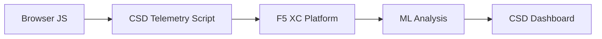

import { Aside } from "@astrojs/starlight/components";

F5 Distributed Cloud Client-Side Defense (CSD) ब्राउज़र में सीधे JavaScript व्यवहार की निगरानी करके वेब अनुप्रयोगों को क्लाइंट-साइड हमलों से सुरक्षित करता है। F5 XC लोड बैलेंसर को क्लाइंट को सर्व किए जाने वाले पेजों में CSD टेलीमेट्री स्क्रिप्ट इंजेक्ट करने के लिए कॉन्फ़िगर किया जा सकता है। यह स्क्रिप्ट सभी JavaScript गतिविधि का अवलोकन करती है — कौन सी स्क्रिप्ट लोड होती हैं, वे किन फॉर्म फ़ील्ड को पढ़ती हैं, और कौन से नेटवर्क कनेक्शन बनाती हैं। टेलीमेट्री डेटा F5 XC प्लेटफ़ॉर्म को भेजा जाता है जहाँ मशीन लर्निंग मॉडल स्क्रिप्ट व्यवहार का विश्लेषण करते हैं, जोखिम स्कोर असाइन करते हैं, और विसंगतियों को चिह्नित करते हैं। सुरक्षा टीमें CSD कंसोल में डिटेक्शन की समीक्षा करती हैं और स्क्रिप्ट डोमेन को अनुमति देकर या उन्हें मिटिगेट करके कार्रवाई करती हैं।

## मुख्य डिटेक्शन सिग्नल

CSD ब्राउज़र-साइड व्यवहार की तीन श्रेणियों की निगरानी करता है:

| सिग्नल | CSD क्या अवलोकन करता है | उदाहरण |
| --- | --- | --- |
| **फॉर्म फ़ील्ड रीड्स** | कौन सी स्क्रिप्ट पेज लोड समय पर DOM में मौजूद किन `input` फ़ील्ड को एक्सेस करती हैं | `main.js` `/login` पर `password` फ़ील्ड पढ़ रहा है |
| **स्क्रिप्ट इन्वेंट्री** | प्रत्येक पेज पर लोड होने वाली सभी फर्स्ट-पार्टी और थर्ड-पार्टी JavaScript, स्रोत डोमेन द्वारा ट्रैक की जाती है | लॉगिन पेज पर `cdn.jsdelivr.net` से लोड होने वाला एक नया `<script>` टैग दिखाई देना |
| **नेटवर्क इंटरैक्शन** | स्क्रिप्ट नेटवर्क गतिविधि में शामिल डोमेन — इसमें स्क्रिप्ट-लोड स्रोत डोमेन और fetch/XHR गंतव्य डोमेन दोनों शामिल हैं | `esm.sh` से सोर्स की गई स्क्रिप्ट और डिटेक्टेड डोमेन में दिखाई देने वाले `www.httpbin.org` जैसे डेटा एक्सफ़िल्ट्रेशन लक्ष्य |

<Aside type="caution">
CSD का नेटवर्क इंटरैक्शन सिग्नल मुख्य रूप से **स्क्रिप्ट-लोड स्रोत डोमेन** को ट्रैक करता है। हालाँकि, fetch/XHR गंतव्य डोमेन भी `/detected_domains` API और डैशबोर्ड डोमेन टेबल में दिखाई देते हैं — CSD डोमेन स्तर पर नेटवर्क गतिविधि का पता लगाता है, न कि केवल स्क्रिप्ट लोड का। व्यवहारिक सीमाओं की पूरी सूची के लिए [डिटेक्शन सीमाएँ](#detection-boundaries) देखें।
</Aside>

## सुविधा मैट्रिक्स

| सुविधा | विवरण | कंसोल स्थान |
| --- | --- | --- |
| **स्क्रिप्ट जोखिम स्कोरिंग** | स्वचालित वर्गीकरण: कोई जोखिम नहीं, कम जोखिम, उच्च जोखिम | Script List &rarr; Risk Level कॉलम |
| **फॉर्म फ़ील्ड संवेदनशीलता** | फ़ील्ड प्रकार और नाम के आधार पर फ़ील्ड को संवेदनशील (सिस्टम द्वारा) के रूप में स्वचालित रूप से वर्गीकृत करता है | Form Fields व्यू &rarr; Analysis कॉलम |
| **व्यवहार टाइमलाइन** | समय के साथ स्क्रिप्ट जोखिम स्तर, स्रोत डोमेन और प्रकार के चार्ट | Script detail &rarr; Overview &rarr; Behaviors Over Time |
| **प्रभावित उपयोगकर्ता एट्रिब्यूशन** | IP, जियोलोकेशन, ब्राउज़र और डिवाइस द्वारा प्रभावित उपयोगकर्ताओं को ट्रैक करता है | Script detail &rarr; Affected Users टैब |
| **डोमेन अनुमति सूची** | विश्वसनीय स्क्रिप्ट डोमेन को अनुमत के रूप में चिह्नित करें | Dashboard &rarr; domain row &rarr; Add To Allow List |
| **डोमेन मिटिगेट सूची** | विशिष्ट स्क्रिप्ट डोमेन से नेटवर्क कॉल और फॉर्म फ़ील्ड रीड्स को ब्लॉक करें, डेटा एक्सफ़िल्ट्रेशन को रोकें | Dashboard &rarr; domain row &rarr; Add To Mitigate List |
| **अलर्ट कॉन्फ़िगरेशन** | नए डोमेन, जोखिम परिवर्तन, संदिग्ध व्यवहार के लिए सूचनाएँ | Notifications सेक्शन |
| **स्क्रिप्ट जस्टिफ़िकेशन** | यह बताने वाले नोट्स जोड़ें कि कोई स्क्रिप्ट क्यों अधिकृत है (PCI DSS अनुपालन) | Script detail &rarr; Justification फ़ील्ड |
| **ट्रांजैक्शन ट्रैकिंग** | CSD सक्रिय होने की पुष्टि करने वाला मासिक टेलीमेट्री इवेंट काउंटर | Dashboard &rarr; Transactions Consumed कार्ड |
| **समय और स्थान फ़िल्टर** | समय सीमा (24h, 7d, 30d) और स्थान द्वारा सभी व्यू फ़िल्टर करें | शीर्ष बार फ़िल्टर नियंत्रण |

## डिटेक्शन सीमाएँ

सटीक डेमो अपेक्षाएँ सेट करने के लिए यह समझना महत्वपूर्ण है कि CSD क्या **नहीं** मॉनिटर करता है:

| सीमा | विवरण | सत्यापित |
| --- | --- | --- |
| **गतिशील रूप से बनाए गए फ़ील्ड** | CSD पेज लोड पर DOM में मौजूद `input` फ़ील्ड को ट्रैक करता है। लोड के बाद JavaScript द्वारा इंजेक्ट किए गए फ़ील्ड मॉनिटर नहीं किए जाते। किसी स्क्रिप्ट द्वारा पढ़ा गया गतिशील रूप से बनाया गया `<input>` Form Fields व्यू में दिखाई नहीं देता। | हाँ — 10 मिनट की प्रतीक्षा के बाद `/formFields` से फ़ील्ड अनुपस्थित |
| **कोड-स्तरीय ऑब्फ़स्केशन** | CSD गतिशील कोड निष्पादन तकनीकों या ऑब्फ़स्केशन पैटर्न को अलग डिटेक्शन सिग्नल के रूप में फ़्लैग नहीं करता। ऑब्फ़स्केटेड हार्वेस्टर गैर-ऑब्फ़स्केटेड के समान जोखिम स्तर उत्पन्न करते हैं — CSD व्यवहारिक मेटाडेटा ट्रैक करता है, स्रोत कोड पैटर्न नहीं। | हाँ — दोनों तकनीकों के लिए समान "High Risk" |
| **फॉर्म ओवरले फ़ील्ड** | CSD केवल पेज लोड पर मूल DOM में मौजूद फॉर्म फ़ील्ड को ट्रैक करता है। JavaScript द्वारा इंजेक्ट किए गए ओवरले फॉर्म (एक सामान्य डिजिटल स्किमिंग तकनीक) ट्रैक नहीं किए जाते — केवल मूल फ़ील्ड के रीड्स का पता लगाया जाता है। | हाँ — 10 मिनट की प्रतीक्षा के बाद `/formFields` से ओवरले फ़ील्ड अनुपस्थित |
| **डैशबोर्ड काउंटर व्यवहार** | "Found &amp; Mitigated" और "Found &amp; Allowed" सारांश काउंट केवल तभी बदलते हैं जब कोई एडमिन स्पष्ट रूप से किसी डोमेन को मिटिगेट या अनुमति सूची में जोड़ता है। "Action Needed" और "Total Found" काउंट नए डोमेन का पता लगने पर स्वचालित रूप से अपडेट होते हैं। | हाँ — "Found &amp; Allowed" `/allowed_domains` पर POST के बाद ही 0 से 1 में बदला |

<Aside type="note" title="API बनाम कंसोल दृश्यता">
`/detected_domains` API एंडपॉइंट फर्स्ट-पार्टी और थर्ड-पार्टी स्क्रिप्ट स्रोत डोमेन दोनों सहित सभी डिटेक्टेड डोमेन लौटाता है। फर्स्ट-पार्टी एप्लिकेशन डोमेन (जैसे, `csd.bankexample.com`) थर्ड-पार्टी CDN डोमेन के साथ डिटेक्टेड डोमेन सूची में दिखाई देता है। फर्स्ट-पार्टी और थर्ड-पार्टी दोनों डोमेन डैशबोर्ड डोमेन टेबल में दिखाई देते हैं।

Fetch/XHR गंतव्य डोमेन (जैसे, `fetch()` के माध्यम से संपर्क किया गया `www.httpbin.org`) भी `/detected_domains` रिस्पॉन्स में दिखाई देते हैं। CSD प्लेटफ़ॉर्म इन्हें डोमेन स्तर पर ट्रैक करता है भले ही ये स्क्रिप्ट-लोड स्रोत डोमेन न हों।
</Aside>

## PCI DSS v4.0 मैपिंग

CSD भुगतान पेज सुरक्षा के लिए दो PCI DSS v4.0 आवश्यकताओं को सीधे संबोधित करता है:

| PCI DSS आवश्यकता | यह क्या आवश्यक करती है | CSD इसे कैसे संबोधित करता है |
| --- | --- | --- |
| **6.4.3** — भुगतान पेजों पर स्क्रिप्ट प्रबंधन | सभी स्क्रिप्ट की इन्वेंट्री बनाए रखें, प्रत्येक के लिए लिखित प्राधिकरण और जस्टिफ़िकेशन प्रदान करें, स्क्रिप्ट अखंडता सत्यापित करें | Script List पूरी इन्वेंट्री प्रदान करती है; Justification फ़ील्ड प्राधिकरण का दस्तावेज़ीकरण करती है; व्यवहार टाइमलाइन परिवर्तनों को ट्रैक करती है |
| **11.6.1** — भुगतान पेजों पर टैम्पर डिटेक्शन | HTTP हेडर और भुगतान पेज सामग्री में अनधिकृत संशोधनों का पता लगाएँ | CSD टेलीमेट्री नई स्क्रिप्ट इंजेक्शन, अनधिकृत फॉर्म फ़ील्ड रीड्स और नए नेटवर्क डोमेन का पता लगाती है — पेज व्यवहार में परिवर्तनों पर अलर्ट करती है |

<Aside type="tip">
यह दस्तावेज़ करने के लिए **Script justification** सुविधा का उपयोग करें कि प्रत्येक स्क्रिप्ट भुगतान पेजों पर क्यों अधिकृत है। यह एक ऑडिट ट्रेल बनाता है जो सीधे PCI DSS 6.4.3 प्राधिकरण आवश्यकताओं से मैप होता है।
</Aside>

## खतरा कवरेज मैट्रिक्स

निम्न तालिका सामान्य क्लाइंट-साइड हमले की श्रेणियों को उन CSD डिटेक्शन सिग्नल से मैप करती है जो प्रत्येक हमले के प्रकार के दौरान सक्रिय होंगे। **\*** से चिह्नित हमले के प्रकार [F5 आधिकारिक दस्तावेज़ीकरण](https://www.f5.com/cloud/products/client-side-defense) द्वारा पुष्ट हैं। अचिह्नित प्रकार CSD के डिटेक्शन सिग्नल श्रेणियों के आधार पर अनुमानित हैं और F5 द्वारा स्पष्ट रूप से दावा नहीं किए जा सकते।

| हमले की श्रेणी | विवरण | फ़ील्ड रीड्स | स्क्रिप्ट इंजेक्शन | नेटवर्क |
| --- | --- | --- | --- | --- |
| **फॉर्मजैकिंग** \* | दुर्भावनापूर्ण स्क्रिप्ट फॉर्म फ़ील्ड मान पढ़ती है और उन्हें एक्सफ़िल्ट्रेट करती है | हाँ | — | हाँ |
| **डिजिटल स्किमिंग** \* | भुगतान डेटा कैप्चर करने के लिए ओवरले फॉर्म या स्क्रिप्ट इंजेक्ट करती है | हाँ | हाँ | हाँ |
| **सप्लाई चेन अटैक** \* | समझौता की गई थर्ड-पार्टी लाइब्रेरी दुर्भावनापूर्ण कोड लोड करती है | — | हाँ | हाँ |
| **डेटा एक्सफ़िल्ट्रेशन** \* | संवेदनशील डेटा पढ़ता है और इसे बाहरी डोमेन पर भेजता है | हाँ | — | हाँ |
| **स्क्रिप्ट इंजेक्शन** \* | पेज में अनधिकृत `<script>` टैग डालता है | — | हाँ | हाँ |
| **क्रिप्टोजैकिंग** \* | क्रिप्टोकरेंसी माइनिंग स्क्रिप्ट इंजेक्ट करता है | — | हाँ | हाँ |
| **DOM मैनिपुलेशन** | उपयोगकर्ताओं को धोखा देने के लिए पेज तत्वों को इंजेक्ट या संशोधित करता है | — | हाँ | — |
| **मैन-इन-द-ब्राउज़र** | ब्राउज़र सत्र के भीतर फॉर्म डेटा को इंटरसेप्ट करता है — देखें [OWASP](https://owasp.org/www-community/attacks/Man-in-the-browser_attack) और [MITRE T1185](https://attack.mitre.org/techniques/T1185/) | हाँ | — | हाँ |
| **क्लिकजैकिंग** | उपयोगकर्ता क्लिक को हाईजैक करने के लिए अदृश्य फ़्रेम ओवरले करता है — देखें [OWASP](https://owasp.org/www-community/attacks/Clickjacking) | — | हाँ | — |
| **वेब स्किमर परसिस्टेंस** | पेज नेविगेशन के दौरान स्किमर स्क्रिप्ट को फिर से इंजेक्ट करता है — देखें [Sansec Magecart Research](https://sansec.io/what-is-magecart) | — | हाँ | हाँ |

<Aside type="note">
"नेटवर्क" डिटेक्शन स्क्रिप्ट-लोड स्रोत डोमेन और fetch/XHR गंतव्य डोमेन दोनों को कवर करता है — दोनों CSD `/detected_domains` API और डैशबोर्ड डोमेन टेबल में दिखाई देते हैं। हालाँकि, CSD मिटिगेशन स्क्रिप्ट लोडिंग (सप्लाई-चेन वेक्टर) को लक्षित करता है, fetch/XHR कॉल को नहीं। किसी डोमेन को मिटिगेट करने से उस डोमेन से `<script>` टैग लोड ब्लॉक हो जाते हैं लेकिन उसके लिए `fetch()` या `XMLHttpRequest` कॉल इंटरसेप्ट नहीं होते।
</Aside>
