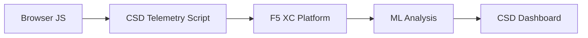

import { Aside } from "@astrojs/starlight/components";

F5 Distributed Cloud Client-Side Defense (CSD) protegge le applicazioni web dagli attacchi lato client monitorando il comportamento JavaScript direttamente nel browser. Il load balancer F5 XC può essere configurato per iniettare lo script di telemetria CSD nelle pagine servite al client. Questo script osserva tutta l'attività JavaScript — quali script vengono caricati, quali campi dei form vengono letti e quali connessioni di rete vengono stabilite. I dati di telemetria vengono inviati alla piattaforma F5 XC dove modelli di machine learning analizzano il comportamento degli script, assegnano punteggi di rischio e segnalano anomalie. I team di sicurezza esaminano i rilevamenti nella console CSD e intervengono consentendo o mitigando i domini degli script.

## Segnali di rilevamento principali

CSD monitora tre categorie di comportamento lato browser:

| Segnale | Cosa osserva CSD | Esempio |
| --- | --- | --- |
| **Lettura dei campi form** | Quali script accedono a quali campi `input` presenti nel DOM della pagina al momento del caricamento | `main.js` che legge il campo `password` su `/login` |
| **Inventario degli script** | Tutti i JavaScript first-party e third-party caricati su ogni pagina, tracciati per dominio di origine | Un nuovo tag `<script>` che carica da `cdn.jsdelivr.net` che appare sulla pagina di login |
| **Interazioni di rete** | Domini coinvolti nell'attività di rete degli script — include sia i domini di origine del caricamento degli script sia i domini di destinazione fetch/XHR | Script provenienti da `esm.sh` e obiettivi di esfiltrazione dati come `www.httpbin.org` che appaiono nei domini rilevati |

<Aside type="caution">
Il segnale delle interazioni di rete di CSD traccia principalmente i **domini di origine del caricamento degli script**. Tuttavia, anche i domini di destinazione fetch/XHR appaiono nell'API `/detected_domains` e nella tabella dei domini del Dashboard — CSD rileva l'attività di rete a livello di dominio, non solo i caricamenti degli script. Consultare [Limiti di rilevamento](#limiti-di-rilevamento) per l'elenco completo delle limitazioni comportamentali.
</Aside>

## Matrice delle funzionalità

| Funzionalità | Descrizione | Posizione nella console |
| --- | --- | --- |
| **Punteggio di rischio degli script** | Classificazione automatica: Nessun rischio, Rischio basso, Rischio alto | Script List &rarr; colonna Risk Level |
| **Sensibilità dei campi form** | Classifica automaticamente i campi come Sensibili (dal sistema) in base al tipo e al nome del campo | Vista Form Fields &rarr; colonna Analysis |
| **Timeline del comportamento** | Grafici del livello di rischio, dominio di origine e tipo dello script nel tempo | Dettaglio script &rarr; Overview &rarr; Behaviors Over Time |
| **Attribuzione degli utenti interessati** | Traccia gli utenti impattati per IP, geolocalizzazione, browser e dispositivo | Dettaglio script &rarr; scheda Affected Users |
| **Lista domini consentiti** | Contrassegna i domini degli script attendibili come consentiti | Dashboard &rarr; riga dominio &rarr; Add To Allow List |
| **Lista domini da mitigare** | Blocca le chiamate di rete e le letture dei campi form da domini script specifici, prevenendo l'esfiltrazione dei dati | Dashboard &rarr; riga dominio &rarr; Add To Mitigate List |
| **Configurazione degli avvisi** | Notifiche per nuovi domini, cambiamenti di rischio, comportamenti sospetti | Sezione Notifications |
| **Giustificazione degli script** | Aggiunta di note che spiegano perché uno script è autorizzato (conformità PCI DSS) | Dettaglio script &rarr; campo Justification |
| **Tracciamento delle transazioni** | Contatore mensile degli eventi di telemetria che conferma l'attività di CSD | Dashboard &rarr; scheda Transactions Consumed |
| **Filtri per tempo e posizione** | Filtra tutte le viste per intervallo temporale (24h, 7d, 30d) e posizione | Controlli filtro nella barra superiore |

## Limiti di rilevamento

Comprendere cosa CSD **non** monitora è fondamentale per impostare aspettative accurate nelle demo:

| Limitazione | Dettaglio | Verificato |
| --- | --- | --- |
| **Campi creati dinamicamente** | CSD traccia i campi `input` presenti nel DOM al caricamento della pagina. I campi iniettati da JavaScript dopo il caricamento non vengono monitorati. Un `<input>` creato dinamicamente e letto da uno script non appare nella vista Form Fields. | Sì — campo assente da `/formFields` dopo 10 minuti di attesa |
| **Offuscamento a livello di codice** | CSD non segnala le tecniche di esecuzione dinamica del codice o i pattern di offuscamento come segnali di rilevamento separati. Gli harvester offuscati producono lo stesso livello di rischio di quelli non offuscati — CSD traccia i metadati comportamentali, non i pattern del codice sorgente. | Sì — "High Risk" identico per entrambe le tecniche |
| **Campi form overlay** | CSD traccia solo i campi form presenti nel DOM originale al caricamento della pagina. I form overlay iniettati da JavaScript (una tecnica comune di digital skimming) non vengono tracciati — vengono rilevate solo le letture dei campi originali. | Sì — campi overlay assenti da `/formFields` dopo 10 minuti di attesa |
| **Comportamento dei contatori del Dashboard** | I conteggi riepilogati "Found &amp; Mitigated" e "Found &amp; Allowed" cambiano solo dopo che un amministratore aggiunge esplicitamente un dominio alla lista di mitigazione o alla lista consentiti. I conteggi "Action Needed" e "Total Found" si aggiornano automaticamente quando vengono rilevati nuovi domini. | Sì — "Found &amp; Allowed" cambiato da 0 a 1 solo dopo POST a `/allowed_domains` |

<Aside type="note" title="Visibilità API vs Console">
L'endpoint API `/detected_domains` restituisce tutti i domini rilevati, inclusi sia i domini di origine degli script first-party che third-party. Il dominio dell'applicazione first-party (es. `csd.bankexample.com`) appare nella lista dei domini rilevati insieme ai domini CDN third-party. Sia i domini first-party che third-party appaiono nella tabella dei domini del Dashboard.

Anche i domini di destinazione fetch/XHR (es. `www.httpbin.org` contattato tramite `fetch()`) appaiono nella risposta `/detected_domains`. La piattaforma CSD li traccia a livello di dominio anche se non sono domini di origine del caricamento degli script.
</Aside>

## Mappatura PCI DSS v4.0

CSD risponde direttamente a due requisiti PCI DSS v4.0 per la sicurezza delle pagine di pagamento:

| Requisito PCI DSS | Cosa richiede | Come CSD lo soddisfa |
| --- | --- | --- |
| **6.4.3** — Gestione degli script sulle pagine di pagamento | Mantenere un inventario di tutti gli script, fornire autorizzazione scritta e giustificazione per ciascuno, verificare l'integrità degli script | Script List fornisce l'inventario completo; il campo Justification documenta l'autorizzazione; la timeline del comportamento traccia le modifiche |
| **11.6.1** — Rilevamento di manomissioni sulle pagine di pagamento | Rilevare modifiche non autorizzate agli header HTTP e al contenuto delle pagine di pagamento | La telemetria CSD rileva nuove iniezioni di script, letture non autorizzate dei campi form e nuovi domini di rete — generando avvisi sulle modifiche al comportamento della pagina |

<Aside type="tip">
Utilizzare la funzionalità **Giustificazione degli script** per documentare perché ogni script è autorizzato sulle pagine di pagamento. Questo crea una traccia di audit che si mappa direttamente ai requisiti di autorizzazione PCI DSS 6.4.3.
</Aside>

## Matrice di copertura delle minacce

La tabella seguente mappa le categorie comuni di attacchi lato client ai segnali di rilevamento CSD che si attiverebbero durante ogni tipo di attacco. I tipi di attacco contrassegnati con **\*** sono confermati dalla [documentazione ufficiale F5](https://www.f5.com/cloud/products/client-side-defense). I tipi non contrassegnati sono dedotti in base alle categorie di segnali di rilevamento di CSD e potrebbero non essere esplicitamente dichiarati da F5.

| Categoria di attacco | Descrizione | Lettura campi | Iniezione script | Rete |
| --- | --- | --- | --- | --- |
| **Formjacking** \* | Uno script malevolo legge i valori dei campi form e li esfiltra | Sì | — | Sì |
| **Digital skimming** \* | Inietta form overlay o script per catturare dati di pagamento | Sì | Sì | Sì |
| **Attacco alla supply chain** \* | Una libreria third-party compromessa carica codice malevolo | — | Sì | Sì |
| **Esfiltrazione dati** \* | Legge dati sensibili e li invia a domini esterni | Sì | — | Sì |
| **Iniezione di script** \* | Inserisce tag `<script>` non autorizzati nella pagina | — | Sì | Sì |
| **Cryptojacking** \* | Inietta script di mining di criptovalute | — | Sì | Sì |
| **Manipolazione del DOM** | Inietta o modifica elementi della pagina per ingannare gli utenti | — | Sì | — |
| **Man-in-the-Browser** | Intercetta i dati dei form all'interno della sessione del browser — vedere [OWASP](https://owasp.org/www-community/attacks/Man-in-the-browser_attack) e [MITRE T1185](https://attack.mitre.org/techniques/T1185/) | Sì | — | Sì |
| **Clickjacking** | Sovrappone frame invisibili per dirottare i clic dell'utente — vedere [OWASP](https://owasp.org/www-community/attacks/Clickjacking) | — | Sì | — |
| **Persistenza del web skimmer** | Re-inietta script skimmer attraverso le navigazioni delle pagine — vedere [Sansec Magecart Research](https://sansec.io/what-is-magecart) | — | Sì | Sì |

<Aside type="note">
Il rilevamento "Rete" copre sia i domini di origine del caricamento degli script sia i domini di destinazione fetch/XHR — entrambi appaiono nell'API CSD `/detected_domains` e nella tabella dei domini del Dashboard. Tuttavia, la mitigazione CSD agisce sul caricamento degli script (il vettore supply-chain), non sulle chiamate fetch/XHR. Mitigare un dominio blocca i caricamenti dei tag `<script>` da quel dominio ma non intercetta le chiamate `fetch()` o `XMLHttpRequest` verso di esso.
</Aside>
