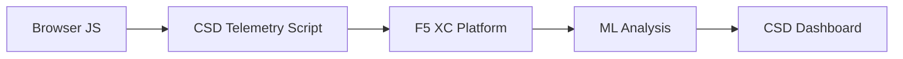

import { Aside } from "@astrojs/starlight/components";

F5 Distributed Cloud Client-Side Defense (CSD) protegge le applicazioni web dagli attacchi lato client monitorando il comportamento di JavaScript direttamente nel browser. Il bilanciatore di carico F5 XC può essere configurato per iniettare lo script di telemetria CSD nelle pagine servite al client. Questo script osserva tutte le attività JavaScript — quali script si caricano, quali campi del modulo leggono e quali connessioni di rete effettuano. I dati di telemetria vengono inviati alla piattaforma F5 XC dove i modelli di machine learning analizzano il comportamento degli script, assegnano punteggi di rischio e segnalano anomalie. I team di sicurezza esaminano i rilevamenti nella console CSD e intervengono consentendo o mitigando i domini degli script.

## Segnali di Rilevamento Core

CSD monitora tre categorie di comportamento lato browser:

| Segnale | Cosa Osserva CSD | Esempio |
| --- | --- | --- |
| **Letture di campi modulo** | Quali script accedono a quali campi `input` presenti nel DOM della pagina al momento del caricamento | `main.js` che legge il campo `password` su `/login` |
| **Inventario script** | Tutti i JavaScript first-party e third-party caricati su ogni pagina, tracciati per dominio di origine | Un nuovo tag `<script>` che si carica da `cdn.jsdelivr.net` che appare nella pagina di login |
| **Interazioni di rete** | Domini coinvolti nell'attività di rete dello script — include sia i domini di origine del caricamento dello script che i domini di destinazione fetch/XHR | Script originati da `esm.sh` e target di esfiltrazione dati come `www.httpbin.org` che appaiono nei domini rilevati |

<Aside type="caution">
Il segnale Network interactions di CSD traccia principalmente i **domini di origine del caricamento dello script**. Tuttavia, i domini di destinazione fetch/XHR appaiono anche nell'API `/detected_domains` e nella tabella del dominio del Dashboard — CSD rileva l'attività di rete a livello di dominio, non solo i caricamenti dello script. Vedere [Detection Boundaries](#detection-boundaries) per l'elenco completo delle limitazioni comportamentali.
</Aside>

## Matrice delle Funzionalità

| Funzionalità | Descrizione | Ubicazione Console |
| --- | --- | --- |
| **Scoring del rischio dello script** | Classificazione automatica: No Risk, Low Risk, High Risk | Script List → colonna Risk Level |
| **Sensibilità campi modulo** | Auto-classifica i campi come Sensitive (dal sistema) in base al tipo e al nome del campo | Visualizzazione Form Fields → colonna Analysis |
| **Timeline comportamento** | Grafici del livello di rischio dello script, dominio di origine e tipo nel tempo | Dettagli script → Overview → Behaviors Over Time |
| **Attribuzione utenti interessati** | Traccia gli utenti impattati per IP, geolocalizzazione, browser e dispositivo | Dettagli script → scheda Affected Users |
| **Elenco di permessi di dominio** | Contrassegna i domini script affidabili come consentiti | Dashboard → riga dominio → Add To Allow List |
| **Elenco di mitigazione dominio** | Blocca le chiamate di rete e le letture dei campi del modulo da domini script specifici, prevenendo l'esfiltrazione dei dati | Dashboard → riga dominio → Add To Mitigate List |
| **Configurazione avvisi** | Notifiche per nuovi domini, cambiamenti di rischio, comportamenti sospetti | Sezione Notifications |
| **Giustificazione script** | Aggiungi note che spiegano perché uno script è autorizzato (conformità PCI DSS) | Dettagli script → campo Justification |
| **Tracciamento transazioni** | Contatore mensile di eventi di telemetria che conferma che CSD è attivo | Dashboard → scheda Transactions Consumed |
| **Filtri temporali e geografici** | Filtra tutte le visualizzazioni per intervallo di tempo (24h, 7d, 30d) e ubicazione | Controlli filtro barra superiore |

## Limiti di Rilevamento

Comprendere cosa CSD **non** monitora è critico per impostare accurate aspettative di demo:

| Limitazione | Dettagli | Verificato |
| --- | --- | --- |
| **Campi creati dinamicamente** | CSD traccia i campi `input` presenti nel DOM al caricamento della pagina. I campi iniettati da JavaScript dopo il caricamento non vengono monitorati. Un `<input>` creato dinamicamente e letto da uno script non appare nella visualizzazione Form Fields. | Sì — campo assente da `/formFields` dopo attesa di 10 minuti |
| **Offuscamento a livello di codice** | CSD non contrassegna le tecniche di esecuzione di codice dinamico o i pattern di offuscamento come segnali di rilevamento separati. Gli harvester offuscati producono lo stesso livello di rischio di quelli non offuscati — CSD traccia i metadati comportamentali, non i pattern del codice sorgente. | Sì — "High Risk" identico per entrambe le tecniche |
| **Campi overlay modulo** | CSD traccia solo i campi del modulo presenti nel DOM originale al caricamento della pagina. I moduli overlay iniettati da JavaScript (una tecnica comune di digital skimming) non vengono tracciati — solo le letture dei campi originali vengono rilevate. | Sì — campi overlay assenti da `/formFields` dopo attesa di 10 minuti |
| **Comportamento contatore dashboard** | I conteggi di riepilogo "Found &amp; Mitigated" e "Found &amp; Allowed" cambiano solo dopo che un amministratore aggiunge esplicitamente un dominio all'elenco di mitigazione o di permessi. I conteggi "Action Needed" e "Total Found" vengono aggiornati automaticamente quando vengono rilevati nuovi domini. | Sì — "Found &amp; Allowed" è passato da 0 a 1 solo dopo POST a `/allowed_domains` |

<Aside type="note" title="Visibilità API vs Console">
L'endpoint API `/detected_domains` restituisce tutti i domini rilevati inclusi sia i domini di origine script first-party che third-party. Il dominio dell'applicazione first-party (ad es. `csd.bankexample.com`) appare nell'elenco dei domini rilevati insieme ai domini CDN third-party. Sia i domini first-party che third-party appaiono nella tabella del dominio del Dashboard.

I domini di destinazione fetch/XHR (ad es. `www.httpbin.org` contattati tramite `fetch()`) appaiono anche nella risposta `/detected_domains`. La piattaforma CSD traccia questi a livello di dominio anche se non sono domini di origine del caricamento dello script.
</Aside>

## Mappatura PCI DSS v4.0

CSD affronta direttamente due requisiti PCI DSS v4.0 per la sicurezza della pagina di pagamento:

| Requisito PCI DSS | Cosa Richiede | Come CSD lo Affronta |
| --- | --- | --- |
| **6.4.3** — Gestione script sulle pagine di pagamento | Mantenere un inventario di tutti gli script, fornire autorizzazione scritta e giustificazione per ciascuno, verificare l'integrità dello script | Script List fornisce l'inventario completo; il campo Justification documenta l'autorizzazione; la timeline comportamentale traccia i cambiamenti |
| **11.6.1** — Rilevamento manomissioni sulle pagine di pagamento | Rilevare modifiche non autorizzate alle intestazioni HTTP e al contenuto della pagina di pagamento | La telemetria CSD rileva nuove iniezioni di script, letture di campi modulo non autorizzate e nuovi domini di rete — avvisando sui cambiamenti al comportamento della pagina |

<Aside type="tip">
Utilizza la funzionalità **Script justification** per documentare perché ogni script è autorizzato sulle pagine di pagamento. Questo crea un audit trail che si mappa direttamente ai requisiti di autorizzazione PCI DSS 6.4.3.
</Aside>

## Matrice di Copertura delle Minacce

La tabella seguente mappa le comuni categorie di attacchi lato client ai segnali di rilevamento CSD che si attiverebbero durante ogni tipo di attacco. I tipi di attacco contrassegnati con **\*** sono confermati dalla [documentazione ufficiale F5](https://www.f5.com/cloud/products/client-side-defense). I tipi non contrassegnati vengono dedotti in base alle categorie di segnali di rilevamento di CSD e potrebbero non essere esplicitamente affermati da F5.

| Categoria di Attacco | Descrizione | Letture Campi | Iniezione Script | Rete |
| --- | --- | --- | --- | --- |
| **Formjacking** \* | Lo script dannoso legge i valori dei campi del modulo e li esfiltra | Sì | — | Sì |
| **Digital skimming** \* | Inietta moduli overlay o script per acquisire dati di pagamento | Sì | Sì | Sì |
| **Attacco della catena di approvvigionamento** \* | La libreria third-party compromessa carica codice dannoso | — | Sì | Sì |
| **Esfiltrazione dati** \* | Legge dati sensibili e li invia a domini esterni | Sì | — | Sì |
| **Iniezione script** \* | Inserisce tag `<script>` non autorizzati nella pagina | — | Sì | Sì |
| **Cryptojacking** \* | Inietta script di mining di criptovalute | — | Sì | Sì |
| **Manipolazione DOM** | Inietta o modifica elementi della pagina per ingannare gli utenti | — | Sì | — |
| **Man-in-the-Browser** | Intercetta dati del modulo all'interno della sessione del browser — vedi [OWASP](https://owasp.org/www-community/attacks/Man-in-the-browser_attack) e [MITRE T1185](https://attack.mitre.org/techniques/T1185/) | Sì | — | Sì |
| **Clickjacking** | Sovrappone frame invisibili per dirottare i clic dell'utente — vedi [OWASP](https://owasp.org/www-community/attacks/Clickjacking) | — | Sì | — |
| **Persistenza web skimmer** | Re-inietta script skimmer nelle navigazioni tra pagine — vedi [Sansec Magecart Research](https://sansec.io/what-is-magecart) | — | Sì | Sì |

<Aside type="note">
Il rilevamento "Network" copre sia i domini di origine del caricamento dello script che i domini di destinazione fetch/XHR — entrambi appaiono nell'API `/detected_domains` di CSD e nella tabella del dominio del Dashboard. Tuttavia, la mitigazione CSD si rivolge al caricamento dello script (il vettore della catena di approvvigionamento), non alle chiamate fetch/XHR. La mitigazione di un dominio blocca i caricamenti dei tag `<script>` da quel dominio ma non intercetta le chiamate `fetch()` o `XMLHttpRequest` ad esso.
</Aside>
