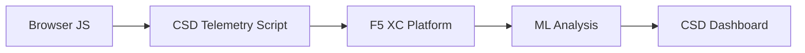

import { Aside } from "@astrojs/starlight/components";

F5 Distributed Cloud Client-Side Defense (CSD) protegge le applicazioni web dagli attacchi lato client monitorando il comportamento di JavaScript direttamente nel browser. Il load balancer F5 XC può essere configurato per iniettare lo script di telemetria CSD nelle pagine servite al client. Questo script osserva tutta l'attività JavaScript — quali script vengono caricati, quali campi di modulo leggono e quali connessioni di rete stabiliscono. I dati di telemetria vengono inviati alla Piattaforma F5 XC, dove i modelli di machine learning analizzano il comportamento degli script, assegnano punteggi di rischio e segnalano anomalie. I team di Sicurezza esaminano i rilevamenti nella console CSD e agiscono consentendo o mitigando i domini degli script.

## Segnali di rilevamento principali

CSD monitora tre categorie di comportamento lato browser:

| Segnale | Cosa osserva CSD | Esempio |
| --- | --- | --- |
| **Letture di campi modulo** | Quali script accedono a quali campi `input` presenti nel DOM della pagina al momento del caricamento | `main.js` che legge il campo `password` su `/login` |
| **Inventario degli script** | Tutti i JavaScript di prima e terza parte caricati su ogni pagina, tracciati per dominio sorgente | Un nuovo tag `<script>` che carica da `cdn.jsdelivr.net` che appare nella pagina di login |
| **Interazioni di rete** | Domini coinvolti nell'attività di rete degli script — include sia i domini sorgente di caricamento degli script che i domini di destinazione di fetch/XHR | Script provenienti da `esm.sh` e destinazioni di esfiltrazione dati come `www.httpbin.org` che appaiono nei domini rilevati |

<Aside type="caution">
Il segnale di interazioni di rete di CSD traccia principalmente i **domini sorgente di caricamento degli script**. Tuttavia, i domini di destinazione di fetch/XHR compaiono anche nell'API `/detected_domains` e nella tabella dei domini della Dashboard — CSD rileva l'attività di rete a livello di dominio, non solo i caricamenti di script. Consultare [Limiti di rilevamento](#detection-boundaries) per l'elenco completo delle limitazioni comportamentali.
</Aside>

## Matrice delle funzionalità

| Funzionalità | Descrizione | Posizione nella console |
| --- | --- | --- |
| **Punteggio di rischio degli script** | Classificazione automatica: Nessun rischio, Rischio basso, Rischio alto | Elenco script &rarr; Colonna Livello di rischio |
| **Sensibilità dei campi modulo** | Classifica automaticamente i campi come Sensibili (dal sistema) in base al tipo e al nome del campo | Vista Campi modulo &rarr; Colonna Analisi |
| **Timeline del comportamento** | Grafici del livello di rischio dello script, del dominio sorgente e del tipo nel tempo | Dettaglio script &rarr; Panoramica &rarr; Comportamenti nel tempo |
| **Attribuzione degli utenti interessati** | Traccia gli utenti interessati per IP, geolocalizzazione, browser e dispositivo | Dettaglio script &rarr; Scheda Utenti interessati |
| **Elenco di domini consentiti** | Contrassegna i domini degli script fidati come consentiti | Dashboard &rarr; riga del dominio &rarr; Aggiungi all'elenco dei consentiti |
| **Elenco di domini da mitigare** | Blocca le chiamate di rete e le letture dei campi modulo da domini specifici degli script, impedendo l'esfiltrazione dei dati | Dashboard &rarr; riga del dominio &rarr; Aggiungi all'elenco da mitigare |
| **Configurazione degli avvisi** | Notifiche per nuovi domini, variazioni di rischio, comportamenti sospetti | Sezione Notifiche |
| **Giustificazione degli script** | Aggiunge note che spiegano perché uno script è autorizzato (conformità PCI DSS) | Dettaglio script &rarr; Campo Giustificazione |
| **Monitoraggio delle transazioni** | Contatore mensile degli eventi di telemetria che conferma che CSD è attivo | Dashboard &rarr; Scheda Transazioni consumate |
| **Filtri per tempo e posizione** | Filtra tutte le visualizzazioni per intervallo di tempo (24h, 7g, 30g) e posizione | Controlli filtro nella barra superiore |

## Limiti di rilevamento

Comprendere ciò che CSD **non** monitora è fondamentale per impostare aspettative accurate nelle demo:

| Limitazione | Dettaglio | Verificato |
| --- | --- | --- |
| **Campi creati dinamicamente** | CSD traccia i campi `input` presenti nel DOM al caricamento della pagina. I campi iniettati da JavaScript dopo il caricamento non vengono monitorati. Un `<input>` creato dinamicamente e letto da uno script non appare nella vista Campi modulo. | Sì — campo assente da `/formFields` dopo 10 minuti di attesa |
| **Offuscamento a livello di codice** | CSD non segnala le tecniche di esecuzione dinamica del codice o i pattern di offuscamento come segnali di rilevamento separati. Gli harvester offuscati producono lo stesso livello di rischio di quelli non offuscati — CSD traccia i metadati comportamentali, non i pattern del codice sorgente. | Sì — identico "Rischio alto" per entrambe le tecniche |
| **Campi nei moduli sovrapposti** | CSD traccia solo i campi modulo presenti nel DOM originale al caricamento della pagina. I moduli sovrapposti iniettati da JavaScript (una tecnica comune di digital skimming) non vengono tracciati — vengono rilevate solo le letture dei campi originali. | Sì — campi sovrapposti assenti da `/formFields` dopo 10 minuti di attesa |
| **Comportamento dei contatori della Dashboard** | I conteggi riassuntivi "Trovati e mitigati" e "Trovati e consentiti" cambiano solo dopo che un amministratore aggiunge esplicitamente un dominio all'elenco da mitigare o a quello dei consentiti. I conteggi "Azione necessaria" e "Totale trovati" si aggiornano automaticamente quando vengono rilevati nuovi domini. | Sì — "Trovati e consentiti" è cambiato da 0 a 1 solo dopo il POST su `/allowed_domains` |

<Aside type="note" title="Visibilità API vs Console">
L'endpoint API `/detected_domains` restituisce tutti i domini rilevati, inclusi sia i domini sorgente degli script di prima parte che quelli di terza parte. Il dominio dell'applicazione di prima parte (ad es., `csd.bankexample.com`) appare nell'elenco dei domini rilevati insieme ai domini CDN di terza parte. Entrambi i domini di prima e terza parte appaiono nella tabella dei domini della Dashboard.

Anche i domini di destinazione di fetch/XHR (ad es., `www.httpbin.org` contattato tramite `fetch()`) appaiono nella risposta `/detected_domains`. La piattaforma CSD li traccia a livello di dominio anche se non sono domini sorgente di caricamento degli script.
</Aside>

## Mappatura PCI DSS v4.0

CSD affronta direttamente due requisiti PCI DSS v4.0 per la sicurezza delle pagine di pagamento:

| Requisito PCI DSS | Cosa richiede | Come CSD vi risponde |
| --- | --- | --- |
| **6.4.3** — Gestione degli script nelle pagine di pagamento | Mantenere un inventario di tutti gli script, fornire autorizzazione scritta e giustificazione per ciascuno, verificare l'integrità degli script | L'elenco degli script fornisce un inventario completo; il campo Giustificazione documenta l'autorizzazione; la timeline del comportamento traccia le modifiche |
| **11.6.1** — Rilevamento delle manomissioni nelle pagine di pagamento | Rilevare modifiche non autorizzate alle intestazioni HTTP e al contenuto della pagina di pagamento | La telemetria CSD rileva nuove iniezioni di script, letture non autorizzate di campi modulo e nuovi domini di rete — generando avvisi sulle variazioni del comportamento della pagina |

<Aside type="tip">
Utilizzare la funzionalità **Giustificazione degli script** per documentare il motivo per cui ogni script è autorizzato nelle pagine di pagamento. Ciò crea un audit trail che si ricollega direttamente ai requisiti di autorizzazione del PCI DSS 6.4.3.
</Aside>

## Matrice di copertura delle minacce

La tabella seguente mappa le categorie comuni di attacchi lato client ai segnali di rilevamento CSD che verrebbero attivati durante ciascun tipo di attacco. I tipi di attacco contrassegnati con **\*** sono confermati dalla [documentazione ufficiale F5](https://www.f5.com/cloud/products/client-side-defense). I tipi non contrassegnati sono dedotti in base alle categorie di segnali di rilevamento di CSD e potrebbero non essere esplicitamente dichiarati da F5.

| Categoria di attacco | Descrizione | Letture campi | Iniezione script | Rete |
| --- | --- | --- | --- | --- |
| **Formjacking** \* | Uno script malevolo legge i valori dei campi modulo e li esfiltра | Sì | — | Sì |
| **Digital skimming** \* | Inietta moduli sovrapposti o script per acquisire i dati di pagamento | Sì | Sì | Sì |
| **Attacco alla supply chain** \* | Una libreria di terze parti compromessa carica codice malevolo | — | Sì | Sì |
| **Esfiltrazione di dati** \* | Legge dati sensibili e li invia a domini esterni | Sì | — | Sì |
| **Iniezione di script** \* | Inserisce tag `<script>` non autorizzati nella pagina | — | Sì | Sì |
| **Cryptojacking** \* | Inietta script per il mining di criptovalute | — | Sì | Sì |
| **Manipolazione del DOM** | Inietta o modifica elementi della pagina per ingannare gli utenti | — | Sì | — |
| **Man-in-the-Browser** | Intercetta i dati del modulo all'interno della sessione del browser — vedere [OWASP](https://owasp.org/www-community/attacks/Man-in-the-browser_attack) e [MITRE T1185](https://attack.mitre.org/techniques/T1185/) | Sì | — | Sì |
| **Clickjacking** | Sovrappone frame invisibili per dirottare i clic degli utenti — vedere [OWASP](https://owasp.org/www-community/attacks/Clickjacking) | — | Sì | — |
| **Persistenza del web skimmer** | Reinietta gli script skimmer attraverso le navigazioni di pagina — vedere [Sansec Magecart Research](https://sansec.io/what-is-magecart) | — | Sì | Sì |

<Aside type="note">
Il rilevamento "Rete" copre sia i domini sorgente di caricamento degli script che i domini di destinazione di fetch/XHR — entrambi appaiono nell'API `/detected_domains` di CSD e nella tabella dei domini della Dashboard. Tuttavia, la mitigazione di CSD ha come target il caricamento degli script (il vettore della supply chain), non le chiamate fetch/XHR. Mitigare un dominio blocca i caricamenti del tag `<script>` da quel dominio, ma non intercetta le chiamate `fetch()` o `XMLHttpRequest` verso di esso.
</Aside>
