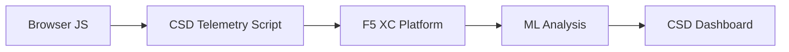

import { Aside } from "@astrojs/starlight/components";

F5 Distributed Cloud Client-Side Defense (CSD) は、ブラウザ内で直接 JavaScript の動作を監視することにより、クライアントサイド攻撃から Web アプリケーションを保護します。F5 XC ロードバランサーは、クライアントに配信されるページに CSD テレメトリスクリプトを注入するように構成できます。このスクリプトは、すべての JavaScript アクティビティ（どのスクリプトが読み込まれるか、どのフォームフィールドを読み取るか、どのネットワーク接続を行うか）を監視します。テレメトリデータは F5 XC プラットフォームに送信され、機械学習モデルがスクリプトの動作を分析し、リスクスコアを割り当て、異常をフラグ付けします。セキュリティチームは CSD コンソールで検出結果を確認し、スクリプトドメインの許可または緩和のアクションを実行します。

## コア検出シグナル

CSD はブラウザサイドの動作を 3 つのカテゴリで監視します：

| シグナル | CSD が監視する内容 | 例 |
| --- | --- | --- |
| **フォームフィールドの読み取り** | ページ読み込み時に DOM に存在する `input` フィールドに対して、どのスクリプトがどのフィールドにアクセスするか | `main.js` が `/login` の `password` フィールドを読み取る |
| **スクリプトインベントリ** | 各ページで読み込まれるすべてのファーストパーティおよびサードパーティの JavaScript（ソースドメイン別に追跡） | ログインページに `cdn.jsdelivr.net` から読み込まれる新しい `<script>` タグが出現 |
| **ネットワークインタラクション** | スクリプトのネットワークアクティビティに関与するドメイン — スクリプト読み込み元ドメインと fetch/XHR 送信先ドメインの両方を含む | `esm.sh` をソースとするスクリプトと、検出されたドメインに `www.httpbin.org` のようなデータ窃取先が出現 |

<Aside type="caution">
CSD のネットワークインタラクションシグナルは、主に**スクリプト読み込み元ドメイン**を追跡します。ただし、fetch/XHR 送信先ドメインも `/detected_domains` API およびダッシュボードのドメインテーブルに表示されます — CSD はスクリプトの読み込みだけでなく、ドメインレベルでネットワークアクティビティを検出します。動作上の制限の完全なリストについては、[検出の境界](#検出の境界)を参照してください。
</Aside>

## 機能マトリクス

| 機能 | 説明 | コンソールの場所 |
| --- | --- | --- |
| **スクリプトリスクスコアリング** | 自動分類：リスクなし、低リスク、高リスク | Script List &rarr; Risk Level 列 |
| **フォームフィールドの機密性** | フィールドのタイプと名前に基づいて、フィールドを機密（システムによる）として自動分類 | Form Fields ビュー &rarr; Analysis 列 |
| **動作タイムライン** | スクリプトのリスクレベル、ソースドメイン、タイプを時系列でチャート表示 | Script detail &rarr; Overview &rarr; Behaviors Over Time |
| **影響を受けたユーザーの帰属** | IP、地理位置情報、ブラウザ、デバイス別に影響を受けたユーザーを追跡 | Script detail &rarr; Affected Users タブ |
| **ドメイン許可リスト** | 信頼できるスクリプトドメインを許可済みとしてマーク | Dashboard &rarr; ドメイン行 &rarr; Add To Allow List |
| **ドメイン緩和リスト** | 特定のスクリプトドメインからのネットワーク呼び出しとフォームフィールドの読み取りをブロックし、データ窃取を防止 | Dashboard &rarr; ドメイン行 &rarr; Add To Mitigate List |
| **アラート設定** | 新しいドメイン、リスク変更、疑わしい動作に関する通知 | Notifications セクション |
| **スクリプトの正当性証明** | スクリプトが承認されている理由を説明するメモを追加（PCI DSS コンプライアンス） | Script detail &rarr; Justification フィールド |
| **トランザクション追跡** | CSD がアクティブであることを確認する月次テレメトリイベントカウンター | Dashboard &rarr; Transactions Consumed カード |
| **時間と場所のフィルター** | 時間範囲（24h、7d、30d）と場所ですべてのビューをフィルタリング | 上部バーのフィルターコントロール |

## 検出の境界

CSD が監視**しない**内容を理解することは、正確なデモの期待値を設定する上で重要です：

| 制限事項 | 詳細 | 検証済み |
| --- | --- | --- |
| **動的に作成されるフィールド** | CSD はページ読み込み時に DOM に存在する `input` フィールドを追跡します。読み込み後に JavaScript によって注入されたフィールドは監視されません。スクリプトによって読み取られた動的に作成された `<input>` は、Form Fields ビューに表示されません。 | はい — 10 分間の待機後も `/formFields` にフィールドが表示されず |
| **コードレベルの難読化** | CSD は動的コード実行テクニックや難読化パターンを個別の検出シグナルとしてフラグ付けしません。難読化されたハーベスターは、難読化されていないものと同じリスクレベルを生成します — CSD はソースコードパターンではなく、動作メタデータを追跡します。 | はい — 両方のテクニックで同一の「高リスク」 |
| **フォームオーバーレイフィールド** | CSD はページ読み込み時に元の DOM に存在するフォームフィールドのみを追跡します。JavaScript によって注入されたオーバーレイフォーム（一般的なデジタルスキミング手法）は追跡されません — 元のフィールドの読み取りのみが検出されます。 | はい — 10 分間の待機後もオーバーレイフィールドが `/formFields` に表示されず |
| **ダッシュボードカウンターの動作** | 「Found &amp; Mitigated」と「Found &amp; Allowed」の合計カウントは、管理者が明示的にドメインを緩和リストまたは許可リストに追加した後にのみ変更されます。「Action Needed」と「Total Found」のカウントは、新しいドメインが検出されると自動的に更新されます。 | はい — 「Found &amp; Allowed」は `/allowed_domains` への POST 後にのみ 0 から 1 に変更 |

<Aside type="note" title="API とコンソールの可視性">
`/detected_domains` API エンドポイントは、ファーストパーティおよびサードパーティのスクリプトソースドメインの両方を含む、検出されたすべてのドメインを返します。ファーストパーティのアプリケーションドメイン（例：`csd.bankexample.com`）は、サードパーティ CDN ドメインと並んで検出ドメインリストに表示されます。ファーストパーティとサードパーティの両方のドメインがダッシュボードのドメインテーブルに表示されます。

fetch/XHR 送信先ドメイン（例：`fetch()` 経由で接続される `www.httpbin.org`）も `/detected_domains` レスポンスに表示されます。CSD プラットフォームは、これらがスクリプト読み込み元ドメインでなくても、ドメインレベルで追跡します。
</Aside>

## PCI DSS v4.0 マッピング

CSD は、決済ページセキュリティに関する PCI DSS v4.0 の 2 つの要件に直接対応します：

| PCI DSS 要件 | 要求事項 | CSD の対応方法 |
| --- | --- | --- |
| **6.4.3** — 決済ページのスクリプト管理 | すべてのスクリプトのインベントリを維持し、各スクリプトに対して書面による承認と正当性証明を提供し、スクリプトの完全性を検証する | Script List が完全なインベントリを提供、Justification フィールドが承認を文書化、動作タイムラインが変更を追跡 |
| **11.6.1** — 決済ページの改ざん検出 | HTTP ヘッダーと決済ページコンテンツの不正な変更を検出する | CSD テレメトリが新しいスクリプトの注入、不正なフォームフィールドの読み取り、新しいネットワークドメインを検出し、ページ動作の変更をアラート |

<Aside type="tip">
**スクリプトの正当性証明**機能を使用して、各スクリプトが決済ページで承認されている理由を文書化してください。これにより、PCI DSS 6.4.3 の承認要件に直接マッピングされる監査証跡が作成されます。
</Aside>

## 脅威カバレッジマトリクス

以下の表は、一般的なクライアントサイド攻撃カテゴリを、各攻撃タイプで発動する CSD 検出シグナルにマッピングしています。**\*** マーク付きの攻撃タイプは [F5 公式ドキュメント](https://www.f5.com/cloud/products/client-side-defense)で確認されています。マークなしのタイプは、CSD の検出シグナルカテゴリに基づいて推測されたものであり、F5 が明示的に主張していない場合があります。

| 攻撃カテゴリ | 説明 | フィールド読み取り | スクリプト注入 | ネットワーク |
| --- | --- | --- | --- | --- |
| **フォームジャッキング** \* | 悪意のあるスクリプトがフォームフィールドの値を読み取り、窃取する | はい | — | はい |
| **デジタルスキミング** \* | オーバーレイフォームやスクリプトを注入して決済データをキャプチャする | はい | はい | はい |
| **サプライチェーン攻撃** \* | 侵害されたサードパーティライブラリが悪意のあるコードを読み込む | — | はい | はい |
| **データ窃取** \* | 機密データを読み取り、外部ドメインに送信する | はい | — | はい |
| **スクリプト注入** \* | 不正な `<script>` タグをページに挿入する | — | はい | はい |
| **クリプトジャッキング** \* | 暗号通貨マイニングスクリプトを注入する | — | はい | はい |
| **DOM 操作** | ページ要素を注入または変更してユーザーを欺く | — | はい | — |
| **Man-in-the-Browser** | ブラウザセッション内でフォームデータを傍受する — [OWASP](https://owasp.org/www-community/attacks/Man-in-the-browser_attack) および [MITRE T1185](https://attack.mitre.org/techniques/T1185/) を参照 | はい | — | はい |
| **クリックジャッキング** | 不可視のフレームを重ねてユーザーのクリックを乗っ取る — [OWASP](https://owasp.org/www-community/attacks/Clickjacking) を参照 | — | はい | — |
| **Web スキマーの永続化** | ページナビゲーション間でスキマースクリプトを再注入する — [Sansec Magecart Research](https://sansec.io/what-is-magecart) を参照 | — | はい | はい |

<Aside type="note">
「ネットワーク」検出は、スクリプト読み込み元ドメインと fetch/XHR 送信先ドメインの両方をカバーします — 両方とも CSD の `/detected_domains` API およびダッシュボードのドメインテーブルに表示されます。ただし、CSD の緩和はスクリプトの読み込み（サプライチェーンベクター）を対象としており、fetch/XHR 呼び出しは対象としていません。ドメインを緩和すると、そのドメインからの `<script>` タグの読み込みはブロックされますが、そのドメインへの `fetch()` や `XMLHttpRequest` 呼び出しは傍受されません。
</Aside>
