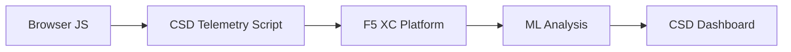

import { Aside } from "@astrojs/starlight/components";

F5 Distributed Cloud Client-Side Defense（CSD）は、ブラウザ内で JavaScript の動作を直接監視することで、クライアントサイド攻撃から Web アプリケーションを保護します。F5 XC ロードバランサーは、クライアントに配信されるページに CSD テレメトリスクリプトを挿入するように構成できます。このスクリプトは、すべての JavaScript アクティビティ（どのスクリプトが読み込まれるか、どのフォームフィールドが読み取られるか、どのネットワーク接続が行われるか）を監視します。テレメトリデータは F5 XC プラットフォームに送信され、機械学習モデルがスクリプトの動作を分析し、リスクスコアを付与し、異常をフラグ付けします。セキュリティチームは CSD コンソールで検出結果を確認し、スクリプトドメインの許可または軽減のアクションを実行します。

## コア検出シグナル

CSD は、ブラウザサイドの動作を 3 つのカテゴリで監視します：

| シグナル | CSD が監視する内容 | 例 |
| --- | --- | --- |
| **フォームフィールドの読み取り** | ページ DOM のロード時に存在する `input` フィールドにどのスクリプトがアクセスするか | `main.js` が `/login` の `password` フィールドを読み取る |
| **スクリプトインベントリ** | 各ページで読み込まれるすべてのファーストパーティおよびサードパーティの JavaScript（ソースドメインで追跡） | ログインページに `cdn.jsdelivr.net` から読み込まれる新しい `<script>` タグが出現する |
| **ネットワークインタラクション** | スクリプトのネットワークアクティビティに関連するドメイン — スクリプトロードのソースドメインと fetch/XHR の宛先ドメインの両方を含む | `esm.sh` をソースとするスクリプトと、検出ドメインに `www.httpbin.org` のようなデータ窃取先が出現する |

<Aside type="caution">
CSD のネットワークインタラクションシグナルは、主に**スクリプトロードのソースドメイン**を追跡します。ただし、fetch/XHR の宛先ドメインも `/detected_domains` API およびダッシュボードのドメインテーブルに表示されます。CSD はスクリプトのロードだけでなく、ドメインレベルでネットワークアクティビティを検出します。動作上の制限の完全なリストについては、[検出の境界](#検出の境界) を参照してください。
</Aside>

## 機能マトリックス

| 機能 | 説明 | コンソール上の場所 |
| --- | --- | --- |
| **スクリプトリスクスコアリング** | 自動分類：リスクなし、低リスク、高リスク | Script List &rarr; Risk Level 列 |
| **フォームフィールドの機密性** | フィールドのタイプと名前に基づいて、フィールドを（システムにより）機密として自動分類 | Form Fields ビュー &rarr; Analysis 列 |
| **動作タイムライン** | スクリプトのリスクレベル、ソースドメイン、タイプを時系列でチャート表示 | Script detail &rarr; Overview &rarr; Behaviors Over Time |
| **影響を受けたユーザーの帰属** | IP、ジオロケーション、ブラウザ、デバイスで影響を受けたユーザーを追跡 | Script detail &rarr; Affected Users タブ |
| **ドメイン許可リスト** | 信頼できるスクリプトドメインを許可済みとしてマーク | Dashboard &rarr; ドメイン行 &rarr; Add To Allow List |
| **ドメイン軽減リスト** | 特定のスクリプトドメインからのネットワーク呼び出しとフォームフィールドの読み取りをブロックし、データ窃取を防止 | Dashboard &rarr; ドメイン行 &rarr; Add To Mitigate List |
| **アラート設定** | 新しいドメイン、リスク変更、不審な動作に対する通知 | Notifications セクション |
| **スクリプトの正当性記録** | スクリプトが承認された理由を説明するメモを追加（PCI DSS コンプライアンス） | Script detail &rarr; Justification フィールド |
| **トランザクション追跡** | CSD がアクティブであることを確認する月間テレメトリイベントカウンター | Dashboard &rarr; Transactions Consumed カード |
| **時間と場所のフィルター** | すべてのビューを時間範囲（24h、7d、30d）と場所でフィルタリング | トップバーのフィルターコントロール |

## 検出の境界

CSD が監視**しない**内容を理解することは、正確なデモの期待値を設定するために不可欠です：

| 制限事項 | 詳細 | 検証済み |
| --- | --- | --- |
| **動的に作成されたフィールド** | CSD はページロード時に DOM に存在する `input` フィールドを追跡します。ロード後に JavaScript によって挿入されたフィールドは監視されません。動的に作成された `<input>` がスクリプトによって読み取られても、Form Fields ビューには表示されません。 | はい — 10 分間待機後も `/formFields` にフィールドが表示されず |
| **コードレベルの難読化** | CSD は動的コード実行手法や難読化パターンを個別の検出シグナルとしてフラグ付けしません。難読化されたハーベスターは難読化されていないものと同じリスクレベルを生成します。CSD はソースコードのパターンではなく、動作メタデータを追跡します。 | はい — 両方の手法で同一の「High Risk」 |
| **フォームオーバーレイフィールド** | CSD はページロード時に元の DOM に存在するフォームフィールドのみを追跡します。JavaScript によって挿入されたオーバーレイフォーム（一般的なデジタルスキミング手法）は追跡されません。元のフィールドの読み取りのみが検出されます。 | はい — 10 分間待機後もオーバーレイフィールドが `/formFields` に表示されず |
| **ダッシュボードカウンターの動作** | 「Found &amp; Mitigated」と「Found &amp; Allowed」のサマリーカウントは、管理者がドメインを軽減リストまたは許可リストに明示的に追加した後にのみ変更されます。「Action Needed」と「Total Found」のカウントは、新しいドメインが検出されると自動的に更新されます。 | はい — 「Found &amp; Allowed」は `/allowed_domains` への POST 後にのみ 0 から 1 に変更 |

<Aside type="note" title="API とコンソールの可視性">
`/detected_domains` API エンドポイントは、ファーストパーティおよびサードパーティのスクリプトソースドメインの両方を含む、すべての検出ドメインを返します。ファーストパーティのアプリケーションドメイン（例：`csd.bankexample.com`）は、サードパーティの CDN ドメインと並んで検出ドメインリストに表示されます。ファーストパーティとサードパーティの両方のドメインがダッシュボードのドメインテーブルに表示されます。

fetch/XHR の宛先ドメイン（例：`fetch()` 経由で接続される `www.httpbin.org`）も `/detected_domains` レスポンスに表示されます。CSD プラットフォームは、スクリプトロードのソースドメインではなくても、ドメインレベルでこれらを追跡します。
</Aside>

## PCI DSS v4.0 マッピング

CSD は、決済ページセキュリティに関する 2 つの PCI DSS v4.0 要件に直接対応します：

| PCI DSS 要件 | 要求される内容 | CSD による対応方法 |
| --- | --- | --- |
| **6.4.3** — 決済ページでのスクリプト管理 | すべてのスクリプトのインベントリを維持し、各スクリプトに対して書面による承認と正当性を提供し、スクリプトの整合性を検証する | Script List が完全なインベントリを提供。Justification フィールドで承認を文書化。動作タイムラインで変更を追跡 |
| **11.6.1** — 決済ページでの改ざん検出 | HTTP ヘッダーおよび決済ページコンテンツへの不正な変更を検出する | CSD テレメトリが新しいスクリプトの挿入、不正なフォームフィールドの読み取り、新しいネットワークドメインを検出し、ページの動作変更についてアラートを発行 |

<Aside type="tip">
**スクリプトの正当性記録**機能を使用して、各スクリプトが決済ページで承認された理由を文書化してください。これにより、PCI DSS 6.4.3 の承認要件に直接マッピングされる監査証跡が作成されます。
</Aside>

## 脅威カバレッジマトリックス

以下の表は、一般的なクライアントサイド攻撃カテゴリを、各攻撃タイプ中に発火する CSD 検出シグナルにマッピングしたものです。**\*** マーク付きの攻撃タイプは [F5 公式ドキュメント](https://www.f5.com/cloud/products/client-side-defense) で確認されています。マークなしのタイプは CSD の検出シグナルカテゴリに基づいて推測されたものであり、F5 によって明示的に主張されているとは限りません。

| 攻撃カテゴリ | 説明 | フィールド読み取り | スクリプト挿入 | ネットワーク |
| --- | --- | --- | --- | --- |
| **フォームジャッキング** \* | 悪意のあるスクリプトがフォームフィールドの値を読み取り窃取する | はい | — | はい |
| **デジタルスキミング** \* | 決済データを取得するためにオーバーレイフォームやスクリプトを挿入する | はい | はい | はい |
| **サプライチェーン攻撃** \* | 侵害されたサードパーティライブラリが悪意のあるコードを読み込む | — | はい | はい |
| **データ窃取** \* | 機密データを読み取り、外部ドメインに送信する | はい | — | はい |
| **スクリプト挿入** \* | ページに不正な `<script>` タグを挿入する | — | はい | はい |
| **クリプトジャッキング** \* | 暗号通貨マイニングスクリプトを挿入する | — | はい | はい |
| **DOM 操作** | ユーザーを欺くためにページ要素を挿入または変更する | — | はい | — |
| **Man-in-the-Browser** | ブラウザセッション内でフォームデータを傍受する — [OWASP](https://owasp.org/www-community/attacks/Man-in-the-browser_attack) および [MITRE T1185](https://attack.mitre.org/techniques/T1185/) を参照 | はい | — | はい |
| **クリックジャッキング** | 不可視のフレームをオーバーレイしてユーザーのクリックを乗っ取る — [OWASP](https://owasp.org/www-community/attacks/Clickjacking) を参照 | — | はい | — |
| **Web スキマーの永続化** | ページナビゲーション間でスキマースクリプトを再挿入する — [Sansec Magecart Research](https://sansec.io/what-is-magecart) を参照 | — | はい | はい |

<Aside type="note">
「ネットワーク」検出は、スクリプトロードのソースドメインと fetch/XHR の宛先ドメインの両方をカバーします。両方とも CSD の `/detected_domains` API およびダッシュボードのドメインテーブルに表示されます。ただし、CSD の軽減はスクリプトのロード（サプライチェーンベクター）を対象としており、fetch/XHR 呼び出しは対象としていません。ドメインを軽減すると、そのドメインからの `<script>` タグのロードはブロックされますが、そのドメインへの `fetch()` や `XMLHttpRequest` 呼び出しはインターセプトされません。
</Aside>
