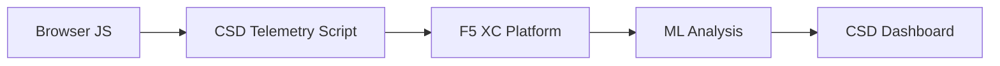

import { Aside } from "@astrojs/starlight/components";

F5 Distributed Cloud クライアントサイド防御 (CSD) は、ブラウザ内で JavaScript の動作を直接監視することにより、Web アプリケーションをクライアントサイド攻撃から保護します。F5 XC ロードバランサーは、クライアントに配信されるページに CSD テレメトリスクリプトを挿入するよう設定できます。このスクリプトは、すべての JavaScript アクティビティ（どのスクリプトが読み込まれるか、どのフォームフィールドを読み取るか、どのネットワーク接続を確立するか）を監視します。テレメトリデータは F5 XC プラットフォームに送信され、機械学習モデルがスクリプトの動作を分析し、リスクスコアを割り当て、異常を検出します。セキュリティチームは CSD コンソールで検出結果を確認し、スクリプトドメインを許可またはブロックする対応を行います。

## コア検出シグナル

CSD はブラウザサイドの動作を 3 つのカテゴリで監視します：

| シグナル | CSD が監視する内容 | 例 |
| --- | --- | --- |
| **フォームフィールドの読み取り** | どのスクリプトが、ページロード時に DOM に存在するどの `input` フィールドにアクセスするか | `/login` ページの `password` フィールドを読み取る `main.js` |
| **スクリプトインベントリ** | 各ページに読み込まれるすべてのファーストパーティおよびサードパーティ JavaScript。ソースドメイン別に追跡 | ログインページに `cdn.jsdelivr.net` から読み込まれる新しい `<script>` タグが出現する |
| **ネットワークインタラクション** | スクリプトのネットワークアクティビティに関連するドメイン — スクリプトロードのソースドメインと fetch/XHR の宛先ドメインの両方を含む | `esm.sh` をソースとするスクリプトや `www.httpbin.org` などのデータ窃取先が検出ドメインに出現する |

<Aside type="caution">
CSD のネットワークインタラクションシグナルは主に**スクリプトロードのソースドメイン**を追跡します。ただし、fetch/XHR の宛先ドメインも `/detected_domains` API およびダッシュボードのドメインテーブルに表示されます — CSD はスクリプトロードだけでなく、ドメインレベルでネットワークアクティビティを検出します。動作上の制限の完全なリストについては、[検出の制限](#detection-boundaries)を参照してください。
</Aside>

## 機能マトリックス

| 機能 | 説明 | コンソールの場所 |
| --- | --- | --- |
| **スクリプトリスクスコアリング** | 自動分類：リスクなし、低リスク、高リスク | スクリプトリスト &rarr; リスクレベル列 |
| **フォームフィールドの感度** | フィールドの種類と名前に基づき、システムが自動的にフィールドを「機密」に分類 | フォームフィールドビュー &rarr; 分析列 |
| **動作タイムライン** | スクリプトのリスクレベル、ソースドメイン、種類の経時変化をグラフ表示 | スクリプト詳細 &rarr; 概要 &rarr; 時系列の動作 |
| **影響ユーザーの帰属** | IP、ジオロケーション、ブラウザ、デバイスにより影響を受けたユーザーを追跡 | スクリプト詳細 &rarr; 影響ユーザータブ |
| **ドメイン許可リスト** | 信頼済みのスクリプトドメインを許可としてマーク | ダッシュボード &rarr; ドメイン行 &rarr; 許可リストに追加 |
| **ドメイン緩和リスト** | 特定のスクリプトドメインからのネットワーク呼び出しおよびフォームフィールドの読み取りをブロックし、データ窃取を防止 | ダッシュボード &rarr; ドメイン行 &rarr; 緩和リストに追加 |
| **アラート設定** | 新規ドメイン、リスク変化、不審な動作に対する通知 | 通知セクション |
| **スクリプトの正当性記録** | スクリプトが承認されている理由を説明するメモを追加（PCI DSS コンプライアンス対応） | スクリプト詳細 &rarr; 正当性フィールド |
| **トランザクション追跡** | CSD が有効であることを確認する月次テレメトリイベントカウンター | ダッシュボード &rarr; 消費トランザクションカード |
| **時間と場所のフィルター** | 時間範囲（24 時間、7 日、30 日）および場所でビューをフィルタリング | トップバーのフィルターコントロール |

## 検出の制限

CSD が**監視しない**内容を理解することは、正確なデモの期待値を設定するうえで重要です：

| 制限事項 | 詳細 | 確認済み |
| --- | --- | --- |
| **動的に作成されたフィールド** | CSD はページロード時に DOM に存在する `input` フィールドを追跡します。ロード後に JavaScript によって挿入されたフィールドは監視されません。スクリプトが動的に作成した `<input>` を読み取っても、フォームフィールドビューには表示されません。 | 確認済み — 10 分待機後も `/formFields` にフィールドが存在しない |
| **コードレベルの難読化** | CSD は動的コード実行技術や難読化パターンを個別の検出シグナルとしてフラグ立てしません。難読化されたハーベスターは難読化されていないものと同じリスクレベルを生成します — CSD はソースコードのパターンではなく、動作メタデータを追跡します。 | 確認済み — 両技術とも同じ「高リスク」 |
| **フォームオーバーレイフィールド** | CSD はページロード時に元の DOM に存在するフォームフィールドのみを追跡します。JavaScript によって挿入されたオーバーレイフォーム（一般的なデジタルスキミング技術）は追跡されません — 元のフィールドへの読み取りのみが検出されます。 | 確認済み — 10 分待機後も `/formFields` にオーバーレイフィールドが存在しない |
| **ダッシュボードカウンターの動作** | 「検出済みおよび緩和済み」と「検出済みおよび許可済み」のサマリーカウントは、管理者が明示的にドメインを緩和リストまたは許可リストに追加した後のみ変化します。「対応が必要」と「合計検出数」のカウントは、新しいドメインが検出されると自動的に更新されます。 | 確認済み — `/allowed_domains` へ POST 後にのみ「検出済みおよび許可済み」が 0 から 1 に変化 |

<Aside type="note" title="API とコンソールの可視性">
`/detected_domains` API エンドポイントは、ファーストパーティとサードパーティのスクリプトソースドメインの両方を含む、検出されたすべてのドメインを返します。ファーストパーティのアプリケーションドメイン（例：`csd.bankexample.com`）は、サードパーティの CDN ドメインと並んで検出ドメインリストに表示されます。ファーストパーティとサードパーティの両ドメインがダッシュボードのドメインテーブルに表示されます。

fetch/XHR の宛先ドメイン（例：`fetch()` 経由で接続される `www.httpbin.org`）も `/detected_domains` レスポンスに表示されます。CSD プラットフォームはスクリプトロードのソースドメインではない場合でも、ドメインレベルでこれらを追跡します。
</Aside>

## PCI DSS v4.0 マッピング

CSD は、決済ページセキュリティに関する 2 つの PCI DSS v4.0 要件に直接対応しています：

| PCI DSS 要件 | 要求内容 | CSD による対応方法 |
| --- | --- | --- |
| **6.4.3** — 決済ページのスクリプト管理 | すべてのスクリプトのインベントリを維持し、各スクリプトに書面による承認と正当性を提供し、スクリプトの整合性を検証する | スクリプトリストが完全なインベントリを提供；正当性フィールドが承認を文書化；動作タイムラインが変更を追跡 |
| **11.6.1** — 決済ページの改ざん検出 | HTTP ヘッダーおよび決済ページコンテンツへの不正な変更を検出する | CSD テレメトリが新しいスクリプトインジェクション、不正なフォームフィールドの読み取り、新しいネットワークドメインを検出し、ページ動作の変化についてアラートを発する |

<Aside type="tip">
**スクリプトの正当性記録**機能を使用して、決済ページ上の各スクリプトが承認されている理由を文書化してください。これにより、PCI DSS 6.4.3 の承認要件に直接対応する監査証跡が作成されます。
</Aside>

## 脅威カバレッジマトリックス

以下の表は、一般的なクライアントサイド攻撃カテゴリを、各攻撃タイプで発動する CSD の検出シグナルにマッピングしたものです。**\*** が付いた攻撃タイプは [F5 公式ドキュメント](https://www.f5.com/cloud/products/client-side-defense)によって確認されています。マークのないタイプは CSD の検出シグナルカテゴリに基づいて推測されたものであり、F5 が明示的に主張しているものではない場合があります。

| 攻撃カテゴリ | 説明 | フィールド読み取り | スクリプトインジェクション | ネットワーク |
| --- | --- | --- | --- | --- |
| **フォームジャッキング** \* | 悪意のあるスクリプトがフォームフィールドの値を読み取り、窃取する | あり | — | あり |
| **デジタルスキミング** \* | オーバーレイフォームまたはスクリプトを挿入して決済データを取得する | あり | あり | あり |
| **サプライチェーン攻撃** \* | 侵害されたサードパーティライブラリが悪意のあるコードを読み込む | — | あり | あり |
| **データ窃取** \* | 機密データを読み取り、外部ドメインに送信する | あり | — | あり |
| **スクリプトインジェクション** \* | 不正な `<script>` タグをページに挿入する | — | あり | あり |
| **クリプトジャッキング** \* | 暗号通貨マイニングスクリプトを挿入する | — | あり | あり |
| **DOM 操作** | ページ要素を挿入または変更してユーザーを欺く | — | あり | — |
| **Man-in-the-Browser** | ブラウザセッション内でフォームデータを傍受する — [OWASP](https://owasp.org/www-community/attacks/Man-in-the-browser_attack) および [MITRE T1185](https://attack.mitre.org/techniques/T1185/) を参照 | あり | — | あり |
| **クリックジャッキング** | 非表示フレームをオーバーレイしてユーザーのクリックを乗っ取る — [OWASP](https://owasp.org/www-community/attacks/Clickjacking) を参照 | — | あり | — |
| **Web スキマーの永続化** | ページナビゲーション全体でスキマースクリプトを再挿入する — [Sansec Magecart Research](https://sansec.io/what-is-magecart) を参照 | — | あり | あり |

<Aside type="note">
「ネットワーク」検出はスクリプトロードのソースドメインと fetch/XHR の宛先ドメインの両方をカバーします — どちらも CSD の `/detected_domains` API およびダッシュボードのドメインテーブルに表示されます。ただし、CSD の緩和はスクリプトの読み込み（サプライチェーンベクター）を対象としており、fetch/XHR 呼び出しは対象外です。ドメインを緩和すると、そのドメインからの `<script>` タグの読み込みはブロックされますが、そのドメインへの `fetch()` または `XMLHttpRequest` 呼び出しはインターセプトされません。
</Aside>
