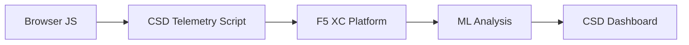

import { Aside } from "@astrojs/starlight/components";

F5 Distributed Cloud クライアント側防御 (CSD) は、ブラウザ内で直接 JavaScript の動作を監視することにより、web アプリケーションをクライアント側攻撃から保護します。F5 XC ロードバランサーは、クライアントに提供されるページに CSD テレメトリスクリプトを挿入するように構成できます。このスクリプトはすべての JavaScript アクティビティを観察します。つまり、どのスクリプトが読み込まれるか、どのフォームフィールドを読み取るか、どのネットワーク接続を確立するかです。テレメトリデータは F5 XC プラットフォームに送信され、機械学習モデルがスクリプトの動作を分析し、リスクスコアを割り当て、異常をフラグ立てします。セキュリティチームは CSD コンソールで検出を確認し、スクリプトドメインの許可または軽減によってアクションを実行します。

## コア検出シグナル

CSD は、ブラウザ側の動作の 3 つのカテゴリを監視します。

| シグナル | CSD が観察すること | 例 |
| --- | --- | --- |
| **フォームフィールドの読み取り** | どのスクリプトがページの読み込み時に DOM に存在するどの `input` フィールドにアクセスするか | `/login` 上の `password` フィールドを読み取る `main.js` |
| **スクリプトインベントリ** | 各ページに読み込まれるすべてのファーストパーティおよびサードパーティの JavaScript。ソースドメインで追跡 | ログインページに `cdn.jsdelivr.net` からロードされる新しい `<script>` タグが出現 |
| **ネットワークインタラクション** | スクリプトネットワークアクティビティに関係するドメイン。スクリプト読み込みのソースドメインと fetch/XHR の宛先ドメイン両方を含む | `esm.sh` からソース化されたスクリプトと `www.httpbin.org` などのデータ流出先が検出ドメインに出現 |

<Aside type="caution">
CSD の「ネットワークインタラクション」シグナルは主に**スクリプト読み込みのソースドメイン**を追跡します。ただし、fetch/XHR の宛先ドメインも `/detected_domains` API とダッシュボードドメインテーブルに表示されます。CSD はスクリプト読み込みだけではなく、ドメインレベルでネットワークアクティビティを検出します。動作制限の完全なリストについては、[検出境界](#検出境界)を参照してください。
</Aside>

## 機能マトリックス

| 機能 | 説明 | コンソールの場所 |
| --- | --- | --- |
| **スクリプトリスクスコアリング** | 自動分類: リスクなし、低リスク、高リスク | スクリプトリスト → リスクレベル列 |
| **フォームフィールドの機密性** | フィールドタイプと名前に基づいて、自動的にフィールドを機密として分類 (システムによる) | フォームフィールドビュー → 分析列 |
| **動作タイムライン** | スクリプトのリスクレベル、ソースドメイン、タイプを時系列でチャート | スクリプト詳細 → 概要 → 時系列の動作 |
| **影響を受けたユーザーの帰属** | IP、地理的位置、ブラウザ、デバイスでインパクトを受けたユーザーを追跡 | スクリプト詳細 → 影響を受けたユーザータブ |
| **ドメイン許可リスト** | 信頼できるスクリプトドメインを許可としてマーク | ダッシュボード → ドメイン行 → 許可リストに追加 |
| **ドメイン軽減リスト** | 特定のスクリプトドメインからのネットワーク呼び出しとフォームフィールド読み取りをブロックし、データ流出を防止 | ダッシュボード → ドメイン行 → 軽減リストに追加 |
| **アラート設定** | 新しいドメイン、リスク変更、疑わしい動作の通知 | 通知セクション |
| **スクリプトの正当化** | スクリプトが承認されている理由を説明するメモを追加 (PCI DSS コンプライアンス) | スクリプト詳細 → 正当化フィールド |
| **トランザクション追跡** | CSD がアクティブであることを確認する月単位のテレメトリイベントカウンター | ダッシュボード → トランザクション消費カード |
| **時間と場所のフィルター** | すべてのビューを時間範囲 (24h、7d、30d) と場所でフィルター | トップバーのフィルターコントロール |

## 検出境界

CSD が監視**しない**ものを理解することは、正確なデモの期待値を設定するために重要です。

| 制限事項 | 詳細 | 検証済み |
| --- | --- | --- |
| **動的に作成されたフィールド** | CSD は、ページ読み込み時に DOM に存在する `input` フィールドを追跡します。読み込み後に JavaScript によって挿入されるフィールドは監視されません。スクリプトによって読み取られる動的に作成された `<input>` は、フォームフィールドビューに表示されません。 | はい—10 分待機後 `/formFields` からフィールドが表示されない |
| **コードレベルの難読化** | CSD は、動的コード実行手法や難読化パターンを個別の検出シグナルとしてフラグ立てしません。難読化されたハーベスターは、難読化されていないものと同じリスクレベルを生成します。CSD は、ソースコードパターンではなく、動作メタデータを追跡します。 | はい—両方の手法について同一の「高リスク」 |
| **フォームオーバーレイフィールド** | CSD は、ページ読み込み時に元の DOM に存在するフォームフィールドのみを追跡します。JavaScript によって挿入されたオーバーレイフォーム (一般的なデジタルスキミング手法) は追跡されません。元のフィールドの読み取りのみが検出されます。 | はい—10 分待機後 `/formFields` からオーバーレイフィールドが表示されない |
| **ダッシュボードカウンターの動作** | 「検出&軽減」および「検出&許可」のサマリーカウントは、管理者が明示的にドメインを軽減リストまたは許可リストに追加した後にのみ変更されます。「アクション必要」および「合計検出」カウントは、新しいドメインが検出されたときに自動的に更新されます。 | はい—「検出&許可」は、`/allowed_domains` への POST 後にのみ 0 から 1 に変更 |

<Aside type="note" title="API とコンソール表示">
`/detected_domains` API エンドポイントは、ファーストパーティとサードパーティの両方のスクリプトソースドメインを含む、検出されたすべてのドメインを返します。ファーストパーティアプリケーションドメイン (例: `csd.bankexample.com`) は、サードパーティ CDN ドメインと並んで検出ドメインリストに表示されます。ファーストパーティドメインとサードパーティドメイン両方が、ダッシュボードドメインテーブルに表示されます。

Fetch/XHR の宛先ドメイン (例: `fetch()` を介して接触する `www.httpbin.org`) も `/detected_domains` レスポンスに表示されます。CSD プラットフォームは、これらがスクリプト読み込みソースドメインではなくても、ドメインレベルで追跡します。
</Aside>

## PCI DSS v4.0 マッピング

CSD は、決済ページセキュリティに関する 2 つの PCI DSS v4.0 要件に直接対応しています。

| PCI DSS 要件 | 要求事項 | CSD の対応方法 |
| --- | --- | --- |
| **6.4.3** — 決済ページ上のスクリプト管理 | すべてのスクリプトのインベントリを保持し、各スクリプトに対して書面による認可と正当化を提供し、スクリプトの整合性を検証 | スクリプトリストは完全なインベントリを提供。正当化フィールドは認可を文書化。動作タイムラインは変更を追跡 |
| **11.6.1** — 決済ページ上の改ざん検出 | HTTP ヘッダーと決済ページコンテンツへの不正な変更を検出 | CSD テレメトリは新しいスクリプト挿入、不正なフォームフィールド読み取り、新しいネットワークドメインを検出し、ページ動作の変更について警告 |

<Aside type="tip">
**スクリプト正当化**機能を使用して、決済ページで各スクリプトが承認されている理由を文書化してください。これにより、PCI DSS 6.4.3 認可要件に直接マップする監査証跡が作成されます。
</Aside>

## 脅威カバレッジマトリックス

以下の表は、一般的なクライアント側攻撃カテゴリを、各攻撃タイプ中に発火する CSD 検出シグナルにマップしています。**\*** でマークされた攻撃タイプは、[F5 公式ドキュメント](https://www.f5.com/cloud/products/client-side-defense)で確認されています。マークなしのタイプは、CSD の検出シグナルカテゴリに基づいて推論され、F5 によって明示的に主張されていない可能性があります。

| 攻撃カテゴリ | 説明 | フィール読み取り | スクリプト挿入 | ネットワーク |
| --- | --- | --- | --- | --- |
| **フォームジャッキング** \* | 悪意のあるスクリプトがフォームフィールド値を読み取り、流出させる | はい | — | はい |
| **デジタルスキミング** \* | オーバーレイフォームまたはスクリプトを挿入して支払いデータをキャプチャ | はい | はい | はい |
| **サプライチェーン攻撃** \* | 侵害されたサードパーティライブラリが悪意のあるコードをロード | — | はい | はい |
| **データ流出** \* | 機密データを読み取り、外部ドメインに送信 | はい | — | はい |
| **スクリプト挿入** \* | 不正な `<script>` タグをページに挿入 | — | はい | はい |
| **クリプトジャッキング** \* | 暗号通貨マイニングスクリプトを挿入 | — | はい | はい |
| **DOM 操作** | ページ要素を挿入または変更してユーザーを欺く | — | はい | — |
| **ブラウザ内中間者** | ブラウザセッション内でフォームデータをインターセプト — [OWASP](https://owasp.org/www-community/attacks/Man-in-the-browser_attack) および [MITRE T1185](https://attack.mitre.org/techniques/T1185/) を参照 | はい | — | はい |
| **クリックジャッキング** | 見えないフレームをオーバーレイしてユーザークリックをハイジャック — [OWASP](https://owasp.org/www-community/attacks/Clickjacking) を参照 | — | はい | — |
| **Web スキマー永続性** | ページナビゲーション全体にわたってスキマースクリプトを再挿入 — [Sansec Magecart リサーチ](https://sansec.io/what-is-magecart)を参照 | — | はい | はい |

<Aside type="note">
「ネットワーク」検出は、スクリプト読み込みのソースドメインと fetch/XHR の宛先ドメイン両方をカバーします。両方が CSD の `/detected_domains` API とダッシュボードドメインテーブルに表示されます。ただし、CSD の軽減はスクリプト読み込み (サプライチェーンベクトル) をターゲットとし、fetch/XHR 呼び出しではありません。ドメインを軽減すると、そのドメインからの `<script>` タグ読み込みがブロックされますが、`fetch()` または `XMLHttpRequest` 呼び出しはインターセプトされません。
</Aside>
