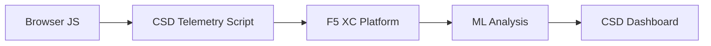

import { Aside } from "@astrojs/starlight/components";

F5 Distributed Cloud 클라이언트 측 방어(CSD)는 브라우저에서 직접 JavaScript 동작을 모니터링하여 웹 애플리케이션을 클라이언트 측 공격으로부터 보호합니다. F5 XC 로드 밸런서는 클라이언트에 제공되는 페이지에 CSD 원격 측정 스크립트를 삽입하도록 구성할 수 있습니다. 이 스크립트는 모든 JavaScript 활동을 관찰합니다. 즉, 어떤 스크립트가 로드되고, 어떤 양식 필드를 읽으며, 어떤 네트워크 연결을 만드는지를 감시합니다. 원격 측정 데이터는 F5 XC 플랫폼으로 전송되며, 여기서 기계 학습 모델이 스크립트 동작을 분석하고 위험 점수를 할당하며 이상을 표시합니다. 보안 팀은 CSD 콘솔에서 탐지 항목을 검토하고 스크립트 도메인을 허용하거나 완화하여 조치를 취합니다.

## 핵심 탐지 신호

CSD는 브라우저 측 동작의 세 가지 범주를 모니터링합니다.

| 신호 | CSD가 관찰하는 항목 | 예시 |
| --- | --- | --- |
| **양식 필드 읽기** | 어떤 스크립트가 페이지 로드 시점에 DOM에 존재하는 어떤 `input` 필드에 접근하는지 | `/login` 페이지의 `password` 필드를 읽는 `main.js` |
| **스크립트 인벤토리** | 각 페이지에 로드된 모든 자사 및 제3자 JavaScript, 소스 도메인별로 추적됨 | `cdn.jsdelivr.net`에서 로드되는 새로운 `<script>` 태그가 로그인 페이지에 나타남 |
| **네트워크 상호작용** | 스크립트 네트워크 활동에 관련된 도메인 — 스크립트 로드 소스 도메인 및 fetch/XHR 대상 도메인 모두 포함 | `esm.sh`에서 소싱된 스크립트 및 `www.httpbin.org`와 같은 데이터 반출 대상이 탐지된 도메인에 나타남 |

<Aside type="caution">
CSD의 네트워크 상호작용 신호는 주로 **스크립트 로드 소스 도메인**을 추적합니다. 그러나 fetch/XHR 대상 도메인도 `/detected_domains` API 및 대시보드 도메인 테이블에 나타납니다. CSD는 스크립트 로드만이 아닌 도메인 수준에서 네트워크 활동을 탐지합니다. 동작 제한 사항의 전체 목록은 [탐지 경계](#탐지-경계)를 참조하세요.
</Aside>

## 기능 매트릭스

| 기능 | 설명 | 콘솔 위치 |
| --- | --- | --- |
| **스크립트 위험 점수 지정** | 자동 분류: 위험 없음, 낮은 위험, 높은 위험 | 스크립트 목록 → 위험 수준 열 |
| **양식 필드 민감도** | 필드 유형 및 이름을 기반으로 필드를 민감(시스템 기준)으로 자동 분류 | 양식 필드 보기 → 분석 열 |
| **동작 타임라인** | 시간 경과에 따른 스크립트 위험 수준, 소스 도메인 및 유형의 차트 | 스크립트 상세 → 개요 → 시간 경과에 따른 동작 |
| **영향받은 사용자 속성** | IP, 지리적 위치, 브라우저 및 장치별로 영향받은 사용자 추적 | 스크립트 상세 → 영향받은 사용자 탭 |
| **도메인 허용 목록** | 신뢰할 수 있는 스크립트 도메인을 허용으로 표시 | 대시보드 → 도메인 행 → 허용 목록에 추가 |
| **도메인 완화 목록** | 특정 스크립트 도메인의 네트워크 호출 및 양식 필드 읽기를 차단하여 데이터 반출 방지 | 대시보드 → 도메인 행 → 완화 목록에 추가 |
| **경고 구성** | 새로운 도메인, 위험 변경, 의심스러운 동작에 대한 알림 | 알림 섹션 |
| **스크립트 정당화** | 스크립트가 인증된 이유를 설명하는 메모 추가(PCI DSS 준수) | 스크립트 상세 → 정당화 필드 |
| **트랜잭션 추적** | CSD가 활성인지 확인하는 월간 원격 측정 이벤트 카운터 | 대시보드 → 사용된 트랜잭션 카드 |
| **시간 및 위치 필터** | 시간 범위(24시간, 7일, 30일) 및 위치별로 모든 보기 필터링 | 상단 표시줄 필터 컨트롤 |

## 탐지 경계

CSD가 모니터링하지 **않는** 항목을 이해하는 것은 정확한 데모 기대치를 설정하기 위해 매우 중요합니다.

| 제한 사항 | 상세 | 확인됨 |
| --- | --- | --- |
| **동적으로 생성된 필드** | CSD는 페이지 로드 시 DOM에 존재하는 `input` 필드를 추적합니다. 로드 후 JavaScript에 의해 주입된 필드는 모니터링되지 않습니다. 스크립트에 의해 읽혀진 동적으로 생성된 `<input>`은 양식 필드 보기에 나타나지 않습니다. | 예 — 10분 대기 후 `/formFields`에서 필드 없음 |
| **코드 수준 난독화** | CSD는 동적 코드 실행 기법 또는 난독화 패턴을 별도의 탐지 신호로 표시하지 않습니다. 난독화된 수집기는 난독화되지 않은 것과 동일한 위험 수준을 생성합니다. CSD는 소스 코드 패턴이 아닌 동작 메타데이터를 추적합니다. | 예 — 두 기법 모두 동일한 "높은 위험" |
| **양식 오버레이 필드** | CSD는 페이지 로드 시 원본 DOM에 존재하는 양식 필드만 추적합니다. JavaScript에 의해 주입된 오버레이 양식(일반적인 디지털 스키밍 기법)은 추적되지 않습니다. 원본 필드의 읽기만 탐지됩니다. | 예 — 10분 대기 후 `/formFields`에서 오버레이 필드 없음 |
| **대시보드 카운터 동작** | "발견 및 완화" 및 "발견 및 허용" 요약 카운트는 관리자가 명시적으로 도메인을 완화 또는 허용 목록에 추가한 후에만 변경됩니다. "조치 필요" 및 "총 발견" 카운트는 새로운 도메인이 탐지될 때 자동으로 업데이트됩니다. | 예 — "발견 및 허용"이 0에서 1로 변경되었으며 이는 `/allowed_domains`에 대한 POST 후에만 발생 |

<Aside type="note" title="API와 콘솔 가시성">
`/detected_domains` API 엔드포인트는 자사 및 제3자 스크립트 소스 도메인을 포함한 모든 탐지된 도메인을 반환합니다. 자사 애플리케이션 도메인(예: `csd.bankexample.com`)은 제3자 CDN 도메인과 함께 탐지된 도메인 목록에 나타납니다. 자사 및 제3자 도메인 모두 대시보드 도메인 테이블에 나타납니다.

Fetch/XHR 대상 도메인(예: `fetch()`를 통해 연락된 `www.httpbin.org`)도 `/detected_domains` 응답에 나타납니다. CSD 플랫폼은 스크립트 로드 소스 도메인이 아님에도 불구하고 도메인 수준에서 이들을 추적합니다.
</Aside>

## PCI DSS v4.0 매핑

CSD는 결제 페이지 보안을 위한 두 가지 PCI DSS v4.0 요구 사항을 직접 해결합니다.

| PCI DSS 요구 사항 | 요구 사항 | CSD가 해결하는 방법 |
| --- | --- | --- |
| **6.4.3** — 결제 페이지의 스크립트 관리 | 모든 스크립트의 인벤토리 유지, 각각에 대한 서면 인증 및 정당화 제공, 스크립트 무결성 확인 | 스크립트 목록은 전체 인벤토리를 제공하고, 정당화 필드는 인증을 문서화하며, 동작 타임라인은 변경 사항을 추적합니다. |
| **11.6.1** — 결제 페이지의 변조 탐지 | HTTP 헤더 및 결제 페이지 콘텐츠의 무단 수정 탐지 | CSD 원격 측정은 새로운 스크립트 주입, 무단 양식 필드 읽기 및 새로운 네트워크 도메인을 탐지합니다. 페이지 동작 변경 사항을 경고합니다. |

<Aside type="tip">
**스크립트 정당화** 기능을 사용하여 각 스크립트가 결제 페이지에서 인증된 이유를 문서화하세요. 이는 PCI DSS 6.4.3 인증 요구 사항에 직접 매핑되는 감사 추적을 생성합니다.
</Aside>

## 위협 범위 매트릭스

다음 표는 일반적인 클라이언트 측 공격 범주를 각 공격 유형 중 발생하는 CSD 탐지 신호에 매핑합니다. **\***로 표시된 공격 유형은 [F5 공식 문서](https://www.f5.com/cloud/products/client-side-defense)에 의해 확인됩니다. 표시되지 않은 유형은 CSD의 탐지 신호 범주를 기반으로 추론되며 F5에서 명시적으로 주장하지 않을 수 있습니다.

| 공격 범주 | 설명 | 필드 읽기 | 스크립트 주입 | 네트워크 |
| --- | --- | --- | --- | --- |
| **Formjacking** \* | 악의적인 스크립트가 양식 필드 값을 읽고 반출 | 예 | — | 예 |
| **디지털 스키밍** \* | 오버레이 양식 또는 스크립트를 주입하여 결제 데이터 캡처 | 예 | 예 | 예 |
| **공급망 공격** \* | 손상된 제3자 라이브러리가 악의적인 코드 로드 | — | 예 | 예 |
| **데이터 반출** \* | 민감한 데이터를 읽고 외부 도메인으로 전송 | 예 | — | 예 |
| **스크립트 주입** \* | 페이지에 무단 `<script>` 태그 삽입 | — | 예 | 예 |
| **암호화폐 채굴** \* | 암호화폐 채굴 스크립트 주입 | — | 예 | 예 |
| **DOM 조작** | 페이지 요소를 주입 또는 수정하여 사용자 기만 | — | 예 | — |
| **Man-in-the-Browser** | 브라우저 세션 내에서 양식 데이터 가로채기 — [OWASP](https://owasp.org/www-community/attacks/Man-in-the-browser_attack) 및 [MITRE T1185](https://attack.mitre.org/techniques/T1185/) 참조 | 예 | — | 예 |
| **클릭재킹** | 보이지 않는 프레임을 오버레이하여 사용자 클릭 하이재킹 — [OWASP](https://owasp.org/www-community/attacks/Clickjacking) 참조 | — | 예 | — |
| **웹 스키머 지속성** | 페이지 탐색 전반에서 스키머 스크립트 재주입 — [Sansec Magecart 연구](https://sansec.io/what-is-magecart) 참조 | — | 예 | 예 |

<Aside type="note">
"네트워크" 탐지는 스크립트 로드 소스 도메인 및 fetch/XHR 대상 도메인을 모두 포함합니다. 둘 다 CSD `/detected_domains` API 및 대시보드 도메인 테이블에 나타납니다. 그러나 CSD 완화는 스크립트 로드(공급망 벡터)를 대상으로 하며 fetch/XHR 호출을 대상으로 하지 않습니다. 도메인을 완화하면 해당 도메인에서 `<script>` 태그 로드를 차단하지만 `fetch()` 또는 `XMLHttpRequest` 호출을 가로채지 않습니다.
</Aside>
