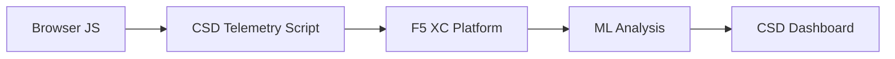

import { Aside } from "@astrojs/starlight/components";

F5 Distributed Cloud 클라이언트 측 방어(CSD)는 브라우저에서 직접 JavaScript 동작을 모니터링하여 웹 애플리케이션을 클라이언트 측 공격으로부터 보호합니다. F5 XC 로드 밸런서는 클라이언트에 제공되는 페이지에 CSD 텔레메트리 스크립트를 삽입하도록 구성할 수 있습니다. 이 스크립트는 모든 JavaScript 활동(어떤 스크립트가 로드되는지, 어떤 폼 필드를 읽는지, 어떤 네트워크 연결을 생성하는지)을 관찰합니다. 텔레메트리 데이터는 F5 XC 플랫폼으로 전송되며, 머신러닝 모델이 스크립트 동작을 분석하고 위험 점수를 부여하며 이상 징후를 표시합니다. 보안 팀은 CSD 콘솔에서 탐지 결과를 검토하고 스크립트 도메인을 허용하거나 완화하는 조치를 취합니다.

## 핵심 탐지 신호

CSD는 브라우저 측 동작의 세 가지 범주를 모니터링합니다:

| 신호 | CSD가 관찰하는 내용 | 예시 |
| --- | --- | --- |
| **폼 필드 읽기** | 페이지 로드 시 DOM에 존재하는 `input` 필드에 어떤 스크립트가 액세스하는지 | `/login`의 `password` 필드를 읽는 `main.js` |
| **스크립트 인벤토리** | 각 페이지에 로드된 모든 자사 및 서드파티 JavaScript를 소스 도메인별로 추적 | 로그인 페이지에 `cdn.jsdelivr.net`에서 로드되는 새 `<script>` 태그가 나타남 |
| **네트워크 상호작용** | 스크립트 네트워크 활동과 관련된 도메인 — 스크립트 로드 소스 도메인과 fetch/XHR 대상 도메인 모두 포함 | `esm.sh`에서 소싱된 스크립트와 탐지된 도메인에 나타나는 `www.httpbin.org`와 같은 데이터 유출 대상 |

<Aside type="caution">
CSD의 네트워크 상호작용 신호는 주로 **스크립트 로드 소스 도메인**을 추적합니다. 그러나 fetch/XHR 대상 도메인도 `/detected_domains` API 및 대시보드 도메인 테이블에 나타납니다 — CSD는 스크립트 로드뿐만 아니라 도메인 수준에서 네트워크 활동을 탐지합니다. 동작 제한의 전체 목록은 [탐지 경계](#detection-boundaries)를 참조하십시오.
</Aside>

## 기능 매트릭스

| 기능 | 설명 | 콘솔 위치 |
| --- | --- | --- |
| **스크립트 위험 점수** | 자동 분류: 위험 없음, 낮은 위험, 높은 위험 | Script List &rarr; Risk Level 열 |
| **폼 필드 민감도** | 필드 유형 및 이름을 기반으로 시스템이 자동으로 필드를 민감 항목으로 분류 | Form Fields 보기 &rarr; Analysis 열 |
| **동작 타임라인** | 시간에 따른 스크립트 위험 수준, 소스 도메인 및 유형을 차트로 표시 | Script detail &rarr; Overview &rarr; Behaviors Over Time |
| **영향받은 사용자 귀속** | IP, 지리적 위치, 브라우저 및 기기별로 영향받은 사용자 추적 | Script detail &rarr; Affected Users 탭 |
| **도메인 허용 목록** | 신뢰할 수 있는 스크립트 도메인을 허용됨으로 표시 | Dashboard &rarr; domain row &rarr; Add To Allow List |
| **도메인 완화 목록** | 특정 스크립트 도메인의 네트워크 호출 및 폼 필드 읽기를 차단하여 데이터 유출 방지 | Dashboard &rarr; domain row &rarr; Add To Mitigate List |
| **알림 구성** | 새 도메인, 위험 변경, 의심스러운 동작에 대한 알림 | Notifications 섹션 |
| **스크립트 정당성** | 스크립트가 승인된 이유를 설명하는 메모 추가 (PCI DSS 준수) | Script detail &rarr; Justification 필드 |
| **트랜잭션 추적** | CSD가 활성 상태임을 확인하는 월별 텔레메트리 이벤트 카운터 | Dashboard &rarr; Transactions Consumed 카드 |
| **시간 및 위치 필터** | 시간 범위(24h, 7d, 30d) 및 위치별로 모든 보기 필터링 | 상단 표시줄 필터 컨트롤 |

## 탐지 경계

CSD가 모니터링하지 **않는** 항목을 이해하는 것은 정확한 데모 기대치 설정에 매우 중요합니다:

| 제한 사항 | 세부 정보 | 확인됨 |
| --- | --- | --- |
| **동적으로 생성된 필드** | CSD는 페이지 로드 시 DOM에 존재하는 `input` 필드를 추적합니다. 로드 후 JavaScript에 의해 삽입된 필드는 모니터링되지 않습니다. 스크립트가 읽는 동적으로 생성된 `<input>`은 Form Fields 보기에 나타나지 않습니다. | 예 — 10분 대기 후 `/formFields`에서 필드 부재 확인 |
| **코드 수준 난독화** | CSD는 동적 코드 실행 기법이나 난독화 패턴을 별도의 탐지 신호로 표시하지 않습니다. 난독화된 수집기는 난독화되지 않은 것과 동일한 위험 수준을 생성합니다 — CSD는 소스 코드 패턴이 아닌 동작 메타데이터를 추적합니다. | 예 — 두 기법 모두 동일하게 "High Risk" |
| **폼 오버레이 필드** | CSD는 페이지 로드 시 원본 DOM에 있는 폼 필드만 추적합니다. JavaScript에 의해 삽입된 오버레이 폼(일반적인 디지털 스키밍 기법)은 추적되지 않으며 원본 필드 읽기만 탐지됩니다. | 예 — 10분 대기 후 `/formFields`에서 오버레이 필드 부재 확인 |
| **대시보드 카운터 동작** | "Found &amp; Mitigated" 및 "Found &amp; Allowed" 요약 카운트는 관리자가 도메인을 완화 또는 허용 목록에 명시적으로 추가한 후에만 변경됩니다. "Action Needed" 및 "Total Found" 카운트는 새 도메인이 탐지될 때 자동으로 업데이트됩니다. | 예 — "Found &amp; Allowed"는 `/allowed_domains`에 POST 후에만 0에서 1로 변경됨 |

<Aside type="note" title="API와 콘솔 가시성">
`/detected_domains` API 엔드포인트는 자사 및 서드파티 스크립트 소스 도메인을 모두 포함한 탐지된 모든 도메인을 반환합니다. 자사 애플리케이션 도메인(예: `csd.bankexample.com`)은 서드파티 CDN 도메인과 함께 탐지된 도메인 목록에 나타납니다. 자사 및 서드파티 도메인 모두 대시보드 도메인 테이블에 나타납니다.

Fetch/XHR 대상 도메인(예: `fetch()`를 통해 접촉된 `www.httpbin.org`)도 `/detected_domains` 응답에 나타납니다. CSD 플랫폼은 스크립트 로드 소스 도메인이 아니더라도 이를 도메인 수준에서 추적합니다.
</Aside>

## PCI DSS v4.0 매핑

CSD는 결제 페이지 보안을 위한 두 가지 PCI DSS v4.0 요구사항을 직접적으로 처리합니다:

| PCI DSS 요구사항 | 요구 내용 | CSD의 처리 방식 |
| --- | --- | --- |
| **6.4.3** — 결제 페이지의 스크립트 관리 | 모든 스크립트의 인벤토리 유지, 각 스크립트에 대한 서면 승인 및 정당성 제공, 스크립트 무결성 검증 | Script List는 전체 인벤토리를 제공; Justification 필드는 승인을 문서화; 동작 타임라인은 변경 사항 추적 |
| **11.6.1** — 결제 페이지의 변조 탐지 | HTTP 헤더 및 결제 페이지 콘텐츠에 대한 무단 수정 탐지 | CSD 텔레메트리는 새 스크립트 삽입, 무단 폼 필드 읽기 및 새 네트워크 도메인을 탐지하여 페이지 동작 변경에 대한 알림 제공 |

<Aside type="tip">
**스크립트 정당성** 기능을 사용하여 결제 페이지에서 각 스크립트가 승인된 이유를 문서화하십시오. 이를 통해 PCI DSS 6.4.3 승인 요구사항에 직접 매핑되는 감사 추적이 생성됩니다.
</Aside>

## 위협 커버리지 매트릭스

다음 표는 일반적인 클라이언트 측 공격 범주를 각 공격 유형 중에 발동될 CSD 탐지 신호에 매핑합니다. **\***로 표시된 공격 유형은 [F5 공식 문서](https://www.f5.com/cloud/products/client-side-defense)에 의해 확인된 것입니다. 표시되지 않은 유형은 CSD의 탐지 신호 범주를 기반으로 추론된 것으로 F5에서 명시적으로 주장하지 않을 수 있습니다.

| 공격 범주 | 설명 | 필드 읽기 | 스크립트 삽입 | 네트워크 |
| --- | --- | --- | --- | --- |
| **Formjacking** \* | 악성 스크립트가 폼 필드 값을 읽어 유출 | 예 | — | 예 |
| **디지털 스키밍** \* | 결제 데이터를 캡처하기 위한 오버레이 폼 또는 스크립트 삽입 | 예 | 예 | 예 |
| **공급망 공격** \* | 손상된 서드파티 라이브러리가 악성 코드 로드 | — | 예 | 예 |
| **데이터 유출** \* | 민감한 데이터를 읽어 외부 도메인으로 전송 | 예 | — | 예 |
| **스크립트 삽입** \* | 페이지에 무단 `<script>` 태그 삽입 | — | 예 | 예 |
| **크립토재킹** \* | 암호화폐 채굴 스크립트 삽입 | — | 예 | 예 |
| **DOM 조작** | 사용자를 기만하기 위한 페이지 요소 삽입 또는 수정 | — | 예 | — |
| **브라우저 내 중간자 공격** | 브라우저 세션 내에서 폼 데이터 가로채기 — [OWASP](https://owasp.org/www-community/attacks/Man-in-the-browser_attack) 및 [MITRE T1185](https://attack.mitre.org/techniques/T1185/) 참조 | 예 | — | 예 |
| **클릭재킹** | 사용자 클릭을 탈취하기 위한 보이지 않는 프레임 오버레이 — [OWASP](https://owasp.org/www-community/attacks/Clickjacking) 참조 | — | 예 | — |
| **웹 스키머 지속성** | 페이지 탐색 전반에 걸쳐 스키머 스크립트 재삽입 — [Sansec Magecart Research](https://sansec.io/what-is-magecart) 참조 | — | 예 | 예 |

<Aside type="note">
"네트워크" 탐지는 스크립트 로드 소스 도메인과 fetch/XHR 대상 도메인 모두를 포함합니다 — 두 가지 모두 CSD `/detected_domains` API 및 대시보드 도메인 테이블에 나타납니다. 그러나 CSD 완화는 스크립트 로딩(공급망 벡터)을 대상으로 하며, fetch/XHR 호출은 대상으로 하지 않습니다. 도메인을 완화하면 해당 도메인에서의 `<script>` 태그 로드는 차단되지만, 해당 도메인으로의 `fetch()` 또는 `XMLHttpRequest` 호출은 가로채지 않습니다.
</Aside>
