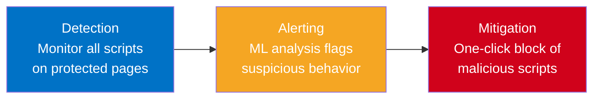

import { Aside, Steps } from "@astrojs/starlight/components";

## The Client-Side Threat Landscape

Modern web applications rely on dozens of third-party scripts — analytics, tag managers, payment processors, chat widgets, and more. Each script is a potential entry point for attackers.

**Formjacking** and **Magecart-style attacks** inject malicious JavaScript into web pages to skim credit card numbers, credentials, and personal data directly from the browser. These attacks are invisible to traditional server-side security controls because the malicious code executes entirely in the end user's browser.

Real-world impact:

- **British Airways** — 380,000 payment cards stolen via a modified checkout script
- **Ticketmaster** — Customer payment data exfiltrated through a compromised third-party chat widget
- **PCI DSS 4.0 (Requirement 6.4.3)** — Now mandates monitoring and authorization of all scripts on payment pages

<Aside type="tip" title="Talking Point">
Ask the customer: "How many third-party scripts run on your checkout page? Do you know what each one does?" Most organizations cannot answer this question — which is exactly the problem CSD solves.
</Aside>

## What is Client-Side Defense?

F5 Distributed Cloud **Client-Side Defense (CSD)** is a browser-side monitoring and mitigation service that protects web applications against client-side attacks. CSD works by:

1. **Injecting a lightweight monitoring script** into protected web pages
2. **Analyzing all JavaScript activity** in the browser using machine learning
3. **Alerting and mitigating** suspicious behavior with a single click

CSD provides visibility into every script running on your pages — including scripts loaded dynamically by other scripts — and uses ML-based analysis to detect anomalous behavior such as unauthorized data exfiltration.

## How It Works

CSD follows a three-phase model:

| Phase | What Happens |
| --- | --- |
| **Detection** | The CSD JavaScript monitors all scripts executing in the browser and reports back to the F5 XC platform |
| **Alerting** | Machine learning models analyze script behavior, network connections, and data flow patterns to flag suspicious activity |
| **Mitigation** | Security teams review alerts and can block malicious scripts with a single click — no code changes or deployments required |

## Key Capabilities

- **Script Inventory** — Complete visibility into every script running on protected pages, including dynamically loaded scripts
- **Suspicious Domain Detection** — ML-based identification of domains involved in data exfiltration or unauthorized communication
- **Network Visualization** — Interactive graph showing relationships between scripts, domains, and data flows
- **One-Click Mitigation** — Block malicious scripts instantly without application changes
- **PCI DSS 6.4.3 Compliance** — Continuous monitoring and authorization of payment page scripts
- **Email Alerts** — Configurable notifications when new suspicious activity is detected

## Demo Scenario

In this sales demo, you will use an **OWASP Juice Shop** instance — a deliberately vulnerable e-commerce application — to demonstrate CSD's capabilities. You will:

<Steps>
1. Explore the demo application and identify its attack surface
2. Enable CSD protection in the F5 XC Console
3. Review detected scripts and suspicious domains on the CSD dashboard
4. Walk through the network visualization and alert configuration
5. Demonstrate one-click mitigation of a suspicious script
</Steps>

<Aside type="note">
This demo uses a pre-configured environment. The Juice Shop application and CSD configuration are already deployed — you just need console access to walk through the demo flow.
</Aside>
