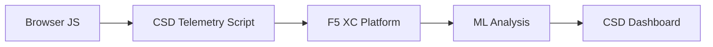

import { Aside } from "@astrojs/starlight/components";

## How CSD Works

F5 Distributed Cloud Client-Side Defense (CSD) protects web applications from client-side attacks by monitoring JavaScript behavior directly in the browser. The F5 XC load balancer injects a telemetry script into every page served to the client. This script observes all JavaScript activity — which scripts load, which form fields they read, and which network connections they make. Telemetry data is sent to the F5 XC platform where machine learning models analyze script behavior, assign risk scores, and flag anomalies. Security teams review detections in the CSD console and take action by allowing or mitigating script domains.

## Core Detection Signals

CSD monitors three categories of browser-side behavior:

| Signal | What CSD Observes | Example |
| --- | --- | --- |
| **Form field reads** | Which scripts access which `input` fields present in the page DOM at load time | `main.js` reading the `password` field on `/login` |
| **Script inventory** | All first-party and third-party JavaScript loaded on each page, tracked by source domain | A new `<script>` tag loading from `cdn.jsdelivr.net` appearing on the login page |
| **Network interactions** | Domains that scripts load resources from (script source domains) | Scripts sourced from `cdnjs.cloudflare.com` appearing in the Network view |

<Aside type="caution">
CSD tracks **script-load source domains** in the Network view — not fetch/XHR destination domains. If a script sends data via `fetch()` to `evil.com`, that domain does not appear in the Network view. See [Detection Boundaries](#detection-boundaries) for the full list of limitations.
</Aside>

## Feature Matrix

| Feature | Description | Console Location |
| --- | --- | --- |
| **Script risk scoring** | Automatic classification: No Risk, Low Risk, High Risk | Script List &rarr; Risk Level column |
| **Form field sensitivity** | Auto-classifies fields as Sensitive (by system) based on field type and name | Form Fields view &rarr; Analysis column |
| **Behavior timeline** | Charts script risk level, source domain, and type over time | Script detail &rarr; Overview &rarr; Behaviors Over Time |
| **Affected user attribution** | Tracks impacted users by IP, geolocation, browser, and device | Script detail &rarr; Affected Users tab |
| **Domain allow list** | Mark trusted script domains as allowed | Dashboard &rarr; domain row &rarr; Add To Allow List |
| **Domain mitigate list** | Block scripts from specific domains on next page load | Dashboard &rarr; domain row &rarr; Add To Mitigate List |
| **Alert configuration** | Notifications for new domains, risk changes, suspicious behavior | Notifications section |
| **Script justification** | Add notes explaining why a script is authorized (PCI DSS compliance) | Script detail &rarr; Justification field |
| **Transaction tracking** | Monthly telemetry event counter confirming CSD is active | Dashboard &rarr; Transactions Consumed card |
| **Time and location filters** | Filter all views by time range (24h, 7d, 30d) and location | Top bar filter controls |

## Detection Boundaries

Understanding what CSD does **not** monitor is critical for setting accurate demo expectations:

| Limitation | Detail |
| --- | --- |
| **Dynamically created fields** | CSD only tracks `input` fields present in the DOM at page load. Fields injected by JavaScript after load are not monitored. |
| **Fetch/XHR destinations** | The Network view shows script-load source domains only. Domains contacted via `fetch()`, `XMLHttpRequest`, or image beacons do not appear. |
| **Code-level patterns** | CSD does not flag `eval()`, `Function()`, or other obfuscation techniques as separate detection signals. |
| **Dashboard counters** | Summary cards (Action Needed, Found &amp; Mitigated, etc.) only increment after an admin actions a domain. New detections appear in the Script List first. |
| **First-party script domains** | The Dashboard domain table tracks third-party script domains only. High-risk first-party scripts appear in the Script List but not on the Dashboard. |

## PCI DSS v4.0 Mapping

CSD directly addresses two PCI DSS v4.0 requirements for payment page security:

| PCI DSS Requirement | What It Requires | How CSD Addresses It |
| --- | --- | --- |
| **6.4.3** — Script management on payment pages | Maintain an inventory of all scripts, provide written authorization and justification for each, verify script integrity | Script List provides full inventory; Justification field documents authorization; behavior timeline tracks changes |
| **11.6.1** — Tamper detection on payment pages | Detect unauthorized modifications to HTTP headers and payment page content | CSD telemetry detects new script injections, unauthorized form field reads, and new network domains — alerting on changes to page behavior |

<Aside type="tip">
Use the **Script justification** feature to document why each script is authorized on payment pages. This creates an audit trail that maps directly to PCI DSS 6.4.3 authorization requirements.
</Aside>

## Threat Coverage Matrix

The following table maps common client-side attack categories to the CSD detection signals that would fire during each attack type:

| Attack Category | Description | Field Reads | Script Injection | Network |
| --- | --- | --- | --- | --- |
| **Formjacking** | Malicious script reads form field values and exfiltrates them | Yes | — | Yes |
| **Digital skimming** | Injects overlay forms or scripts to capture payment data | Yes | Yes | Yes |
| **Supply chain attack** | Compromised third-party library loads malicious code | — | Yes | Yes |
| **DOM manipulation** | Injects or modifies page elements to deceive users | — | Yes | — |
| **Data exfiltration** | Reads sensitive data and sends it to external domains | Yes | — | Yes |
| **Script injection** | Inserts unauthorized `<script>` tags into the page | — | Yes | Yes |
| **Man-in-the-Browser** | Intercepts form data within the browser session | Yes | — | Yes |
| **Cryptojacking** | Injects cryptocurrency mining scripts | — | Yes | Yes |
| **Clickjacking** | Overlays invisible frames to hijack user clicks | — | Yes | — |
| **Web skimmer persistence** | Re-injects skimmer scripts across page navigations | — | Yes | Yes |

<Aside type="note">
"Network" detection depends on whether the attack loads scripts from external domains. Exfiltration via `fetch()` or image beacons to external domains is **not** visible in the CSD Network view — only script-load source domains are tracked.
</Aside>
