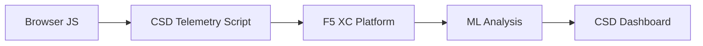

import { Aside } from "@astrojs/starlight/components";

F5 Distributed Cloud Client-Side Defense (CSD) protects web applications from client-side attacks by monitoring JavaScript behavior directly in the browser. The F5 XC load balancer can be configured to inject the CSD telemetry script into pages served to the client. This script observes all JavaScript activity — which scripts load, which form fields they read, and which network connections they make. Telemetry data is sent to the F5 XC platform where machine learning models analyze script behavior, assign risk scores, and flag anomalies. Security teams review detections in the CSD console and take action by allowing or mitigating script domains.

## Core Detection Signals

CSD monitors three categories of browser-side behavior:

| Signal | What CSD Observes | Example |
| --- | --- | --- |
| **Form field reads** | Which scripts access which `input` fields present in the page DOM at load time | `main.js` reading the `password` field on `/login` |
| **Script inventory** | All first-party and third-party JavaScript loaded on each page, tracked by source domain | A new `<script>` tag loading from `cdn.jsdelivr.net` appearing on the login page |
| **Network interactions** | Domains involved in script network activity — includes both script-load source domains and fetch/XHR destination domains | Scripts sourced from `esm.sh` and data exfiltration targets like `www.httpbin.org` appearing in detected domains |

<Aside type="caution">
CSD's Network interactions signal primarily tracks **script-load source domains**. However, fetch/XHR destination domains also appear in the `/detected_domains` API and Dashboard domain table — CSD detects network activity at the domain level, not just script loads. See [Detection Boundaries](#detection-boundaries) for the full list of behavioral limitations.
</Aside>

## Feature Matrix

| Feature | Description | Console Location |
| --- | --- | --- |
| **Script risk scoring** | Automatic classification: No Risk, Low Risk, High Risk | Script List &rarr; Risk Level column |
| **Form field sensitivity** | Auto-classifies fields as Sensitive (by system) based on field type and name | Form Fields view &rarr; Analysis column |
| **Behavior timeline** | Charts script risk level, source domain, and type over time | Script detail &rarr; Overview &rarr; Behaviors Over Time |
| **Affected user attribution** | Tracks impacted users by IP, geolocation, browser, and device | Script detail &rarr; Affected Users tab |
| **Domain allow list** | Mark trusted script domains as allowed | Dashboard &rarr; domain row &rarr; Add To Allow List |
| **Domain mitigate list** | Block network calls and form field reads from specific script domains, preventing data exfiltration | Dashboard &rarr; domain row &rarr; Add To Mitigate List |
| **Alert configuration** | Notifications for new domains, risk changes, suspicious behavior | Notifications section |
| **Script justification** | Add notes explaining why a script is authorized (PCI DSS compliance) | Script detail &rarr; Justification field |
| **Transaction tracking** | Monthly telemetry event counter confirming CSD is active | Dashboard &rarr; Transactions Consumed card |
| **Time and location filters** | Filter all views by time range (24h, 7d, 30d) and location | Top bar filter controls |

## Detection Boundaries

Understanding what CSD does **not** monitor is critical for setting accurate demo expectations:

| Limitation | Detail | Verified |
| --- | --- | --- |
| **Dynamically created fields** | CSD tracks `input` fields present in the DOM at page load. Fields injected by JavaScript after load are not monitored. A dynamically created `<input>` read by a script does not appear in the Form Fields view. | Yes — field absent from `/formFields` after 10-minute wait |
| **Code-level obfuscation** | CSD does not flag dynamic code execution techniques or obfuscation patterns as separate detection signals. Obfuscated harvesters produce the same risk level as non-obfuscated ones — CSD tracks behavioral metadata, not source code patterns. | Yes — identical "High Risk" for both techniques |
| **Form overlay fields** | CSD tracks only form fields present in the original DOM at page load. Overlay forms injected by JavaScript (a common digital skimming technique) are not tracked — only reads of the original fields are detected. | Yes — overlay fields absent from `/formFields` after 10-minute wait |
| **Dashboard counter behavior** | The "Found &amp; Mitigated" and "Found &amp; Allowed" summary counts only change after an admin explicitly adds a domain to the mitigate or allow list. The "Action Needed" and "Total Found" counts update automatically when new domains are detected. | Yes — "Found &amp; Allowed" changed from 0 to 1 only after POST to `/allowed_domains` |

<Aside type="note" title="API vs Console visibility">
The `/detected_domains` API endpoint returns all detected domains including both first-party and third-party script source domains. The first-party application domain (e.g., `csd.bankexample.com`) appears in the detected domains list alongside third-party CDN domains. Both first-party and third-party domains appear in the Dashboard domain table.

Fetch/XHR destination domains (e.g., `www.httpbin.org` contacted via `fetch()`) also appear in the `/detected_domains` response. The CSD platform tracks these at the domain level even though they are not script-load source domains.
</Aside>

## PCI DSS v4.0 Mapping

CSD directly addresses two PCI DSS v4.0 requirements for payment page security:

| PCI DSS Requirement | What It Requires | How CSD Addresses It |
| --- | --- | --- |
| **6.4.3** — Script management on payment pages | Maintain an inventory of all scripts, provide written authorization and justification for each, verify script integrity | Script List provides full inventory; Justification field documents authorization; behavior timeline tracks changes |
| **11.6.1** — Tamper detection on payment pages | Detect unauthorized modifications to HTTP headers and payment page content | CSD telemetry detects new script injections, unauthorized form field reads, and new network domains — alerting on changes to page behavior |

<Aside type="tip">
Use the **Script justification** feature to document why each script is authorized on payment pages. This creates an audit trail that maps directly to PCI DSS 6.4.3 authorization requirements.
</Aside>

## Threat Coverage Matrix

The following table maps common client-side attack categories to the CSD detection signals that would fire during each attack type. Attack types marked with **\*** are confirmed by [F5 official documentation](https://www.f5.com/cloud/products/client-side-defense). Unmarked types are inferred based on CSD's detection signal categories and may not be explicitly claimed by F5.

| Attack Category | Description | Field Reads | Script Injection | Network |
| --- | --- | --- | --- | --- |
| **Formjacking** \* | Malicious script reads form field values and exfiltrates them | Yes | — | Yes |
| **Digital skimming** \* | Injects overlay forms or scripts to capture payment data | Yes | Yes | Yes |
| **Supply chain attack** \* | Compromised third-party library loads malicious code | — | Yes | Yes |
| **Data exfiltration** \* | Reads sensitive data and sends it to external domains | Yes | — | Yes |
| **Script injection** \* | Inserts unauthorized `<script>` tags into the page | — | Yes | Yes |
| **Cryptojacking** \* | Injects cryptocurrency mining scripts | — | Yes | Yes |
| **DOM manipulation** | Injects or modifies page elements to deceive users | — | Yes | — |
| **Man-in-the-Browser** | Intercepts form data within the browser session — see [OWASP](https://owasp.org/www-community/attacks/Man-in-the-browser_attack) and [MITRE T1185](https://attack.mitre.org/techniques/T1185/) | Yes | — | Yes |
| **Clickjacking** | Overlays invisible frames to hijack user clicks — see [OWASP](https://owasp.org/www-community/attacks/Clickjacking) | — | Yes | — |
| **Web skimmer persistence** | Re-injects skimmer scripts across page navigations — see [Sansec Magecart Research](https://sansec.io/what-is-magecart) | — | Yes | Yes |

<Aside type="note">
"Network" detection covers both script-load source domains and fetch/XHR destination domains — both appear in the CSD `/detected_domains` API and Dashboard domain table. However, CSD mitigation targets script loading (the supply-chain vector), not fetch/XHR calls. Mitigating a domain blocks `<script>` tag loads from that domain but does not intercept `fetch()` or `XMLHttpRequest` calls to it.
</Aside>
