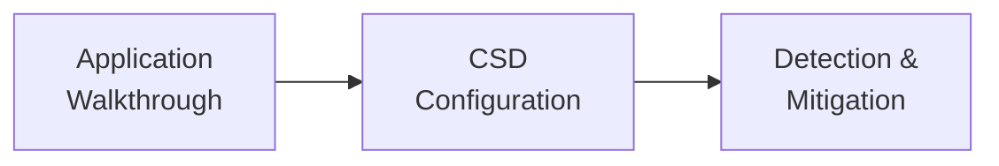

import { Steps } from "@astrojs/starlight/components";

This guide walks through a Client-Side Defense (CSD) demonstration using a Juice Shop e-commerce application as the protected site. CSD is already enabled on the demo environment.

## Demo Flow

<Steps>
1. Open the demo application and review pages with form inputs
2. Navigate CSD configuration in the XC Console
3. Review the script inventory and dashboard
4. Inspect suspicious domains and network visualization
5. Mitigate a flagged script
</Steps>

## Demo Environment

| Component | Detail |
| --- | --- |
| **Demo application** | Juice Shop at `https://botdemo.sales-demo.f5demos.com` |
| **CSD status** | Pre-configured and monitoring all pages |
| **Console** | F5 Distributed Cloud Console with CSD permissions |
