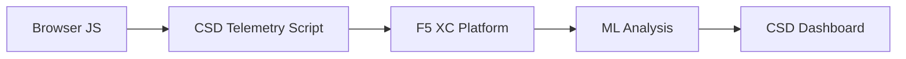

import { Aside } from "@astrojs/starlight/components";

F5 Distributed Cloud Client-Side Defense (CSD) protege aplicações web de ataques do lado do cliente monitorando o comportamento do JavaScript diretamente no navegador. O balanceador de carga F5 XC pode ser configurado para injetar o script de telemetria CSD em páginas servidas ao cliente. Este script observa toda atividade de JavaScript — quais scripts carregam, quais campos de formulário eles leem e quais conexões de rede estabelecem. Os dados de telemetria são enviados à plataforma F5 XC, onde modelos de aprendizado de máquina analisam o comportamento dos scripts, atribuem pontuações de risco e sinalizam anomalias. Os times de segurança analisam as detecções no console CSD e tomam ações permitindo ou mitigando domínios de scripts.

## Sinais Principais de Detecção

O CSD monitora três categorias de comportamento do lado do navegador:

| Sinal | O que o CSD Observa | Exemplo |
| --- | --- | --- |
| **Leitura de campos de formulário** | Quais scripts acessam quais campos `input` presentes no DOM da página no momento do carregamento | `main.js` lendo o campo `password` em `/login` |
| **Inventário de scripts** | Todos os JavaScript first-party e third-party carregados em cada página, rastreados por domínio de origem | Uma nova tag `<script>` carregando de `cdn.jsdelivr.net` aparecendo na página de login |
| **Interações de rede** | Domínios envolvidos na atividade de rede dos scripts — inclui tanto domínios de origem de carregamento de scripts quanto domínios de destino de fetch/XHR | Scripts obtidos de `esm.sh` e destinos de exfiltração de dados como `www.httpbin.org` aparecendo nos domínios detectados |

<Aside type="caution">
O sinal de interações de rede do CSD rastreia principalmente **domínios de origem de carregamento de scripts**. Porém, domínios de destino de fetch/XHR também aparecem na API `/detected_domains` e na tabela de domínios do Dashboard — o CSD detecta atividade de rede no nível de domínio, não apenas carregamentos de scripts. Veja [Limites de Detecção](#limites-de-detecção) para a lista completa de limitações comportamentais.
</Aside>

## Matriz de Recursos

| Recurso | Descrição | Localização no Console |
| --- | --- | --- |
| **Pontuação de risco de script** | Classificação automática: Sem Risco, Risco Baixo, Risco Alto | Lista de Scripts &rarr; coluna Nível de Risco |
| **Sensibilidade de campo de formulário** | Classifica automaticamente campos como Sensíveis (pelo sistema) com base no tipo e nome do campo | Visualização de Campos de Formulário &rarr; coluna Análise |
| **Linha do tempo de comportamento** | Gráficos do nível de risco do script, domínio de origem e tipo ao longo do tempo | Detalhe do Script &rarr; Visão Geral &rarr; Comportamentos ao Longo do Tempo |
| **Atribuição de usuário afetado** | Rastreia usuários impactados por IP, geolocalização, navegador e dispositivo | Detalhe do Script &rarr; aba Usuários Afetados |
| **Lista de permissão de domínio** | Marca domínios de script confiáveis como permitidos | Dashboard &rarr; linha de domínio &rarr; Adicionar à Lista de Permissão |
| **Lista de mitigação de domínio** | Bloqueia chamadas de rede e leituras de campos de formulário de domínios de script específicos, prevenindo exfiltração de dados | Dashboard &rarr; linha de domínio &rarr; Adicionar à Lista de Mitigação |
| **Configuração de alerta** | Notificações para novos domínios, mudanças de risco, comportamento suspeito | Seção Notificações |
| **Justificação de script** | Adiciona notas explicando por que um script é autorizado (conformidade com PCI DSS) | Detalhe do Script &rarr; campo Justificação |
| **Rastreamento de transação** | Contador mensal de eventos de telemetria confirmando que o CSD está ativo | Dashboard &rarr; cartão Transações Consumidas |
| **Filtros de tempo e localização** | Filtra todas as visualizações por intervalo de tempo (24h, 7d, 30d) e localização | Controles de filtro da barra superior |

## Limites de Detecção

Entender o que o CSD **não** monitora é crítico para definir expectativas precisas de demonstração:

| Limitação | Detalhe | Verificado |
| --- | --- | --- |
| **Campos criados dinamicamente** | O CSD rastreia campos `input` presentes no DOM no carregamento da página. Campos injetados por JavaScript após o carregamento não são monitorados. Um `<input>` criado dinamicamente e lido por um script não aparece na visualização de Campos de Formulário. | Sim — campo ausente de `/formFields` após espera de 10 minutos |
| **Ofuscação no nível do código** | O CSD não sinaliza técnicas de execução de código dinâmico ou padrões de ofuscação como sinais de detecção separados. Coletores ofuscados produzem o mesmo nível de risco que não ofuscados — o CSD rastreia metadados comportamentais, não padrões de código-fonte. | Sim — "Risco Alto" idêntico para ambas as técnicas |
| **Campos de formulário em overlay** | O CSD rastreia apenas campos de formulário presentes no DOM original no carregamento da página. Formulários em overlay injetados por JavaScript (uma técnica comum de digital skimming) não são rastreados — apenas leituras dos campos originais são detectadas. | Sim — campos de overlay ausentes de `/formFields` após espera de 10 minutos |
| **Comportamento do contador do Dashboard** | As contagens de resumo "Encontrado &amp; Mitigado" e "Encontrado &amp; Permitido" só mudam após um administrador adicionar explicitamente um domínio à lista de mitigação ou permissão. As contagens "Ação Necessária" e "Total Encontrado" são atualizadas automaticamente quando novos domínios são detectados. | Sim — "Encontrado &amp; Permitido" mudou de 0 para 1 apenas após POST para `/allowed_domains` |

<Aside type="note" title="Visibilidade da API vs Console">
O endpoint da API `/detected_domains` retorna todos os domínios detectados, incluindo domínios de origem de scripts first-party e third-party. O domínio da aplicação first-party (por exemplo, `csd.bankexample.com`) aparece na lista de domínios detectados junto com domínios CDN third-party. Tanto domínios first-party quanto third-party aparecem na tabela de domínios do Dashboard.

Domínios de destino de fetch/XHR (por exemplo, `www.httpbin.org` contatado via `fetch()`) também aparecem na resposta `/detected_domains`. A plataforma CSD rastreia esses no nível de domínio, mesmo que não sejam domínios de origem de carregamento de scripts.
</Aside>

## Mapeamento do PCI DSS v4.0

O CSD atende diretamente a dois requisitos do PCI DSS v4.0 para segurança de página de pagamento:

| Requisito do PCI DSS | O que Exige | Como o CSD Atende |
| --- | --- | --- |
| **6.4.3** — Gerenciamento de scripts em páginas de pagamento | Manter um inventário de todos os scripts, fornecer autorização escrita e justificativa para cada um, verificar integridade do script | Lista de Scripts fornece inventário completo; campo Justificação documenta autorização; linha do tempo de comportamento rastreia alterações |
| **11.6.1** — Detecção de tamper em páginas de pagamento | Detectar modificações não autorizadas em headers HTTP e conteúdo de página de pagamento | A telemetria CSD detecta injeções de novo script, leituras não autorizadas de campos de formulário e novos domínios de rede — alertando sobre alterações no comportamento da página |

<Aside type="tip">
Use o recurso de **justificação de script** para documentar por que cada script é autorizado em páginas de pagamento. Isso cria uma trilha de auditoria que mapeia diretamente aos requisitos de autorização do PCI DSS 6.4.3.
</Aside>

## Matriz de Cobertura de Ameaças

A tabela a seguir mapeia categorias de ataque comuns do lado do cliente para os sinais de detecção CSD que acionariam durante cada tipo de ataque. Tipos de ataque marcados com **\*** são confirmados pela [documentação oficial do F5](https://www.f5.com/cloud/products/client-side-defense). Tipos não marcados são inferidos com base nas categorias de sinais de detecção do CSD e podem não ser explicitamente reivindicados pelo F5.

| Categoria de Ataque | Descrição | Leituras de Campo | Injeção de Script | Rede |
| --- | --- | --- | --- | --- |
| **Formjacking** \* | Script malicioso lê valores de campo de formulário e os exfiltra | Sim | — | Sim |
| **Digital skimming** \* | Injeta formulários em overlay ou scripts para capturar dados de pagamento | Sim | Sim | Sim |
| **Ataque na cadeia de suprimentos** \* | Biblioteca third-party comprometida carrega código malicioso | — | Sim | Sim |
| **Exfiltração de dados** \* | Lê dados sensíveis e os envia para domínios externos | Sim | — | Sim |
| **Injeção de script** \* | Insere tags `<script>` não autorizadas na página | — | Sim | Sim |
| **Cryptojacking** \* | Injeta scripts de mineração de criptomoedas | — | Sim | Sim |
| **Manipulação de DOM** | Injeta ou modifica elementos da página para enganar usuários | — | Sim | — |
| **Man-in-the-Browser** | Intercepta dados de formulário dentro da sessão do navegador — veja [OWASP](https://owasp.org/www-community/attacks/Man-in-the-browser_attack) e [MITRE T1185](https://attack.mitre.org/techniques/T1185/) | Sim | — | Sim |
| **Clickjacking** | Sobrepõe frames invisíveis para sequestrar cliques do usuário — veja [OWASP](https://owasp.org/www-community/attacks/Clickjacking) | — | Sim | — |
| **Persistência de web skimmer** | Reinjecta scripts de skimmer em navegações de página — veja [Sansec Magecart Research](https://sansec.io/what-is-magecart) | — | Sim | Sim |

<Aside type="note">
A detecção de "Rede" cobre tanto domínios de origem de carregamento de scripts quanto domínios de destino de fetch/XHR — ambos aparecem na API `/detected_domains` do CSD e na tabela de domínios do Dashboard. Porém, a mitigação CSD visa o carregamento de scripts (o vetor da cadeia de suprimentos), não chamadas fetch/XHR. Mitigar um domínio bloqueia carregamentos de tag `<script>` desse domínio, mas não intercepta chamadas `fetch()` ou `XMLHttpRequest` para ele.
</Aside>
