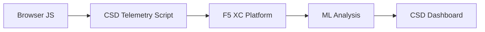

import { Aside } from "@astrojs/starlight/components";

O F5 Distributed Cloud Client-Side Defense (CSD) protege aplicações web contra ataques do lado do cliente monitorando o comportamento do JavaScript diretamente no navegador. O balanceador de carga do F5 XC pode ser configurado para injetar o script de telemetria do CSD nas páginas entregues ao cliente. Esse script observa toda a atividade JavaScript — quais scripts são carregados, quais campos de formulário eles leem e quais conexões de rede estabelecem. Os dados de telemetria são enviados à plataforma F5 XC, onde modelos de aprendizado de máquina analisam o comportamento dos scripts, atribuem pontuações de risco e sinalizam anomalias. As equipes de segurança revisam as detecções no console do CSD e tomam ação permitindo ou mitigando domínios de scripts.

## Sinais de Detecção Principais

O CSD monitora três categorias de comportamento do lado do navegador:

| Sinal | O que o CSD Observa | Exemplo |
| --- | --- | --- |
| **Leituras de campos de formulário** | Quais scripts acessam quais campos `input` presentes no DOM da página no momento do carregamento | `main.js` lendo o campo `password` em `/login` |
| **Inventário de scripts** | Todos os JavaScript de primeira e terceira partes carregados em cada página, rastreados por domínio de origem | Uma nova tag `<script>` carregando de `cdn.jsdelivr.net` aparecendo na página de login |
| **Interações de rede** | Domínios envolvidos na atividade de rede dos scripts — inclui tanto domínios de origem do carregamento de scripts quanto domínios de destino de fetch/XHR | Scripts originados de `esm.sh` e alvos de exfiltração de dados como `www.httpbin.org` aparecendo nos domínios detectados |

<Aside type="caution">
O sinal de Interações de rede do CSD rastreia principalmente **domínios de origem do carregamento de scripts**. No entanto, domínios de destino de fetch/XHR também aparecem na API `/detected_domains` e na tabela de domínios do Dashboard — o CSD detecta a atividade de rede no nível do domínio, não apenas os carregamentos de scripts. Consulte [Limites de Detecção](#detection-boundaries) para a lista completa de limitações comportamentais.
</Aside>

## Matriz de Funcionalidades

| Funcionalidade | Descrição | Localização no Console |
| --- | --- | --- |
| **Pontuação de risco de scripts** | Classificação automática: Sem Risco, Baixo Risco, Alto Risco | Lista de Scripts &rarr; coluna Nível de Risco |
| **Sensibilidade de campos de formulário** | Classifica automaticamente campos como Sensíveis (pelo sistema) com base no tipo e nome do campo | Visualização de Campos de Formulário &rarr; coluna Análise |
| **Linha do tempo de comportamento** | Exibe o nível de risco, domínio de origem e tipo do script ao longo do tempo | Detalhe do script &rarr; Visão Geral &rarr; Comportamentos ao Longo do Tempo |
| **Atribuição de usuários afetados** | Rastreia usuários impactados por IP, geolocalização, navegador e dispositivo | Detalhe do script &rarr; aba Usuários Afetados |
| **Lista de permissão de domínios** | Marcar domínios de scripts confiáveis como permitidos | Dashboard &rarr; linha do domínio &rarr; Adicionar à Lista de Permissão |
| **Lista de mitigação de domínios** | Bloquear chamadas de rede e leituras de campos de formulário de domínios de scripts específicos, impedindo a exfiltração de dados | Dashboard &rarr; linha do domínio &rarr; Adicionar à Lista de Mitigação |
| **Configuração de alertas** | Notificações para novos domínios, mudanças de risco e comportamentos suspeitos | Seção de Notificações |
| **Justificativa de script** | Adicionar notas explicando por que um script está autorizado (conformidade com PCI DSS) | Detalhe do script &rarr; campo Justificativa |
| **Rastreamento de transações** | Contador mensal de eventos de telemetria confirmando que o CSD está ativo | Dashboard &rarr; card Transações Consumidas |
| **Filtros de tempo e localização** | Filtrar todas as visualizações por intervalo de tempo (24h, 7d, 30d) e localização | Controles de filtro na barra superior |

## Limites de Detecção

Entender o que o CSD **não** monitora é fundamental para definir expectativas precisas em demonstrações:

| Limitação | Detalhes | Verificado |
| --- | --- | --- |
| **Campos criados dinamicamente** | O CSD rastreia campos `input` presentes no DOM no momento do carregamento da página. Campos injetados por JavaScript após o carregamento não são monitorados. Um `<input>` criado dinamicamente e lido por um script não aparece na visualização de Campos de Formulário. | Sim — campo ausente em `/formFields` após 10 minutos de espera |
| **Ofuscação no nível do código** | O CSD não sinaliza técnicas de execução dinâmica de código ou padrões de ofuscação como sinais de detecção separados. Coletores ofuscados produzem o mesmo nível de risco que os não ofuscados — o CSD rastreia metadados comportamentais, não padrões de código-fonte. | Sim — "Alto Risco" idêntico para ambas as técnicas |
| **Campos de formulários sobrepostos** | O CSD rastreia apenas campos de formulário presentes no DOM original no momento do carregamento da página. Formulários sobrepostos injetados por JavaScript (uma técnica comum de skimming digital) não são rastreados — apenas leituras dos campos originais são detectadas. | Sim — campos sobrepostos ausentes em `/formFields` após 10 minutos de espera |
| **Comportamento do contador do Dashboard** | As contagens resumidas "Encontrado &amp; Mitigado" e "Encontrado &amp; Permitido" só mudam após um administrador adicionar explicitamente um domínio à lista de mitigação ou permissão. As contagens "Ação Necessária" e "Total Encontrado" são atualizadas automaticamente quando novos domínios são detectados. | Sim — "Encontrado &amp; Permitido" mudou de 0 para 1 somente após POST em `/allowed_domains` |

<Aside type="note" title="Visibilidade via API vs Console">
O endpoint de API `/detected_domains` retorna todos os domínios detectados, incluindo tanto domínios de origem de scripts de primeira quanto de terceira partes. O domínio da aplicação de primeira parte (por exemplo, `csd.bankexample.com`) aparece na lista de domínios detectados juntamente com domínios de CDN de terceiros. Tanto os domínios de primeira quanto de terceira partes aparecem na tabela de domínios do Dashboard.

Domínios de destino de fetch/XHR (por exemplo, `www.httpbin.org` contactado via `fetch()`) também aparecem na resposta de `/detected_domains`. A plataforma CSD os rastreia no nível do domínio, mesmo que não sejam domínios de origem de carregamento de scripts.
</Aside>

## Mapeamento para o PCI DSS v4.0

O CSD aborda diretamente dois requisitos do PCI DSS v4.0 para segurança de páginas de pagamento:

| Requisito PCI DSS | O que Exige | Como o CSD Atende |
| --- | --- | --- |
| **6.4.3** — Gerenciamento de scripts em páginas de pagamento | Manter um inventário de todos os scripts, fornecer autorização e justificativa por escrito para cada um e verificar a integridade dos scripts | A Lista de Scripts fornece o inventário completo; o campo Justificativa documenta a autorização; a linha do tempo de comportamento rastreia as alterações |
| **11.6.1** — Detecção de adulteração em páginas de pagamento | Detectar modificações não autorizadas em cabeçalhos HTTP e no conteúdo da página de pagamento | A telemetria do CSD detecta novas injeções de scripts, leituras não autorizadas de campos de formulário e novos domínios de rede — alertando sobre mudanças no comportamento da página |

<Aside type="tip">
Utilize o recurso de **Justificativa de script** para documentar por que cada script está autorizado nas páginas de pagamento. Isso cria uma trilha de auditoria que se mapeia diretamente aos requisitos de autorização do PCI DSS 6.4.3.
</Aside>

## Matriz de Cobertura de Ameaças

A tabela a seguir mapeia categorias comuns de ataques do lado do cliente aos sinais de detecção do CSD que seriam ativados durante cada tipo de ataque. Os tipos de ataque marcados com **\*** são confirmados pela [documentação oficial da F5](https://www.f5.com/cloud/products/client-side-defense). Os tipos não marcados são inferidos com base nas categorias de sinais de detecção do CSD e podem não ser explicitamente declarados pela F5.

| Categoria de Ataque | Descrição | Leituras de Campos | Injeção de Script | Rede |
| --- | --- | --- | --- | --- |
| **Formjacking** \* | Script malicioso lê valores de campos de formulário e os exfiltra | Sim | — | Sim |
| **Skimming digital** \* | Injeta formulários sobrepostos ou scripts para capturar dados de pagamento | Sim | Sim | Sim |
| **Ataque à cadeia de fornecimento** \* | Biblioteca de terceiros comprometida carrega código malicioso | — | Sim | Sim |
| **Exfiltração de dados** \* | Lê dados sensíveis e os envia a domínios externos | Sim | — | Sim |
| **Injeção de script** \* | Insere tags `<script>` não autorizadas na página | — | Sim | Sim |
| **Cryptojacking** \* | Injeta scripts de mineração de criptomoedas | — | Sim | Sim |
| **Manipulação de DOM** | Injeta ou modifica elementos da página para enganar usuários | — | Sim | — |
| **Man-in-the-Browser** | Intercepta dados de formulário dentro da sessão do navegador — consulte [OWASP](https://owasp.org/www-community/attacks/Man-in-the-browser_attack) e [MITRE T1185](https://attack.mitre.org/techniques/T1185/) | Sim | — | Sim |
| **Clickjacking** | Sobrepõe frames invisíveis para sequestrar cliques do usuário — consulte [OWASP](https://owasp.org/www-community/attacks/Clickjacking) | — | Sim | — |
| **Persistência de web skimmer** | Reinjecta scripts de skimmer entre navegações de página — consulte [Pesquisa Magecart da Sansec](https://sansec.io/what-is-magecart) | — | Sim | Sim |

<Aside type="note">
A detecção de "Rede" abrange tanto domínios de origem do carregamento de scripts quanto domínios de destino de fetch/XHR — ambos aparecem na API `/detected_domains` do CSD e na tabela de domínios do Dashboard. No entanto, a mitigação do CSD tem como alvo o carregamento de scripts (o vetor da cadeia de fornecimento), e não as chamadas fetch/XHR. Mitigar um domínio bloqueia os carregamentos de tags `<script>` desse domínio, mas não intercepta chamadas `fetch()` ou `XMLHttpRequest` direcionadas a ele.
</Aside>
