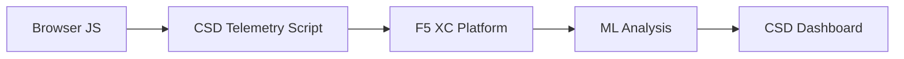

import { Aside } from "@astrojs/starlight/components";

F5 Distributed Cloud Client-Side Defense (CSD) ปกป้องเว็บแอปพลิเคชันจากการโจมตีฝั่งไคลเอนต์โดยการตรวจสอบพฤติกรรมของ JavaScript โดยตรงในเบราว์เซอร์ โหลดบาลานเซอร์ F5 XC สามารถกำหนดค่าให้แทรกสคริปต์เทเลเมทรีของ CSD เข้าไปในหน้าเพจที่ให้บริการแก่ไคลเอนต์ สคริปต์นี้จะสังเกตกิจกรรม JavaScript ทั้งหมด ได้แก่ สคริปต์ที่โหลด ฟิลด์ฟอร์มที่อ่าน และการเชื่อมต่อเครือข่ายที่สร้างขึ้น ข้อมูลเทเลเมทรีจะถูกส่งไปยังแพลตฟอร์ม F5 XC ซึ่งโมเดล Machine Learning จะวิเคราะห์พฤติกรรมของสคริปต์ กำหนดคะแนนความเสี่ยง และตั้งค่าสถานะความผิดปกติ ทีมความปลอดภัยตรวจสอบการตรวจจับในคอนโซล CSD และดำเนินการโดยการอนุญาตหรือบรรเทาโดเมนของสคริปต์

## สัญญาณการตรวจจับหลัก

CSD ตรวจสอบพฤติกรรมฝั่งเบราว์เซอร์สามประเภท:

| สัญญาณ | สิ่งที่ CSD สังเกต | ตัวอย่าง |
| --- | --- | --- |
| **การอ่านฟิลด์ฟอร์ม** | สคริปต์ใดเข้าถึงฟิลด์ `input` ใดที่มีอยู่ใน DOM ของหน้าเพจขณะโหลด | `main.js` อ่านฟิลด์ `password` บน `/login` |
| **รายการสคริปต์** | JavaScript ทั้งหมดทั้งฝั่งเจ้าของและบุคคลที่สามที่โหลดในแต่ละหน้า โดยติดตามตามโดเมนต้นทาง | แท็ก `<script>` ใหม่ที่โหลดจาก `cdn.jsdelivr.net` ปรากฏขึ้นในหน้าล็อกอิน |
| **การโต้ตอบเครือข่าย** | โดเมนที่เกี่ยวข้องกับกิจกรรมเครือข่ายของสคริปต์ ครอบคลุมทั้งโดเมนต้นทางของการโหลดสคริปต์และโดเมนปลายทางของ fetch/XHR | สคริปต์ที่มาจาก `esm.sh` และเป้าหมายการขโมยข้อมูล เช่น `www.httpbin.org` ปรากฏในโดเมนที่ตรวจพบ |

<Aside type="caution">
สัญญาณการโต้ตอบเครือข่ายของ CSD ติดตาม**โดเมนต้นทางของการโหลดสคริปต์**เป็นหลัก อย่างไรก็ตาม โดเมนปลายทางของ fetch/XHR ยังปรากฏใน API `/detected_domains` และตารางโดเมนในแดชบอร์ดด้วย — CSD ตรวจจับกิจกรรมเครือข่ายในระดับโดเมน ไม่ใช่เพียงการโหลดสคริปต์เท่านั้น ดู [ขอบเขตการตรวจจับ](#detection-boundaries) สำหรับรายการข้อจำกัดด้านพฤติกรรมทั้งหมด
</Aside>

## เมทริกซ์คุณสมบัติ

| คุณสมบัติ | คำอธิบาย | ตำแหน่งในคอนโซล |
| --- | --- | --- |
| **การให้คะแนนความเสี่ยงสคริปต์** | การจำแนกประเภทอัตโนมัติ: ไม่มีความเสี่ยง, ความเสี่ยงต่ำ, ความเสี่ยงสูง | รายการสคริปต์ &rarr; คอลัมน์ระดับความเสี่ยง |
| **ความละเอียดอ่อนของฟิลด์ฟอร์ม** | จำแนกฟิลด์เป็น Sensitive (โดยระบบ) อัตโนมัติตามประเภทและชื่อฟิลด์ | มุมมองฟิลด์ฟอร์ม &rarr; คอลัมน์การวิเคราะห์ |
| **ไทม์ไลน์พฤติกรรม** | แผนภูมิระดับความเสี่ยงของสคริปต์ โดเมนต้นทาง และประเภทตามเวลา | รายละเอียดสคริปต์ &rarr; ภาพรวม &rarr; พฤติกรรมตามเวลา |
| **การระบุผู้ใช้ที่ได้รับผลกระทบ** | ติดตามผู้ใช้ที่ได้รับผลกระทบโดย IP, ตำแหน่งทางภูมิศาสตร์, เบราว์เซอร์, และอุปกรณ์ | รายละเอียดสคริปต์ &rarr; แท็บผู้ใช้ที่ได้รับผลกระทบ |
| **รายการโดเมนที่อนุญาต** | ทำเครื่องหมายโดเมนสคริปต์ที่เชื่อถือได้เป็นรายการที่อนุญาต | แดชบอร์ด &rarr; แถวโดเมน &rarr; เพิ่มในรายการที่อนุญาต |
| **รายการโดเมนที่บรรเทา** | บล็อกการเรียกเครือข่ายและการอ่านฟิลด์ฟอร์มจากโดเมนสคริปต์ที่ระบุ เพื่อป้องกันการขโมยข้อมูล | แดชบอร์ด &rarr; แถวโดเมน &rarr; เพิ่มในรายการที่บรรเทา |
| **การกำหนดค่าการแจ้งเตือน** | การแจ้งเตือนสำหรับโดเมนใหม่ การเปลี่ยนแปลงความเสี่ยง และพฤติกรรมที่น่าสงสัย | ส่วนการแจ้งเตือน |
| **การให้เหตุผลสคริปต์** | เพิ่มบันทึกอธิบายว่าเหตุใดสคริปต์จึงได้รับอนุญาต (การปฏิบัติตาม PCI DSS) | รายละเอียดสคริปต์ &rarr; ฟิลด์เหตุผล |
| **การติดตามธุรกรรม** | ตัวนับเหตุการณ์เทเลเมทรีรายเดือนที่ยืนยันว่า CSD ทำงานอยู่ | แดชบอร์ด &rarr; การ์ดธุรกรรมที่ใช้ |
| **ตัวกรองเวลาและตำแหน่ง** | กรองมุมมองทั้งหมดตามช่วงเวลา (24 ชั่วโมง, 7 วัน, 30 วัน) และตำแหน่ง | ตัวควบคุมตัวกรองในแถบด้านบน |

## ขอบเขตการตรวจจับ

การทำความเข้าใจสิ่งที่ CSD **ไม่ได้** ตรวจสอบเป็นสิ่งสำคัญสำหรับการตั้งความคาดหวังในการสาธิตที่ถูกต้อง:

| ข้อจำกัด | รายละเอียด | ยืนยันแล้ว |
| --- | --- | --- |
| **ฟิลด์ที่สร้างแบบไดนามิก** | CSD ติดตามฟิลด์ `input` ที่มีอยู่ใน DOM ขณะโหลดหน้าเพจ ฟิลด์ที่ถูกแทรกโดย JavaScript หลังการโหลดจะไม่ถูกตรวจสอบ `<input>` ที่สร้างแบบไดนามิกซึ่งถูกอ่านโดยสคริปต์จะไม่ปรากฏในมุมมองฟิลด์ฟอร์ม | ใช่ — ฟิลด์ไม่ปรากฏใน `/formFields` หลังรอ 10 นาที |
| **การสับสนโค้ด** | CSD ไม่ตั้งค่าสถานะเทคนิคการรันโค้ดแบบไดนามิกหรือรูปแบบการสับสนเป็นสัญญาณการตรวจจับแยกต่างหาก โปรแกรมเก็บข้อมูลที่สับสนให้ระดับความเสี่ยงเท่ากับที่ไม่ได้สับสน — CSD ติดตามข้อมูลเมตาด้านพฤติกรรม ไม่ใช่รูปแบบซอร์สโค้ด | ใช่ — "High Risk" เหมือนกันสำหรับทั้งสองเทคนิค |
| **ฟิลด์แบบฟอร์มโอเวอร์เลย์** | CSD ติดตามเฉพาะฟิลด์ฟอร์มที่มีอยู่ใน DOM ดั้งเดิมขณะโหลดหน้าเพจ แบบฟอร์มโอเวอร์เลย์ที่แทรกโดย JavaScript (เทคนิคการสกิมมิ่งดิจิทัลที่พบบ่อย) จะไม่ถูกติดตาม — ตรวจจับเฉพาะการอ่านฟิลด์ดั้งเดิมเท่านั้น | ใช่ — ฟิลด์โอเวอร์เลย์ไม่ปรากฏใน `/formFields` หลังรอ 10 นาที |
| **พฤติกรรมตัวนับในแดชบอร์ด** | จำนวนสรุป "Found &amp; Mitigated" และ "Found &amp; Allowed" จะเปลี่ยนแปลงเฉพาะเมื่อผู้ดูแลระบบเพิ่มโดเมนในรายการบรรเทาหรืออนุญาตอย่างชัดเจน จำนวน "Action Needed" และ "Total Found" จะอัปเดตอัตโนมัติเมื่อตรวจพบโดเมนใหม่ | ใช่ — "Found &amp; Allowed" เปลี่ยนจาก 0 เป็น 1 หลังจาก POST ไปที่ `/allowed_domains` เท่านั้น |

<Aside type="note" title="การมองเห็น API เทียบกับคอนโซล">
API endpoint `/detected_domains` จะคืนค่าโดเมนที่ตรวจพบทั้งหมด รวมถึงโดเมนต้นทางสคริปต์ทั้งฝั่งเจ้าของและบุคคลที่สาม โดเมนแอปพลิเคชันฝั่งเจ้าของ (เช่น `csd.bankexample.com`) ปรากฏในรายการโดเมนที่ตรวจพบควบคู่กับโดเมน CDN ของบุคคลที่สาม ทั้งโดเมนฝั่งเจ้าของและบุคคลที่สามปรากฏในตารางโดเมนในแดชบอร์ด

โดเมนปลายทางของ fetch/XHR (เช่น `www.httpbin.org` ที่ติดต่อผ่าน `fetch()`) ยังปรากฏในการตอบสนองของ `/detected_domains` ด้วย แพลตฟอร์ม CSD ติดตามสิ่งเหล่านี้ในระดับโดเมน แม้ว่าจะไม่ใช่โดเมนต้นทางของการโหลดสคริปต์ก็ตาม
</Aside>

## การแมปกับ PCI DSS v4.0

CSD ตอบสนองความต้องการ PCI DSS v4.0 สองรายการสำหรับความปลอดภัยของหน้าชำระเงินโดยตรง:

| ข้อกำหนด PCI DSS | สิ่งที่กำหนด | วิธีที่ CSD ตอบสนอง |
| --- | --- | --- |
| **6.4.3** — การจัดการสคริปต์บนหน้าชำระเงิน | รักษารายการสคริปต์ทั้งหมด ให้การอนุญาตและเหตุผลเป็นลายลักษณ์อักษรสำหรับแต่ละรายการ ยืนยันความสมบูรณ์ของสคริปต์ | รายการสคริปต์ให้รายการสินค้าคงคลังที่ครบถ้วน ฟิลด์เหตุผลบันทึกการอนุญาต ไทม์ไลน์พฤติกรรมติดตามการเปลี่ยนแปลง |
| **11.6.1** — การตรวจจับการแทรกแซงบนหน้าชำระเงิน | ตรวจจับการแก้ไขที่ไม่ได้รับอนุญาตในส่วนหัว HTTP และเนื้อหาหน้าชำระเงิน | เทเลเมทรี CSD ตรวจจับการแทรกสคริปต์ใหม่ การอ่านฟิลด์ฟอร์มที่ไม่ได้รับอนุญาต และโดเมนเครือข่ายใหม่ — แจ้งเตือนเมื่อพฤติกรรมของหน้าเพจเปลี่ยนแปลง |

<Aside type="tip">
ใช้คุณสมบัติ **การให้เหตุผลสคริปต์** เพื่อบันทึกว่าเหตุใดแต่ละสคริปต์จึงได้รับอนุญาตในหน้าชำระเงิน สิ่งนี้สร้างเส้นทางการตรวจสอบที่แมปโดยตรงกับข้อกำหนดการอนุญาตของ PCI DSS 6.4.3
</Aside>

## เมทริกซ์ความครอบคลุมภัยคุกคาม

ตารางต่อไปนี้แมปประเภทการโจมตีฝั่งไคลเอนต์ทั่วไปกับสัญญาณการตรวจจับของ CSD ที่จะทำงานระหว่างการโจมตีแต่ละประเภท ประเภทการโจมตีที่ทำเครื่องหมายด้วย **\*** ได้รับการยืนยันโดย [เอกสารทางการของ F5](https://www.f5.com/cloud/products/client-side-defense) ประเภทที่ไม่มีเครื่องหมายเป็นการอนุมานตามประเภทสัญญาณการตรวจจับของ CSD และอาจไม่ได้รับการอ้างสิทธิ์อย่างชัดเจนโดย F5

| ประเภทการโจมตี | คำอธิบาย | การอ่านฟิลด์ | การแทรกสคริปต์ | เครือข่าย |
| --- | --- | --- | --- | --- |
| **Formjacking** \* | สคริปต์อันตรายอ่านค่าฟิลด์ฟอร์มและขโมยออกไป | ใช่ | — | ใช่ |
| **Digital skimming** \* | แทรกแบบฟอร์มโอเวอร์เลย์หรือสคริปต์เพื่อดักจับข้อมูลการชำระเงิน | ใช่ | ใช่ | ใช่ |
| **Supply chain attack** \* | ไลบรารีบุคคลที่สามที่ถูกโจมตีโหลดโค้ดอันตราย | — | ใช่ | ใช่ |
| **Data exfiltration** \* | อ่านข้อมูลที่ละเอียดอ่อนและส่งไปยังโดเมนภายนอก | ใช่ | — | ใช่ |
| **Script injection** \* | แทรกแท็ก `<script>` ที่ไม่ได้รับอนุญาตเข้าไปในหน้าเพจ | — | ใช่ | ใช่ |
| **Cryptojacking** \* | แทรกสคริปต์ขุดสกุลเงินดิจิทัล | — | ใช่ | ใช่ |
| **DOM manipulation** | แทรกหรือแก้ไของค์ประกอบหน้าเพจเพื่อหลอกลวงผู้ใช้ | — | ใช่ | — |
| **Man-in-the-Browser** | ดักจับข้อมูลฟอร์มภายในเซสชันเบราว์เซอร์ — ดู [OWASP](https://owasp.org/www-community/attacks/Man-in-the-browser_attack) และ [MITRE T1185](https://attack.mitre.org/techniques/T1185/) | ใช่ | — | ใช่ |
| **Clickjacking** | วางเฟรมที่มองไม่เห็นทับเพื่อจี้การคลิกของผู้ใช้ — ดู [OWASP](https://owasp.org/www-community/attacks/Clickjacking) | — | ใช่ | — |
| **Web skimmer persistence** | แทรกสคริปต์สกิมเมอร์ซ้ำข้ามการนำทางหน้าเพจ — ดู [Sansec Magecart Research](https://sansec.io/what-is-magecart) | — | ใช่ | ใช่ |

<Aside type="note">
การตรวจจับ "เครือข่าย" ครอบคลุมทั้งโดเมนต้นทางของการโหลดสคริปต์และโดเมนปลายทางของ fetch/XHR — ทั้งสองปรากฏใน API `/detected_domains` ของ CSD และตารางโดเมนในแดชบอร์ด อย่างไรก็ตาม การบรรเทาของ CSD มุ่งเป้าไปที่การโหลดสคริปต์ (เวกเตอร์ supply chain) ไม่ใช่การเรียก fetch/XHR การบรรเทาโดเมนจะบล็อกการโหลดแท็ก `<script>` จากโดเมนนั้น แต่ไม่ดักจับการเรียก `fetch()` หรือ `XMLHttpRequest` ไปยังโดเมนนั้น
</Aside>
