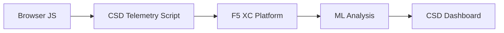

import { Aside } from "@astrojs/starlight/components";

F5 Distributed Cloud Client-Side Defense (CSD) ปกป้องเว็บแอปพลิเคชันจากการโจมตีฝั่งไคลเอ็นต์โดยการติดตามพฤติกรรม JavaScript โดยตรงในเบราว์เซอร์ สามารถกำหนดค่า F5 XC load balancer เพื่อฉีด CSD telemetry script เข้าไปในหน้าเว็บที่ให้บริการแก่ไคลเอ็นต์ได้ สคริปต์นี้สังเกตการณ์กิจกรรม JavaScript ทั้งหมด — สคริปต์ที่โหลด ฟิลด์แบบฟอร์มที่อ่าน และการเชื่อมต่อเครือข่ายที่ดำเนินการ ข้อมูล Telemetry จะถูกส่งไปยังแพลตฟอร์ม F5 XC โดยที่โมเดล Machine Learning วิเคราะห์พฤติกรรมของสคริปต์ กำหนดคะแนนความเสี่ยง และทำเครื่องหมายความผิดปกติ ทีมความปลอดภัยตรวจสอบการตรวจจับในคอนโซล CSD และดำเนินการโดยการอนุญาตหรือลดความเสี่ยงของโดเมนสคริปต์

## สัญญาณการตรวจจับหลัก

CSD ติดตามพฤติกรรมฝั่งเบราว์เซอร์ในสามประเภท:

| สัญญาณ | สิ่งที่ CSD สังเกตการณ์ | ตัวอย่าง |
| --- | --- | --- |
| **การอ่านฟิลด์แบบฟอร์ม** | สคริปต์ใดที่เข้าถึงฟิลด์ `input` ใดบ้างที่มีอยู่ใน DOM ของหน้าเพจ ณ เวลาที่โหลด | `main.js` อ่านฟิลด์ `password` บน `/login` |
| **สินค้าคงคลังสคริปต์** | JavaScript ที่เป็นของบุคคลแรกและบุคคลที่สามทั้งหมดที่โหลดบนแต่ละหน้า ติดตามตามโดเมนต้นทาง | แท็ก `<script>` ใหม่ที่โหลดจาก `cdn.jsdelivr.net` ปรากฏบนหน้าเข้าสู่ระบบ |
| **ปฏิสัมพันธ์เครือข่าย** | โดเมนที่เกี่ยวข้องกับกิจกรรมเครือข่ายของสคริปต์ — รวมถึงโดเมนต้นทางของการโหลดสคริปต์และโดเมนปลายทาง fetch/XHR | สคริปต์ที่มาจาก `esm.sh` และเป้าหมายการรั่วไหลข้อมูลเช่น `www.httpbin.org` ปรากฏในโดเมนที่ตรวจจับได้ |

<Aside type="caution">
สัญญาณ Network interactions ของ CSD หลักเป็นเทน สคริปต์-โหลดโดเมนต้นทาง อย่างไรก็ตาม โดเมนปลายทาง fetch/XHR ยังปรากฏในเอพีไอ `/detected_domains` และตารางโดเมนของแดชบอร์ด — CSD ตรวจจับกิจกรรมเครือข่ายในระดับโดเมน ไม่ใช่แค่การโหลดสคริปต์เท่านั้น โปรดดู [Detection Boundaries](#detection-boundaries) สำหรับรายการข้อจำกัดพฤติกรรมที่สมบูรณ์
</Aside>

## เมทริกซ์คุณสมบัติ

| คุณสมบัติ | คำอธิบาย | ตำแหน่งในคอนโซล |
| --- | --- | --- |
| **คะแนนความเสี่ยงของสคริปต์** | การจำแนกประเภทโดยอัตโนมัติ: No Risk, Low Risk, High Risk | Script List → คอลัมน์ Risk Level |
| **ความไวของฟิลด์แบบฟอร์ม** | การจำแนกประเภทฟิลด์เป็น Sensitive (โดยระบบ) โดยอิงจากประเภทและชื่อของฟิลด์ | Form Fields view → คอลัมน์ Analysis |
| **ไทม์ไลน์พฤติกรรม** | แสดงความเสี่ยง แหล่งที่มา และประเภทของสคริปต์เมื่อเวลาผ่านไป | Script detail → Overview → Behaviors Over Time |
| **การระบุผู้ใช้ที่ได้รับผลกระทบ** | ติดตามผู้ใช้ที่ได้รับผลกระทบตาม IP ที่ตั้งทางภูมิศาสตร์ เบราว์เซอร์ และอุปกรณ์ | Script detail → แท็บ Affected Users |
| **รายการอนุญาตโดเมน** | ทำเครื่องหมายโดเมนสคริปต์ที่เชื่อถือได้เป็นอนุญาต | Dashboard → แถวโดเมน → Add To Allow List |
| **รายการลดความเสี่ยงโดเมน** | บล็อกการโทรเครือข่ายและการอ่านฟิลด์แบบฟอร์มจากโดเมนสคริปต์เฉพาะ โป้งกันการรั่วไหลข้อมูล | Dashboard → แถวโดเมน → Add To Mitigate List |
| **การกำหนดค่าการแจ้งเตือน** | การแจ้งเตือนสำหรับโดเมนใหม่ การเปลี่ยนแปลงความเสี่ยง พฤติกรรมที่น่าสงสัย | ส่วน Notifications |
| **ลักษณ์ยืนยันของสคริปต์** | เพิ่มหมายเหตุที่อธิบายว่าเหตุใดสคริปต์จึงได้รับอนุญาต (การปฏิบัติตาม PCI DSS) | Script detail → ฟิลด์ Justification |
| **การติดตามธุรกรรม** | ตัวนับเหตุการณ์ telemetry รายเดือนที่ยืนยันว่า CSD ทำงานอยู่ | Dashboard → การ์ด Transactions Consumed |
| **ตัวกรองเวลาและตำแหน่ง** | ตัวกรองทุกมุมมองตามช่วงเวลา (24h, 7d, 30d) และตำแหน่ง | ตัวควบคุมตัวกรองแถบบน |

## ขอบเขตของการตรวจจับ

การทำความเข้าใจว่า CSD ทำ **ไม่** ติดตามคืออะไรเป็นสิ่งสำคัญสำหรับการตั้งค่าความคาดหวังในการสาธิตที่แม่นยำ:

| ข้อจำกัด | รายละเอียด | ยืนยันแล้ว |
| --- | --- | --- |
| **ฟิลด์ที่สร้างขึ้นแบบไดนามิก** | CSD ติดตามฟิลด์ `input` ที่มีอยู่ใน DOM ณ เวลาโหลดหน้า ฟิลด์ที่ฉีดโดย JavaScript หลังจากโหลดจะไม่ได้รับการติดตาม `<input>` ที่สร้างขึ้นแบบไดนามิกซึ่งอ่านโดยสคริปต์จะไม่ปรากฏในมุมมอง Form Fields | ใช่ — ฟิลด์ไม่มีจาก `/formFields` หลังรอ 10 นาที |
| **การอบดิบรหัส** | CSD ไม่ทำเครื่องหมายเทคนิคการดำเนินการรหัสแบบไดนามิกหรือรูปแบบการอบดิบเป็นสัญญาณการตรวจจับแยกต่างหาก ตัวเก็บเกี่ยวที่อบดิบสร้างระดับความเสี่ยงเดียวกันกับตัวที่ไม่อบดิบ — CSD ติดตาม metadata พฤติกรรม ไม่ใช่รูปแบบรหัสต้นทาง | ใช่ — "High Risk" เดียวกันสำหรับเทคนิคทั้งสอง |
| **ฟิลด์แบบฟอร์มเพื่อข้อมูล** | CSD ติดตามเฉพาะฟิลด์แบบฟอร์มที่มีอยู่ใน DOM ดั้งเดิม ณ เวลาโหลดหน้า ฟอร์มเพื่อข้อมูลที่ฉีดโดย JavaScript (เทคนิคการขูดข้อมูลดิจิทัลทั่วไป) จะไม่ได้รับการติดตาม — มีเพียงการอ่านฟิลด์ดั้งเดิมเท่านั้นที่ตรวจจับได้ | ใช่ — ฟิลด์เพื่อข้อมูลไม่มีจาก `/formFields` หลังรอ 10 นาที |
| **พฤติกรรมตัวนับแดชบอร์ด** | จำนวนสรุป "Found & Mitigated" และ "Found & Allowed" มีการเปลี่ยนแปลงเพียงหลังจากที่ผู้ดูแลระบบเพิ่มโดเมนไปยังรายการลดความเสี่ยงหรืออนุญาตอย่างชัดแจ้ง จำนวน "Action Needed" และ "Total Found" อัพเดตโดยอัตโนมัติเมื่อตรวจจับโดเมนใหม่ | ใช่ — "Found & Allowed" เปลี่ยนจาก 0 เป็น 1 เพียงหลังจาก POST ไปยัง `/allowed_domains` |

<Aside type="note" title="API เทียบกับการมองเห็นของคอนโซล">
จุดสิ้นสุด API `/detected_domains` ส่งคืนโดเมนทั้งหมดที่ตรวจจับได้ รวมทั้งโดเมนต้นทางสคริปต์ที่เป็นของบุคคลแรกและบุคคลที่สาม โดเมนแอปพลิเคชันของบุคคลแรก (เช่น `csd.bankexample.com`) ปรากฏในรายการโดเมนที่ตรวจจับได้พร้อมกับโดเมน CDN ของบุคคลที่สาม โดเมนของบุคคลแรกและบุคคลที่สามปรากฏในตารางโดเมนของแดชบอร์ด

โดเมนปลายทาง fetch/XHR (เช่น `www.httpbin.org` ที่ติดต่อผ่าน `fetch()`) ยังปรากฏในการตอบสนอง `/detected_domains` แพลตฟอร์ม CSD ติดตามสิ่งเหล่านี้ในระดับโดเมนแม้ว่าไม่ใช่โดเมนต้นทางของการโหลดสคริปต์
</Aside>

## การแมป PCI DSS v4.0

CSD ตอบสนองโดยตรงต่อข้อกำหนด PCI DSS v4.0 สองข้อสำหรับความปลอดภัยของหน้าการชำระเงิน:

| ข้อกำหนด PCI DSS | สิ่งที่ต้องการ | CSD ตอบสนองอย่างไร |
| --- | --- | --- |
| **6.4.3** — การจัดการสคริปต์บนหน้าการชำระเงิน | รักษาสินค้าคงคลังของสคริปต์ทั้งหมด ให้การยืนยันและเหตุผลที่เขียนไว้สำหรับแต่ละรายการ ตรวจสอบความสมบูรณ์ของสคริปต์ | Script List ให้สินค้าคงคลังที่สมบูรณ์ ฟิลด์ Justification จัดเอกสารการยืนยัติดตามพฤติกรรมผ่านเวลา |
| **11.6.1** — การตรวจจับการปลอมแปลงบนหน้าการชำระเงิน | ตรวจจับการปลอมแปลงที่ไม่ได้รับอนุญาตต่อส่วนหัว HTTP และเนื้อหาหน้าการชำระเงิน | Telemetry CSD ตรวจจับการฉีดสคริปต์ใหม่ การอ่านฟิลด์แบบฟอร์มที่ไม่ได้รับอนุญาต และโดเมนเครือข่ายใหม่ — แจ้งเตือนเกี่ยวกับการเปลี่ยนแปลงพฤติกรรมของหน้า |

<Aside type="tip">
ใช้คุณสมบัติ **Script justification** เพื่อจัดเอกสารว่าเหตุใดสคริปต์แต่ละรายการจึงได้รับอนุญาตบนหน้าการชำระเงิน สิ่งนี้สร้างรายการตรวจสอบที่แมปโดยตรงกับข้อกำหนดการยืนยันของ PCI DSS 6.4.3
</Aside>

## เมทริกซ์ความครอบคลุมของภัยคุกคาม

ตารางต่อไปนี้แมปหมวดหมู่การโจมตีฝั่งไคลเอ็นต์ทั่วไปกับสัญญาณการตรวจจับ CSD ที่จะเรียกใช้ระหว่างการโจมตีแต่ละประเภท ประเภทการโจมตีที่ทำเครื่องหมายด้วย **\*** ได้รับการยืนยันโดย [เอกสารอย่างเป็นทางการของ F5](https://www.f5.com/cloud/products/client-side-defense) ประเภทที่ไม่มีเครื่องหมายนั้นอนุมานจากหมวดหมู่สัญญาณการตรวจจับของ CSD และอาจไม่ได้ถูกอ้างสิทธิ์อย่างชัดแจ้งโดย F5

| หมวดหมู่การโจมตี | คำอธิบาย | ฟิลด์ Reads | Script Injection | Network |
| --- | --- | --- | --- | --- |
| **Formjacking** \* | สคริปต์อันตรายอ่านค่าฟิลด์แบบฟอร์มและส่งออกไป | ใช่ | — | ใช่ |
| **Digital skimming** \* | ฉีดแบบฟอร์มเพื่อข้อมูลหรือสคริปต์เพื่อจับข้อมูลการชำระเงิน | ใช่ | ใช่ | ใช่ |
| **Supply chain attack** \* | ไลบรารีบุคคลที่สามที่ถูกบุกรุกโหลดรหัสอันตราย | — | ใช่ | ใช่ |
| **Data exfiltration** \* | อ่านข้อมูลที่ไว และส่งไปยังโดเมนภายนอก | ใช่ | — | ใช่ |
| **Script injection** \* | แทรกแท็ก `<script>` ที่ไม่ได้รับอนุญาตลงในหน้า | — | ใช่ | ใช่ |
| **Cryptojacking** \* | ฉีดสคริปต์การขุดสกุลเงินดิจิทัล | — | ใช่ | ใช่ |
| **DOM manipulation** | ฉีดหรือปรับเปลี่ยนองค์ประกอบหน้าเพื่อหลอกล่อผู้ใช้ | — | ใช่ | — |
| **Man-in-the-Browser** | สกัดกั้นข้อมูลแบบฟอร์มในเซสชันเบราว์เซอร์ — ดู [OWASP](https://owasp.org/www-community/attacks/Man-in-the-browser_attack) และ [MITRE T1185](https://attack.mitre.org/techniques/T1185/) | ใช่ | — | ใช่ |
| **Clickjacking** | หล่อบริเวณเฟรมที่มองไม่เห็นเพื่อชิงการคลิกของผู้ใช้ — ดู [OWASP](https://owasp.org/www-community/attacks/Clickjacking) | — | ใช่ | — |
| **Web skimmer persistence** | ฉีดสคริปต์ skimmer ใหม่ข้ามการนำทางหน้า — ดู [Sansec Magecart Research](https://sansec.io/what-is-magecart) | — | ใช่ | ใช่ |

<Aside type="note">
การตรวจจับ "Network" ครอบคลุมทั้งโดเมนต้นทางของการโหลดสคริปต์และโดเมนปลายทาง fetch/XHR — ทั้งสองปรากฏในเอพีไอ `/detected_domains` ของ CSD และตารางโดเมนของแดชบอร์ด อย่างไรก็ตาม การลดความเสี่ยง CSD กำหนดเป้าหมายการโหลดสคริปต์ (เวกเตอร์ supply-chain) ไม่ใช่การโทร fetch/XHR ลดความเสี่ยงของโดเมนบล็อกการโหลดแท็ก `<script>` จากโดเมนนั้น แต่ไม่สกัดกั้นการโทร `fetch()` หรือ `XMLHttpRequest` ไปยังมัน
</Aside>
