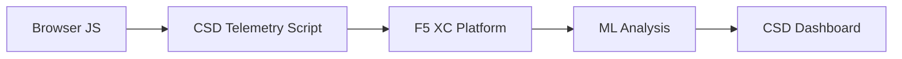

import { Aside } from "@astrojs/starlight/components";

F5 Distributed Cloud Client-Side Defense (CSD) ปกป้องเว็บแอปพลิเคชันจากการโจมตีฝั่งไคลเอนต์โดยการตรวจสอบพฤติกรรมของ JavaScript โดยตรงในเบราว์เซอร์ สามารถกำหนดค่า F5 XC load balancer เพื่อแทรกสคริปต์เทเลเมทรีของ CSD ลงในหน้าเว็บที่ส่งไปยังไคลเอนต์ สคริปต์นี้จะสังเกตกิจกรรม JavaScript ทั้งหมด — สคริปต์ใดที่โหลด ฟิลด์ฟอร์มใดที่ถูกอ่าน และการเชื่อมต่อเครือข่ายใดที่ถูกสร้างขึ้น ข้อมูลเทเลเมทรีจะถูกส่งไปยังแพลตฟอร์ม F5 XC ซึ่งโมเดล machine learning จะวิเคราะห์พฤติกรรมของสคริปต์ กำหนดคะแนนความเสี่ยง และระบุความผิดปกติ ทีมรักษาความปลอดภัยจะตรวจสอบการตรวจจับในคอนโซล CSD และดำเนินการโดยการอนุญาตหรือบรรเทาโดเมนของสคริปต์

## สัญญาณการตรวจจับหลัก

CSD ตรวจสอบพฤติกรรมฝั่งเบราว์เซอร์ 3 หมวดหมู่:

| สัญญาณ | สิ่งที่ CSD สังเกต | ตัวอย่าง |
| --- | --- | --- |
| **การอ่านฟิลด์ฟอร์ม** | สคริปต์ใดเข้าถึงฟิลด์ `input` ใดที่มีอยู่ใน DOM ของหน้าเว็บตอนโหลด | `main.js` อ่านฟิลด์ `password` บนหน้า `/login` |
| **รายการสคริปต์** | JavaScript ของบุคคลที่หนึ่งและบุคคลที่สามทั้งหมดที่โหลดในแต่ละหน้า ติดตามตามโดเมนต้นทาง | แท็ก `<script>` ใหม่ที่โหลดจาก `cdn.jsdelivr.net` ปรากฏบนหน้าล็อกอิน |
| **การโต้ตอบผ่านเครือข่าย** | โดเมนที่เกี่ยวข้องกับกิจกรรมเครือข่ายของสคริปต์ — รวมถึงโดเมนต้นทางของการโหลดสคริปต์และโดเมนปลายทางของ fetch/XHR | สคริปต์ที่มาจาก `esm.sh` และเป้าหมายการขโมยข้อมูลเช่น `www.httpbin.org` ที่ปรากฏในโดเมนที่ตรวจพบ |

<Aside type="caution">
สัญญาณการโต้ตอบผ่านเครือข่ายของ CSD ติดตาม**โดเมนต้นทางของการโหลดสคริปต์**เป็นหลัก อย่างไรก็ตาม โดเมนปลายทางของ fetch/XHR ก็ปรากฏใน API `/detected_domains` และตารางโดเมนในแดชบอร์ดเช่นกัน — CSD ตรวจจับกิจกรรมเครือข่ายในระดับโดเมน ไม่ใช่เฉพาะการโหลดสคริปต์เท่านั้น ดู [ขอบเขตการตรวจจับ](#ขอบเขตการตรวจจับ) สำหรับรายการข้อจำกัดด้านพฤติกรรมทั้งหมด
</Aside>

## ตารางคุณสมบัติ

| คุณสมบัติ | คำอธิบาย | ตำแหน่งในคอนโซล |
| --- | --- | --- |
| **การให้คะแนนความเสี่ยงของสคริปต์** | การจำแนกอัตโนมัติ: ไม่มีความเสี่ยง, ความเสี่ยงต่ำ, ความเสี่ยงสูง | Script List &rarr; คอลัมน์ Risk Level |
| **ความอ่อนไหวของฟิลด์ฟอร์ม** | จำแนกฟิลด์โดยอัตโนมัติว่าเป็น Sensitive (โดยระบบ) ตามประเภทและชื่อฟิลด์ | มุมมอง Form Fields &rarr; คอลัมน์ Analysis |
| **ไทม์ไลน์พฤติกรรม** | แผนภูมิระดับความเสี่ยงของสคริปต์ โดเมนต้นทาง และประเภทตลอดช่วงเวลา | Script detail &rarr; Overview &rarr; Behaviors Over Time |
| **การระบุผู้ใช้ที่ได้รับผลกระทบ** | ติดตามผู้ใช้ที่ได้รับผลกระทบตาม IP, ตำแหน่งทางภูมิศาสตร์, เบราว์เซอร์ และอุปกรณ์ | Script detail &rarr; แท็บ Affected Users |
| **รายการอนุญาตโดเมน** | ทำเครื่องหมายโดเมนสคริปต์ที่เชื่อถือได้เป็นอนุญาต | Dashboard &rarr; แถวโดเมน &rarr; Add To Allow List |
| **รายการบรรเทาโดเมน** | บล็อกการเรียกเครือข่ายและการอ่านฟิลด์ฟอร์มจากโดเมนสคริปต์ที่ระบุ ป้องกันการขโมยข้อมูล | Dashboard &rarr; แถวโดเมน &rarr; Add To Mitigate List |
| **การกำหนดค่าการแจ้งเตือน** | การแจ้งเตือนสำหรับโดเมนใหม่ การเปลี่ยนแปลงความเสี่ยง พฤติกรรมที่น่าสงสัย | ส่วน Notifications |
| **การให้เหตุผลของสคริปต์** | เพิ่มหมายเหตุอธิบายว่าเหตุใดสคริปต์จึงได้รับอนุญาต (การปฏิบัติตาม PCI DSS) | Script detail &rarr; ฟิลด์ Justification |
| **การติดตามธุรกรรม** | ตัวนับเหตุการณ์เทเลเมทรีรายเดือนยืนยันว่า CSD ทำงานอยู่ | Dashboard &rarr; การ์ด Transactions Consumed |
| **ตัวกรองเวลาและตำแหน่ง** | กรองมุมมองทั้งหมดตามช่วงเวลา (24 ชม., 7 วัน, 30 วัน) และตำแหน่ง | ตัวควบคุมตัวกรองแถบด้านบน |

## ขอบเขตการตรวจจับ

การเข้าใจสิ่งที่ CSD **ไม่ได้**ตรวจสอบเป็นสิ่งสำคัญสำหรับการตั้งความคาดหวังของการสาธิตอย่างถูกต้อง:

| ข้อจำกัด | รายละเอียด | ยืนยันแล้ว |
| --- | --- | --- |
| **ฟิลด์ที่สร้างแบบไดนามิก** | CSD ติดตามฟิลด์ `input` ที่มีอยู่ใน DOM ตอนโหลดหน้าเว็บ ฟิลด์ที่ถูกแทรกโดย JavaScript หลังจากโหลดจะไม่ถูกตรวจสอบ `<input>` ที่สร้างแบบไดนามิกที่ถูกอ่านโดยสคริปต์จะไม่ปรากฏในมุมมอง Form Fields | ใช่ — ฟิลด์ไม่ปรากฏใน `/formFields` หลังจากรอ 10 นาที |
| **การอำพรางระดับโค้ด** | CSD ไม่ได้ระบุเทคนิคการรันโค้ดแบบไดนามิกหรือรูปแบบการอำพรางเป็นสัญญาณการตรวจจับแยกต่างหาก ตัวเก็บข้อมูลที่ถูกอำพรางจะให้ระดับความเสี่ยงเดียวกับตัวที่ไม่ถูกอำพราง — CSD ติดตามข้อมูลเมตาเชิงพฤติกรรม ไม่ใช่รูปแบบซอร์สโค้ด | ใช่ — "High Risk" เหมือนกันทั้งสองเทคนิค |
| **ฟิลด์ฟอร์มแบบซ้อนทับ** | CSD ติดตามเฉพาะฟิลด์ฟอร์มที่มีอยู่ใน DOM ดั้งเดิมตอนโหลดหน้าเว็บ ฟอร์มซ้อนทับที่ถูกแทรกโดย JavaScript (เทคนิค digital skimming ทั่วไป) จะไม่ถูกติดตาม — เฉพาะการอ่านฟิลด์ดั้งเดิมเท่านั้นที่จะถูกตรวจจับ | ใช่ — ฟิลด์ซ้อนทับไม่ปรากฏใน `/formFields` หลังจากรอ 10 นาที |
| **พฤติกรรมตัวนับแดชบอร์ด** | ตัวนับสรุป "Found &amp; Mitigated" และ "Found &amp; Allowed" จะเปลี่ยนแปลงเฉพาะหลังจากผู้ดูแลระบบเพิ่มโดเมนเข้าในรายการบรรเทาหรือรายการอนุญาตอย่างชัดเจน ตัวนับ "Action Needed" และ "Total Found" จะอัปเดตโดยอัตโนมัติเมื่อตรวจพบโดเมนใหม่ | ใช่ — "Found &amp; Allowed" เปลี่ยนจาก 0 เป็น 1 เฉพาะหลังจาก POST ไปยัง `/allowed_domains` |

<Aside type="note" title="การมองเห็นของ API เทียบกับคอนโซล">
จุดเชื่อมต่อ API `/detected_domains` จะส่งคืนโดเมนที่ตรวจพบทั้งหมดรวมถึงโดเมนต้นทางของสคริปต์ทั้งบุคคลที่หนึ่งและบุคคลที่สาม โดเมนแอปพลิเคชันของบุคคลที่หนึ่ง (เช่น `csd.bankexample.com`) จะปรากฏในรายการโดเมนที่ตรวจพบควบคู่กับโดเมน CDN ของบุคคลที่สาม โดเมนทั้งบุคคลที่หนึ่งและบุคคลที่สามจะปรากฏในตารางโดเมนของแดชบอร์ด

โดเมนปลายทางของ fetch/XHR (เช่น `www.httpbin.org` ที่ติดต่อผ่าน `fetch()`) ก็ปรากฏในการตอบกลับของ `/detected_domains` เช่นกัน แพลตฟอร์ม CSD ติดตามสิ่งเหล่านี้ในระดับโดเมนแม้ว่าจะไม่ใช่โดเมนต้นทางของการโหลดสคริปต์ก็ตาม
</Aside>

## การแมปกับ PCI DSS v4.0

CSD ตอบสนองข้อกำหนด PCI DSS v4.0 สองข้อสำหรับความปลอดภัยหน้าชำระเงินโดยตรง:

| ข้อกำหนด PCI DSS | สิ่งที่กำหนด | วิธีที่ CSD ตอบสนอง |
| --- | --- | --- |
| **6.4.3** — การจัดการสคริปต์บนหน้าชำระเงิน | จัดทำรายการสคริปต์ทั้งหมด ให้การอนุญาตและเหตุผลเป็นลายลักษณ์อักษรสำหรับแต่ละสคริปต์ ยืนยันความสมบูรณ์ของสคริปต์ | Script List ให้รายการทั้งหมด; ฟิลด์ Justification บันทึกการอนุญาต; ไทม์ไลน์พฤติกรรมติดตามการเปลี่ยนแปลง |
| **11.6.1** — การตรวจจับการดัดแปลงบนหน้าชำระเงิน | ตรวจจับการแก้ไข HTTP headers และเนื้อหาหน้าชำระเงินที่ไม่ได้รับอนุญาต | เทเลเมทรีของ CSD ตรวจจับการแทรกสคริปต์ใหม่ การอ่านฟิลด์ฟอร์มที่ไม่ได้รับอนุญาต และโดเมนเครือข่ายใหม่ — แจ้งเตือนเมื่อมีการเปลี่ยนแปลงพฤติกรรมของหน้าเว็บ |

<Aside type="tip">
ใช้คุณสมบัติ **การให้เหตุผลของสคริปต์** เพื่อบันทึกว่าเหตุใดแต่ละสคริปต์จึงได้รับอนุญาตบนหน้าชำระเงิน สิ่งนี้สร้างร่องรอยการตรวจสอบที่แมปโดยตรงกับข้อกำหนดการอนุญาตของ PCI DSS 6.4.3
</Aside>

## ตารางการครอบคลุมภัยคุกคาม

ตารางต่อไปนี้แมปหมวดหมู่การโจมตีฝั่งไคลเอนต์ทั่วไปกับสัญญาณการตรวจจับของ CSD ที่จะทำงานระหว่างการโจมตีแต่ละประเภท ประเภทการโจมตีที่ทำเครื่องหมายด้วย **\*** ได้รับการยืนยันจาก[เอกสารทางการของ F5](https://www.f5.com/cloud/products/client-side-defense) ประเภทที่ไม่มีเครื่องหมายเป็นการอนุมานจากหมวดหมู่สัญญาณการตรวจจับของ CSD และอาจไม่ได้ถูกอ้างสิทธิ์อย่างชัดเจนโดย F5

| หมวดหมู่การโจมตี | คำอธิบาย | การอ่านฟิลด์ | การแทรกสคริปต์ | เครือข่าย |
| --- | --- | --- | --- | --- |
| **Formjacking** \* | สคริปต์ที่เป็นอันตรายอ่านค่าฟิลด์ฟอร์มและขโมยข้อมูลออกไป | ใช่ | — | ใช่ |
| **Digital skimming** \* | แทรกฟอร์มซ้อนทับหรือสคริปต์เพื่อเก็บข้อมูลการชำระเงิน | ใช่ | ใช่ | ใช่ |
| **การโจมตี supply chain** \* | ไลบรารีบุคคลที่สามที่ถูกบุกรุกโหลดโค้ดที่เป็นอันตราย | — | ใช่ | ใช่ |
| **การขโมยข้อมูล** \* | อ่านข้อมูลที่ละเอียดอ่อนและส่งไปยังโดเมนภายนอก | ใช่ | — | ใช่ |
| **การแทรกสคริปต์** \* | แทรกแท็ก `<script>` ที่ไม่ได้รับอนุญาตลงในหน้าเว็บ | — | ใช่ | ใช่ |
| **Cryptojacking** \* | แทรกสคริปต์ขุดสกุลเงินดิจิทัล | — | ใช่ | ใช่ |
| **การจัดการ DOM** | แทรกหรือแก้ไของค์ประกอบหน้าเว็บเพื่อหลอกลวงผู้ใช้ | — | ใช่ | — |
| **Man-in-the-Browser** | ดักจับข้อมูลฟอร์มภายในเซสชันเบราว์เซอร์ — ดู [OWASP](https://owasp.org/www-community/attacks/Man-in-the-browser_attack) และ [MITRE T1185](https://attack.mitre.org/techniques/T1185/) | ใช่ | — | ใช่ |
| **Clickjacking** | ซ้อนทับเฟรมที่มองไม่เห็นเพื่อแย่งชิงการคลิกของผู้ใช้ — ดู [OWASP](https://owasp.org/www-community/attacks/Clickjacking) | — | ใช่ | — |
| **Web skimmer persistence** | แทรกสคริปต์ skimmer ซ้ำข้ามการนำทางหน้าเว็บ — ดู [Sansec Magecart Research](https://sansec.io/what-is-magecart) | — | ใช่ | ใช่ |

<Aside type="note">
การตรวจจับ "เครือข่าย" ครอบคลุมทั้งโดเมนต้นทางของการโหลดสคริปต์และโดเมนปลายทางของ fetch/XHR — ทั้งสองปรากฏใน API `/detected_domains` ของ CSD และตารางโดเมนในแดชบอร์ด อย่างไรก็ตาม การบรรเทาของ CSD มุ่งเป้าไปที่การโหลดสคริปต์ (เวกเตอร์ supply-chain) ไม่ใช่การเรียก fetch/XHR การบรรเทาโดเมนจะบล็อกการโหลดแท็ก `<script>` จากโดเมนนั้นแต่ไม่ได้ดักจับการเรียก `fetch()` หรือ `XMLHttpRequest` ไปยังโดเมนนั้น
</Aside>
