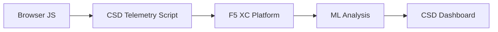

import { Aside } from "@astrojs/starlight/components";

F5 Distributed Cloud Client-Side Defense (CSD) ปกป้องเว็บแอปพลิเคชันจากการโจมตีฝั่งไคลเอนต์โดยการตรวจสอบพฤติกรรมของ JavaScript โดยตรงในเบราว์เซอร์ F5 XC load balancer สามารถกำหนดค่าเพื่อแทรกสคริปต์เทเลเมทรีของ CSD ลงในหน้าเว็บที่ส่งไปยังไคลเอนต์ สคริปต์นี้จะสังเกตกิจกรรม JavaScript ทั้งหมด — สคริปต์ใดที่โหลด ฟิลด์ฟอร์มใดที่ถูกอ่าน และการเชื่อมต่อเครือข่ายใดที่ถูกสร้างขึ้น ข้อมูลเทเลเมทรีจะถูกส่งไปยังแพลตฟอร์ม F5 XC ซึ่งโมเดลการเรียนรู้ของเครื่องจะวิเคราะห์พฤติกรรมของสคริปต์ กำหนดคะแนนความเสี่ยง และแจ้งเตือนความผิดปกติ ทีมรักษาความปลอดภัยจะตรวจสอบการตรวจจับในคอนโซล CSD และดำเนินการโดยการอนุญาตหรือบรรเทาโดเมนของสคริปต์

## สัญญาณการตรวจจับหลัก

CSD ตรวจสอบพฤติกรรมฝั่งเบราว์เซอร์สามหมวดหมู่:

| สัญญาณ | สิ่งที่ CSD สังเกต | ตัวอย่าง |
| --- | --- | --- |
| **การอ่านฟิลด์ฟอร์ม** | สคริปต์ใดเข้าถึงฟิลด์ `input` ใดที่มีอยู่ใน DOM ของหน้าเว็บขณะโหลด | `main.js` อ่านฟิลด์ `password` บนหน้า `/login` |
| **รายการสคริปต์** | JavaScript ทั้งหมดของ first-party และ third-party ที่โหลดบนแต่ละหน้า ติดตามตามโดเมนต้นทาง | แท็ก `<script>` ใหม่ที่โหลดจาก `cdn.jsdelivr.net` ปรากฏบนหน้าเข้าสู่ระบบ |
| **การโต้ตอบทางเครือข่าย** | โดเมนที่เกี่ยวข้องกับกิจกรรมเครือข่ายของสคริปต์ — รวมถึงทั้งโดเมนต้นทางของการโหลดสคริปต์และโดเมนปลายทางของ fetch/XHR | สคริปต์ที่มาจาก `esm.sh` และเป้าหมายการขโมยข้อมูลเช่น `www.httpbin.org` ที่ปรากฏในโดเมนที่ตรวจพบ |

<Aside type="caution">
สัญญาณการโต้ตอบทางเครือข่ายของ CSD ติดตาม **โดเมนต้นทางของการโหลดสคริปต์** เป็นหลัก อย่างไรก็ตาม โดเมนปลายทางของ fetch/XHR ก็ปรากฏใน API `/detected_domains` และตารางโดเมนบนแดชบอร์ดเช่นกัน — CSD ตรวจจับกิจกรรมเครือข่ายในระดับโดเมน ไม่ใช่แค่การโหลดสคริปต์เท่านั้น ดู [ขอบเขตการตรวจจับ](#ขอบเขตการตรวจจับ) สำหรับรายการข้อจำกัดด้านพฤติกรรมทั้งหมด
</Aside>

## ตารางคุณสมบัติ

| คุณสมบัติ | รายละเอียด | ตำแหน่งในคอนโซล |
| --- | --- | --- |
| **การให้คะแนนความเสี่ยงของสคริปต์** | การจำแนกอัตโนมัติ: ไม่มีความเสี่ยง, ความเสี่ยงต่ำ, ความเสี่ยงสูง | Script List &rarr; คอลัมน์ Risk Level |
| **ความอ่อนไหวของฟิลด์ฟอร์ม** | จำแนกฟิลด์เป็น Sensitive (โดยระบบ) โดยอัตโนมัติตามประเภทและชื่อฟิลด์ | มุมมอง Form Fields &rarr; คอลัมน์ Analysis |
| **ไทม์ไลน์พฤติกรรม** | แผนภูมิแสดงระดับความเสี่ยงของสคริปต์ โดเมนต้นทาง และประเภทตามช่วงเวลา | รายละเอียดสคริปต์ &rarr; Overview &rarr; Behaviors Over Time |
| **การระบุผู้ใช้ที่ได้รับผลกระทบ** | ติดตามผู้ใช้ที่ได้รับผลกระทบตาม IP, ตำแหน่งทางภูมิศาสตร์, เบราว์เซอร์ และอุปกรณ์ | รายละเอียดสคริปต์ &rarr; แท็บ Affected Users |
| **รายการโดเมนที่อนุญาต** | ทำเครื่องหมายโดเมนสคริปต์ที่เชื่อถือได้ว่าอนุญาต | Dashboard &rarr; แถวโดเมน &rarr; Add To Allow List |
| **รายการโดเมนที่บรรเทา** | บล็อกการเรียกเครือข่ายและการอ่านฟิลด์ฟอร์มจากโดเมนสคริปต์ที่กำหนด ป้องกันการขโมยข้อมูล | Dashboard &rarr; แถวโดเมน &rarr; Add To Mitigate List |
| **การกำหนดค่าการแจ้งเตือน** | การแจ้งเตือนสำหรับโดเมนใหม่ การเปลี่ยนแปลงความเสี่ยง พฤติกรรมที่น่าสงสัย | ส่วน Notifications |
| **การให้เหตุผลของสคริปต์** | เพิ่มบันทึกอธิบายว่าทำไมสคริปต์จึงได้รับอนุญาต (การปฏิบัติตาม PCI DSS) | รายละเอียดสคริปต์ &rarr; ฟิลด์ Justification |
| **การติดตามธุรกรรม** | ตัวนับเหตุการณ์เทเลเมทรีรายเดือนที่ยืนยันว่า CSD ทำงานอยู่ | Dashboard &rarr; การ์ด Transactions Consumed |
| **ตัวกรองเวลาและตำแหน่ง** | กรองมุมมองทั้งหมดตามช่วงเวลา (24 ชม., 7 วัน, 30 วัน) และตำแหน่ง | ตัวควบคุมตัวกรองแถบด้านบน |

## ขอบเขตการตรวจจับ

การทำความเข้าใจสิ่งที่ CSD **ไม่ได้** ตรวจสอบมีความสำคัญอย่างยิ่งสำหรับการตั้งความคาดหวังในการสาธิตที่ถูกต้อง:

| ข้อจำกัด | รายละเอียด | ตรวจสอบแล้ว |
| --- | --- | --- |
| **ฟิลด์ที่สร้างแบบไดนามิก** | CSD ติดตามฟิลด์ `input` ที่มีอยู่ใน DOM ขณะโหลดหน้า ฟิลด์ที่ถูกแทรกโดย JavaScript หลังโหลดจะไม่ถูกตรวจสอบ `<input>` ที่สร้างแบบไดนามิกที่ถูกอ่านโดยสคริปต์จะไม่ปรากฏในมุมมอง Form Fields | ใช่ — ฟิลด์ไม่ปรากฏจาก `/formFields` หลังรอ 10 นาที |
| **การอำพรางระดับโค้ด** | CSD ไม่แจ้งเตือนเทคนิคการประมวลผลโค้ดแบบไดนามิกหรือรูปแบบการอำพรางเป็นสัญญาณการตรวจจับแยก ตัวเก็บเกี่ยวที่ถูกอำพรางจะให้ระดับความเสี่ยงเดียวกันกับตัวที่ไม่ได้อำพราง — CSD ติดตามเมตาดาต้าพฤติกรรม ไม่ใช่รูปแบบซอร์สโค้ด | ใช่ — "High Risk" เหมือนกันสำหรับทั้งสองเทคนิค |
| **ฟิลด์ฟอร์มโอเวอร์เลย์** | CSD ติดตามเฉพาะฟิลด์ฟอร์มที่มีอยู่ใน DOM ดั้งเดิมขณะโหลดหน้า ฟอร์มโอเวอร์เลย์ที่ถูกแทรกโดย JavaScript (เทคนิค digital skimming ที่พบบ่อย) จะไม่ถูกติดตาม — เฉพาะการอ่านฟิลด์ดั้งเดิมเท่านั้นที่ถูกตรวจจับ | ใช่ — ฟิลด์โอเวอร์เลย์ไม่ปรากฏจาก `/formFields` หลังรอ 10 นาที |
| **พฤติกรรมตัวนับบนแดชบอร์ด** | จำนวนสรุป "Found &amp; Mitigated" และ "Found &amp; Allowed" จะเปลี่ยนแปลงเฉพาะหลังจากผู้ดูแลระบบเพิ่มโดเมนไปยังรายการบรรเทาหรือรายการอนุญาตอย่างชัดเจน จำนวน "Action Needed" และ "Total Found" จะอัปเดตโดยอัตโนมัติเมื่อตรวจพบโดเมนใหม่ | ใช่ — "Found &amp; Allowed" เปลี่ยนจาก 0 เป็น 1 เฉพาะหลังจาก POST ไปยัง `/allowed_domains` |

<Aside type="note" title="การมองเห็น API เทียบกับคอนโซล">
API endpoint `/detected_domains` จะส่งคืนโดเมนที่ตรวจพบทั้งหมดรวมถึงโดเมนต้นทางสคริปต์ทั้ง first-party และ third-party โดเมนแอปพลิเคชัน first-party (เช่น `csd.bankexample.com`) ปรากฏในรายการโดเมนที่ตรวจพบควบคู่กับโดเมน CDN ของ third-party โดเมนทั้ง first-party และ third-party ปรากฏในตารางโดเมนบนแดชบอร์ด

โดเมนปลายทาง fetch/XHR (เช่น `www.httpbin.org` ที่ติดต่อผ่าน `fetch()`) ก็ปรากฏในการตอบกลับของ `/detected_domains` เช่นกัน แพลตฟอร์ม CSD ติดตามสิ่งเหล่านี้ในระดับโดเมนแม้ว่าจะไม่ใช่โดเมนต้นทางของการโหลดสคริปต์
</Aside>

## การเชื่อมโยง PCI DSS v4.0

CSD ตอบสนองข้อกำหนด PCI DSS v4.0 สองข้อสำหรับความปลอดภัยของหน้าชำระเงินโดยตรง:

| ข้อกำหนด PCI DSS | สิ่งที่กำหนด | CSD ตอบสนองอย่างไร |
| --- | --- | --- |
| **6.4.3** — การจัดการสคริปต์บนหน้าชำระเงิน | ดูแลรักษารายการสคริปต์ทั้งหมด ให้การอนุญาตและเหตุผลเป็นลายลักษณ์อักษรสำหรับแต่ละรายการ ตรวจสอบความสมบูรณ์ของสคริปต์ | Script List ให้รายการทั้งหมด; ฟิลด์ Justification บันทึกการอนุญาต; ไทม์ไลน์พฤติกรรมติดตามการเปลี่ยนแปลง |
| **11.6.1** — การตรวจจับการดัดแปลงบนหน้าชำระเงิน | ตรวจจับการแก้ไขที่ไม่ได้รับอนุญาตต่อส่วนหัว HTTP และเนื้อหาหน้าชำระเงิน | เทเลเมทรีของ CSD ตรวจจับการแทรกสคริปต์ใหม่ การอ่านฟิลด์ฟอร์มที่ไม่ได้รับอนุญาต และโดเมนเครือข่ายใหม่ — แจ้งเตือนเมื่อมีการเปลี่ยนแปลงพฤติกรรมของหน้า |

<Aside type="tip">
ใช้คุณสมบัติ **Script justification** เพื่อบันทึกว่าทำไมแต่ละสคริปต์จึงได้รับอนุญาตบนหน้าชำระเงิน สิ่งนี้สร้างเส้นทางการตรวจสอบที่เชื่อมโยงโดยตรงกับข้อกำหนดการอนุญาตของ PCI DSS 6.4.3
</Aside>

## ตารางการครอบคลุมภัยคุกคาม

ตารางต่อไปนี้เชื่อมโยงหมวดหมู่การโจมตีฝั่งไคลเอนต์ที่พบบ่อยกับสัญญาณการตรวจจับของ CSD ที่จะถูกเรียกใช้งานระหว่างการโจมตีแต่ละประเภท ประเภทการโจมตีที่มีเครื่องหมาย **\*** ได้รับการยืนยันโดย [เอกสารทางการของ F5](https://www.f5.com/cloud/products/client-side-defense) ประเภทที่ไม่มีเครื่องหมายอนุมานจากหมวดหมู่สัญญาณการตรวจจับของ CSD และอาจไม่ได้รับการอ้างสิทธิ์อย่างชัดเจนโดย F5

| หมวดหมู่การโจมตี | รายละเอียด | การอ่านฟิลด์ | การแทรกสคริปต์ | เครือข่าย |
| --- | --- | --- | --- | --- |
| **Formjacking** \* | สคริปต์อันตรายอ่านค่าฟิลด์ฟอร์มและขโมยข้อมูลออก | ใช่ | — | ใช่ |
| **Digital skimming** \* | แทรกฟอร์มโอเวอร์เลย์หรือสคริปต์เพื่อจับข้อมูลการชำระเงิน | ใช่ | ใช่ | ใช่ |
| **Supply chain attack** \* | ไลบรารี third-party ที่ถูกบุกรุกโหลดโค้ดอันตราย | — | ใช่ | ใช่ |
| **Data exfiltration** \* | อ่านข้อมูลที่อ่อนไหวและส่งไปยังโดเมนภายนอก | ใช่ | — | ใช่ |
| **Script injection** \* | แทรกแท็ก `<script>` ที่ไม่ได้รับอนุญาตลงในหน้า | — | ใช่ | ใช่ |
| **Cryptojacking** \* | แทรกสคริปต์ขุดคริปโตเคอร์เรนซี | — | ใช่ | ใช่ |
| **DOM manipulation** | แทรกหรือแก้ไของค์ประกอบหน้าเพื่อหลอกลวงผู้ใช้ | — | ใช่ | — |
| **Man-in-the-Browser** | สกัดกั้นข้อมูลฟอร์มภายในเซสชันเบราว์เซอร์ — ดู [OWASP](https://owasp.org/www-community/attacks/Man-in-the-browser_attack) และ [MITRE T1185](https://attack.mitre.org/techniques/T1185/) | ใช่ | — | ใช่ |
| **Clickjacking** | วางเฟรมที่มองไม่เห็นทับเพื่อจี้การคลิกของผู้ใช้ — ดู [OWASP](https://owasp.org/www-community/attacks/Clickjacking) | — | ใช่ | — |
| **Web skimmer persistence** | แทรกสคริปต์ skimmer ซ้ำข้ามการนำทางหน้า — ดู [Sansec Magecart Research](https://sansec.io/what-is-magecart) | — | ใช่ | ใช่ |

<Aside type="note">
การตรวจจับ "เครือข่าย" ครอบคลุมทั้งโดเมนต้นทางของการโหลดสคริปต์และโดเมนปลายทางของ fetch/XHR — ทั้งสองปรากฏใน API `/detected_domains` ของ CSD และตารางโดเมนบนแดชบอร์ด อย่างไรก็ตาม การบรรเทาของ CSD กำหนดเป้าหมายที่การโหลดสคริปต์ (เวกเตอร์ supply-chain) ไม่ใช่การเรียก fetch/XHR การบรรเทาโดเมนจะบล็อกการโหลดแท็ก `<script>` จากโดเมนนั้นแต่ไม่ได้สกัดกั้นการเรียก `fetch()` หรือ `XMLHttpRequest` ไปยังโดเมนนั้น
</Aside>
