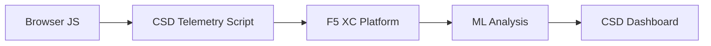

import { Aside } from "@astrojs/starlight/components";

F5 Distributed Cloud 客户端防御 (CSD) 通过直接在浏览器中监控 JavaScript 行为来保护网络应用免受客户端攻击。F5 XC 负载均衡器可配置为将 CSD 遥测脚本注入到提供给客户端的页面中。该脚本观察所有 JavaScript 活动 — 哪些脚本加载、它们读取哪些表单字段以及它们建立哪些网络连接。遥测数据被发送到 F5 XC 平台，其中机器学习模型分析脚本行为、分配风险评分并标记异常。安全团队在 CSD 控制台中查看检测结果，并通过允许或缓解脚本域来采取行动。

## 核心检测信号

CSD 监控三类浏览器端行为：

| 信号 | CSD 观察内容 | 示例 |
| --- | --- | --- |
| **表单字段读取** | 脚本访问页面 DOM 中加载时存在的哪些 `input` 字段 | `main.js` 读取 `/login` 上的 `password` 字段 |
| **脚本清单** | 每个页面加载的所有第一方和第三方 JavaScript，按源域跟踪 | 一个新的 `<script>` 标签从 `cdn.jsdelivr.net` 加载到登录页面 |
| **网络交互** | 脚本网络活动涉及的域 — 包括脚本加载源域和 fetch/XHR 目标域 | 从 `esm.sh` 获取的脚本和数据泄露目标（如 `www.httpbin.org`）出现在检测到的域中 |

<Aside type="caution">
CSD 的网络交互信号主要跟踪**脚本加载源域**。但是，fetch/XHR 目标域也出现在 `/detected_domains` API 和仪表板域表中 — CSD 在域级别检测网络活动，不仅仅是脚本加载。有关行为限制的完整列表，请参见[检测边界](#detection-boundaries)。
</Aside>

## 功能矩阵

| 功能 | 描述 | 控制台位置 |
| --- | --- | --- |
| **脚本风险评分** | 自动分类：无风险、低风险、高风险 | 脚本列表 &rarr; 风险等级列 |
| **表单字段敏感性** | 基于字段类型和名称自动将字段分类为敏感（按系统） | 表单字段视图 &rarr; 分析列 |
| **行为时间线** | 图表显示脚本风险等级、源域和类型随时间的变化 | 脚本详情 &rarr; 概述 &rarr; 随时间变化的行为 |
| **受影响用户归属** | 按 IP、地理位置、浏览器和设备跟踪受影响的用户 | 脚本详情 &rarr; 受影响用户选项卡 |
| **域允许列表** | 将受信任的脚本域标记为允许 | 仪表板 &rarr; 域行 &rarr; 添加到允许列表 |
| **域缓解列表** | 阻止来自特定脚本域的网络调用和表单字段读取，防止数据泄露 | 仪表板 &rarr; 域行 &rarr; 添加到缓解列表 |
| **警报配置** | 新域、风险变化、可疑行为的通知 | 通知部分 |
| **脚本正当理由** | 添加说明脚本为何被授权的注释（PCI DSS 合规性） | 脚本详情 &rarr; 正当理由字段 |
| **交易跟踪** | 月度遥测事件计数器，确认 CSD 处于活跃状态 | 仪表板 &rarr; 已消费交易卡 |
| **时间和位置过滤器** | 按时间范围（24 小时、7 天、30 天）和位置过滤所有视图 | 顶部栏过滤控件 |

## 检测边界

理解 CSD **不**监控的内容对于设置准确的演示预期至关重要：

| 限制 | 详情 | 已验证 |
| --- | --- | --- |
| **动态创建的字段** | CSD 跟踪页面加载时 DOM 中存在的 `input` 字段。JavaScript 加载后注入的字段不被监控。脚本读取的动态创建的 `<input>` 不会出现在表单字段视图中。 | 是 — 字段在等待 10 分钟后从 `/formFields` 中消失 |
| **代码级混淆** | CSD 不会将动态代码执行技术或混淆模式标记为单独的检测信号。混淆的收集器产生与非混淆收集器相同的风险等级 — CSD 跟踪行为元数据，而不是源代码模式。 | 是 — 两种技术的"高风险"相同 |
| **表单覆盖字段** | CSD 仅跟踪页面加载时原始 DOM 中存在的表单字段。JavaScript 注入的覆盖表单（常见的数字掠夺技术）不被跟踪 — 仅检测到原始字段的读取。 | 是 — 覆盖字段在等待 10 分钟后从 `/formFields` 中消失 |
| **仪表板计数器行为** | "已找到并已缓解"和"已找到并已允许"摘要计数仅在管理员明确将域添加到缓解或允许列表后更改。检测到新域时，"需要采取行动"和"总计已找到"计数会自动更新。 | 是 — "已找到并已允许"仅在发送 POST 到 `/allowed_domains` 后从 0 更改为 1 |

<Aside type="note" title="API 与控制台可见性">
`/detected_domains` API 端点返回所有检测到的域，包括第一方和第三方脚本源域。第一方应用程序域（例如 `csd.bankexample.com`）与第三方 CDN 域一起出现在检测到的域列表中。第一方和第三方域都出现在仪表板域表中。

Fetch/XHR 目标域（例如通过 `fetch()` 访问的 `www.httpbin.org`）也出现在 `/detected_domains` 响应中。CSD 平台在域级别跟踪这些，尽管它们不是脚本加载源域。
</Aside>

## PCI DSS v4.0 映射

CSD 直接解决支付页面安全的两个 PCI DSS v4.0 要求：

| PCI DSS 要求 | 其要求内容 | CSD 如何解决 |
| --- | --- | --- |
| **6.4.3** — 支付页面上的脚本管理 | 维护所有脚本的清单，为每个脚本提供书面授权和正当理由，验证脚本完整性 | 脚本列表提供完整清单；正当理由字段记录授权；行为时间线跟踪变化 |
| **11.6.1** — 支付页面上的篡改检测 | 检测对 HTTP 头和支付页面内容的未授权修改 | CSD 遥测检测新脚本注入、未授权的表单字段读取和新网络域 — 对页面行为变化发出警报 |

<Aside type="tip">
使用**脚本正当理由**功能记录为什么每个脚本在支付页面上被授权。这会创建一个审计跟踪，直接映射到 PCI DSS 6.4.3 授权要求。
</Aside>

## 威胁覆盖矩阵

下表将常见客户端攻击类别映射到在每种攻击类型期间会触发的 CSD 检测信号。标有 **\*** 的攻击类型由 [F5 官方文档](https://www.f5.com/cloud/products/client-side-defense)确认。未标记的类型是根据 CSD 的检测信号类别推断的，可能未被 F5 明确声称。

| 攻击类别 | 描述 | 字段读取 | 脚本注入 | 网络 |
| --- | --- | --- | --- | --- |
| **表单劫持** \* | 恶意脚本读取表单字段值并将其泄露 | 是 | — | 是 |
| **数字掠夺** \* | 注入覆盖表单或脚本以捕获支付数据 | 是 | 是 | 是 |
| **供应链攻击** \* | 被破坏的第三方库加载恶意代码 | — | 是 | 是 |
| **数据泄露** \* | 读取敏感数据并将其发送到外部域 | 是 | — | 是 |
| **脚本注入** \* | 将未授权的 `<script>` 标签插入页面 | — | 是 | 是 |
| **挖矿** \* | 注入加密货币挖矿脚本 | — | 是 | 是 |
| **DOM 操纵** | 注入或修改页面元素以欺骗用户 | — | 是 | — |
| **浏览器中间人** | 在浏览器会话中拦截表单数据 — 请参见 [OWASP](https://owasp.org/www-community/attacks/Man-in-the-browser_attack) 和 [MITRE T1185](https://attack.mitre.org/techniques/T1185/) | 是 | — | 是 |
| **点击劫持** | 覆盖不可见的框架以劫持用户点击 — 请参见 [OWASP](https://owasp.org/www-community/attacks/Clickjacking) | — | 是 | — |
| **网络掠夺器持久性** | 在页面导航中重新注入掠夺器脚本 — 请参见 [Sansec Magecart 研究](https://sansec.io/what-is-magecart) | — | 是 | 是 |

<Aside type="note">
"网络"检测涵盖脚本加载源域和 fetch/XHR 目标域 — 两者都出现在 CSD `/detected_domains` API 和仪表板域表中。但是，CSD 缓解针对脚本加载（供应链向量），而不是 fetch/XHR 调用。缓解一个域会阻止来自该域的 `<script>` 标签加载，但不会拦截对该域的 `fetch()` 或 `XMLHttpRequest` 调用。
</Aside>
