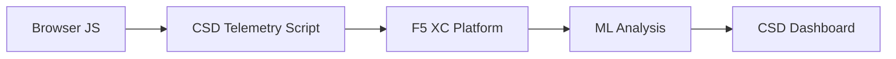

import { Aside } from "@astrojs/starlight/components";

F5 Distributed Cloud 客户端防御 (CSD) 通过直接在浏览器中监控 JavaScript 行为来保护 Web 应用程序免受客户端攻击。F5 XC 负载均衡器可以配置为将 CSD 遥测脚本注入到提供给客户端的页面中。该脚本观察所有 JavaScript 活动——包括加载了哪些脚本、读取了哪些表单字段以及建立了哪些网络连接。遥测数据被发送到 F5 XC 平台，机器学习模型在此分析脚本行为、分配风险评分并标记异常。安全团队在 CSD 控制台中查看检测结果，并通过允许或缓解脚本域来采取相应措施。

## 核心检测信号

CSD 监控三类浏览器端行为：

| 信号 | CSD 观察的内容 | 示例 |
| --- | --- | --- |
| **表单字段读取** | 哪些脚本访问了页面 DOM 加载时存在的哪些 `input` 字段 | `main.js` 读取 `/login` 页面上的 `password` 字段 |
| **脚本清单** | 每个页面上加载的所有第一方和第三方 JavaScript，按来源域跟踪 | 登录页面上出现从 `cdn.jsdelivr.net` 加载的新 `<script>` 标签 |
| **网络交互** | 脚本网络活动涉及的域——包括脚本加载来源域和 fetch/XHR 目标域 | 来源为 `esm.sh` 的脚本以及检测到的域中出现的数据外泄目标（如 `www.httpbin.org`） |

<Aside type="caution">
CSD 的网络交互信号主要跟踪**脚本加载来源域**。但是，fetch/XHR 目标域也会出现在 `/detected_domains` API 和仪表板域表中——CSD 在域级别检测网络活动，而不仅仅是脚本加载。有关行为限制的完整列表，请参阅[检测边界](#检测边界)。
</Aside>

## 功能矩阵

| 功能 | 描述 | 控制台位置 |
| --- | --- | --- |
| **脚本风险评分** | 自动分类：无风险、低风险、高风险 | Script List &rarr; Risk Level 列 |
| **表单字段敏感度** | 基于字段类型和名称自动将字段分类为敏感（由系统判定） | Form Fields 视图 &rarr; Analysis 列 |
| **行为时间线** | 以图表展示脚本风险级别、来源域和类型随时间的变化 | Script detail &rarr; Overview &rarr; Behaviors Over Time |
| **受影响用户归因** | 通过 IP、地理位置、浏览器和设备跟踪受影响的用户 | Script detail &rarr; Affected Users 选项卡 |
| **域允许列表** | 将受信任的脚本域标记为允许 | Dashboard &rarr; 域行 &rarr; Add To Allow List |
| **域缓解列表** | 阻止来自特定脚本域的网络调用和表单字段读取，防止数据外泄 | Dashboard &rarr; 域行 &rarr; Add To Mitigate List |
| **告警配置** | 新域、风险变更、可疑行为的通知 | Notifications 部分 |
| **脚本合理性说明** | 添加说明解释为什么授权某个脚本（PCI DSS 合规） | Script detail &rarr; Justification 字段 |
| **事务跟踪** | 月度遥测事件计数器，确认 CSD 处于活动状态 | Dashboard &rarr; Transactions Consumed 卡片 |
| **时间和位置过滤器** | 按时间范围（24 小时、7 天、30 天）和位置过滤所有视图 | 顶部栏过滤控件 |

## 检测边界

了解 CSD **不**监控的内容对于设定准确的演示预期至关重要：

| 限制 | 详情 | 已验证 |
| --- | --- | --- |
| **动态创建的字段** | CSD 跟踪页面加载时 DOM 中存在的 `input` 字段。页面加载后由 JavaScript 注入的字段不会被监控。由脚本读取的动态创建的 `<input>` 不会出现在 Form Fields 视图中。 | 是——等待 10 分钟后字段未出现在 `/formFields` 中 |
| **代码级混淆** | CSD 不会将动态代码执行技术或混淆模式标记为单独的检测信号。混淆的采集器与未混淆的采集器产生相同的风险级别——CSD 跟踪的是行为元数据，而非源代码模式。 | 是——两种技术均为"高风险" |
| **表单覆盖字段** | CSD 仅跟踪页面加载时原始 DOM 中存在的表单字段。由 JavaScript 注入的覆盖表单（一种常见的数字盗刷技术）不会被跟踪——仅检测到对原始字段的读取。 | 是——等待 10 分钟后覆盖字段未出现在 `/formFields` 中 |
| **仪表板计数器行为** | "Found &amp; Mitigated"和"Found &amp; Allowed"汇总计数仅在管理员明确将域添加到缓解列表或允许列表后才会更改。"Action Needed"和"Total Found"计数在检测到新域时自动更新。 | 是——仅在向 `/allowed_domains` 发送 POST 请求后，"Found &amp; Allowed"才从 0 变为 1 |

<Aside type="note" title="API 与控制台可见性">
`/detected_domains` API 端点返回所有检测到的域，包括第一方和第三方脚本来源域。第一方应用域（例如 `csd.bankexample.com`）与第三方 CDN 域一起出现在检测到的域列表中。第一方和第三方域都会出现在仪表板域表中。

Fetch/XHR 目标域（例如通过 `fetch()` 联系的 `www.httpbin.org`）也会出现在 `/detected_domains` 响应中。即使它们不是脚本加载来源域，CSD 平台也会在域级别跟踪这些域。
</Aside>

## PCI DSS v4.0 映射

CSD 直接满足了 PCI DSS v4.0 关于支付页面安全的两项要求：

| PCI DSS 要求 | 具体要求 | CSD 如何满足 |
| --- | --- | --- |
| **6.4.3** — 支付页面上的脚本管理 | 维护所有脚本的清单，为每个脚本提供书面授权和合理性说明，验证脚本完整性 | Script List 提供完整清单；Justification 字段记录授权信息；行为时间线跟踪变更 |
| **11.6.1** — 支付页面上的篡改检测 | 检测对 HTTP 头和支付页面内容的未授权修改 | CSD 遥测检测新的脚本注入、未授权的表单字段读取和新的网络域——对页面行为变更发出告警 |

<Aside type="tip">
使用**脚本合理性说明**功能记录每个脚本在支付页面上被授权的原因。这将创建一个直接映射到 PCI DSS 6.4.3 授权要求的审计追踪。
</Aside>

## 威胁覆盖矩阵

下表将常见的客户端攻击类别映射到每种攻击类型触发的 CSD 检测信号。标有 **\*** 的攻击类型已通过 [F5 官方文档](https://www.f5.com/cloud/products/client-side-defense)确认。未标记的类型是基于 CSD 的检测信号类别推断的，可能未被 F5 明确声明。

| 攻击类别 | 描述 | 字段读取 | 脚本注入 | 网络 |
| --- | --- | --- | --- | --- |
| **表单劫持** \* | 恶意脚本读取表单字段值并将其外泄 | 是 | — | 是 |
| **数字盗刷** \* | 注入覆盖表单或脚本以捕获支付数据 | 是 | 是 | 是 |
| **供应链攻击** \* | 被入侵的第三方库加载恶意代码 | — | 是 | 是 |
| **数据外泄** \* | 读取敏感数据并将其发送到外部域 | 是 | — | 是 |
| **脚本注入** \* | 在页面中插入未授权的 `<script>` 标签 | — | 是 | 是 |
| **加密劫持** \* | 注入加密货币挖矿脚本 | — | 是 | 是 |
| **DOM 操纵** | 注入或修改页面元素以欺骗用户 | — | 是 | — |
| **浏览器中间人攻击** | 在浏览器会话中拦截表单数据——参见 [OWASP](https://owasp.org/www-community/attacks/Man-in-the-browser_attack) 和 [MITRE T1185](https://attack.mitre.org/techniques/T1185/) | 是 | — | 是 |
| **点击劫持** | 覆盖不可见框架以劫持用户点击——参见 [OWASP](https://owasp.org/www-community/attacks/Clickjacking) | — | 是 | — |
| **Web 盗刷持久化** | 在页面导航间重新注入盗刷脚本——参见 [Sansec Magecart 研究](https://sansec.io/what-is-magecart) | — | 是 | 是 |

<Aside type="note">
"网络"检测涵盖脚本加载来源域和 fetch/XHR 目标域——两者都会出现在 CSD `/detected_domains` API 和仪表板域表中。但是，CSD 缓解措施针对的是脚本加载（供应链向量），而非 fetch/XHR 调用。缓解某个域会阻止从该域加载 `<script>` 标签，但不会拦截对该域的 `fetch()` 或 `XMLHttpRequest` 调用。
</Aside>
