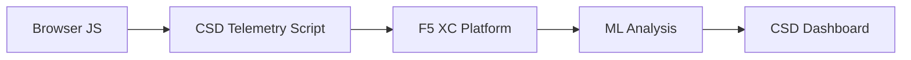

import { Aside } from "@astrojs/starlight/components";

F5 Distributed Cloud 客户端防御（CSD）通过直接在浏览器中监控 JavaScript 行为，保护 Web 应用程序免受客户端攻击。F5 XC 负载均衡器可配置为向客户端提供的页面中注入 CSD 遥测脚本。该脚本监测所有 JavaScript 活动——包括哪些脚本被加载、哪些脚本读取了哪些表单字段，以及哪些脚本建立了网络连接。遥测数据发送至 F5 XC 平台，由机器学习模型分析脚本行为、分配风险评分并标记异常。安全团队在 CSD 控制台中审查检测结果，并通过允许或缓解脚本域名来采取相应措施。

## 核心检测信号

CSD 监控三类浏览器端行为：

| 信号 | CSD 观测内容 | 示例 |
| --- | --- | --- |
| **表单字段读取** | 哪些脚本访问了页面 DOM 在加载时存在的哪些 `input` 字段 | `main.js` 在 `/login` 页面读取 `password` 字段 |
| **脚本清单** | 每个页面上加载的所有第一方和第三方 JavaScript，按来源域名追踪 | 登录页面出现了从 `cdn.jsdelivr.net` 加载的新 `<script>` 标签 |
| **网络交互** | 与脚本网络活动相关的域名——包括脚本加载来源域名以及 fetch/XHR 目标域名 | 在检测到的域名中出现来自 `esm.sh` 的脚本来源以及 `www.httpbin.org` 等数据泄露目标 |

<Aside type="caution">
CSD 的网络交互信号主要追踪**脚本加载来源域名**。但是，fetch/XHR 目标域名也会出现在 `/detected_domains` API 和仪表板域名表中——CSD 在域名级别检测网络活动，而不仅限于脚本加载。有关行为限制的完整列表，请参阅[检测边界](#detection-boundaries)。
</Aside>

## 功能矩阵

| 功能 | 描述 | 控制台位置 |
| --- | --- | --- |
| **脚本风险评分** | 自动分类：无风险、低风险、高风险 | 脚本列表 &rarr; 风险级别列 |
| **表单字段敏感性** | 系统根据字段类型和名称自动将字段分类为敏感字段 | 表单字段视图 &rarr; 分析列 |
| **行为时间线** | 以图表展示脚本风险级别、来源域名和类型随时间的变化 | 脚本详情 &rarr; 概述 &rarr; 行为时间线 |
| **受影响用户归因** | 按 IP、地理位置、浏览器和设备追踪受影响用户 | 脚本详情 &rarr; 受影响用户选项卡 |
| **域名允许列表** | 将受信任的脚本域名标记为已允许 | 仪表板 &rarr; 域名行 &rarr; 添加至允许列表 |
| **域名缓解列表** | 阻止来自特定脚本域名的网络调用和表单字段读取，防止数据泄露 | 仪表板 &rarr; 域名行 &rarr; 添加至缓解列表 |
| **告警配置** | 针对新域名、风险变化、可疑行为的通知 | 通知设置部分 |
| **脚本说明** | 添加注释说明脚本被授权的原因（PCI DSS 合规） | 脚本详情 &rarr; 说明字段 |
| **事务追踪** | 每月遥测事件计数器，确认 CSD 处于活动状态 | 仪表板 &rarr; 已消耗事务卡片 |
| **时间和位置筛选** | 按时间范围（24小时、7天、30天）和位置筛选所有视图 | 顶部栏筛选控件 |

## 检测边界

了解 CSD **不**监控的内容对于设置准确的演示预期至关重要：

| 限制 | 详情 | 已验证 |
| --- | --- | --- |
| **动态创建的字段** | CSD 追踪页面加载时 DOM 中存在的 `input` 字段。加载后由 JavaScript 注入的字段不受监控。脚本读取的动态创建的 `<input>` 不会出现在表单字段视图中。 | 是——等待10分钟后字段仍未出现在 `/formFields` 中 |
| **代码级混淆** | CSD 不会将动态代码执行技术或混淆模式标记为独立的检测信号。混淆的数据采集器与非混淆的产生相同的风险级别——CSD 追踪行为元数据，而非源代码模式。 | 是——两种技术均产生相同的"高风险"结果 |
| **表单覆盖层字段** | CSD 仅追踪页面加载时原始 DOM 中存在的表单字段。由 JavaScript 注入的覆盖表单（一种常见的数字盗刷技术）不被追踪——仅能检测到对原始字段的读取。 | 是——等待10分钟后覆盖层字段仍未出现在 `/formFields` 中 |
| **仪表板计数器行为** | "已发现并缓解"和"已发现并允许"汇总计数仅在管理员明确将域名添加至缓解列表或允许列表后才会更改。"需要处理"和"已发现总数"在检测到新域名时自动更新。 | 是——"已发现并允许"仅在向 `/allowed_domains` 发送 POST 请求后才从0变为1 |

<Aside type="note" title="API 与控制台可见性">
`/detected_domains` API 端点返回所有检测到的域名，包括第一方和第三方脚本来源域名。第一方应用程序域名（例如 `csd.bankexample.com`）与第三方 CDN 域名一同出现在检测到的域名列表中。第一方和第三方域名均显示在仪表板域名表中。

Fetch/XHR 目标域名（例如通过 `fetch()` 访问的 `www.httpbin.org`）也会出现在 `/detected_domains` 响应中。CSD 平台在域名级别追踪这些域名，即使它们不是脚本加载来源域名。
</Aside>

## PCI DSS v4.0 映射

CSD 直接满足 PCI DSS v4.0 中关于支付页面安全性的两项要求：

| PCI DSS 要求 | 要求内容 | CSD 如何满足 |
| --- | --- | --- |
| **6.4.3** — 支付页面脚本管理 | 维护所有脚本的清单，为每个脚本提供书面授权和说明，验证脚本完整性 | 脚本列表提供完整清单；说明字段记录授权信息；行为时间线追踪变更 |
| **11.6.1** — 支付页面篡改检测 | 检测对 HTTP 头部和支付页面内容的未经授权修改 | CSD 遥测检测新的脚本注入、未经授权的表单字段读取以及新的网络域名——对页面行为变化发出告警 |

<Aside type="tip">
使用**脚本说明**功能记录每个脚本在支付页面上获得授权的原因。这将创建审计追踪，直接对应 PCI DSS 6.4.3 的授权要求。
</Aside>

## 威胁覆盖矩阵

下表将常见的客户端攻击类别映射至每种攻击类型中会触发的 CSD 检测信号。标注 **\*** 的攻击类型已由 [F5 官方文档](https://www.f5.com/cloud/products/client-side-defense)确认。未标注的类型根据 CSD 的检测信号类别推断，F5 可能未明确声明。

| 攻击类别 | 描述 | 字段读取 | 脚本注入 | 网络 |
| --- | --- | --- | --- | --- |
| **表单劫持** \* | 恶意脚本读取表单字段值并将其泄露 | 是 | — | 是 |
| **数字盗刷** \* | 注入覆盖层表单或脚本以捕获支付数据 | 是 | 是 | 是 |
| **供应链攻击** \* | 受攻击的第三方库加载恶意代码 | — | 是 | 是 |
| **数据泄露** \* | 读取敏感数据并将其发送至外部域名 | 是 | — | 是 |
| **脚本注入** \* | 向页面插入未经授权的 `<script>` 标签 | — | 是 | 是 |
| **加密货币挖矿劫持** \* | 注入加密货币挖矿脚本 | — | 是 | 是 |
| **DOM 操纵** | 注入或修改页面元素以欺骗用户 | — | 是 | — |
| **浏览器中间人攻击** | 在浏览器会话中拦截表单数据——参见 [OWASP](https://owasp.org/www-community/attacks/Man-in-the-browser_attack) 和 [MITRE T1185](https://attack.mitre.org/techniques/T1185/) | 是 | — | 是 |
| **点击劫持** | 覆盖不可见框架以劫持用户点击——参见 [OWASP](https://owasp.org/www-community/attacks/Clickjacking) | — | 是 | — |
| **Web 盗刷持久化** | 在页面导航过程中重复注入盗刷脚本——参见 [Sansec Magecart Research](https://sansec.io/what-is-magecart) | — | 是 | 是 |

<Aside type="note">
"网络"检测涵盖脚本加载来源域名和 fetch/XHR 目标域名——两者均出现在 CSD `/detected_domains` API 和仪表板域名表中。但是，CSD 缓解措施针对的是脚本加载（供应链攻击向量），而非 fetch/XHR 调用。缓解某个域名会阻止从该域名加载 `<script>` 标签，但不会拦截对该域名的 `fetch()` 或 `XMLHttpRequest` 调用。
</Aside>
