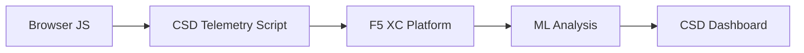

import { Aside } from "@astrojs/starlight/components";

F5 Distributed Cloud 用戶端防禦 (CSD) 透過直接在瀏覽器中監控 JavaScript 行為來保護網路應用程式免受用戶端攻擊。F5 XC 負載平衡器可設定為將 CSD 遙測指令碼注入提供給用戶端的頁面。此指令碼可觀察所有 JavaScript 活動 — 哪些指令碼載入、它們讀取哪些表單欄位，以及它們建立哪些網路連線。遙測資料傳送至 F5 XC 平台，其中機器學習模型分析指令碼行為、指派風險分數，並標示異常。安全團隊在 CSD 主控台中檢閱偵測結果，並透過允許或緩解指令碼網域來採取行動。

## 核心偵測訊號

CSD 監控三個類別的瀏覽器端行為：

| 訊號 | CSD 觀察的內容 | 範例 |
| --- | --- | --- |
| **表單欄位讀取** | 哪些指令碼存取頁面 DOM 在載入時呈現的哪些 `input` 欄位 | `main.js` 在 `/login` 上讀取 `password` 欄位 |
| **指令碼清單** | 每個頁面上載入的所有第一方和第三方 JavaScript，按來源網域追蹤 | 新的 `<script>` 標籤從 `cdn.jsdelivr.net` 載入到登入頁面 |
| **網路互動** | 指令碼網路活動涉及的網域 — 包含指令碼載入來源網域和 fetch/XHR 目的地網域 | 從 `esm.sh` 取得的指令碼以及資料外洩目標（如 `www.httpbin.org`）出現在偵測到的網域中 |

<Aside type="caution">
CSD 的「網路互動」訊號主要追蹤**指令碼載入來源網域**。但 fetch/XHR 目的地網域也會出現在 `/detected_domains` API 和儀表板網域表中 — CSD 在網域層級偵測網路活動，不僅限於指令碼載入。請參閱[偵測邊界](#偵測邊界)了解完整的行為限制清單。
</Aside>

## 功能矩陣

| 功能 | 說明 | 主控台位置 |
| --- | --- | --- |
| **指令碼風險評分** | 自動分類：無風險、低風險、高風險 | 指令碼清單 &rarr; 風險等級欄 |
| **表單欄位敏感度** | 根據欄位類型和名稱自動將欄位分類為敏感（由系統分類） | 表單欄位檢視 &rarr; 分析欄 |
| **行為時間軸** | 圖表顯示指令碼風險等級、來源網域和類型隨時間的變化 | 指令碼詳情 &rarr; 概述 &rarr; 一段時間內的行為 |
| **受影響使用者歸因** | 依 IP、地理位置、瀏覽器和裝置追蹤受影響的使用者 | 指令碼詳情 &rarr; 受影響的使用者標籤 |
| **網域允許清單** | 將受信任的指令碼網域標記為允許 | 儀表板 &rarr; 網域列 &rarr; 新增至允許清單 |
| **網域緩解清單** | 阻止來自特定指令碼網域的網路呼叫和表單欄位讀取，防止資料外洩 | 儀表板 &rarr; 網域列 &rarr; 新增至緩解清單 |
| **警示設定** | 新網域、風險變更、可疑行為的通知 | 通知區段 |
| **指令碼正當理由** | 新增備註說明為什麼指令碼獲得授權（PCI DSS 合規性） | 指令碼詳情 &rarr; 正當理由欄位 |
| **交易追蹤** | 每月遙測事件計數器，確認 CSD 為作用中 | 儀表板 &rarr; 已消耗交易卡 |
| **時間和位置篩選器** | 依時間範圍（24h、7d、30d）和位置篩選所有檢視 | 頂部列篩選控制項 |

## 偵測邊界

了解 CSD **不會**監控的內容對於設定準確的示範預期至關重要：

| 限制 | 詳情 | 已驗證 |
| --- | --- | --- |
| **動態建立的欄位** | CSD 追蹤頁面載入時 DOM 中存在的 `input` 欄位。JavaScript 在載入後注入的欄位不會被監控。動態建立的 `<input>` 由指令碼讀取不會出現在「表單欄位」檢視中。 | 是 — 10 分鐘等待後欄位在 `/formFields` 中缺失 |
| **程式碼級混淆** | CSD 不會將動態程式碼執行技術或混淆模式標記為單獨的偵測訊號。混淆的收割機產生的風險等級與非混淆的相同 — CSD 追蹤行為中繼資料，而不是原始程式碼模式。 | 是 — 兩種技術的風險等級相同均為「高風險」 |
| **表單疊加層欄位** | CSD 僅追蹤頁面載入時原始 DOM 中存在的表單欄位。JavaScript 注入的疊加層表單（常見的數位略奪技術）未被追蹤 — 僅偵測原始欄位的讀取。 | 是 — 10 分鐘等待後疊加層欄位在 `/formFields` 中缺失 |
| **儀表板計數器行為** | 「已尋找並緩解」和「已尋找並允許」摘要計數僅在管理員明確將網域新增至緩解或允許清單後才變更。「需要採取行動」和「總計已尋找」計數在偵測到新網域時自動更新。 | 是 — 「已尋找並允許」僅在 POST 至 `/allowed_domains` 後從 0 變更為 1 |

<Aside type="note" title="API 對比主控台可見性">
`/detected_domains` API 端點傳回所有偵測到的網域，包括第一方和第三方指令碼來源網域。第一方應用程式網域（例如 `csd.bankexample.com`）與第三方 CDN 網域一起出現在偵測到的網域清單中。第一方和第三方網域都出現在儀表板網域表中。

Fetch/XHR 目的地網域（例如透過 `fetch()` 聯絡的 `www.httpbin.org`）也會出現在 `/detected_domains` 回應中。CSD 平台在網域層級追蹤這些，即使它們不是指令碼載入來源網域。
</Aside>

## PCI DSS v4.0 對應

CSD 直接解決付款頁面安全的兩個 PCI DSS v4.0 要求：

| PCI DSS 要求 | 需要的內容 | CSD 如何解決 |
| --- | --- | --- |
| **6.4.3** — 付款頁面上的指令碼管理 | 維護所有指令碼的清單，為每個指令碼提供書面授權和正當理由，驗證指令碼完整性 | 指令碼清單提供完整清單；正當理由欄位記錄授權；行為時間軸追蹤變更 |
| **11.6.1** — 付款頁面上的竄改偵測 | 偵測對 HTTP 標頭和付款頁面內容的未授權修改 | CSD 遙測偵測新的指令碼注入、未授權的表單欄位讀取和新的網路網域 — 對頁面行為的變更發出警示 |

<Aside type="tip">
使用**指令碼正當理由**功能記錄每個指令碼為什麼在付款頁面上獲得授權。這可建立直接對應至 PCI DSS 6.4.3 授權要求的稽核軌跡。
</Aside>

## 威脅涵蓋矩陣

下表將常見的用戶端攻擊類別對應至每種攻擊類型期間會觸發的 CSD 偵測訊號。標記為 **\*** 的攻擊類型由 [F5 官方文件](https://www.f5.com/cloud/products/client-side-defense)確認。未標記的類型是根據 CSD 的偵測訊號類別推斷，可能不是由 F5 明確宣稱。

| 攻擊類別 | 說明 | 欄位讀取 | 指令碼注入 | 網路 |
| --- | --- | --- | --- | --- |
| **表單劫持** \* | 惡意指令碼讀取表單欄位值並外洩它們 | 是 | — | 是 |
| **數位略奪** \* | 注入疊加層表單或指令碼以擷取付款資料 | 是 | 是 | 是 |
| **供應鏈攻擊** \* | 被入侵的第三方程式庫載入惡意程式碼 | — | 是 | 是 |
| **資料外洩** \* | 讀取敏感資料並將其傳送至外部網域 | 是 | — | 是 |
| **指令碼注入** \* | 將未授權的 `<script>` 標籤插入頁面 | — | 是 | 是 |
| **挖礦程式** \* | 注入加密貨幣挖礦指令碼 | — | 是 | 是 |
| **DOM 操縱** | 注入或修改頁面元素來欺騙使用者 | — | 是 | — |
| **瀏覽器中間人攻擊** | 在瀏覽器工作階段中攔截表單資料 — 參閱 [OWASP](https://owasp.org/www-community/attacks/Man-in-the-browser_attack) 和 [MITRE T1185](https://attack.mitre.org/techniques/T1185/) | 是 | — | 是 |
| **點擊劫持** | 疊加層不可見的框架以劫持使用者點擊 — 參閱 [OWASP](https://owasp.org/www-community/attacks/Clickjacking) | — | 是 | — |
| **網路略奪器持續性** | 在頁面瀏覽中重新注入略奪器指令碼 — 參閱 [Sansec Magecart 研究](https://sansec.io/what-is-magecart) | — | 是 | 是 |

<Aside type="note">
「網路」偵測涵蓋指令碼載入來源網域和 fetch/XHR 目的地網域 — 兩者都出現在 CSD `/detected_domains` API 和儀表板網域表中。但 CSD 緩解的目標是指令碼載入（供應鏈向量），而不是 fetch/XHR 呼叫。緩解網域會阻止來自該網域的 `<script>` 標籤載入，但不會攔截對該網域的 `fetch()` 或 `XMLHttpRequest` 呼叫。
</Aside>
