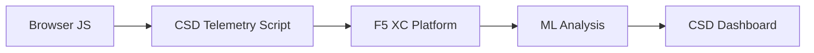

import { Aside } from "@astrojs/starlight/components";

F5 Distributed Cloud Client-Side Defense (CSD) 透過直接在瀏覽器中監控 JavaScript 行為，保護 Web 應用程式免受用戶端攻擊。F5 XC 負載平衡器可設定為將 CSD 遙測腳本注入至提供給用戶端的頁面中。此腳本會觀察所有 JavaScript 活動——包括哪些腳本被載入、哪些表單欄位被讀取，以及建立了哪些網路連線。遙測資料會傳送至 F5 XC 平台，由機器學習模型分析腳本行為、指派風險分數並標記異常。安全團隊可在 CSD 控制台中檢閱偵測結果，並透過允許或緩解腳本網域來採取行動。

## 核心偵測訊號

CSD 監控三類瀏覽器端行為：

| 訊號 | CSD 觀察的內容 | 範例 |
| --- | --- | --- |
| **表單欄位讀取** | 哪些腳本存取頁面 DOM 載入時存在的哪些 `input` 欄位 | `main.js` 在 `/login` 頁面讀取 `password` 欄位 |
| **腳本清單** | 每個頁面載入的所有第一方和第三方 JavaScript，依來源網域追蹤 | 登入頁面上出現從 `cdn.jsdelivr.net` 載入的新 `<script>` 標籤 |
| **網路互動** | 參與腳本網路活動的網域——包括腳本載入來源網域和 fetch/XHR 目標網域 | 來源為 `esm.sh` 的腳本，以及偵測到的網域中出現如 `www.httpbin.org` 等資料外洩目標 |

<Aside type="caution">
CSD 的網路互動訊號主要追蹤**腳本載入來源網域**。然而，fetch/XHR 目標網域也會出現在 `/detected_domains` API 和儀表板網域表格中——CSD 在網域層級偵測網路活動，而不僅是腳本載入。請參閱[偵測邊界](#偵測邊界)以了解完整的行為限制清單。
</Aside>

## 功能矩陣

| 功能 | 說明 | 控制台位置 |
| --- | --- | --- |
| **腳本風險評分** | 自動分類：無風險、低風險、高風險 | Script List &rarr; Risk Level 欄位 |
| **表單欄位敏感度** | 根據欄位類型和名稱，系統自動將欄位分類為敏感 | Form Fields 檢視 &rarr; Analysis 欄位 |
| **行為時間軸** | 以圖表呈現腳本風險等級、來源網域和類型隨時間的變化 | Script detail &rarr; Overview &rarr; Behaviors Over Time |
| **受影響使用者歸因** | 透過 IP、地理位置、瀏覽器和裝置追蹤受影響的使用者 | Script detail &rarr; Affected Users 分頁 |
| **網域允許清單** | 將受信任的腳本網域標記為允許 | Dashboard &rarr; 網域列 &rarr; Add To Allow List |
| **網域緩解清單** | 封鎖來自特定腳本網域的網路呼叫和表單欄位讀取，防止資料外洩 | Dashboard &rarr; 網域列 &rarr; Add To Mitigate List |
| **警示設定** | 針對新網域、風險變更、可疑行為的通知 | Notifications 區段 |
| **腳本授權說明** | 新增說明解釋為何該腳本已獲授權（PCI DSS 合規） | Script detail &rarr; Justification 欄位 |
| **交易追蹤** | 每月遙測事件計數器，確認 CSD 處於啟用狀態 | Dashboard &rarr; Transactions Consumed 卡片 |
| **時間與位置篩選器** | 依時間範圍（24 小時、7 天、30 天）和位置篩選所有檢視 | 頂部列篩選控制項 |

## 偵測邊界

了解 CSD **未**監控的內容對於設定準確的展示預期至關重要：

| 限制 | 詳細說明 | 已驗證 |
| --- | --- | --- |
| **動態建立的欄位** | CSD 追蹤頁面載入時 DOM 中存在的 `input` 欄位。載入後由 JavaScript 注入的欄位不會被監控。由腳本讀取的動態建立 `<input>` 不會出現在 Form Fields 檢視中。 | 是——等待 10 分鐘後欄位未出現在 `/formFields` 中 |
| **程式碼層級混淆** | CSD 不會將動態程式碼執行技術或混淆模式標記為獨立的偵測訊號。混淆的採集器產生的風險等級與未混淆的相同——CSD 追蹤的是行為元資料，而非原始碼模式。 | 是——兩種技術均為「High Risk」，結果相同 |
| **表單覆蓋欄位** | CSD 僅追蹤頁面載入時原始 DOM 中存在的表單欄位。由 JavaScript 注入的覆蓋表單（一種常見的數位盜刷技術）不會被追蹤——僅偵測對原始欄位的讀取。 | 是——等待 10 分鐘後覆蓋欄位未出現在 `/formFields` 中 |
| **儀表板計數器行為** | 「Found &amp; Mitigated」和「Found &amp; Allowed」摘要計數僅在管理員明確將網域新增至緩解或允許清單後才會變更。「Action Needed」和「Total Found」計數在偵測到新網域時會自動更新。 | 是——「Found &amp; Allowed」僅在 POST 至 `/allowed_domains` 後才從 0 變為 1 |

<Aside type="note" title="API 與控制台可見性">
`/detected_domains` API 端點會傳回所有偵測到的網域，包括第一方和第三方腳本來源網域。第一方應用程式網域（例如 `csd.bankexample.com`）會與第三方 CDN 網域一起出現在偵測到的網域清單中。第一方和第三方網域都會出現在儀表板網域表格中。

Fetch/XHR 目標網域（例如透過 `fetch()` 連接的 `www.httpbin.org`）也會出現在 `/detected_domains` 回應中。即使這些不是腳本載入來源網域，CSD 平台仍會在網域層級追蹤它們。
</Aside>

## PCI DSS v4.0 對應

CSD 直接滿足 PCI DSS v4.0 中關於支付頁面安全的兩項要求：

| PCI DSS 要求 | 要求內容 | CSD 如何滿足 |
| --- | --- | --- |
| **6.4.3** — 支付頁面上的腳本管理 | 維護所有腳本的清單、為每個腳本提供書面授權和理由說明、驗證腳本完整性 | Script List 提供完整清單；Justification 欄位記錄授權說明；行為時間軸追蹤變更 |
| **11.6.1** — 支付頁面上的竄改偵測 | 偵測對 HTTP 標頭和支付頁面內容的未授權修改 | CSD 遙測偵測新的腳本注入、未授權的表單欄位讀取和新的網路網域——針對頁面行為變更發出警示 |

<Aside type="tip">
使用**腳本授權說明**功能來記錄為何每個腳本已獲授權在支付頁面上運行。這將建立一個直接對應 PCI DSS 6.4.3 授權要求的稽核軌跡。
</Aside>

## 威脅涵蓋矩陣

下表將常見的用戶端攻擊類別對應至每種攻擊類型會觸發的 CSD 偵測訊號。標記 **\*** 的攻擊類型已由 [F5 官方文件](https://www.f5.com/cloud/products/client-side-defense)確認。未標記的類型是根據 CSD 的偵測訊號類別推斷而來，可能未被 F5 明確聲稱。

| 攻擊類別 | 說明 | 欄位讀取 | 腳本注入 | 網路 |
| --- | --- | --- | --- | --- |
| **表單劫持** \* | 惡意腳本讀取表單欄位值並將其外洩 | 是 | — | 是 |
| **數位盜刷** \* | 注入覆蓋表單或腳本以擷取支付資料 | 是 | 是 | 是 |
| **供應鏈攻擊** \* | 受損的第三方程式庫載入惡意程式碼 | — | 是 | 是 |
| **資料外洩** \* | 讀取敏感資料並傳送至外部網域 | 是 | — | 是 |
| **腳本注入** \* | 在頁面中插入未授權的 `<script>` 標籤 | — | 是 | 是 |
| **加密劫持** \* | 注入加密貨幣挖礦腳本 | — | 是 | 是 |
| **DOM 操控** | 注入或修改頁面元素以欺騙使用者 | — | 是 | — |
| **瀏覽器中間人攻擊** | 在瀏覽器工作階段中攔截表單資料——請參閱 [OWASP](https://owasp.org/www-community/attacks/Man-in-the-browser_attack) 和 [MITRE T1185](https://attack.mitre.org/techniques/T1185/) | 是 | — | 是 |
| **點擊劫持** | 覆蓋不可見的框架以劫持使用者點擊——請參閱 [OWASP](https://owasp.org/www-community/attacks/Clickjacking) | — | 是 | — |
| **Web 盜刷持續性** | 在頁面導覽間重新注入盜刷腳本——請參閱 [Sansec Magecart 研究](https://sansec.io/what-is-magecart) | — | 是 | 是 |

<Aside type="note">
「網路」偵測涵蓋腳本載入來源網域和 fetch/XHR 目標網域——兩者都會出現在 CSD `/detected_domains` API 和儀表板網域表格中。然而，CSD 緩解措施針對的是腳本載入（供應鏈向量），而非 fetch/XHR 呼叫。緩解某個網域會封鎖從該網域載入的 `<script>` 標籤，但不會攔截對其發出的 `fetch()` 或 `XMLHttpRequest` 呼叫。
</Aside>
