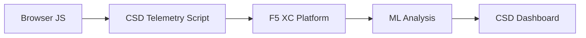

import { Aside } from "@astrojs/starlight/components";

F5 Distributed Cloud 用戶端防禦（CSD）透過直接在瀏覽器中監控 JavaScript 行為，保護 Web 應用程式免受用戶端攻擊。F5 XC 負載平衡器可設定為將 CSD 遙測腳本注入傳送至用戶端的頁面。此腳本會觀察所有 JavaScript 活動——包括哪些腳本載入、哪些表單欄位被讀取，以及建立了哪些網路連線。遙測資料傳送至 F5 XC 平台後，機器學習模型會分析腳本行為、指派風險評分並標記異常。資安團隊在 CSD 主控台中檢視偵測結果，並透過允許或緩解腳本網域來採取行動。

## 核心偵測訊號

CSD 監控三類瀏覽器端行為：

| 訊號 | CSD 觀察內容 | 範例 |
| --- | --- | --- |
| **表單欄位讀取** | 哪些腳本存取頁面 DOM 在載入時存在的哪些 `input` 欄位 | `main.js` 在 `/login` 頁面讀取 `password` 欄位 |
| **腳本清單** | 每個頁面上載入的所有第一方與第三方 JavaScript，依來源網域追蹤 | 登入頁面出現從 `cdn.jsdelivr.net` 載入的新 `<script>` 標籤 |
| **網路互動** | 腳本網路活動所涉及的網域——包含腳本載入來源網域以及 fetch/XHR 目標網域 | 來源為 `esm.sh` 的腳本，以及如 `www.httpbin.org` 等資料外洩目標出現在偵測到的網域中 |

<Aside type="caution">
CSD 的網路互動訊號主要追蹤**腳本載入來源網域**。然而，fetch/XHR 目標網域也會出現在 `/detected_domains` API 及儀表板網域表格中——CSD 在網域層級偵測網路活動，而非僅限於腳本載入。完整的行為限制清單請參閱[偵測邊界](#detection-boundaries)。
</Aside>

## 功能矩陣

| 功能 | 說明 | 主控台位置 |
| --- | --- | --- |
| **腳本風險評分** | 自動分類：無風險、低風險、高風險 | 腳本清單 &rarr; 風險等級欄位 |
| **表單欄位敏感度** | 系統依欄位類型與名稱自動將欄位分類為敏感欄位 | 表單欄位檢視 &rarr; 分析欄位 |
| **行為時間軸** | 呈現腳本風險等級、來源網域與類型隨時間的變化圖表 | 腳本詳情 &rarr; 概覽 &rarr; 隨時間變化的行為 |
| **受影響使用者歸因** | 依 IP、地理位置、瀏覽器及裝置追蹤受影響使用者 | 腳本詳情 &rarr; 受影響使用者索引標籤 |
| **網域允許清單** | 將受信任的腳本網域標記為允許 | 儀表板 &rarr; 網域列 &rarr; 新增至允許清單 |
| **網域緩解清單** | 封鎖來自特定腳本網域的網路呼叫及表單欄位讀取，防止資料外洩 | 儀表板 &rarr; 網域列 &rarr; 新增至緩解清單 |
| **警示設定** | 針對新網域、風險變更及可疑行為發送通知 | 通知區段 |
| **腳本說明** | 新增說明腳本獲授權原因的備註（PCI DSS 合規性） | 腳本詳情 &rarr; 說明欄位 |
| **交易追蹤** | 確認 CSD 運作中的每月遙測事件計數器 | 儀表板 &rarr; 已消耗交易次數卡片 |
| **時間與位置篩選** | 依時間範圍（24 小時、7 天、30 天）及位置篩選所有檢視 | 頂部列篩選控制項 |

## 偵測邊界

瞭解 CSD **不**監控的項目，對於設定準確的示範預期至關重要：

| 限制 | 詳細說明 | 已驗證 |
| --- | --- | --- |
| **動態建立的欄位** | CSD 追蹤頁面載入時 DOM 中存在的 `input` 欄位。頁面載入後由 JavaScript 注入的欄位不受監控。腳本讀取動態建立的 `<input>` 不會出現在表單欄位檢視中。 | 是——等待 10 分鐘後 `/formFields` 中仍無該欄位 |
| **程式碼層級混淆** | CSD 不會將動態程式碼執行技術或混淆模式標記為獨立的偵測訊號。混淆的收集程式與未混淆的收集程式產生相同的風險等級——CSD 追蹤行為中繼資料，而非原始碼模式。 | 是——兩種技術均顯示相同的「高風險」 |
| **表單覆蓋欄位** | CSD 僅追蹤頁面載入時原始 DOM 中存在的表單欄位。由 JavaScript 注入的覆蓋表單（一種常見的數位略讀技術）不受追蹤——僅偵測對原始欄位的讀取。 | 是——等待 10 分鐘後 `/formFields` 中仍無覆蓋欄位 |
| **儀表板計數器行為** | 「已發現並緩解」與「已發現並允許」摘要計數僅在管理員明確將網域新增至緩解或允許清單後才會變更。「需要處理」與「總計發現」計數在偵測到新網域時自動更新。 | 是——「已發現並允許」僅在 POST 至 `/allowed_domains` 後才從 0 變更為 1 |

<Aside type="note" title="API 與主控台可見性">
`/detected_domains` API 端點回傳所有偵測到的網域，包含第一方與第三方腳本來源網域。第一方應用程式網域（例如 `csd.bankexample.com`）與第三方 CDN 網域一同出現在偵測到的網域清單中。第一方與第三方網域均顯示於儀表板網域表格中。

Fetch/XHR 目標網域（例如透過 `fetch()` 聯繫的 `www.httpbin.org`）也會出現在 `/detected_domains` 回應中。CSD 平台在網域層級追蹤這些網域，即使它們並非腳本載入來源網域。
</Aside>

## PCI DSS v4.0 對應

CSD 直接對應兩項針對支付頁面安全性的 PCI DSS v4.0 要求：

| PCI DSS 要求 | 要求內容 | CSD 如何因應 |
| --- | --- | --- |
| **6.4.3**——支付頁面腳本管理 | 維護所有腳本的清單，為每個腳本提供書面授權與說明，並驗證腳本完整性 | 腳本清單提供完整清單；說明欄位記錄授權；行為時間軸追蹤變更 |
| **11.6.1**——支付頁面竄改偵測 | 偵測對 HTTP 標頭及支付頁面內容的未授權修改 | CSD 遙測偵測新的腳本注入、未授權的表單欄位讀取及新網路網域——對頁面行為變更發出警示 |

<Aside type="tip">
使用**腳本說明**功能記錄支付頁面上每個腳本獲授權的原因。這將建立直接對應 PCI DSS 6.4.3 授權要求的稽核追蹤記錄。
</Aside>

## 威脅涵蓋矩陣

下表將常見的用戶端攻擊類別對應至各攻擊類型發生時會觸發的 CSD 偵測訊號。標有 **\*** 的攻擊類型已由 [F5 官方文件](https://www.f5.com/cloud/products/client-side-defense)確認。未標記的類型係根據 CSD 的偵測訊號類別推斷，F5 可能未明確聲明。

| 攻擊類別 | 說明 | 欄位讀取 | 腳本注入 | 網路 |
| --- | --- | --- | --- | --- |
| **表單劫持** \* | 惡意腳本讀取表單欄位值並將其外洩 | 是 | — | 是 |
| **數位略讀** \* | 注入覆蓋表單或腳本以擷取支付資料 | 是 | 是 | 是 |
| **供應鏈攻擊** \* | 被入侵的第三方程式庫載入惡意程式碼 | — | 是 | 是 |
| **資料外洩** \* | 讀取敏感資料並傳送至外部網域 | 是 | — | 是 |
| **腳本注入** \* | 將未授權的 `<script>` 標籤插入頁面 | — | 是 | 是 |
| **加密貨幣劫持** \* | 注入加密貨幣挖礦腳本 | — | 是 | 是 |
| **DOM 操控** | 注入或修改頁面元素以欺騙使用者 | — | 是 | — |
| **瀏覽器中間人攻擊** | 在瀏覽器工作階段內攔截表單資料——參閱 [OWASP](https://owasp.org/www-community/attacks/Man-in-the-browser_attack) 及 [MITRE T1185](https://attack.mitre.org/techniques/T1185/) | 是 | — | 是 |
| **點擊劫持** | 覆蓋不可見框架以劫持使用者點擊——參閱 [OWASP](https://owasp.org/www-community/attacks/Clickjacking) | — | 是 | — |
| **網頁略讀持久化** | 跨頁面導覽重新注入略讀腳本——參閱 [Sansec Magecart 研究](https://sansec.io/what-is-magecart) | — | 是 | 是 |

<Aside type="note">
「網路」偵測涵蓋腳本載入來源網域及 fetch/XHR 目標網域——兩者均出現在 CSD 的 `/detected_domains` API 及儀表板網域表格中。然而，CSD 緩解的目標是腳本載入（供應鏈向量），而非 fetch/XHR 呼叫。緩解某個網域會封鎖來自該網域的 `<script>` 標籤載入，但不會攔截對該網域的 `fetch()` 或 `XMLHttpRequest` 呼叫。
</Aside>
